# 利用约束满足问题的人工智能规划

> 原文：<https://towardsdatascience.com/ai-planning-using-constraint-satisfaction-problems-eb1be5466af6?source=collection_archive---------7----------------------->

利用约束满足问题解决人工智能规划问题。

马库斯·温克勒在 [Unsplash](https://unsplash.com?utm_source=medium&utm_medium=referral) 上的照片

# 介绍

就像 AI 规划作为可满足性一样，我们可以使用一种现有的技术——约束满足问题来帮助我们解决 AI 规划问题。这样我们就可以使用现有的成熟的求解 CSP 的算法来解决我们的 AI 规划问题。

我们将首先介绍 CSP 的概况。然后我们继续看如何将人工智能规划问题编码到 CSP 中。最后，我们使用 CSP 回溯算法来解决我们的问题。我们将通过在 Python 中实现它们来证明所有这些理论。

# 约束满足问题

来自维基百科，

> CSP 是定义为一组对象的数学问题，这些对象的状态必须满足一些约束。

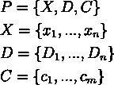

约束满足问题(作者图片)

这幅图描绘了有限域上的 CSP。我们有一组变量——X，一组域列表——D，和一组约束——c。

赋给 X 中变量的值必须是它们在 d 中的定义域之一。

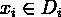

变量和域(图片由作者提供)

约束限制了来自 x 的变量子集的可能值。

## 例子

一个很好的例子是[地图着色问题](https://docs.ocean.dwavesys.com/en/stable/examples/map_coloring.html)。你可以点击链接看地图。在这个问题中，我们有**变量**，它们是区域，**域**是我们可以分配给变量的颜色(红色、绿色、黄色、蓝色)；在这个例子中，所有变量都有相同的域。

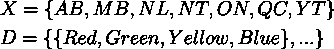

地图着色变量和域(图片由作者提供)

约束条件是分配给一个区域的颜色不能分配给相邻的区域。

有限域上的 CSP 通常使用某种搜索算法来解决。既然我们理解了什么是有限域上的 CSP，我们可以开始研究如何将规划问题编码到 CSP 中。

# 将规划问题编码到 CSP 中

就像“作为可满足性的规划”一样，我们将规划问题编码到命题可满足性问题中，我们可以用这种方法做同样的事情。

我们将有界规划问题——计划长度固定的约束规划问题编码为约束满足问题。完全编码有四个步骤。下面我们会一一看到。

## CSP 变量和域

在第一步中，我们想要创建 CSP 变量及其对应的 CSP 域。我们需要将两个组件转换为 CSP 变量，它们是:

*   断言
*   行动

对于谓词，我们为每个步骤实例化所有谓词。记住我们有一个固定长度的计划( *k* )。

例如，假设我们有一个简单的规划域，其中只有一个机器人和两个位置，如下面的 pddl 文件所示。我们的有界规划问题的长度是 1。

简单域(作者代码)

我们可以将规划领域编码为以下 CSP 变量和领域:

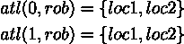

CSP 变量和域—谓词(图片由作者提供)

数字表示步骤，因此对于从 0 到有界规划问题长度的每一步，我们将枚举所有可能的谓词。在这个例子中，我们有两个变量，其中每个变量都有相同的域 *{loc1，loc2}* 。

类似地，对于动作，我们从步长 0 到步长-1 进行实例化。

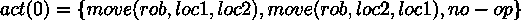

CSP 变量和域操作(图片由作者提供)

对于我们的简单域，我们只有一个 action 变量，它是 *act(0)* ，在其域中有两个可能的值。但是另外，我们将需要添加一个无操作动作(无操作动作)到域。这是一个没有先决条件也没有效果的行动。

现在，我们有了 CSP 变量和相应的域，在接下来的步骤中，我们将有 CSP 约束。

## CSP 对初始状态和目标状态的约束

在这一步中，我们将初始状态和目标状态编码到 CSP 约束中。对于我们的例子，我们将使用下面 pddl 文件中表示的简单规划领域的规划问题。

简单规划问题(由作者编写代码)

在初始状态，我们的机器人处于*位置 1* ，在目标状态，它处于*位置 2* 。这真的很简单。

这一步非常简单。我们只需要将初始状态和目标状态转换成一元约束，每个受影响的变量被赋予一个来自其定义域的值。

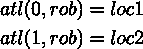

CSP 对初始和目标状态的约束(图片由作者提供)

这意味着在步骤 0，机器人的位置被限制在*位置 1* ，在步骤 1，机器人的位置被限制在*位置 2* 。

## CSP 对行动的约束

在这一步中，我们将动作转换成二元约束。我们如下写约束集。

前提条件:

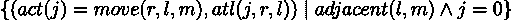

前提条件约束集构建器(图片由作者提供)

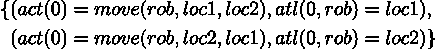

前提条件约束示例(图片由作者提供)

效果:

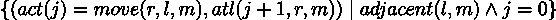

效果约束集生成器(图片由作者提供)

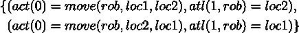

效果约束示例(图片由作者提供)

这些约束是为了确保变量被正确赋值。如果 *act(0)* 已经赋值给 *move(rob，loc1，loc2)* ， *atl(0，rob)* 只能是 *loc1* 。

## 框架公理的 CSP 约束

框架公理约束是说，在动作效果中没有被显式修改(或也称为不变量)的变量保持不变。举例来说，我们需要向我们的规划域添加另一个谓词。假设我们有一个新的谓词 *loaded(r)={cont，nil}* ，它表示机器人是否装载了一个容器。这个谓词不受 *move(r，l，m)* 动作的影响，因此它在执行 *move(r，l，m)* 动作前后保持不变。我们将这一事实表述如下。

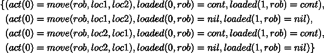

框架公理约束示例(图片由作者提供)

从上面的例子中，我们可以看出，在执行移动动作后，机器人根据其初始状态保持空载/负载状态。

# 求解 CSP 的算法

我们现在有了我们的有界规划问题——具有固定长度的人工智能规划问题 *k* ，被编码成一个约束满足问题。我们可以使用现有的解析器来求解 CSP。

如果有解，解算器将返回指定的变量(参见上一节中的 CSP 变量)。我们对*行动 CSP 变量*特别感兴趣，以便我们提取计划。

然后，我们可以基于该步骤对提取的*动作 CSP 变量*进行排序，并拥有我们的计划。

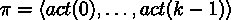

有序计划(图片由作者提供)

## 求解 CSP 的搜索算法

常见的求解器是回溯搜索算法，如下所示。

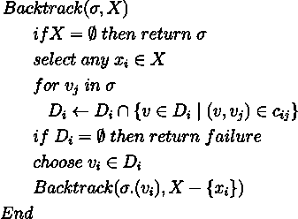

回溯搜索算法(作者图片)

这个算法很简单。它接收σ中的部分解和 x 中的未赋值变量。

如果所有变量都已赋值，这意味着我们有了解，算法返回σ。

否则，它将选择一个变量为其赋值。然后，它继续从域 d 中删除不一致的值。

然后给它赋值，然后递归调用自己。如果在某一点失败，它会回溯并在“选择 vi ∈ Di”处选择另一个值。

当我们用 Python 实现这个算法时，它会更容易阅读。

# Python 中的结论和代码

在这篇文章中，我们学习了如何使用现有的技术——CSP，通过将经典的规划问题表示编码为有界规划问题和约束满足问题，来找到规划问题的解决方案。

然后，我们使用经典的 CSP 回溯算法来解决我们的 CSP。

这种方法的一个限制是我们需要指定计划的长度，这意味着我们可能需要尝试几次才能知道我们的问题是否存在解决方案。

我用 Python 写了编码和 CSP 回溯算法。CSP 回溯算法取自以下链接:

<https://freecontent.manning.com/constraint-satisfaction-problems-in-python/>  

…因为我发现使用函数比使用上一节算法中的元组集更容易理解和实现 CSP 约束。

如果您对代码感兴趣，请从这里获取:

<https://github.com/debbynirwan/planning_csps> 