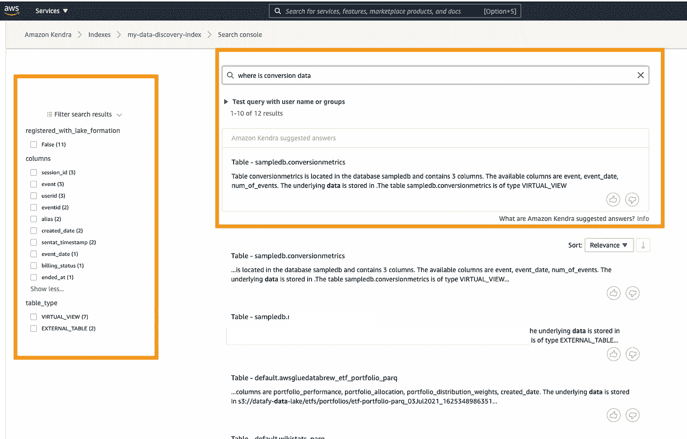
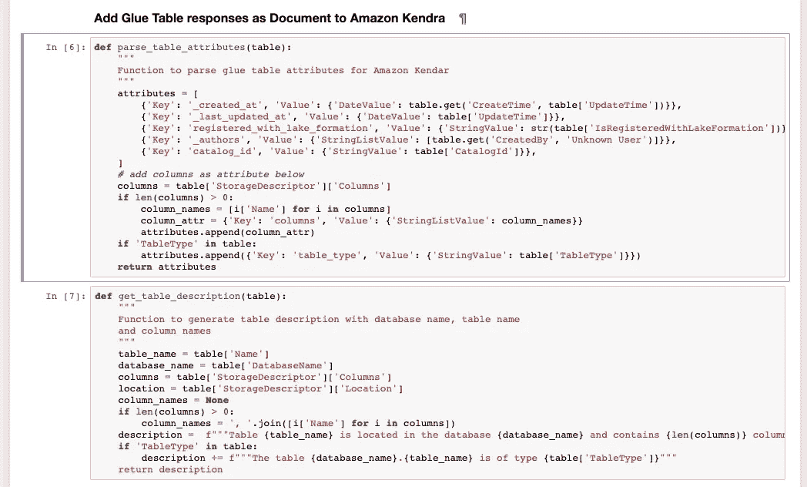
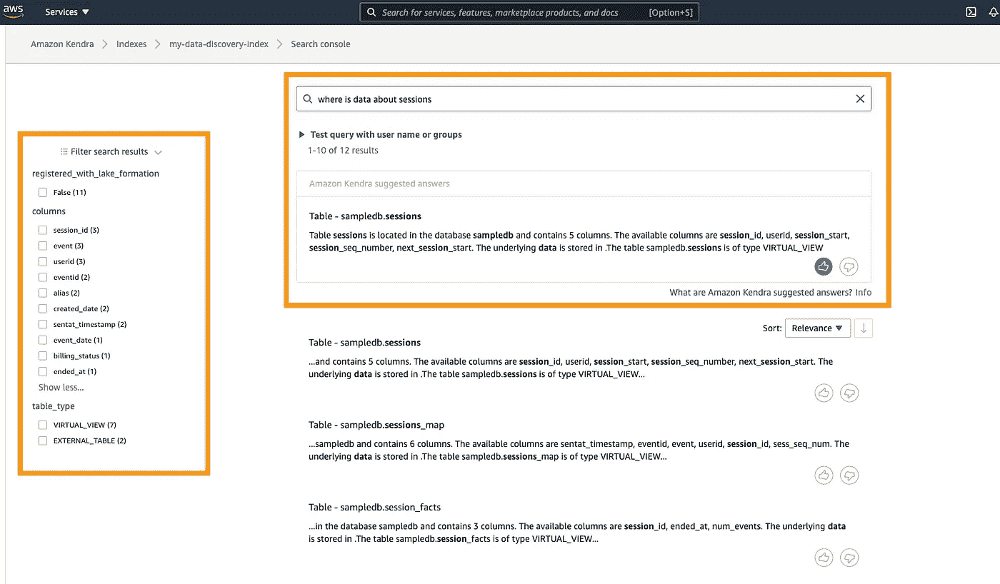
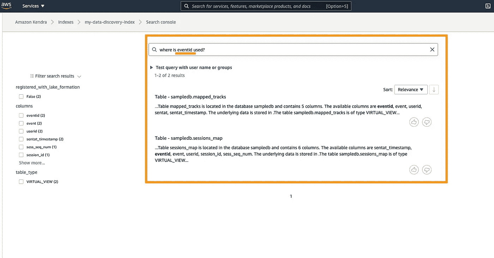
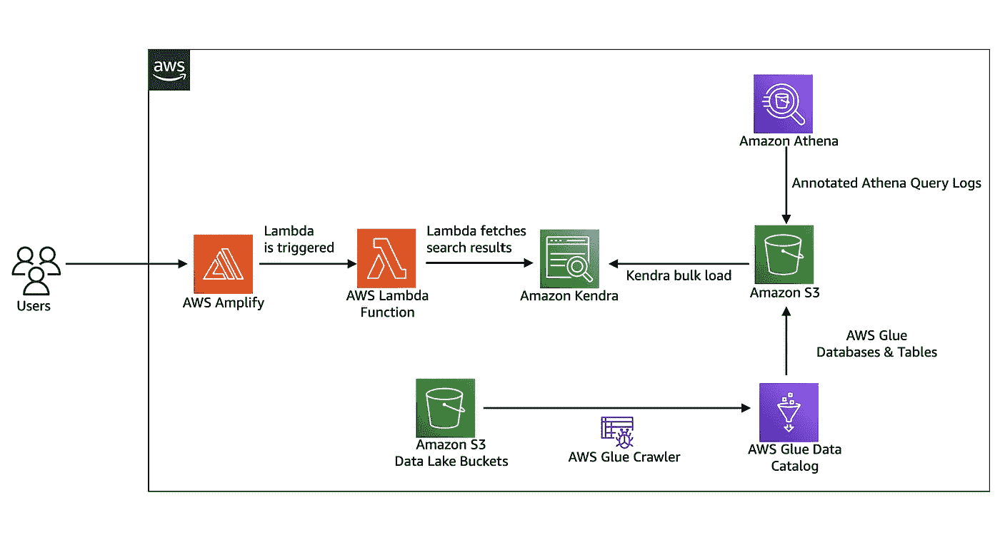

# 通过 Amazon Kendra 和 AWS Glue 数据目录进行人工智能驱动的数据发现

> 原文：<https://towardsdatascience.com/ai-powered-data-discovery-with-amazon-kendra-and-aws-glue-data-catalog-f2d2cdcc9233?source=collection_archive---------17----------------------->

## 如何着手实施完全托管的数据发现服务



通过 Amazon Kendra 和 AWS Glue 数据目录进行人工智能数据发现——Olalekan Elesin

在过去的几个月里，我询问了 AWS 基于 AWS Glue Data Catalog 的完全托管的数据发现服务，但是没有结果。我经常收到使用 AWS Glue 数据目录搜索功能的建议，并使用自定义 UI 和 AWS SDK 进行扩展，这样用户就不需要登录 AWS 控制台来查找可用于分析的相关数据。无论这种方法多么有用，它并没有被证明是有用的，因为我坚信数据发现不仅仅是一个搜索 UI，更多的是关于搜索结果的相关性。这看起来像是机器学习和图形算法的完美问题——还记得 PageRank 吗？

编写 PageRank 算法或重用现有模块是不可能的，主要是因为我要花时间让它投入生产。我还考虑了现有的开源产品，如[阿蒙森](https://www.amundsen.io/)(来自 Lyft)和[数据中心](https://datahubproject.io/)(来自 LinkedIn)，它们都以自己的方式取得了成功，但并不符合我的需要。这不是从功能的角度来看(因为两者都有丰富的功能)，而是从基础设施管理的复杂性来看。我在寻找一种可以使用 AWS Cloud 提供的构建模块轻松拼凑起来的东西。

# AWS 搜索服务来救援

据我所知，在撰写本文时，AWS 上大约有 3 到 4 个搜索管理服务。它们是:

1.  [亚马逊云搜索](https://aws.amazon.com/cloudsearch/)
2.  [亚马逊弹性搜索](https://aws.amazon.com/elasticsearch-service/)
3.  [亚马逊肯德拉](https://aws.amazon.com/kendra/)
4.  [AWS Infinidash](https://dev.to/rainleander/what-is-aws-infinidash-2mjn) (这个服务是虚构的，不存在)

在这三者中， [Amazon Kendra](https://aws.amazon.com/kendra/) 符合我想要解决的特定需求，即使用机器学习来改善数据发现体验(注意:我并不专注于搜索功能)。

## 什么是[亚马逊 Kendra](https://aws.amazon.com/kendra/)

根据产品页面:

> [亚马逊 Kendra](https://aws.amazon.com/kendra/) 是一项由机器学习支持的智能搜索服务。Kendra 为您的网站和应用程序重新设计了企业搜索，以便您的员工和客户可以轻松找到他们正在寻找的内容，即使这些内容分散在您组织内的多个位置和内容存储库中。… Amazon Kendra 是一项完全托管的服务，因此无需供应服务器，也无需构建、训练或部署机器学习模型。

<https://aws.amazon.com/kendra/>  

正如产品页面上所述，[亚马逊 Kendra](https://aws.amazon.com/kendra/) 是一项完全托管的服务，因此，维护和扩展机器学习系统的基础设施负担是完全不可能的。我需要做的就是弄清楚如何以适用于 Amazon Kendra 的格式准备我的数据。

# 这项工作

出于本文的目的，我们将主要从 AWS 控制台关注一个简单的工作流。所附架构图中引用的组件不是本文的一部分，但是正在被开发成一个全功能的数据发现工具。

## 环境设置

我们需要快速原型化和验证这个想法的 AWS 环境设置是一个[亚马逊 SageMaker](https://aws.amazon.com/sagemaker/) 笔记本实例(用于 Jupyter 环境)和一个[亚马逊 Kendra](https://aws.amazon.com/kendra/) 索引。我不会详细介绍如何建立一个亚马逊 SageMaker 笔记本实例，我坚信你会在网上和 AWS 机器学习博客上找到大量关于这方面的资源。

[Amazon Kendra](https://aws.amazon.com/kendra/) 也包含大量关于其设置的文档，但我想强调一下，只需点击几下鼠标，从控制台创建一个索引是多么容易。点击以下链接了解更多信息:

  

一旦我们的 [Amazon Kendra](https://aws.amazon.com/kendra/) 索引建立并运行，接下来的事情就是用可搜索的元数据填充索引。

## 在[数据发现](/data-catalogs-are-dead-long-live-data-discovery-a0dc8d02bd34)中，元数据为王

与任何其他数据发现工具一样，元数据是王道。我们将利用 [AWS Glue 数据目录](https://docs.aws.amazon.com/glue/latest/dg/populate-data-catalog.html)中的数据库和 S3 表。为了使这些信息可以通过 Amazon Kendra 进行搜索，我需要在 Amazon Kendra 中以可索引的格式准备元数据(即 AWS Glue 数据目录中的数据库和表名)。这对于 AWS Python SDK boto3 来说非常简单。请参见下面的示例:

```
def get_all_glue_tables():
    """
    Function to get all tables in AWS Glue Data Catalog
    """
    glue_tables = []
    kwargs = {}
    response = glue.search_tables(**kwargs)
    glue_tables.extend(response['TableList'])
    while 'NextToken' in response:
        token = response['NextToken']
        kwargs['NextToken'] = token
        response = glue.search_tables(**kwargs)
        glue_tables.extend(response['TableList'])
    return glue_tables
```



如何准备 AWS 胶水搜索表结果索引到亚马逊 Kendra

## 在亚马逊肯德拉搜索和发现

随着元数据作为文档添加到[亚马逊 Kendra](https://aws.amazon.com/kendra/) ，是时候体验数据发现了。我的第一个搜索查询是寻找用户会话数据。为此，Amazon Kendra 返回了正确的结果及其建议的答案，这与我正在寻找的答案相匹配。此外，基于 Amazon Kendra 中的元数据和方面配置，我可以过滤我感兴趣的列或表类型(视图或外部表)。



使用 Amazon Kendra 和 AWS Glue 数据目录进行数据发现—图片由 Olalekan Elesin 提供

在研究了会话数据之后，我现在想看看转换时可用的数据。所以，我干脆问亚马逊 Kendra:“转换数据在哪里”。瞧，结果如下图所示


使用 Amazon Kendra 和 AWS Glue 数据目录进行数据发现—图片由 Olalekan Elesin 提供

最后，我希望看到带有 **eventId** 列的表，这样我就知道要为我的分析连接哪些表或视图:



使用 Amazon Kendra 和 AWS Glue 数据目录进行数据发现—图片由 Olalekan Elesin 提供

# 视窗网际网路名称服务

1.  搜索体验允许自然语言提问。例如“eventid 用在哪里？”或者“转换数据在哪里？”。有了这一功能，任何人都可以更轻松地找到分析所需的相关数据。因此，减少了查找数据所需的时间。
2.  无需维护基础设施，只需将数据填充到 Amazon Kendra 索引中，并观察用户发现数据。
3.  Amazon Kendra 文档属性可以用作过滤器，在本例中是列名，为过滤提供了直观的 UI。
4.  超越 AWS 控制台体验的可扩展性。这个我没有试过，但是我从 AWS 找到了 React 组件。[点击此处了解详情](https://docs.aws.amazon.com/kendra/latest/dg/deploying.html)。

# 限制

1.  不允许每个 API 调用向 Amazon Kendra 索引添加超过 10 个文档。这可能是一个很大的限制，尤其是对于包含大量表的 AWS Glue 数据目录。但是，有一个编程解决方法，可以将文档分成 10 个项目的块来添加。
2.  带有字符串列表(即 StringList)的文档属性不能超过 10 项。在这个例子中，我添加了表列名作为带有字符串列表(即列名)的自定义属性。超过 10 列可能是企业表的标准，因此这是一个巨大的障碍
3.  贵！

# 近期工作

尽管这篇博客文章涵盖了在 Amazon SageMaker 笔记本实例和 [Amazon Kendra](https://aws.amazon.com/kendra/) 控制台上开发的 MVP，但要让这样的系统投入生产使用，还需要一个如下面的架构所示的全功能应用程序。此外，与公司内部 wikis(如 Confluence)的集成将改善搜索结果和数据可发现性，因为数据文档存在于此类系统中。该架构还可以扩展到尚未连接到 [AWS Glue 数据目录](https://docs.aws.amazon.com/glue/latest/dg/populate-data-catalog.html)的数据源。



全功能数据发现工具的架构，包含 Amazon Kendra、AWS Glue 数据目录和 Amazon Athena。图片由奥拉勒坎·埃勒辛拍摄

迫不及待地想知道你会用[亚马逊 Kendra](https://aws.amazon.com/kendra/) 造出什么。您可以通过[电子邮件](mailto:elesin.olalekan@gmail.com)联系我，在 [Twitter](https://twitter.com/elesinOlalekan) 上关注我，或者在 [LinkedIn](https://www.linkedin.com/in/elesinolalekan/) 上与我联系。