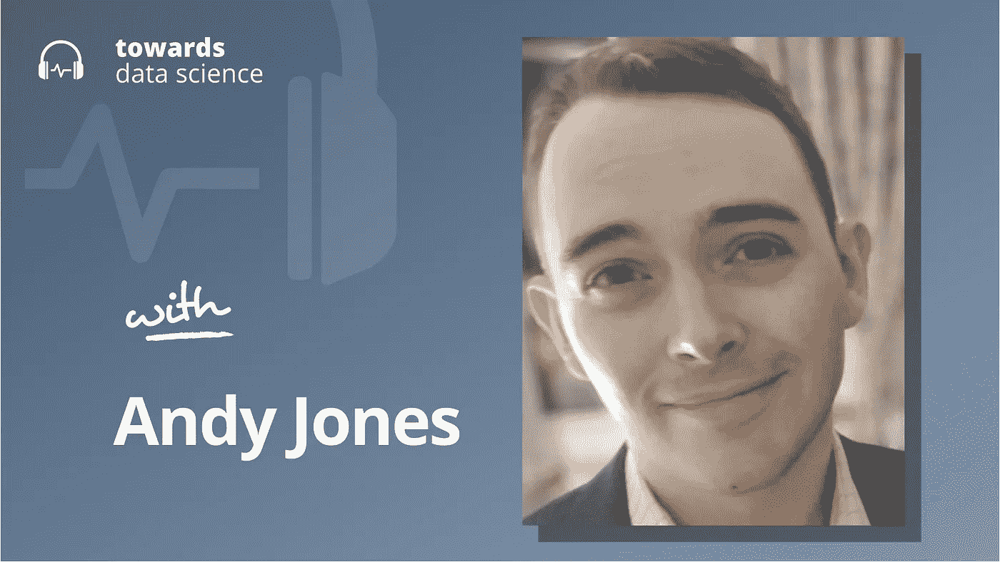

# 人工智能安全和扩展假说

> 原文：<https://towardsdatascience.com/ai-safety-and-the-scaling-hypothesis-76bfee57f924?source=collection_archive---------30----------------------->

## [播客](https://towardsdatascience.com/tagged/tds-podcast)

## 安迪·琼斯解释了我们如何从小型人工智能中预测大型人工智能的能力——以及这对人工智能安全意味着什么

[苹果](https://podcasts.apple.com/ca/podcast/towards-data-science/id1470952338?mt=2) | [谷歌](https://www.google.com/podcasts?feed=aHR0cHM6Ly9hbmNob3IuZm0vcy8zNmI0ODQ0L3BvZGNhc3QvcnNz) | [SPOTIFY](https://open.spotify.com/show/63diy2DtpHzQfeNVxAPZgU) | [其他](https://anchor.fm/towardsdatascience)

*编者按:这一集是我们关于数据科学和机器学习新兴问题的播客系列的一部分*，*由 Jeremie Harris 主持。除了主持播客，Jeremie 还帮助运营一家名为*[*sharpes minds*](http://sharpestminds.com)*的数据科学导师初创公司。*

当 OpenAI 去年宣布发布他们的 GPT-3 API 时，科技界震惊了。这是一个语言模型，只被训练来执行一个简单的自动完成任务，它被证明能够进行[语言翻译](https://twitter.com/IntuitMachine/status/1289862242100338690?ref_src=twsrc%255Etfw%257Ctwcamp%255Etweetembed%257Ctwterm%255E1289862242100338690%257Ctwgr%255E%257Ctwcon%255Es1_&ref_url=https://www.redditmedia.com/mediaembed/i91asy?responsive=trueis_nightmode=false)、[编码](https://twitter.com/NimaRoohiS/status/1283981601697869824)、[论文写作](https://twitter.com/zebulgar/status/1283927560435326976)、[问题回答](https://twitter.com/nottombrown/status/1266188692311339008)以及许多其他任务，而这些任务在以前都需要专门构建的系统。

GPT 3 号有能力解决这些问题的原因是什么？它是如何击败专门为解决它从未明确训练过的任务而构建的最先进的人工智能的？这是一个绝妙的新算法吗？比深度学习更深的东西？

嗯……不。就算法而言，GPT 3 相对简单，是用当时相当标准的变形金刚架构建造的。GPT-3 与之前所有系统的真正区别不是花哨的算法，而是尺寸*:*“GPT-3”是一个简单但庞大的 175B 参数模型，比第二大人工智能系统大 10 倍。**

**GPT-3 只是一长串结果中的最新一个，这些结果表明，扩大简单的人工智能技术可以产生新的行为和更大的能力。这些结果共同推动了人工智能的扩展:追求更大的人工智能，在更大的数据集上进行更多的计算。但是扩大规模是昂贵的:据估计，GPT 3 号的训练成本高达 500 万美元。因此，只有资源丰富的公司，如谷歌、OpenAI 和微软，才能够用缩放模型进行实验。**

**这对独立的人工智能安全研究人员来说是一个问题，他们希望更好地了解先进的人工智能系统如何工作，以及他们最危险的行为可能是什么，但他们负担不起 500 万美元的计算预算。这就是为什么专注于人工智能扩展的独立研究员安迪·琼斯最近的一篇论文如此有前途:安迪的论文表明，至少在某些情况下，大型人工智能系统的能力可以从较小的系统中预测出来。如果这一结果得以推广，它可能会让独立研究人员有能力在小型系统上进行廉价的实验，但这种实验也可以推广到昂贵的大规模人工智能，如 GPT-3。安迪很友好地和我一起参加了这一集的播客。**

**以下是我在对话中最喜欢的一些观点:**

*   **研究人员在过去探索了人工智能的扩展趋势，但他们倾向于只调查模型大小、数据和计算能力的扩展效果。除了探索扩展的计算能力，安迪还尝试扩展人工智能试图解决的问题的复杂性。他使用 DeepMind 的 AlphaZero 算法玩了一个名为 Hex 的简单棋盘游戏，值得注意的是，他发现可以通过观察其在简单游戏中的表现来预测他的人工智能在复杂游戏中的表现。**
*   **已经研究了与特定任务相关的缩放定律(例如，“如果我将模型大小和计算预算增加一倍，图像识别精度会有什么变化？”).但正如 GPT-3 所显示的，当人工智能系统变得更大时，它们不仅在接受训练的特定任务上表现更好，而且通常在全新的、更普遍的任务上也表现更好。不幸的是，因为我们目前缺乏一种方法来衡量人工智能系统的泛化能力，所以还没有直接检查作为规模函数的普遍性的研究(尽管正如 Andy 提到的那样，存在旨在更好地量化人工智能系统中的普遍性的积极努力)。**
*   **人工智能能够学习关于它所接受训练的任务的知识，然后将其应用于其他任务，这种能力被称为元学习。尽管 GPT-3 是我们见过的元学习最引人注目的例子，安迪指出回想起来它并不是第一个。事实上，你可以提出一个非常令人信服的论点，即所有的机器学习都是元学习，至少在某种程度上是如此:模型通常会从一项概括其他任务的狭窄任务中学习东西(即使这些东西的数量和重要性通常小到我们无法注意到它们)。作为一个甚至早于现代机器学习时代的元学习的例子，安迪引用了早期的马尔可夫链模型，这些模型可以产生与他们的训练集中不同的有趣和新颖的语言结构。即使是接受过计算机视觉问题训练的人工智能也显示出发展了一种地理感觉，这种感觉原则上可以应用于其他问题类别。**

**你可以在这里的 Twitter 上关注安迪，或者在这里的 Twitter 上关注我[。](https://twitter.com/jeremiecharris)**

## **播客中引用的链接:**

*   **[安迪在《GPT 3》发布后发布的关于 LessWrong 的原始帖子](https://www.lesswrong.com/posts/N6vZEnCn6A95Xn39p/are-we-in-an-ai-overhang)。**
*   **如果你有兴趣从事独立的人工智能安全研究，安迪推荐[生存和繁荣基金](https://survivalandflourishing.fund/)，它支持他的最新项目。**

****

## ****章节**:**

*   **0:00 介绍**
*   **1:30 安迪的背景**
*   **3:00 为什么 AI 安全？**
*   **13:20 罗宾·汉森模拟奇点**
*   **16:35 我们如何衡量人工智能系统？**
*   **23:45 跨任务能力**
*   **31:45 GPT 3 号的发射**
*   **36:30 安迪的案子及其未来走向**
*   **43:10 围绕 AI 的焦虑**
*   **51:35 游戏算法**
*   **1:00:04 新的扩展发现**
*   **1:10:18 人类不断进步**
*   **1:16:06 增加的安全问题**
*   **1:24:15 总结**