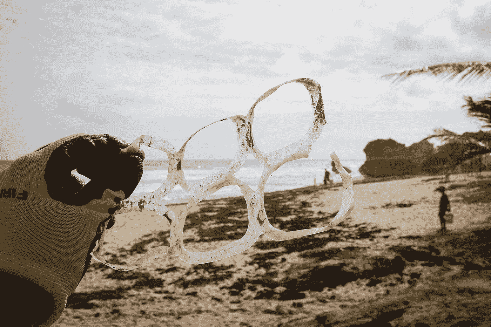
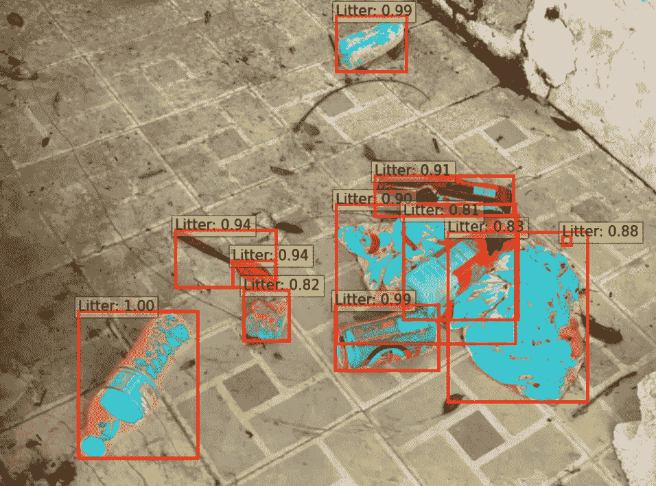
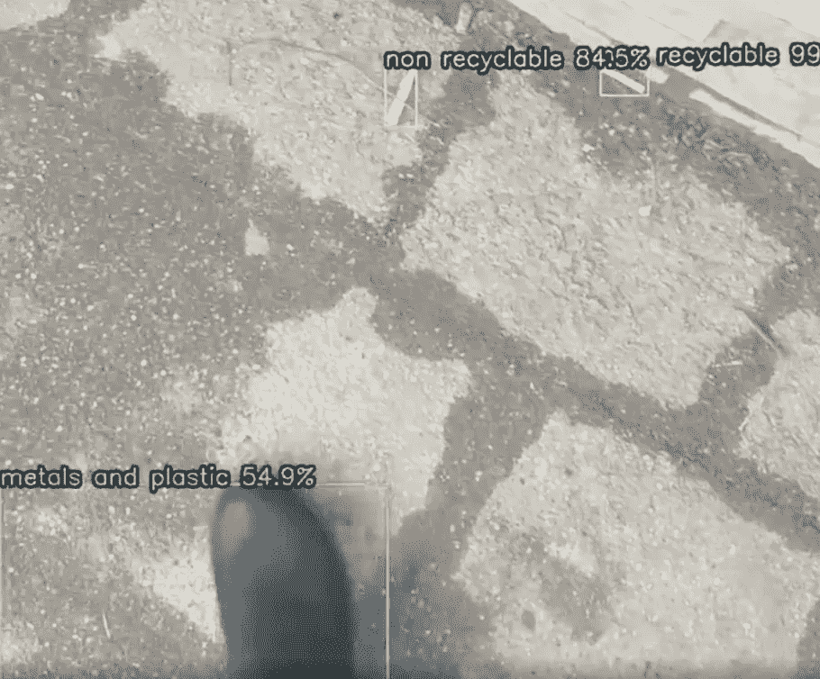
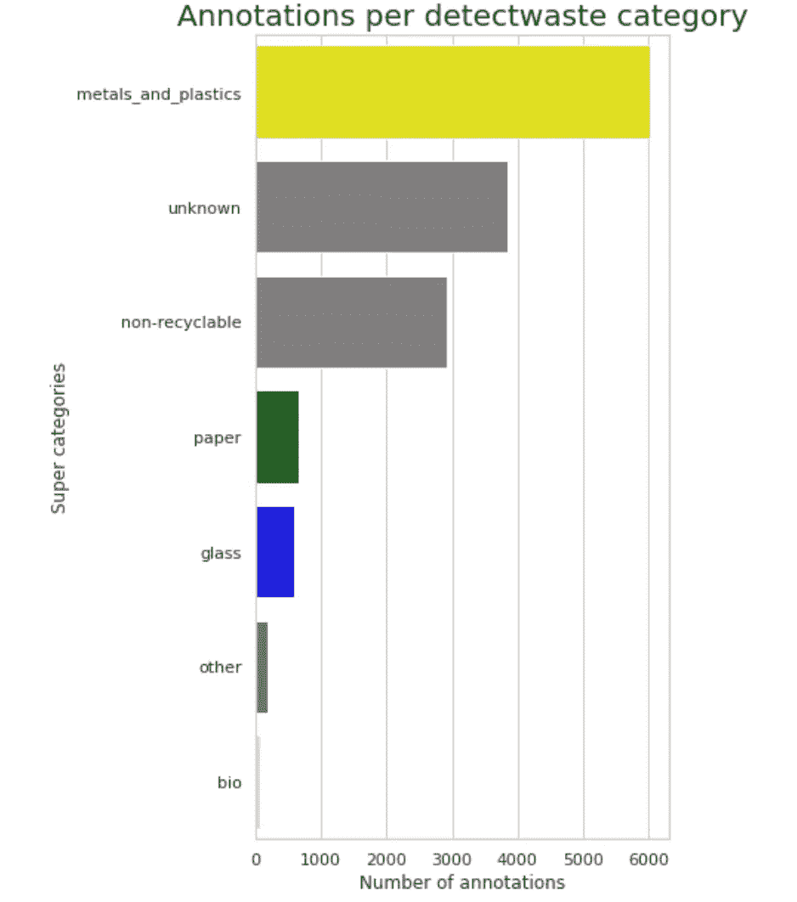
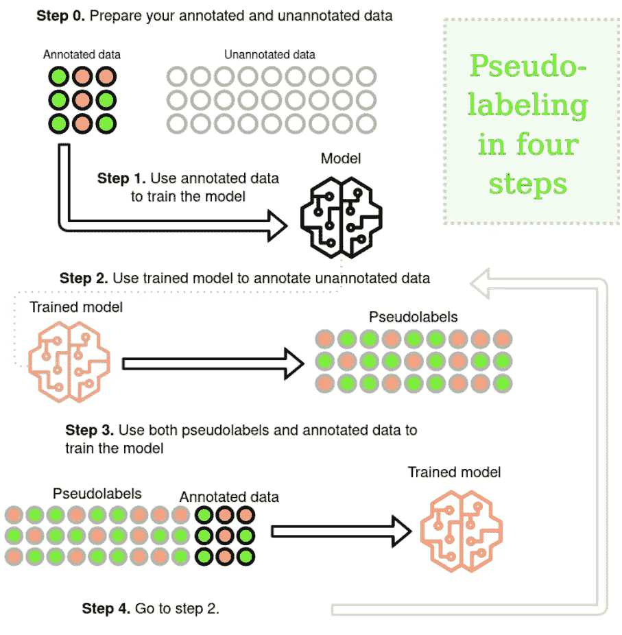
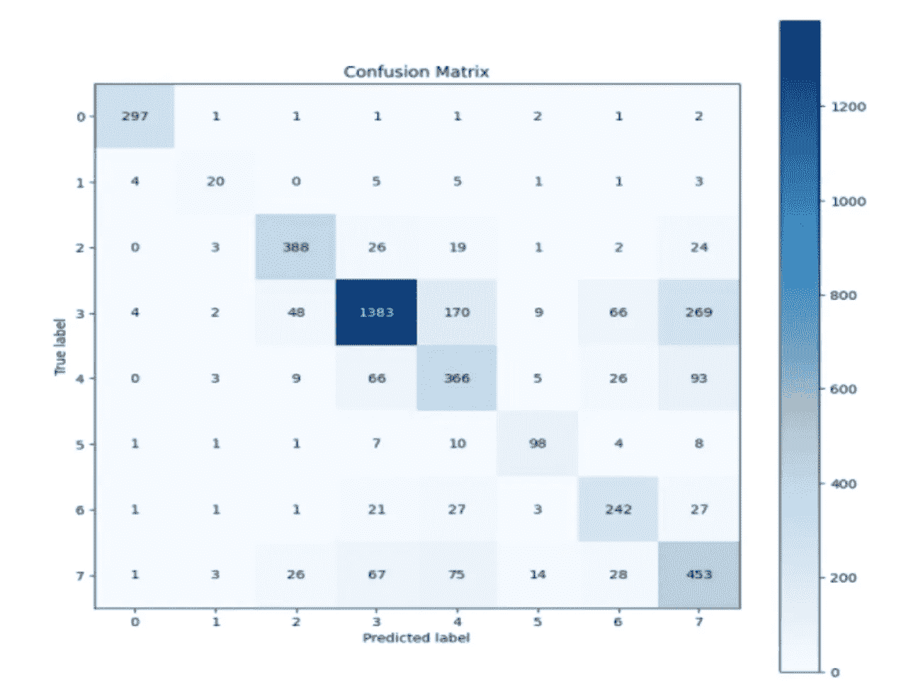

# 创造人工智能对抗环境污染

> 原文：<https://towardsdatascience.com/ai-to-combat-environmental-pollution-6d58b0bf6a1?source=collection_archive---------20----------------------->

## [变更数据](https://towardsdatascience.com/tagged/data-for-change)

## 一群波兰妇女如何在当地环境中建造用于垃圾检测的人工智能

在 [Unsplash](https://unsplash.com?utm_source=medium&utm_medium=referral) 上由 [Brian Yurasits](https://unsplash.com/@brian_yuri?utm_source=medium&utm_medium=referral) 拍摄的照片

# 塑料问题

废物污染是现代世界最大的环境问题之一。

根据纽卡斯尔大学进行的一项研究，人类每年吃掉多达 250 克的微塑料。相当于一年两块半巧克力。而是塑料的。

几乎 90%的塑料来自瓶装水和自来水。今天，每年生产 3 亿多吨塑料，只剩下 30 年的时间，海洋中垃圾的数量就会超过海洋生物的数量。

一群来自**机器学习中的女性&数据科学(WiMLDS)** 组织波兰分会的女性不仅思考了这个问题，还决定自己创造一个解决方案，能够检测环境中的垃圾——使用人工智能。

# 用人工智能对抗垃圾

**在波美拉尼亚检测废物**是一个非盈利、教育、生态项目，旨在利用人工智能造福大众。

## 这个想法是使用机器学习来检测环境中的塑料废物，教育和支持来自当地社区的妇女在数据科学和机器学习领域的职业发展。

该项目的目标是来自波美拉尼亚的人，至少具有中级 Python 知识和深度学习的基本经验。

在 5 个月的时间里，一个由精心挑选的成员、 **9 名女性数据科学家、分析师和机器学习工程师组成的团队在 5 名行业导师的支持下，共同研究和开发一个垃圾检测模型，这是一个适用于视频和摄影的解决方案。**

ai4 检测环境中废物的良好项目 [www.detectwaste.ml](https://github.com/wimlds-trojmiasto/detect-waste/blob/main/www.detectwaste.ml) (来源: [TACO](http://tacodataset.org) 数据集)

# 用于目标检测的迁移学习

在检测波美拉尼亚的浪费项目中，我们使用了 9 个公开的可用数据集，并且使用[谷歌图片下载](https://github.com/hardikvasa/google-images-download)收集了一些数据。我们使用了一种称为迁移学习的技术，这是一种机器学习技术，在一项任务中训练的模型被重新用于第二项相关任务。在我们的例子中，我们使用在众所周知的 COCO 数据集上预先训练的模型。

在 5 个月的工作中，我们尝试了许多模式和方法，其中包括:

*   效率检测，
*   DETR(检测变压器)，
*   屏蔽 R-CNN，
*   更快的 R-CNN，
*   用 ResNet50 分类，
*   使用 EfficientNet 分类。

但是废物检测并不是一件容易的事情。很容易过度训练模型，有时很难定义什么是一窝。

破旧的鞋子。一窝还是不一窝？(图片由 WIMLDS Trojmiasto 提供)

> 我穿的鞋是一只鞋，而不是一只担架。但是如果我把它扔到森林里，它就会变成垃圾。

另一个问题来自生物垃圾；小块苹果，吃了一半的西红柿:神经网络很难学习它们，更难区分它们与自然。毕竟，树下的水果只是一个可能从树上掉下来的水果。但它可能会被人扔出去，然后变成垃圾。

然而，我们已经设法开发了**一个基于开源人工智能的垃圾检测解决方案，并以大约 65%的平均精度检测垃圾**，将其分为主要类别:

*   金属和塑料，
*   纸，
*   玻璃，
*   生物，
*   不可回收，
*   其他未知。

但是，我们是如何做到的呢？**我们决定把任务分成两个**，物体定位和物体分类。

# 第一步——废物本地化

我们试图从许多公共数据集中获取的高质量和低质量图像中检测出浪费。出于这个目的，我们使用了用 PyTorch 编写的 EfficientDet，这是一个流行的最先进的对象检测模型家族，来自 Google Brain 团队。我们的主要目标是从各种环境条件下拍摄的照片中定位垃圾。

我们从在 [TACO 数据集](http://tacodataset.org/)上执行的废物检测开始，TACO 数据集是环境中废物的开放图像数据集。最初，根据格但斯克市的强制隔离规则，TACO 类别被转换为检测废物类别。在第一次尝试后，**我们注意到，我们的模型在定位废物时表现相当好，但在分类时表现不佳**。因此，**我们决定改为尝试单类检测**，并单独分类。

在我们的 GitHub 存储库中，您会发现已经针对我们的混合数据集进行了调整的 EfficientDet 代码。**在我们的案例中，为 1 胎训练的 efficentdet-D2 给了我们最好的可能结果，mAP@0.5 几乎等于 64%** 。较小的架构得分较低，而较大的架构很快就会过度适应。可能是由于高度不平衡的数据。

# 下一步—垃圾分类

对于分类任务，我们使用了 EfficientNet-B2 网络，这也是我们最好的废物检测器 EfficientDet-D2 的主干。[在我们的垃圾分类挑战赛中使用的 EfficientNet](https://arxiv.org/abs/1905.11946) ，是一个基于 AutoML 和复合缩放的卷积神经网络。

此外，我们使用了多种数据扩充技术，这在垃圾分类任务中非常重要。**根据所处的环境，垃圾可以呈现不同的外观——在家里、水下或室外**。因此我们决定应用一些在[相册库](https://github.com/albumentations-team/albumentations)中实现的方法。

第一步，我们必须准备带有适当标签的废物图像。我们将它们从混合数据集的训练和验证子集中剪切出来。

> 裁剪方法的核心是从注释中读取边界框属性，计算其新坐标，然后从源图像中剪切。

*缩放*参数(默认设置为 1)对于在背景中嵌入对象的分类非常有用，但是如果图像中挤满了许多对象，它会降低分数。

此外，我们还使用了一个 OpenLitterMap 数据集，在该数据集上我们已经预先定位了垃圾。最大的困难是从源 openlittermap 文件中提取对象类别，并结合我们预定义的垃圾定位将其分配给我们。由于标签误导，我们决定以半监督的方式使用数据。

TACO 指定的检测废物的类别(资料来源:WIMLDS Trojmiasto)

我们还增加了第八类:*背景*(没有任何垃圾的区域，例如人行道、森林小径、草坪)，因为有必要限制我们的检测器产生的假阳性数量。

为分类目的生成数据可能需要一段时间，但是最终在目标目录中，我们期望看到如下所示的结构。

我们的数据在 DataLoader 中加载到网络中，使用从增强库中选择的数据增强技术( *RandomCrop、HorizontalFlip、VerticalFlip、ShiftScaleRotate、RandomBrightnessContrast、Cutout、Normalize* )。

当涉及到训练模型时，我们**处理了一组标记数据**(来自混合数据集)**以及一组未标记数据**(来自 openlittermap，由于误导性的多标签)。在[的伪标签概念](https://www.semanticscholar.org/paper/Pseudo-Label-%3A-The-Simple-and-Efficient-Learning-Lee/798d9840d2439a0e5d47bcf5d164aa46d5e7dc26)中，主要思想很简单。

1.  首先，根据标记的数据训练模型。
2.  然后，使用训练好的模型来预测未标记数据上的标签—制作伪标签。在下一步中，预测将被视为未标记数据的基础事实标签。
3.  将伪标签和真训练标签混合，用它训练模型。
4.  每个批次或时期重复前面的步骤。

在我们的研究中，伪标签可用于每时期和每批次模式*，这指的是伪标签的更新频率。(资料来源:WIMLDS Trojmiasto)*

# 结果呢

在我们的案例中，在我们的神经网络上以 0.0001 的学习率和 16 的批量运行 20 个时期的训练后，以几乎 3/1 的训练/测试分割，**我们实现了 73.02%** 的测试准确度(和 86.67%的训练准确度)。

标签的 val 子集-id 的混淆矩阵按字母顺序排列:0-背景，1-生物，2-玻璃，3-金属和塑料，4-不可回收，5-其他，6-纸，7-未知。(资料来源:WIMLDS Trojmiasto)

来自测试子集的绝大多数样本都被正确分类。该矩阵还显示了数据的高度不平衡；不幸的是，塑料是最常见的垃圾，同时也是回收时最大的问题。

另一个问题在于回收规则。关于隔离原则，缺乏明确定义的统一准则。每个城市都不一样，每个国家都不一样。

> 例如，与我们的注释者团队讨论的“芯片包”,由于构成它的塑料材料类型的多样性(并非所有都是可回收的),有人可以将其视为属于金属和塑料类的废物，而其他人可以将其视为属于不可回收类的废物。

毕竟，不幸的是，垃圾无处不在。如果不加以收集，它往往会损害我们所在的环境。为了有效地清理它，我们需要学习如何回收它。

如果你对我们的[项目](http://detectwaste.ml)的整个解决方案代码感兴趣，你可以在我们的 [GitHub](https://github.com/wimlds-trojmiasto/detect-waste) 上找到它，你也可以在 [ArXiv](https://arxiv.org/abs/2105.06808) 上读到更多关于它的内容。

作者:

 [## 马格达莱纳·科尔塔斯-培养基

### 阅读马格达莱纳·科尔塔斯在媒介上的作品。数据科学家，WiMLDS Trójmiasto(波兰)联合创始人，AI for Good & Data…

medium.com](https://medium.com/@magdalenakortas)  [## Sylwia Majchrowska 培养基

### 阅读 Sylwia Majchrowska 在介质上的作品。深度学习研究员，物理学博士生，STEM 教育家。每…

medium.com](https://medium.com/@sylwia.majchrowska) 

WIMLDS Trojmiasto 小组成员 Agnieszka mikoajczyk、Sylwia Majchrowska、Maria Ferlin、Ewa Marczewska、Zuzanna Klawikowska、Marta Plantykow、Magdalena Kortas、Anna Brodecka 和 Katarzyna ago cka 制定了项目和最终解决方案。