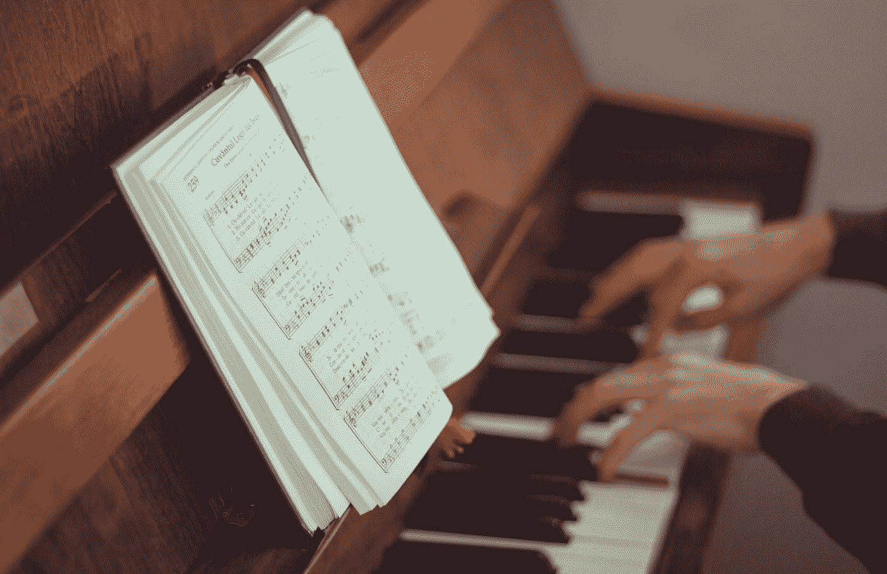
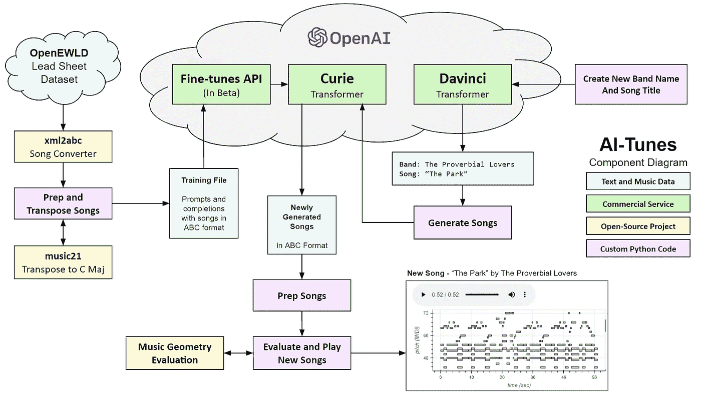
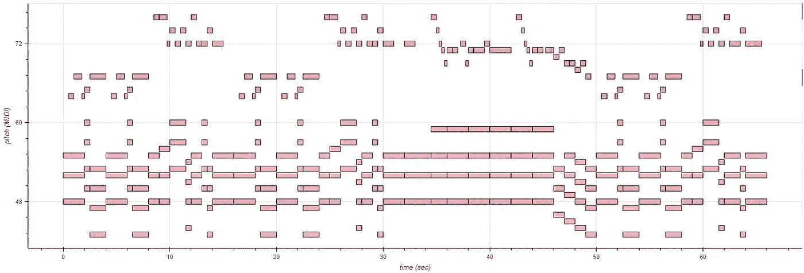
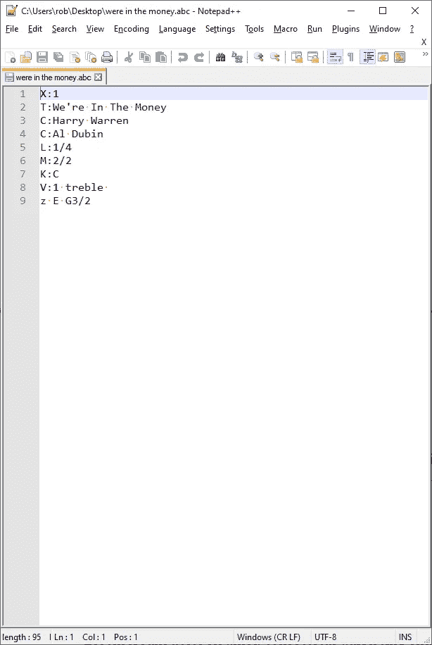
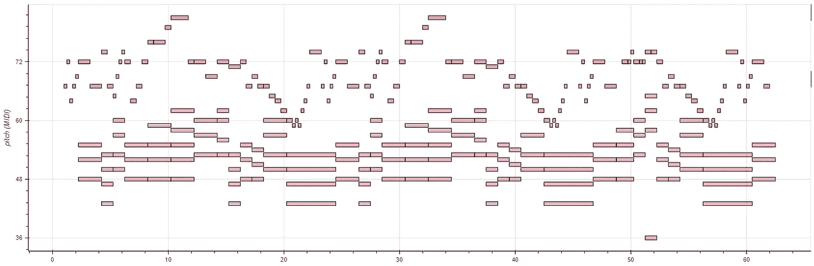
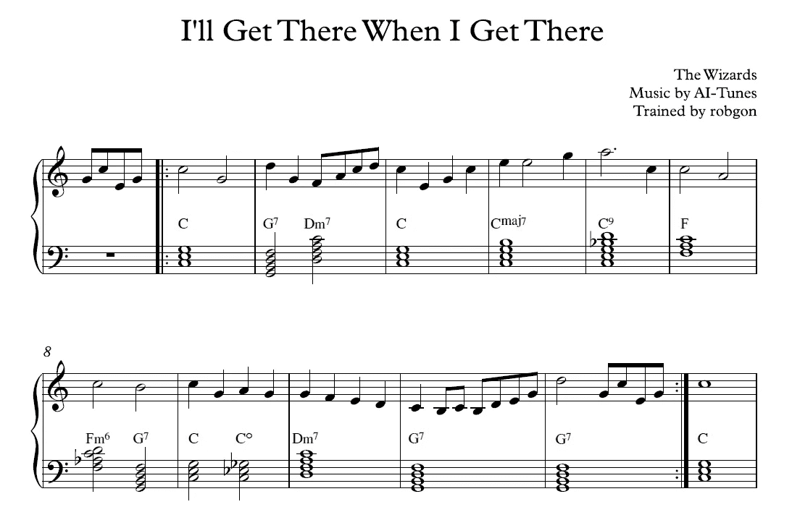
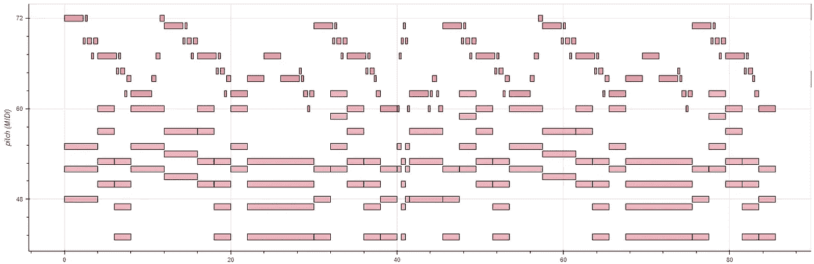
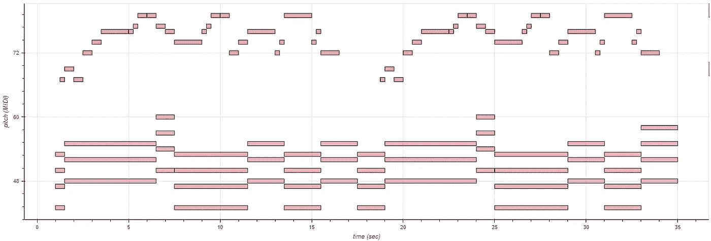
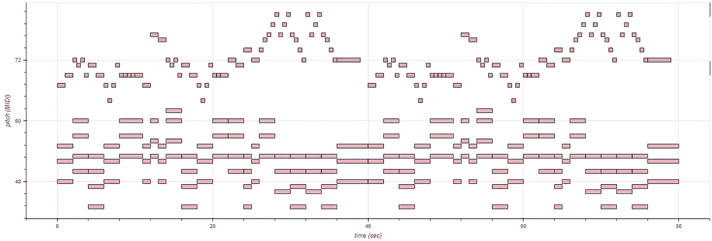
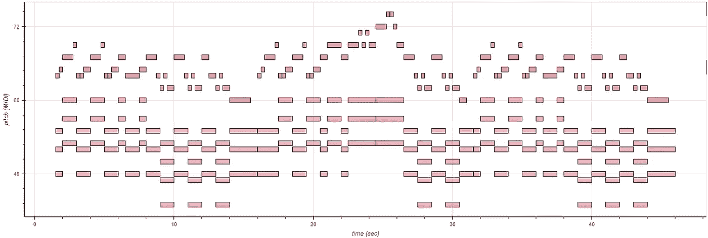

# AI-Tunes:用人工智能创作新歌

> 原文：<https://towardsdatascience.com/ai-tunes-creating-new-songs-with-artificial-intelligence-4fb383218146?source=collection_archive---------5----------------------->

## [实践教程](https://towardsdatascience.com/tagged/hands-on-tutorials)

## 我如何微调 OpenAI 的 GPT-3 来生成具有全球结构的音乐



由[安东·达利斯](https://unsplash.com/@thesollers?utm_source=medium&utm_medium=referral)在 [Unsplash](https://unsplash.com?utm_source=medium&utm_medium=referral) 上拍摄的照片

一年多来，我一直在试验各种基于人工智能的音乐生成系统，我讨厌这么说，但人工智能生成的大多数音乐听起来都像垃圾。要么太复杂杂乱，要么太简单重复。它几乎从来没有一个令人愉快的旋律与整体结构的组成。

我们目睹了最近在基于人工智能的其他媒体形式的内容创作方面取得的进展，如图像和文本。因此，令人困惑的是，人工智能生成的音乐质量似乎远远落后。

当我听说 OpenAI 发布了一个 API 来微调他们的 GPT-3 文本处理模型[1]时，我的第一个想法是，啊哈！，也许我可以用它来创作不烂的音乐。这花了一点功夫，但我设法从公共领域的音乐中获得了一些训练数据，并用它来教 GPT-3 如何作曲。我将在本文中详细解释我做了什么，但首先，这里有一个样本，我从五首生成的歌曲中精选出来的。

**生成歌曲——洗碗先生**，音乐 GPT-3，作者培训

好吧，这并不伟大，但至少对我来说，这听起来很有趣，我敢说，很好？

接下来是这个系统的概述，我称之为 AI-Tunes。

# 概观

下面是 AI-Tunes 的高层示意图。在简要讨论了每个组件之后，我将在下面的小节中更详细地解释处理步骤。



**艾调**组件图，图片作者

我从下载公共领域超过 500 首歌曲的 OpenEWLD [2]数据库开始。每首歌都有旋律和相应的和弦。这些歌曲是一种名为 MusicXML 的格式，它是纯文本格式，但是这种格式有很大的开销。因此，我使用了一个名为 xml2abc[3]的开源脚本来将歌曲转换为 abc 格式[4]，这种格式更加精简，因此更有利于训练基于文本的机器学习(ml)系统。

然后，我使用麻省理工学院的一个名为 music21 [5]的库来处理这些歌曲，并将它们转置到 c 大调，使机器更容易理解音乐。格式化的歌曲被保存在一个训练文件中，并上传到 OpenAI 的微调服务。我训练他们的 GPT-3 居里变压器模型，在歌曲标题和乐队名称的提示下生成一首歌曲。

虽然 Curie 模型生成音乐，但我使用它的老大哥 Davinci 来自动生成歌曲标题和乐队名称。我用这两段数据来提示微调后的 Curie 模型生成 5 首候选歌曲。

我用一个叫 music_geometry_eval [6]的软件包来分析这五首歌的音色质量。分析是基于 Dmitri Tymoczko 在《音乐的几何学》一书中描述的音乐理论[7]。然后，我选择与训练集中的歌曲具有统计上最接近的音质的歌曲。最后，我把这些歌曲作为可视的钢琴曲播放出来。


照片由[戴恩·托普金](https://unsplash.com/@dtopkin1?utm_source=medium&utm_medium=referral)在 [Unsplash](https://unsplash.com?utm_source=medium&utm_medium=referral) 上拍摄

# 系统详细信息

下面的部分描述了 AI-Tunes 中使用的组件和过程的细节。请务必在下面的附录中查看更多生成的歌曲。

## OpenEWLD 数据集

从 ML 系统中获得良好结果的关键之一是拥有良好的训练数据。在研究音乐生成系统时，我发现由于版权限制，论文作者通常不会发布他们的训练数据集。虽然有许多网站托管用户生成的流行歌曲的 MIDI 文件，但这些歌曲的版权仍归作者/出版商所有。如果结果被用于商业用途，使用受版权保护的材料作为训练数据就处于法律的灰色地带。

我发现了一个叫 OpenEWLD 的数据集，可以免费使用。它是增强型 Wikifonia Leadsheet 数据集(EWLD) [8]的精简版，该数据集以 MusicXML 格式收集了 5000 多首歌曲[9]。请注意，“leadsheet”是一个简化的歌曲乐谱，只有旋律和和弦。OpenEWLD 是 EWLD 中 502 首歌曲的摘录，这些歌曲在公共领域中，并且可以用于训练 ML 系统。

公平声明:我没有检查 OpenEWLD 中所有歌曲的出处，以确保它们确实是公共领域中的*。但是快速浏览一下标题/作曲家，会发现一些老调，比如:*

1.  *安迪·拉扎夫、费兹·华勒和哈里·布鲁克斯的《不要行为不端》*
2.  *“太棒了！格斯·卡恩和沃尔特·唐纳森*
3.  *斯科特·乔普林的《枫叶抹布》*
4.  *“哦！斯蒂芬·福斯特的《苏珊娜》*
5.  *艾尔·杜宾和哈里·沃伦的《我们发财了》*

*这是 OpenEWLD 收藏中的一首歌曲的例子。您可以看到歌曲的“钢琴卷帘窗”，这是一个图表，y 轴表示音符的音高值，x 轴表示时间。你可以在下面的 SoundCloud 上播放这首歌。*

**

*真正的歌曲——艾尔·杜宾和哈里·沃伦的《我们在金钱中》，来源:OpenEWLD*

## *ABC 格式*

*正如我上面提到的，OpenEWLD [8]中的歌曲是 MusicXML 格式的，这种格式很好，但是有很多额外的格式化文本。虽然 ML 系统可以学习所有的格式命令并生成这种格式的歌曲，但我发现最好是将音乐符号减少到最少。Chris Walshaw [4]的 ABC 格式是一个很好的匹配。例如，下面是 MusicXML 和 ABC 格式的歌曲“我们有钱”的第一部分。*

****

*阿尔·杜宾和哈里·沃伦的音乐 XML(左)和 ABC 格式(右)的《我们在金钱中》(T1)，来源:OpenEWLD*

*你可以看到，当转换成 ABC 格式时，这首歌被大大简化了。XML 格式的标题需要 503 个字符，前两个注释需要 443 个字符。ABC 格式仅使用 85 个字符的标题和 8 个字符的前两个注释来指定相同的信息。*

## *MusicXML 到 ABC 的转换*

*我使用一个由 Wim Vree [3]开发的名为 xml2abc 的开源脚本将歌曲从 MusicXML 转换为 abc 格式。下面是我用于转换的命令。*

```
*python xml2abc.py were-in-the-money.xml -u -d 4*
```

*这将读取文件“were-in-the-money.xml”，转换它，并将其保存为“were-in-the-money.abc”。-u 选项将“展开”任何重复的小节，而-d 4 选项将默认音符长度设置为四分音符。使用这两个选项通过标准化乐谱来帮助机器学习过程。*

*这是 ABC 格式的整首歌《我们有钱》。*

```
*X:1
T:We're In The Money
C:Harry Warren
L:1/4
M:2/2
I:linebreak $
K:C
V:1 treble 
"C" z E G3/2 E/ |"Dm7" F"G7" G3 |"C" z E G3/2 E/ |"Dm7" F"G7" G3 
"C" z e"C+" e3/2 c/ | %5 | "F" d c d"Ab7" c |"C" e c"Dm7" c"G7" d
"C" c2 z2 |"C" z E G3/2 E/ |"Dm7" F"G7" G3 | %10
"C" z E G3/2 E/ |"Dm7" F"G7" G3 |$"C" z e"C+" e3/2 c/
"F" d c d"Ab7" c |"C" e c"Dm7" c"G7" d | %15
"C" c2 z2 |"C" c2 z2 |$ z"Cmaj7" e d/c/B/A/ |"Cmaj7" B B z/ c A/
"Cmaj7" B B2 c |"Cmaj7" B4 |$ %21
"Cmaj7" z e d/c/B/A/ |"Cmaj7" B B z/ B B/ |"Bb" _B B"A7" A A
"Ab7" _A A"G7" G z |$ %25 | "C" z E G3/2 E/ |"Dm7" F"G7" G3
"C" z E G3/2 E/ |"Dm7" F"G7" G3 |$"C" z e"C+" e3/2 c/ | %30
"F" d c d"Ab7" c |"C" e c2"G7" d |"C" c3 z | %33*
```

## *准备歌曲*

*我通过执行以下处理步骤准备用作训练数据的歌曲:*

1.  *过滤掉不使用 4/4 和 2/2 拍号的歌曲*
2.  *将歌曲转到 c 大调*
3.  *去掉歌词和其他不必要的数据*
4.  *用“$”符号替换换行符*

*统一拍号和调号使得 ML 系统更容易学习旋律音符和定时。大多数歌曲使用 4/4 或 2/2 时间(502 首中的 381 首)，因此不值得让系统理解其他节拍。而且大部分歌曲都已经是 c 大调的调了(502 首中的 303 首)。我使用 music21 包[5]中的一个函数将歌曲转置到一个统一的音调上。*

*我去掉了歌词，以帮助系统只关注音符。我把换行符转换成了“$”，以符合 GPT-3 微调系统的一个怪癖。否则，它会将换行符转换为逗号；这将为 ABC 格式的歌曲带来问题，因为逗号已经用于指定不同八度音阶中的音符。*

## *微调 GPT-3*

*为了微调 OpenAI 的 GPT-3 模型，第一步是编译一个包含 JSON 格式的提示和完成对的文本文件。对于提示，我使用歌曲标题和作曲家的名字。完整版是 ABC 格式的预录歌曲。*

*下面是两个提示完成对的样子:*

```
*{"**prompt**": "X: 1 $ T: We're In The Money $ C: Harry Warren $ <song>", "**completion**": " `C` z E G3/2 E/ |`Dm7` F`G7` G3 |`C` z E G3/2 E/ |`Dm7` F`G7` G3 |`C` z e`C+` e3/2 c/ | $ `F` d c d`G#7` c |`C` e c`Dm7` c`G7` d |`C` c2 z2 |`C` z E G3/2 E/ |`Dm7` F`G7` G3 | $ `C` z E G3/2 E/ |`Dm7` F`G7` G3 |`C` z e`C+` e3/2 c/ |`F` d c d`G#7` c |`C` e c`Dm7` c`G7` d | $ `C` c2 z2 |`C` c2 z2 | z`Cmaj7` e d/c/B/A/ |`Cmaj7` B B z/ c A/ |`Cmaj7` B B2 c |`Cmaj7` B4 | $ `Cmaj7` z e d/c/B/A/ |`Cmaj7` B B z/ B B/ |`Bb` _B B`A7` A A |`G#7` ^G G`G7` =G z | $ `C` z E G3/2 E/ |`Dm7` F`G7` G3 |`C` z E G3/2 E/ |`Dm7` F`G7` G3 |`C` z e`C+` e3/2 c/ | $ `F` d c d`G#7` c |`C` e c2`G7` d |`C` c3 z | $ <end>"}
{"**prompt**": "X: 1 $ T: They Didn't Believe Me $ C: Jerome Kern $ <song>", "**completion**": " z G A c |`Dm7` d2 d2- |`G7` d e d/>e/c/>d/ |`C` e4- |`Em7b5` e e`A7b9` (3e f g |`Dm7` d2 d2- | $ `G7` d d (3d e f |`C` G2 G2- |`Am7` G G A c |`Dm7` f A B c |`G7` d3/2 B/ c`G7/F` d | $ `Em7` g B c d |`Am` e2 e ^f |`Em` g e/>^f/ g2- |`B7` g ^f =e _e |`Em7``Bb9` e4- | $ `A7` e g`A7b9` f e |`Dm7` d2 d2- |`G7` d d/>e/ (3d/e/d/ c/>d/ |`C6` e2 e2- |`Am7` e c d e | $ `Dm` f2 f2 |`G7` f f e _e |`C6``Bb9` e4- |`A7` e e e/f/ g |`Dm` d2 d2- |`G7` d d d/e/ f | $ `C` G2`Dm7` G2- |`Em7` G G`A7` ^G A |`Dm7` f A B c |`G7` d2`G7b9` e2 |`C` c4- | c z z2 | $ <end>"}*
```

*OpenAI 提供了一个检查训练文件有效性的实用程序。下面是我用来检查文件的命令。*

```
*openai tools fine_tunes.prepare_data -f songs.jsonl*
```

*这是结果。*

```
*Analyzing...

- Your file contains 374 prompt-completion pairs
- More than a third of your `completion` column/key is uppercase. 
- All prompts end with suffix ` $ <song>`
- All prompts start with prefix `X: 1 $ T: `
- All completions end with suffix ` | $ <end>`

Based on the analysis we will perform the following actions:
- [Recommended] Lowercase all your data in column/key `completion` [Y/n]: n*
```

*它只标记了一个问题，但这实际上并不是问题。prepare_data 脚本注意到补全中的许多文本都是大写的。这是因为和弦的根音和许多音符都是用大写字母表示的。这个警告可能是针对对话文本，而不是音乐，所以我忽略了这个警告。*

*一旦训练文件处于良好状态，就很容易微调 GPT-3。以下是命令:*

```
*openai api fine_tunes.create -t songs.jsonl -m curie --n_epochs 5*
```

*我选择使用现有的最大的 GPT-3 模型进行训练，居里。虽然没有达芬奇大，但是看起来效果不错。我还将训练历元的数量设置为 5，这表明需要在数据集中运行多少次来进行训练。*

*这是训练的结果。*

```
*Created fine-tune: ft-Vk1UCsXpd65sXXayafTGAY0m
Streaming events until fine-tuning is complete...(Ctrl-C will interrupt the stream, but not cancel the fine-tune)
[2021-08-29 12:10:50] Fine-tune enqueued. Queue number: 0
[2021-08-29 12:10:53] Fine-tune started
[2021-08-29 12:12:55] Completed epoch 1/5
[2021-08-29 12:13:41] Completed epoch 2/5
[2021-08-29 12:14:27] Completed epoch 3/5
[2021-08-29 12:15:13] Completed epoch 4/5
[2021-08-29 12:15:59] Completed epoch 5/5
[2021-08-29 12:17:09] Fine-tune succeededJob complete! Status: succeeded 🎉*
```

*如您所见，运行培训只需要大约六分钟。OpenAI 的团队在训练结束时向我展示了一个庆祝表情符号，获得了额外的积分！*

*在我们检验这个模型创作歌曲的能力之前，我将向你展示我如何使用 GPT-3 达芬奇创建新的歌曲名称和乐队名称作为提示。*

## *生成新的歌曲名称和乐队名称*

*正如您在上面的训练数据示例中看到的，每一行都有一个提示，其中包含歌曲标题和作曲家姓名，后跟 ABC 格式的歌曲。为了生成新歌，我用新歌和乐队名创建了一个新的提示。任何文本都可以，但我认为看到系统在提示新信息时(如歌名和假乐队名)是否可以创作歌曲很有趣。下面是一个提示示例。*

```
*"prompt": "X: 1 $ T: Expensive to Maintain $ C: Shaky Pies $ <song>"*
```

*为了做出很多这样的提示，我使用了 GPT-3 达芬奇系统。不需要微调。给定这样的提示，达芬奇模型可以很好地工作。请注意，我在提示中填写了虚假的乐队名称和歌曲。*

```
*Create a new song title a new band name. Be creative!Band name: The Execs
Song title: Company Meeting
###Band name: The One Chords
Song title: Moving Down to Burlington
###*
```

*这是 GPT 3 号达芬奇的一些样本结果。*

```
*Band name: The Wizards
Song title: I’ll Get There When I Get There
###Band name: The Undergrads
Song title: I'm Just a Kid
###Band name: The Fortunes
Song title: What Do You Want from Me?
###*
```

*好像是一些好玩的歌！顺便说一下，这些生成的歌名和/或乐队名可能存在于现实世界中，但如果是这样，也没关系。我只是用这些来提示写歌模式。*

## *创作新歌*

*现在我们有了一些提示，让我们看看模型能做什么。我生成了第一首歌的五个版本，并选择了最好的一个。*

**

***生成歌曲——奇才**的《我到了就到了》，AI-Tunes 的音乐*

*好的，旋律相当简单，听起来相当不错。请注意这个有趣的结构，它似乎是 ABABCB。你可以在下面的附录中看到和听到更多生成的歌曲。*

## *评价歌曲调性*

*最后一次测试，我以评论家的身份参与其中。我听了《到了就到了》的五个生成版本，选择了最好的一个。请注意，该批次中有一些旧车。他们中的一些人开始还不错，但后来开始演奏一些奇怪的音符。其他人只是一遍又一遍地重复一个短语，没有太多变化。*

*鉴于该系统可以制作出这些歌曲的许多版本，我研究了使用统计数据来帮助淘汰旧车。我发现在测量音乐音质的主题上已经做了很多研究。*

*我上面提到的 Dmitri Tymoczko 的书有完整的标题，“音乐的几何学:扩展的共同实践中的和声与对位”[7]。在书中，Tymoczko 讨论了音乐调性的五个特征。*

> *[这]五个特征存在于广泛的[音乐]流派中，西方的和非西方的，过去的和现在的，它们共同促成了一种音调感:*
> 
> *1.**合音旋律动作**。旋律倾向于从一个音符到另一个音符移动一小段距离。*
> 
> *2.**声协和**。和谐的和声比不和谐的和声更受青睐，而且更倾向于用在音乐的稳定点上。*
> 
> *3.**调和一致。一段音乐中的和声，不管它们是什么，在结构上往往是相似的。***
> 
> *4.**有限宏观和谐**。我用“宏观和声”这个术语来指代在中等音乐时间跨度内听到的所有音符。调性音乐倾向于使用相对较小的宏观和声，通常包含五到八个音符。*
> 
> *5.**居中**。在适度的音乐时间跨度内，一个音符听起来比其他音符更突出，出现更频繁，并作为音乐运动的目标。*
> 
> *——德米特里·季莫申科《音乐的几何学》*

*我在 GitHub 上找到了一个名为 music-geometry-eval [6]的开源项目，它有 Python 代码来评估 Tymoczko 的三个音调特征，**联合旋律运动**，**有限宏观和声**和**中心性**。*

*我通过代码运行了我的训练数据中的所有 374 首歌曲，以找到这三个指标的平均值和标准偏差。结果如下:*

```
***Conjunct Melodic Motion** (CMM) : **2.2715** ± 0.4831
**Limited Macroharmony **   (LM)  : **2.0305** ± 0.5386
**Centricity **             (CENT): **0.3042** ± 0.0891*
```

*这里是五个生成版本的“我到了那里就到了”的统计数据。我还计算了五首歌曲中每一首的平均(NDM)值的归一化距离，将每首生成的歌曲的指标与训练数据集中歌曲的平均指标进行比较。*

```
***Generating Song Version 0**
  CMM : 2.3385
  LM  : 3.5488
  CENT: 0.5213
  NDM : 8.1677**Generating Song Version 1**
  CMM : 3.828
  LM  : 2.3396
  CENT: 0.2677
  NDM : 10.7161**Generating Song Version 2**
  CMM : 3.124
  LM  : 1.5614
  CENT: 0.2244
  NDM : **3.8996**  **<-- Closest tonality to the training data****Generating Song Version 3**
  CMM : 2.0206
  LM  : 3.4195
  CENT: 0.4869
  NDM : 7.0639**Generating Song Version 4**
  CMM : 3.2644
  LM  : 1.4132
  CENT: 0.2436
  NDM : 5.5533*
```

*果不其然，我选择的那首“最好的”歌曲，第二版，恰好也是 NDM 最佳配乐。请注意，这种情况经常发生，但并不总是如此。在进行了十几次这样的实验后，我发现有时候 NDM 评分第二或第三接近的歌曲听起来是最好的。*

# *讨论*

*AI-Tunes 系统工作得相当好。并不是每首曲子都很好，但它经常会产生有趣的音乐，有可识别的主题和变奏。*

*如果你了解音乐创作，你可能会注意到有些作品需要一点“清理”。例如，有时系统由于在各处插入额外的八分音符而不能严格遵守 4/4 拍。(提示:听生成的音乐时，试着用脚跟着节拍打拍子。)*

*好消息是，你可以下载生成的音乐作为 MIDI 文件，并很容易地在乐谱软件中修改它们。例如，这是一个示例歌曲的清理版本。*

**

***清理示例**，图片作者*

*至于作文的总体质量，肯定还有改进的余地。例如，如果 OpenAI 为他们更大的 Davinci transformer 提供微调，结果音乐可能会改善。*

*此外，在更大的音乐数据集上训练系统肯定会有所帮助。它可能会更新音乐的风格，使之成为这个千年的东西😄。*

*实现 Tymoczko 的其他两个音调特征，声学共鸣和谐波一致性，将有助于评估生成的结果。*

# *后续步骤*

*将 AI-Tunes 模型扩展到包括像音乐短语完成和和弦条件生成这样的功能是相当容易的。*

*对于短语完成，训练集将需要包含歌曲部分，在提示中包含来自原始歌曲的一个或多个小节，响应将包含从歌曲中的该点拾取的一个或多个小节。当运行系统生成新的部分时，会传入一组前面的和弦和旋律，系统会完成音乐短语。*

*对于和弦调节，训练提示将只包含 ABC 格式的原始歌曲的和弦，而预期的响应将是原始旋律。当生成音乐时，只传入和弦，系统会生成与和弦匹配的旋律。*

# *源代码和 Colab*

*这个项目的所有源代码都可以在 [GitHub](https://github.com/robgon-art/ai-tunes) 上获得。你可以使用这个 [Google Colab](https://colab.research.google.com/github/robgon-art/ai-tunes/blob/main/AI_Tunes_Generate_Music.ipynb) 来试验代码。这个 Colab 只有在你有 OpenAI 账户的情况下才有效。如果你没有账户，你可以[在这里](https://openai.com/blog/openai-api/)注册。我在 [CC BY-SA 许可](https://creativecommons.org/licenses/by-sa/4.0/)下发布了源代码。*

**

***归属分享相似***

# *感谢*

*我要感谢詹尼弗·林和奥利弗·斯特里普尔对这个项目的帮助。我要感谢麻省理工学院图书馆的乔治娜·刘易斯帮我找到了一本《音乐的几何学》*

# *参考*

*[1] OpenAI， [GPT 微调 API](https://beta.openai.com/docs/api-reference/fine-tunes) (2021)*

*[2]弗·西蒙内塔，[公开赛](https://github.com/00sapo/OpenEWLD) (2017)*

*[3] W. Vree， [xml2abc](https://wim.vree.org/svgParse/xml2abc.html) (2012)*

*[4] C. Walshaw， [ABC 符号](https://abcnotation.com/) (1997)*

*[5]麻省理工学院，[音乐 21](https://web.mit.edu/music21/) (2010)*

*[6] S. G .巴伦西亚，[音乐-几何-评估](https://github.com/sebasgverde/music-geometry-eval) (2017)*

*[7] D. Tymoczko，[音乐的几何学:扩展的普遍实践中的和声与对位](https://dmitri.mycpanel.princeton.edu/geometry-of-music.html) (2010)，牛津音乐理论研究*

*[8] F. Simonetta，[增强的 Wikifonia 铅片数据集](https://zenodo.org/record/1476555#.YSzKqI5KiUk)，(2018)*

*[9] M. Good， [MusicMXL](https://www.w3.org/2021/06/musicxml40/) (2004 年)*

# *附录*

*在这里你可以找到更多由 AI-Tunes 生成的歌曲的例子。*

## *菜鸟的“普通美分”*

**

***生成歌曲——菜鸟《平凡的美分》**，AI-Tunes 配乐*

## *大学生的“我只是个孩子”*

**

***自创歌曲——大学生的《我只是个孩子》**，AI-Tunes 的音乐*

## *“你想从我这里得到什么？”凭运气*

**

***生成歌曲——《你想从我这里得到什么》**，AI-Tunes 音乐*

## *老年人的“老人社会”*

**

***生成曲——前辈们的《老乡亲社》**，艾曲*

## *老鼠帮的《让我们在一起》*

**

***生成歌曲——鼠帮**的《我们聚一聚》，AI-Tunes 的音乐*

*为了无限制地访问 Medium 上的所有文章，[成为](https://robgon.medium.com/membership)的会员，每月支付 5 美元。非会员每月只能看三个锁定的故事。*