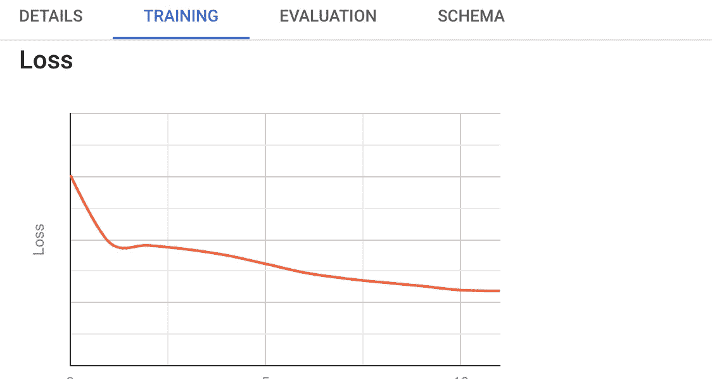

# 人工智能与大数据

> 原文：<https://towardsdatascience.com/ai-vs-big-data-9acfc7b2d37d?source=collection_archive---------31----------------------->

## 什么是什么，术语和预测

蒂莫·瓦格纳在 [Unsplash](https://unsplash.com/photos/6e8E-8BEeWU) 上拍摄的照片

人工智能和大数据通常被视为矛盾的构造，而不是可以携手合作的领域。但事实真的是这样吗？下面的文章涉及术语、预测，并试图回答像人工智能在可预见的未来是否真的取代大数据这样的问题。

## 什么是人工智能？

**人工智能(简称 AI)关注的是在机器**尤其是计算机系统的帮助下模仿人类的思维过程。AI 是如何工作的？一般来说，人工智能系统的工作原理是摄取大量带标签的训练数据，分析数据的相关性和模式。然后，产生的模式被用于预测未来的状态。聊天机器人可以被认为是一个利用人工智能的例子，因为它们正在学习更具体地回答问题，从以前的用户那里获得更多的信息。[1]

## 什么是大数据？

**大数据是指来自不同部门和来源的大量数据，这些数据使用专门的解决方案进行存储、处理和分析。** [2]这些不同类型的数据来源于传感器、设备、视频/音频、网络、日志文件、交易应用、网络和社交媒体等。其中大部分都是大规模实时生成的[3]。术语“大数据”已经在科学和实践中出现了好几年。通常，大数据的挑战，特别是 **3Vs** ，是指数据(量)的持续增长、种类和速度的增加，以及数据变化速度的加快[4]。

## 大数据和 AI 如何互补？

这两个领域相互依赖。如今，数据的来源变得越来越复杂，而不是传统的数据来源，因为它们正在受到人工智能、移动设备、社交媒体和物联网(IoT)的驱动。[3]因此，人们可以得出结论，**人工智能依赖于大数据**，因为后者为前者提供了重要的数据集，能够为最终用户的决策提供坚实的基础。这里有一个更好理解的具体例子:公司利用人工智能和大数据在互联网和社交媒体网络中搜索用户评级。因此，通过使用监督学习和自然语言识别等工具，可以快速识别和解决问题，以提高客户的好感度。[5]

## 实际例子

像 ***这样的新方法将计算带入数据，或者将机器学习/算法带入数据*** 就是这两个领域如何相互作用的很好例子。特别是，由于像谷歌、亚马逊和微软这样的大提供商提供数据库和数据仓库等与人工智能服务的链接服务，因此不再需要将数据集成到其他平台或系统中[6]。

使用 Google BigQuery 的 ML—图片由作者提供

像 BigQuery ML 这样的工具使机器学习的使用民主化。数据科学家和分析师可以使用 BigQuery ML 直接在数据平台中构建和运行模型。预测分析有助于商业决策。因此，在这种情况下，数据科学可以直接在大数据技术中执行。

## 摘要

总之，可以说人工智能依赖于大数据。只有拥有海量的数据，人工智能技术才能模仿人类的思维过程。因此，这两个领域相互依赖。因此，需要 IOT、ML 或 Self-Service-BI 等新技术和方法来应对不断增长的数据量，并为公司管理层的决策奠定坚实的基础。在这种情况下，重要的是要注意，大数据和人工智能不是相互竞争，而是相互依赖和受益。

## 资料来源和进一步阅读

[1] TechTarget，[https://search enterprise AI . TechTarget . com/definition/AI-Artificial-Intelligence](https://searchenterpriseai.techtarget.com/definition/AI-Artificial-Intelligence)(2021)

[2] GablerWirtschaftslexikon，[大数据](https://wirtschaftslexikon.gabler.de/definition/big-data-54101) (2021)

[3] IBM，[什么是大数据分析？](https://www.ibm.com/analytics/hadoop/big-data-analytics) (2021)

[4]麦肯锡公司，[人工智能下一个数字前沿？](https://www.mckinsey.com/~/media/mckinsey/industries/advanced%20electronics/our%20insights/how%20artificial%20intelligence%20can%20deliver%20real%20value%20to%20companies/mgi-artificial-intelligence-discussion-paper.ashx)2017 年

[5] DATABERG，[旅游行业大数据、机器学习和人工智能的 10 个例子](https://blog.datumize.com/10-examples-of-big-data-machine-learning-and-ai-in-travel-industry) (2019)

【6】Google，[什么是 BigQuery ML？](https://cloud.google.com/bigquery-ml/docs/introduction?hl=en) (2020 年)