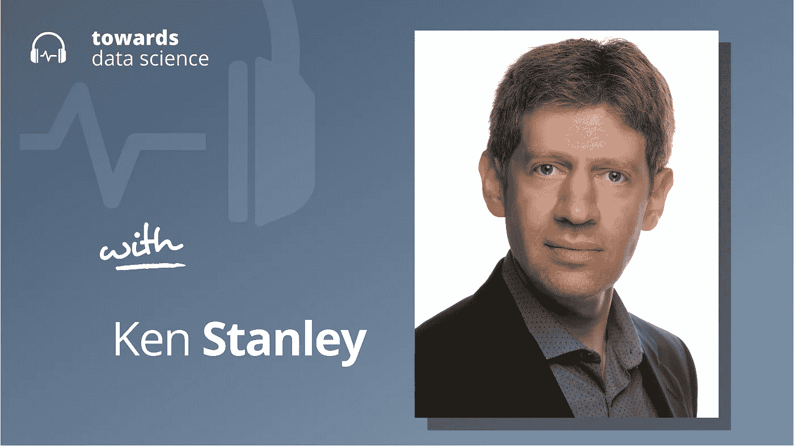

# 没有目标的人工智能

> 原文：<https://towardsdatascience.com/ai-without-objectives-48b9c8e7b988?source=collection_archive---------26----------------------->

## [播客](https://towardsdatascience.com/tagged/tds-podcast)

## 肯·史丹利谈进化论、开放式学习和 AGI

[苹果](https://podcasts.apple.com/ca/podcast/towards-data-science/id1470952338?mt=2) | [谷歌](https://www.google.com/podcasts?feed=aHR0cHM6Ly9hbmNob3IuZm0vcy8zNmI0ODQ0L3BvZGNhc3QvcnNz) | [SPOTIFY](https://open.spotify.com/show/63diy2DtpHzQfeNVxAPZgU) | [其他](https://anchor.fm/towardsdatascience)

*编者按:TDS 播客由 Jeremie Harris 主持，他是数据科学导师初创公司 SharpestMinds 的联合创始人。每周，Jeremie 都会与该领域前沿的研究人员和商业领袖聊天，以解开围绕数据科学、机器学习和人工智能的最紧迫问题。*

今天，大多数机器学习算法都使用相同的范式:设定一个目标，并训练一个代理、神经网络或经典模型来实现该目标。这种方法产生了良好的效果:这些类型的人工智能可以听、说、写、读、画、驾驶等等。

但它们也有内在的局限性:因为它们针对人类感兴趣的目标进行优化，所以它们通常会避开参数空间中有价值但人类不会立即感兴趣的区域，或者我们设置的目标函数。这对像肯·斯坦利这样的研究人员提出了挑战，他的目标是建立广泛超智能的人工智能系统——在广泛的任务中超越人类的智能系统。除其他外，Ken 是一名前初创公司创始人和人工智能研究员，他的职业生涯包括在学术界和 UberAI 实验室工作，最近在 OpenAI 领导开放式学习团队。

在这一集的 TDS 播客中，肯和我一起谈论了他 2015 年的著作《伟大是无法规划的:目标的神话》,开放性对人类意味着什么，智能的未来，甚至人工智能的安全。

以下是我在对话中最喜欢的一些观点:

*   创造力是人工智能系统尚未掌握的东西，在相当狭窄的背景之外。像 DALL-E 和 GPT-3 这样的图像和文本生成器在某些方面可能看起来很有创意，但它们实际上只是通过在训练集中的数据之间进行插值来生成样本。人类发明家所展示的那种真正的、开放的、无处不在的创造力更具挑战性。
*   创造力如此难以自动化的原因之一是它不容易被评估。根据定义，创造性产出具有意想不到的特征，目前还不清楚研究人员如何评估一个解决无法提前预测的问题的结果。以托马斯·爱迪生为例:回想起来，他显然极富创造力。他的发明既有趣又有价值。但是，在我们明确知道他将发明什么来评估他的创造力之前，我们可能会使用什么度量标准呢？肯认为，如果我们要破解创造力和一般智力，这是我们需要回答的关键问题之一。
*   在决定什么是创造力时，存在着固有的主观性。回到托马斯·爱迪生的例子:当爱迪生发明灯泡时，他释放了巨大的经济价值。但是所有的经济价值都是主观的:例如，人们会为灯泡付钱，因为他们主观上觉得有一个比没有好。评估创造性过程的产出所固有的主观性是另一个障碍。
*   创造力的一个违反直觉的特征是:通常情况下，旨在创造特定的东西，并逐步优化它，是一种低效的创造价值的方式。这是因为你想要的创造性输出的前身可能看起来与那个输出非常不同。例如:阿尔伯特·爱因斯坦发展了广义相对论——一种革命性的引力理论——使用了一种几何学，当它在一个世纪前被数学家们发明时，几乎没有任何可以想象的应用。如果那些数学家在很久以前就一直试图为一个新的引力理论做出贡献，而不是简单地追逐他们觉得有趣的想法，那么他们似乎不太可能花时间去开发那些在爱因斯坦最终需要它们时被证明是如此有用的奇异的新几何。矛盾的是，设定具体的目标实际上在很多情况下会导致进展缓慢。
*   肯主张设计寻求做有趣事情的人工智能，而不是为特定目标优化。“有趣”是一个主观的术语，但它的一个可以客观衡量的方面是*新颖性*:为了让一个想法或状态变得有趣，它必须至少与以前的任何东西不同。新颖性可以被很好地衡量:例如，目标状态可以根据某种相似性的度量与过去的状态进行比较，并选择不太相似的状态。
*   Ken 评论了开放式学习策略的风险，如人工智能安全的新颖性搜索。他特别强调，开放式学习的风险之一是其不可预测性，这使得预测事故或偏差行为变得更加困难。如果开放式学习被证明是通往 AGI 的关键路径的一部分，为了安全起见，我们必须找到强有力的方法来限制人工智能的创造力。

你可以[点击这里](https://twitter.com/kenneth0stanley)在 Twitter 上关注 Ken。

## 章节:

*   0:00 介绍
*   1:40 什么是智力？
*   9:30 目标设定
*   15:30 根据兴趣选择
*   24:25 问题示例
*   29:15 环境意味着活动
*   35:10 设定目标
*   42:40 验证方面
*   49:30 开口端和对齐困难
*   什么是开放式结尾
*   1:06:00 总结