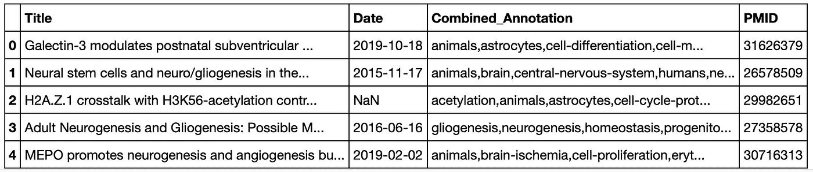
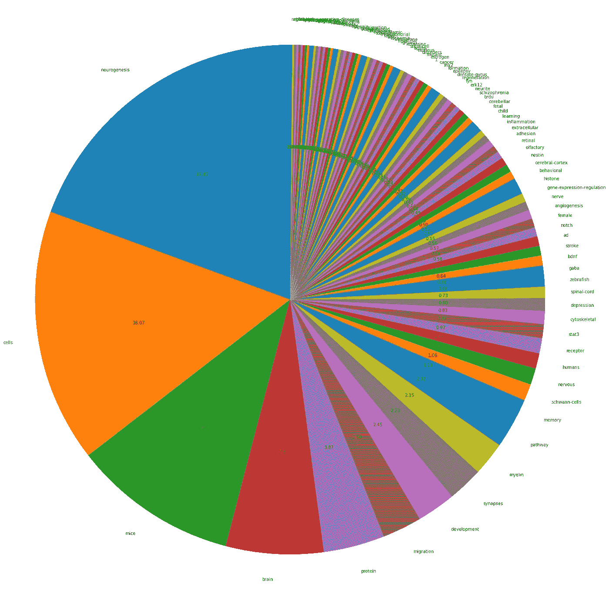
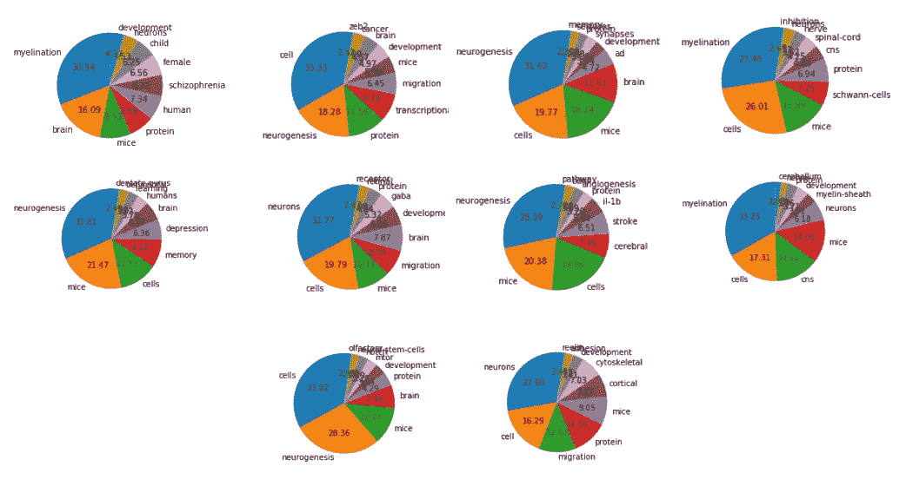

# 用单词注释和嵌入辅助生物医学文献综述过程

> 原文：<https://towardsdatascience.com/aiding-biomedical-literature-review-process-with-word-annotation-and-embedding-9a2d59f6c0cd?source=collection_archive---------35----------------------->

## [实践教程](https://towardsdatascience.com/tagged/hands-on-tutorials)

## 将激动人心的数据科学工具应用于枯燥的文献综述

当你着手任何研究问题时，你首先要做的事情之一就是查阅文献。除非你已经是你所在领域的专家，并且确切知道去哪里找，否则你很可能会被你需要浏览的关于谷歌学术或 PubMed 的大量论文所淹没。因此，你接下来要做的最符合逻辑的事情就是选择最近的评论文章，并抱最大的希望。或者，如果你能快速浏览 5000 篇摘要，提取每篇论文的关键词，排序，并按主题组织它们，会怎么样？

# 方法

## Pubmed 报废

首先，我们需要一个数据库，从中我们将下载我们的摘要。幸运的是， [Pubmed API](https://www.ncbi.nlm.nih.gov/home/develop/api/) E-utilites 允许访问所有 Entrez 数据库，包括 Pubmed、PMC、基因、核核心和蛋白质[1]。随后，我们可以编写一个`pubmed_scrapping`函数来指定术语、要下载的文档数量，并根据它们与术语的相关性进行组织。此外，对于每个文档，我们将返回其标题、 [MeshHeading](https://www.nlm.nih.gov/mesh/meshhome.html) 、摘要、出版日期和 PMID。

代码 1。pubmed _ 报废函数

## BeCAS 注释

虽然我们可以只使用网状标题来对我们的论文进行分组，但我们可以更进一步，通过扫描摘要和标题来寻找额外的重要关键字，这些关键字过于具体，以至于不能首先包含在网状标题中，例如特定的分子途径或模式生物的名称。这样做将允许我们以后对具有类似主题的论文进行分类，例如，将精神病学研究论文分为精神分裂症和自闭症谱系障碍。

在这里，我们可以使用一个生物医学概念识别服务和可视化工具( [BeCAS](https://pubmed.ncbi.nlm.nih.gov/23736528/) )，以及它的 [API](http://tnunes.github.io/becas-python/) 来注释关键的生物学术语(这里还有一个 web 界面)【2】。本质上，BeCAS tool 就像一个大字典，可以执行句子的部分标记，并识别物种、解剖概念、miRNAs、酶、化学物质、药物、疾病、代谢途径、细胞成分、生物过程和分子功能的概念，这些概念是从多个元源(如 UMLS 和 NCBI 生物系统公司)编译的。

结合上面的`pubmed_scrapping`函数的输入，我们可以使用 BeCAS API 提取进一步的关键字。

代码 2。BeCAS 注释

## **BioWordVect 单词嵌入**

一旦我们有了所有必要的关键字(来自 MeshHeadings 和 BeCAS API)，我们就可以将它们组合并转换成一个数值来表示每个文档。

在这里，我们可以使用 BioWordVect，一种预训练的单词嵌入，包含超过 270 万个标记，并且已经在大量 PubMed 摘要和 MeshHeadings 上训练过[3]。与 Word2Vec 中对单个单词进行训练不同，作者对子词进行了训练，这在生物医学数据中证明特别有用，因为其中有许多复合词。假设 BioWordVect 中的每个单词都由一个 200 维的向量表示，我们可以将每个关键字翻译成 BioWordVect 的向量，并将每个文档翻译成这些向量的平均值。

# 结果

为了测试这个概念证明，我查看了 5 个 PubMed 术语:*胶质发生、神经元迁移、神经发生、突触发生和髓鞘形成、*，随后下载了 1000 个摘要(总共 5000 篇论文)，并提取了它们的网格标题和 BeCAS 注释(图 1)。

图一。每篇论文及其组合注释的示例(图片由作者提供)

正如所料，我们可以看到最常见的术语是与神经发生和神经元迁移相关的细胞过程(图 2)。更有趣的是，如果我们放大那些较少提及的术语，我们可以看到不同的模式生物、精神疾病和途径；表明我们已经成功提取了许多更小的子类别。

图二。最常见的术语(作者图片)

一旦将这些术语转换成向量，我们就可以试着将单个的论文组合在一起。使用 K-means 聚类，我将 5000 篇论文分成 10 个聚类，并查看它们最常用的术语。

图 3。使用 K-means 聚类的 10 组论文中最常见的术语(图片由作者提供)

忽略图 3 中最常见的术语，如大脑、髓鞘形成和神经发生(以及可怕的颜色方案)，您可以看到 10 个集群中的每一个似乎都包含不同于其他集群的术语。例如，如果我们问自己在 5000 篇论文中最常见的疾病是什么，我们会看到精神分裂症在一个集群中，抑郁症在另一个集群中，癌症在第三个集群中，中风在第四个集群中，老年痴呆症在第五个集群中。这是特别令人兴奋的，因为这个简单的结果反映了神经科学的现状，这些疾病是研究的主要领域。

然而，考虑到我们使用了无监督的技术，一些可解释性的问题是可以预料的。然而，随着 PubMed 搜索词的选择和关键字预处理的进一步细化，当然还有改进的空间。

# 结论

虽然将自然语言处理应用于生物医学数据并不是一个突破，但令人惊讶的是，帮助文献综述过程的工具并不存在或不为人所知。通过这个简单的概念验证，我们可以将现有的 API 与预训练的单词嵌入模型相结合，以帮助解决我们的研究问题。

最后，你可以在下面查看我为这个项目编写的代码:

 [## 乐海-毫升/文学-评论-神经

### 目录因为我的研究问题非常广泛，为了帮助我的文献回顾过程，我想把…

github.com](https://github.com/lehai-ml/lit-review-neuro) 

# 参考

[1] Sayers，E. (2010)对电子公用事业的一般介绍。Entrez 计划。Util。帮助

[2]t . nu nes、d . Campos、s . Matos 和 j . l . Oliveira(2013)BeCAS:生物医学概念识别服务和可视化。生物信息学。29, 1915–1916

[3] Zhang，y .，Chen，q .，Yang，z .，Lin，h .，和 Lu，Z. (2019) BioWordVec，利用子词信息和网格改进生物医学词嵌入。Sci。数据。6, 1–9