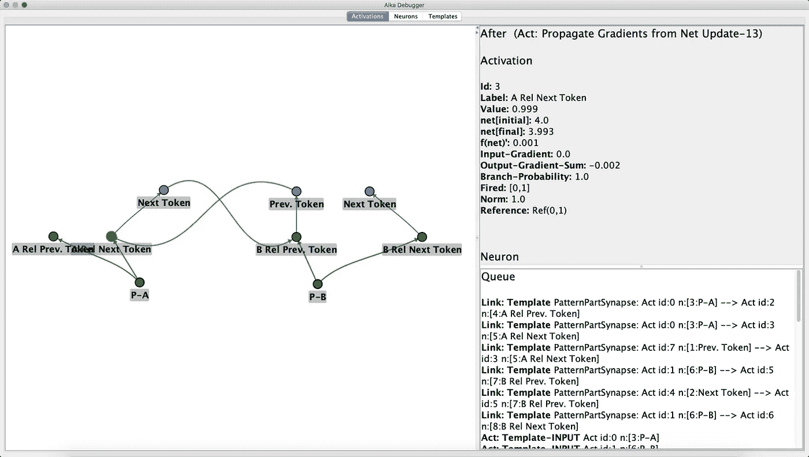

# AIKA:一种事件驱动的神经网络架构

> 原文：<https://towardsdatascience.com/aika-an-event-driven-neural-network-architecture-6a862f1a3ffb?source=collection_archive---------26----------------------->

Siarhei 土坯股票

## 事件队列是有效处理稀疏输入数据集(如文本)的有效方法

传统上，神经网络体系结构是以分层结构组织的。通常这些层是完全连接的，但是根据应用可能有不同类型的层，例如卷积层、递归层或 softmax 层。为了简化数学，这些通常表示为向量或矩阵。这样做的好处是，这些层可以很容易地馈入专门的硬件芯片，从而大大加快处理速度，并允许训练巨大的网络。这种方法只有一个问题。现实世界中的大多数概念非常罕见，在给定的输入数据集中根本不会出现。这些不需要任何计算能力，哪怕是非常小的一点点。实现这一点的先决条件是区分活跃神经元和不活跃神经元。低于其激活阈值的神经元在进一步处理中可以完全忽略。为了充分利用这一设计决策，需要一种新型的网络架构，它不支持预先确定处理顺序的层。相反，我们需要一个事件队列，它能够根据给定的输入数据集以任意顺序处理数据。对于这种类型的架构，从概念上将激活与其神经元分开是有意义的，这意味着有两个单独的图表——一个图表由神经元和突触组成，代表网络已经获得的知识，另一个图表由激活和链接组成，描述网络能够推断出的关于具体输入数据集的信息。神经元和激活之间存在一对多的关系。例如，可能有一个神经元代表一个单词或一个单词的特定含义，但该神经元可能有多次激活，每次激活都代表该单词在输入数据集中的一次出现。在激活网络中，每个激活都基于输入数据集。这种接地可以直接发生在输入激活上，也可以通过代表子模式的激活间接发生。这意味着激活之间的链接有两个目的。一方面，它们用于合计突触权重，另一方面，它们将身份传播到更高级别的激活。

**饭桶:**【https://github.com/aika-algorithm/aika】T2

**项目页面:**[https://aika . network/](https://aika.network/)

爱歌(用于知识获取的人工智能)项目提供了这种神经网络架构的实验性实现，其特征在于以下特征:

*   一种链接过程，确保只有与输出激活的身份一致的链接才被添加到网络中。换句话说，为了将输入链接添加到激活，它需要与用于激活的至少一个其他输入链接基于相同的输入数据。链接由 visitor 类执行，它基本上是一个在激活网络上运行的有限状态机。
*   不同类型的神经元在网络中扮演不同的角色。模式神经元是连接神经元，如果存在足够的输入特征来推断给定模式的存在，则该连接神经元被激活。如果某个输入特征作为整体模式的一部分出现，模式部分神经元也会被激活，这些神经元也表现为联合行为。他们的任务之一是确保输入要素以正确的相互关系出现。模式神经元和模式部分神经元在正反馈回路中相互连接。由模式神经元和与其相关联的模式部分神经元组形成的模式可以堆叠在彼此之上。
*   抑制性神经元是另一种类型的神经元。这些本质上是分离的，并以各种模式连接到模式部分神经元。它们的输出突触与模式部分神经元形成负反馈环路，使得不同模式的模式部分神经元能够相互抑制。然而，负权重突触是特殊的，因为它们需要在激活网络中引入互斥的分支。这些分支相互隔离，并代表输入数据集各部分的某种解释。例如，这些分支可以与句子或图像的解析结构的某种解释相关联。这些分支在人类感知中变得可识别的一个很好的例子是，输入数据集提供了几种同样可能的解释，如句子“大米像沙子一样飞”或隐藏的面部图片。
*   为了实例化这些不同类型的神经元和突触，使用了包含所有蓝图的模板网络。
*   由于这种类型的网络包含环，通常的反向传播算法在这里不太适用。此外，依赖应用于网络输出的手工标签可能非常容易出错，并且可能在我们的训练信号和我们想要调整的权重之间产生很大的距离。这就是经典神经网络需要大量训练样本的原因。因此，我们希望根据输入数据中出现的模式更局部地训练网络，而不依赖于监督训练标签。这就是香农熵派上用场的地方。以一个单词为例，它的输入特征是它的单个字母。在这个例子中，我们可以通过计算香农熵来测量每个字母的信息量。然后我们可以把单词模式神经元看作是压缩单个字母神经元给出的信息的一种方式。单词模式神经元需要更少的信息来传达与单个字母总和相同的信息。这种压缩或信息增益可以使用互信息来形式化，然后可以用于导出我们的训练算法的目标函数。

# 可视化调试器

为了简化 AIKA 项目的调试过程，我们添加了一个图形化的调试工具。它显示了激活网络的图形或实际神经网络的摘录。完整的神经网络通常太大而无法显示。调试器逐步处理事件队列中的每个条目，并在显示的图形中可视化激活网络中的每个变化。它还显示了所有相关对象的属性，包括激活、神经元、链接和突触。此外，它允许我们深入了解链接过程，并跟踪访问者在网络中的行程。

**饭桶:**【https://github.com/aika-algorithm/aika-visualization】T2

# 结论

AIKA 项目代表了从经典的基于层的神经网络架构向事件驱动架构迈出的重要一步，一方面，事件驱动架构更紧密地重新采样了生物神经网络的尖峰性质，但也为符号人工智能领域的概念的更无缝集成打开了大门。