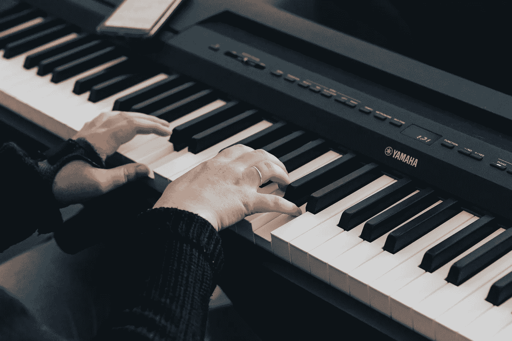
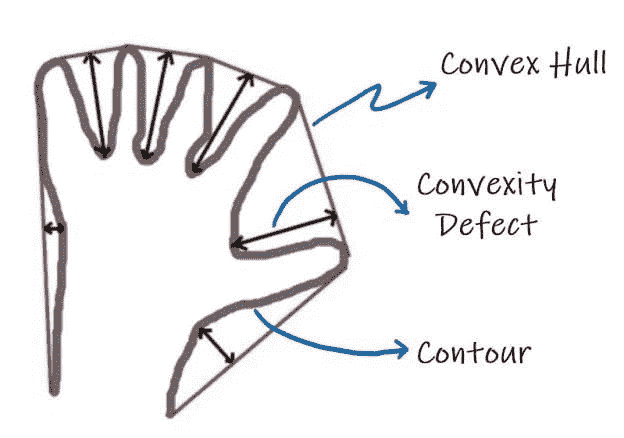
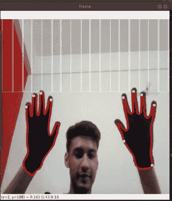

# 使用 OpenCV 和 Python 的空中钢琴

> 原文：<https://towardsdatascience.com/air-piano-using-opencv-and-python-298cb22097d9?source=collection_archive---------10----------------------->

## 只要在空中动动手指就能弹钢琴！

摘自 Unsplash

# 我制作“空气钢琴”的灵感

最近我拜访了我的表妹，她已经试着学习钢琴很长时间了。然而，由于疫情，她的老师不能回家，他们通过变焦会议练习。就在那时，我想到了做一架虚拟钢琴的主意，她的老师和她都可以用它来学习音乐。当我思考这个问题时，我在思考为什么不超越键盘呢？让我们试着凭空创造音乐？让我们的创造性思维流动起来，做出这样一种互动，让一个人只需在空中移动双手就能弹奏钢琴？！就在那时，我决定做一架 ***“空中钢琴”。***

# 项目的技术说明:

空中钢琴是计算机视觉和人机交互融合而成的项目。为了制作 Air Piano，我使用了 Python 语言和一个名为 OpenCV 的专业库。它是一个开源的计算机视觉和机器学习软件库。

帮助我们完成这个项目的另一个重要的库是 PyAutoGUI 库。PyAutoGUI 允许您的 Python 脚本控制鼠标和键盘，以自动化与其他应用程序的交互。PyAutoGUI 有几个特点:移动鼠标在其他应用程序的窗口中点击或键入，截图等。

# 现在让我们了解一下项目的流程:

*   第一步是捕获用户的视频流输入。
*   在我们逐帧读取输入内容后，我们现在需要将 BGR 色阶转换为 HSV 色阶，这样我们可以更好地处理颜色。

*我们为什么要转换到 HSV 色彩空间？*简单的答案是，与 RGB 不同，HSV 从色度或颜色信息中分离出亮度或图像强度。在计算机视觉中，出于各种原因，例如对光照变化的鲁棒性或消除阴影，您通常希望从强度中分离颜色分量。

*   使用我们使用 HSV 标度创建的黑色遮罩来检测手。出于这个目的，我选择戴上一副黑色手套，因为检测肤色相对来说更难，而且会剥夺这个项目的普遍性。
*   在检测到手之后，我们找到轮廓，即我们的手的边界。然后我们画一个凸包，找出周围的凸多边形。从这个多边形中，我们使用凸度缺陷函数提取指尖。

*什么是凸包？*凸包，完全外切一个对象的最小 n 边凸多边形。

*什么是凸度缺陷？*轮廓与其凸包的任何偏差都被称为凸性缺陷。

[https://theailearner . com/2020/11/09/凸面-缺陷-opencv/](https://theailearner.com/2020/11/09/convexity-defects-opencv/)

*   还应用了一个过滤器，使用点之间的距离(即指尖和关节)仅获取指尖，同时您也可以选择使用手指之间的角度来实现相同的效果。
*   在开始使用 PyAutoGUI 函数之前，让我们在我们的框架上绘制钢琴键，这将是我们的“Air Paino Keys”。
*   最后一部分包括 PyAutoGUI 库的使用，该库允许您根据手部运动的坐标(准确地说是指尖)进行键盘操作。现在，当这个程序运行时，它将跟踪帧中指尖的位置，并自动按下键盘上提到的键。为此，我们将打开另一个带有链接的窗口:[https://www.onlinepianist.com/virtual-piano](https://www.onlinepianist.com/virtual-piano)。
    这是我们将用指尖控制的虚拟钢琴。

# 最终结果看起来是这样的:

以上是“空中钢琴”项目的详细技术说明，希望你通过这个学到了很多。访问[***Github***](https://github.com/umar07/OpenCV-Projects/tree/main/Air-Piano)repo 并查看完整代码以获得更好的理解。以下是我曾经学习过的资源，它们帮助我成功地建立了这个项目

1.  [指尖检测](https://abnerrjo.github.io/blog/2015/11/15/fingertip-detection-on-opencv/)
2.  [凸包](https://docs.opencv.org/3.4/d7/d1d/tutorial_hull.html)
3.  [凸面缺陷](https://opencv-python-tutroals.readthedocs.io/en/latest/py_tutorials/py_imgproc/py_contours/py_contours_more_functions/py_contours_more_functions.html)
4.  [手检测](https://medium.com/analytics-vidhya/hand-detection-and-finger-counting-using-opencv-python-5b594704eb08)

# 未来方向和使用案例:

以类似的方式开发，一整套乐器可以使用与上述相同的原理进行手势控制，为学习音乐创造一个非常互动的环境。我们可以添加更多的实用程序，并使用最先进的开发技术(如 [*MediaPipe*](https://mediapipe.dev/) 库)来增加这个项目的趣味性。