# 空气生物——值得大肆宣传吗？

> 原文：<https://towardsdatascience.com/airbyte-worth-the-hype-d2f25d0a7ca5?source=collection_archive---------4----------------------->

## 一个简单的例子，并检查其功能和特点。值得炒作吗？

# 介绍

Airbyte 目前似乎在炒作列车上。数据世界中的大多数人正在使用或计划使用它，所以我决定从我的角度来评估它。我知道它是一行一行地处理，以某种并行的方式进行，没有或只有很少的转换。这是显而易见的，因为它是一个 EL 工具。对于社区成员或 Airbyte 开发人员创建的源和目标，您可以使用多个连接。你甚至可以在[市场](https://discuss.airbyte.io/c/connector-marketplace/connector-jobs-listing/8)询问一些具体的。当然，你也可以参与这个项目，因为它是一个开源项目！

# 先决条件

在这篇文章中，我不打算介绍基本的设置。如果您希望复制本教程，您应该有:

1.  本地(或远程，如果你喜欢)气流运行与**阿帕奇-气流-供应商-airbyte** 安装了 airbyte 运营商(和任何其他库，你会需要)。
2.  Postgres 数据库正在运行(可以与气流后端数据库相同)
3.  空气生物旋转起来。我用过[公文](https://docs.airbyte.io/quickstart/deploy-airbyte)。
4.  拥有 AWS 帐户，创建了一些 s3 存储桶，并拥有 AWS 访问密钥 id 和密钥

# 数据流

让我们以著名的 [NYC 出租车数据集](https://www1.nyc.gov/site/tlc/about/tlc-trip-record-data.page)为例，称之为我们的提供商数据，我们可以通过下载来访问它。为了在我们的数据流中实现容错和幂等，我们应该将它存储在 S3 桶中，并且无论我们使用什么应用程序，它都是可用的。从那里，我们将利用 Airbyte 并加载到我们的 Postgres DB 暂存模式。

长话短说，你可以查看下图中的数据流:

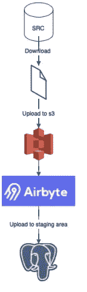

数据流向中转区。作者图片

# 下载并加载到 S3

对于这些操作，我将利用两个操作符—一个下载数据，另一个将数据上传到 s3。请记住，我的 Airflow 实例正在 docker 容器中本地运行。我不想在我现有的设置上添加任何东西，使它成为一个沉重的庞然大物，只有我添加到它的最少的东西。通过将我的任务分解成原子动作，我可以保证每一步都能正常工作，当我再次运行它时，它会返回相同的结果。

为了下载数据，我将使用一个简单的 Bash 操作符来执行 **curl** 命令:

```
download = BashOperator*(* task_id="download_data",
    bash_command="""curl -o /opt/downloads/{{ macros.ds_format(ds, "%Y-%m-%d", "%Y-%m") }}.csv -L https://s3.amazonaws.com/nyc-tlc/trip+data/yellow_tripdata_{{ macros.ds_format(ds, "%Y-%m-%d", "%Y-%m") }}.csv""",
*)*
```

因为我在模仿每月的文件创建，所以我在这里使用 **ds 宏**作为文件名。我认为这是我在我的流中喜欢 ds 胜过 next_ds 的罕见情况之一(如果你熟悉 Airflow，你知道我对这些宏的厌恶来自哪里，如果你不熟悉，我强烈建议阅读 Bas P. Harenslak 和 Julian Rutger de Ruiter 在 Apache Airflow 的[数据管道中关于宏和执行日期的内容，天文学家关于](https://www.manning.com/books/data-pipelines-with-apache-airflow)[基础](https://academy.astronomer.io/astronomer-certification-apache-airflow-fundamentals-preparation)和 [DAG 创作](https://academy.astronomer.io/astronomer-certification-apache-airflow-dag-authoring-preparation)的培训课程，或者查看 Marc Lamberti [Youtube 频道](https://www.youtube.com/c/MarcLamberti)。

因此，要装载到 S3，我将采用气流方式，我将使用 S3 钩来完成。使用任务流 API，我创建了这个任务:

```
@task.python
def upload_file_to_s3*(*s3_conn_id, file_name, **kwargs*)*:
    s3 = S3Hook*(*aws_conn_id=s3_conn_id*)* s3.get_conn*()* s3.load_file*(*filename=file_name,
                 bucket_name="tomasp-dwh-staging",
                 key=file_name.split*(*"/"*)[*-1*])*
```

# 空气字节

首先，我喜欢的是 UI。超级干净，容易理解，虽然工具本身非常简单。设置来源，设置目的地。映射流，并添加一个计时器，如果您希望它定期触发。


源页面打开。作者图片

此外，章鱼的形象也值得称赞(不是乌贼，而是章鱼！Slack 频道的人给我指出来了😅奥克塔维亚·斯奎丁顿三世)。对我来说，这是一个很好的方式，以一种简单的、非侵入性的、但是交互的方式来简单地加入你的产品。

所以让我们开始设置。您可以离开并开始分别设置源和目的地，然后在 connections 部分中映射它们。我懒得浏览多个标签页。让我们看看 connections 的 onboarding 是否能马上为我工作。


来自连接屏幕的图像。作者拍摄

再次回到章鱼，仍然超级可爱！让我们回到我来这里要做的事情——就像乌贼说的那样，创建一个新的连接！

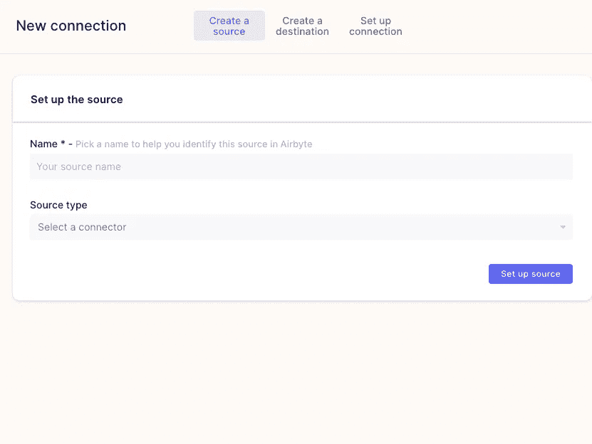

新连接介绍页面。作者图片

我们已经可以看到，我们的介绍流程非常简单，只有三个步骤。

*   创建一个源
*   创建目的地
*   创建连接

如果您之前已经创建了源和目标，那么您可以在这里将它们连接起来。否则，如果您正在使用 onboarding flow，您将看到如下内容:

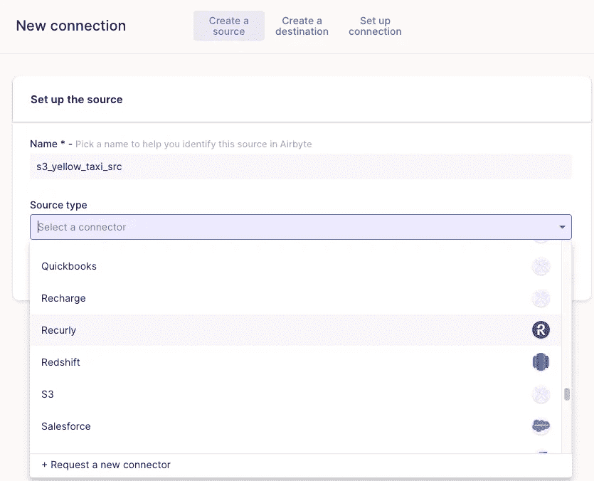

多种来源类型可用。作者图片

所以我喜欢的是，已经有许多来源，最坏的情况下，你可以从这里要求一个新的连接器！

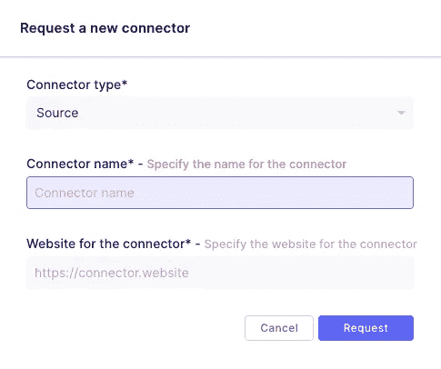

请求新的源/目的地。作者图片

此外，您可以查看他们的[市场](https://airbyte.io/connector-categories/marketplace)，并在那里申请一个连接器。它将在 GitHub 上为他们的项目开一期。

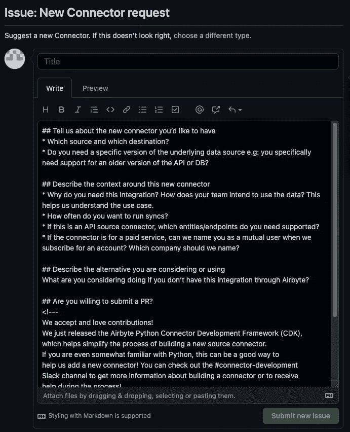

发布新连接器的注册。作者图片

但是，单击健康状态会将我带到未找到错误的页面上:(

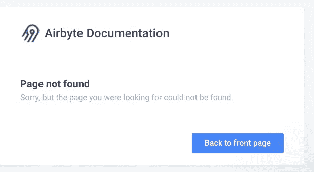

别担心，只是一个错误的链接。在 slack 中得到一个答案，我们应该在不同的[链接](https://docs.airbyte.io/integrations)中看到内容。

我想我有点跑题了。因此，让我们选择 S3 作为源(因为我们的黄色出租车数据驻留在那里)。我们已经可以看到，我们的设置部分刚刚扩展。所以用你想要的填充数据。我将使用黄色出租车数据的一些配置属性。我选择的数据集名称是 yellow_taxi，我只接受 CSV 文件。在这里，我可以设置多个文件夹来检查助手文本中指定的数据和其他规则，但这与我的用例无关，尽管这是一个很好的简单特性，可以处理文件存放的多个位置。

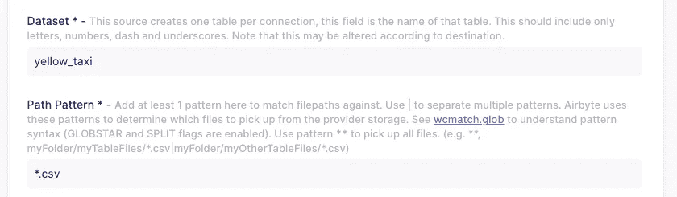

数据集名称和路径模式。作者图片

我之前提到过，我们需要创建一个 bucket，如果您的 bucket 不是公共的，您必须传递凭证，以便 Airbyte 可以访问它们。

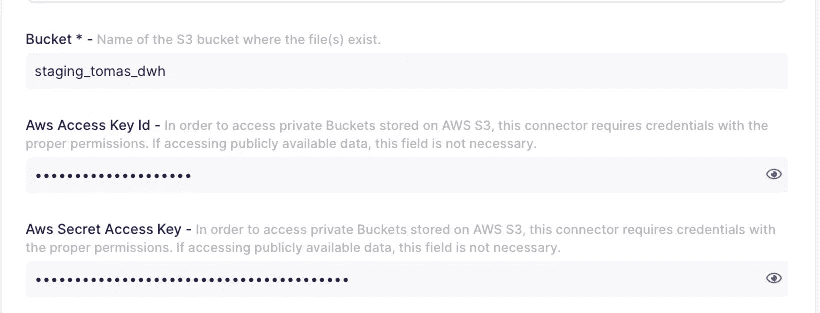

存储桶和 AWS 凭据。作者图片

此外，好的一面是您可以配置块大小。它可以提高你的 EL 流动性能。


块大小参数。作者图片

请记住，Airbyte 在推进到目的地之前会处理内存中的所有信息！如果您的数据库有更好的提示和技巧(例如，Redshift/Postgres copy 命令)，请尝试利用它们(或者在 Airbyte 上打开一个 PR，如果您有一个有助于开源的解决方案！).

如果您已经正确地设置了所有的东西，您应该不会得到任何错误，并且会被抛出“创建一个目标部件”

这部分对我来说更简单。到我的 Postgres 本地实例的简单连接配置:

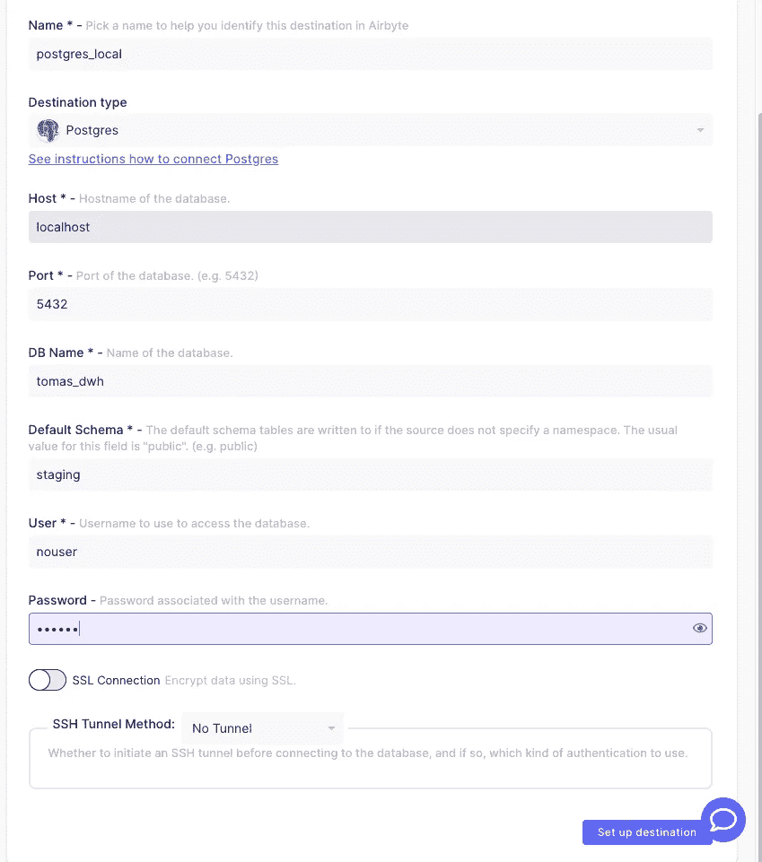

Postgres 目的地。作者图片

设置也很成功，所以我们终于进入了“设置连接”部分！

在这里，我们可以选择同步的频率:

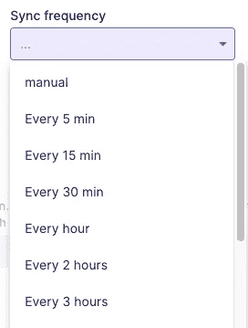

同步频率。作者图片

当然，这取决于您的用例。在我的例子中，我将使用气流来编排整个事情，所以我将在这里选择**手动**。

下一部分是名称空间配置。这里我们看到三个选项

*   镜像源结构
*   目标连接器设置
*   自定义格式

你可以在[官方 Airbyte 文档](https://docs.airbyte.io/understanding-airbyte/namespaces)中阅读更多关于差异的细节。在我的例子中，我想选择**镜像源结构**。

如果基于每个连接创建多个表，那么让我们创建 **yellow_taxi** 作为表前缀。

**刷新模式！**默认情况下，它将只包含一些系统列。始终仔细检查您的列是否出现在映射部分:

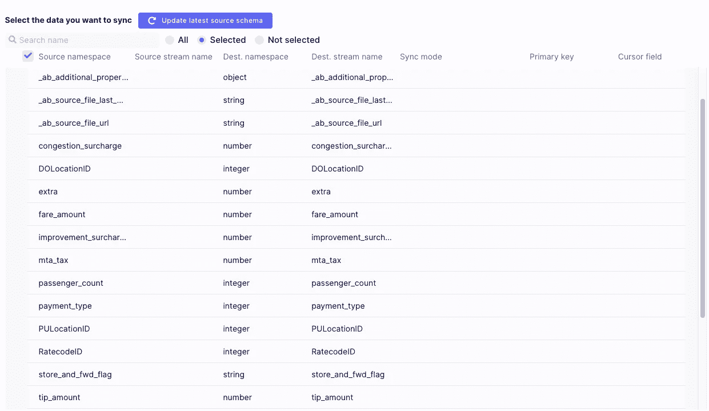

列及其映射。作者图片

现在，让我们检查可用的同步模式。超级高兴增量在那里:

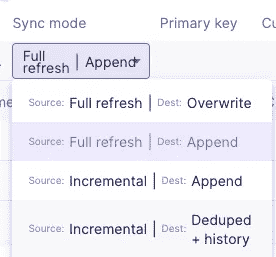

可能的同步模式。作者图片

查看关于 [**增量追加**](https://docs.airbyte.io/understanding-airbyte/connections/incremental-append) **(仅处理新的或更改的数据)和** [**增量重复数据删除+历史**](https://docs.airbyte.io/understanding-airbyte/connections/incremental-deduped-history) **(提供的唯一键上的 SCD 类型 1)的更深入的解释。**我的情况很简单，这是一个事实表导入，所以完全刷新并覆盖。

下一步是规范化和转换。我再次提醒你，Airbyte 在内存中运行是为了逐行处理。options 中没有规范化意味着 Airbyte 会将它作为 JSON 和一些元数据一起存储在最终表中！我后面的转换将在表格数据上执行，所以我更喜欢在这里使用规范化选项。

> **剧透:它使用 dbt 是为了规范你的数据！**

另一件事是，我们可以在这个管道中添加一些转换！从它的外观来看，它将在 docker 映像中运行您的转换，然后推送到目的地！

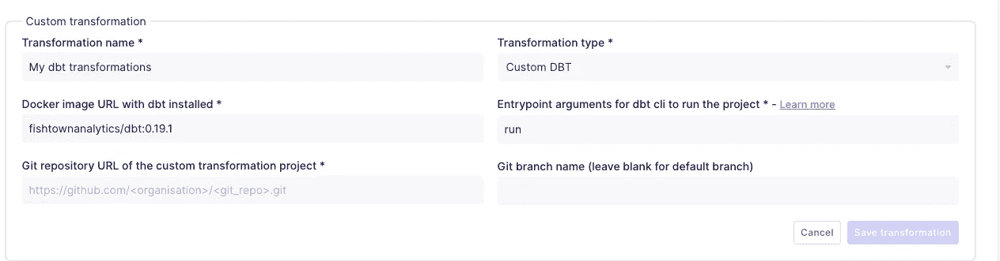

自定义转换选项。可以在加载完成后触发。作者图片

首先想到的是它将如何处理私有存储库，但是查看[文档](https://docs.airbyte.io/operator-guides/transformation-and-normalization/transformations-with-airbyte)，我已经得到了所有的答案和例子！如果您的数据是定期同步的，并且不使用任何 orchestrator，那么这是非常好的。完成装载后使用 dbt 型号—在一定程度上消除气流。

在我的示例中，我使用气流管理流，因此我可以在一个 DAG 中拥有所有这些内容，并对其进行完全控制。

唯一剩下的东西——当我们移动完数据后，Airflow 可以调用 Airbyte。

# 回到气流

如果你还没有设置 Airbyte 连接气流，请遵循[他们的官方文件](https://docs.airbyte.io/operator-guides/using-the-airflow-airbyte-operator)。尽管使用 docker 图像，您可能会遇到一些问题。运行 **docker ps** 获取 Airbyte 服务器 docker 镜像 id，然后运行 **docker inspect IMAGE_ID。**在连接部分，将 gateway 作为您的主机:


对我来说，联系是这样的:

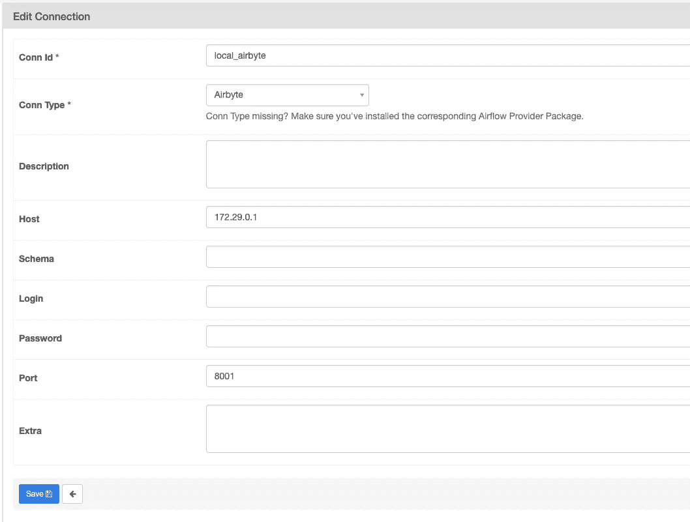

空气连接。作者图片

我需要做的唯一一件事就是将 Airbyte 部分添加到我的 DAG 中:

```
airbyte_s3_to_postgres = AirbyteTriggerSyncOperator*(*task_id='sync_airbyte_s3_to_postgres',
                                                    airbyte_conn_id='local_airbyte',
                                                    connection_id='902284d9-c0c3-43a7-a71f-636afd3c1b73',
                                                    timeout=3600,
                                                    wait_seconds=30
                                                    *)*
```

connection_id 是您打开连接时在 URL 中看到的内容。Wait_seconds 是戳时间；它检查完成的频率。

因此，我们最终流向中转区的气流看起来像这样:

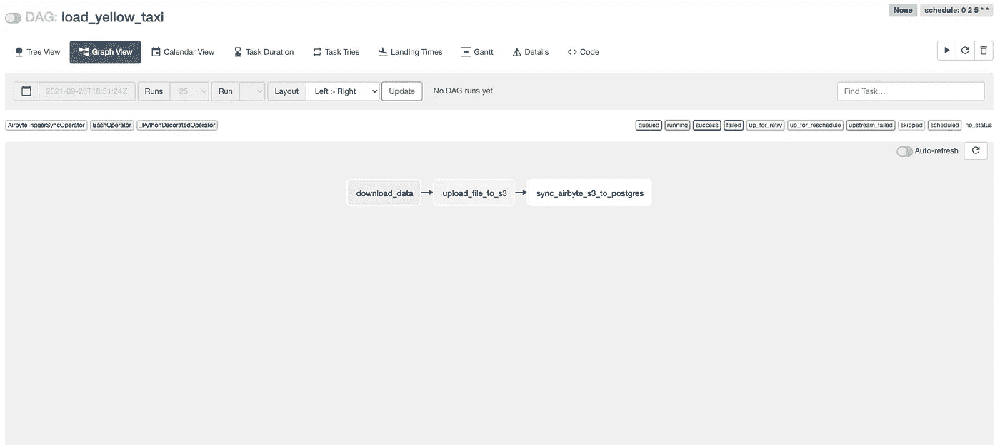

气流 DAG。作者图片

当我们的 Airflow dag 运行时，我们可以转到 Airbyte UI 并检查我们的连接是否正在运行，这将表明一切正常:

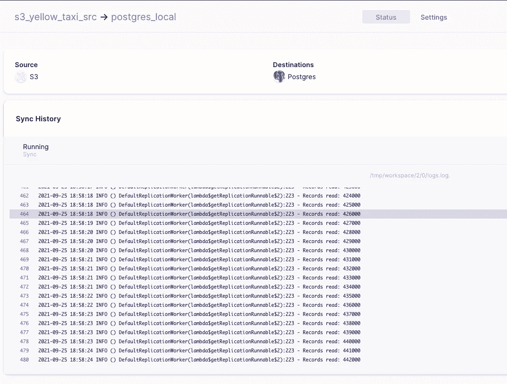

正在同步。作者图片

所以我们可以看到它运行得非常好！所以用我的 docker 设置:

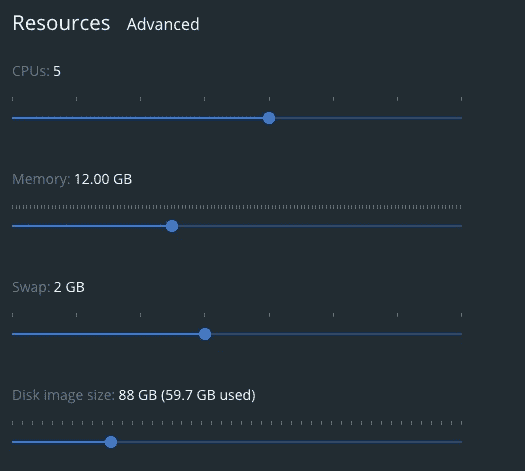

Docker 设置。作者图片

2020 年的数据–11 辆黄色出租车数据(由 1508000 行组成)花费了大约 7 分钟来加载。数据大小为 132M，所以我认为对于这些量来说有点慢。我想我需要对 Airbyte 或我的 docker 中的一些参数做一些调整，或者将它从本地 docker 容器移到不同的环境中。

剩下的唯一一件事就是检查我们的数据库和里面创建了什么:


由流创建的表。作者图片

一个包含原始表行信息的 JSON 表:

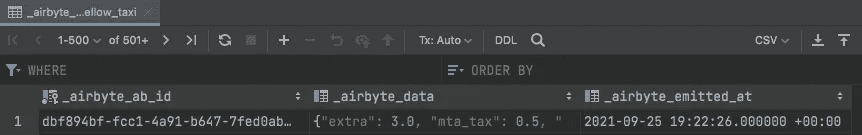

Postgres 中摄取的原始表。作者图片

然后是 yellow_taxi，它有表格格式的数据。

# 我的笔记和想法

随着自助服务成为数据世界中的必备工具，我认为它是公司采用的一种优秀且简单的工具。然而，我认为它还不够成熟(并不是所有的连接器都可用，处于早期阶段，他们只是在开发他们的云解决方案以吸引收入，而不仅仅是投资者)。

我漏掉了一些传入操作符的参数。如果数据通过其他流流向 s3 存储桶，我的气流就不会是等幂的。我可能会消耗过多的文件！

所以我尝试了增量加载。免责声明是，我之前从 s3 中丢弃了文件，并立即上传了 11 月和 12 月，并触发了流(增量|附加同步模式)。事情是这样的，我把它们都装上了。因为它们都被修改过，所以被处理了🤦。我很幸运，因为我的笔记本电脑上有 2020–01，所以我很快上传了它，并再次手动触发同步。所以它有文件的最后更新时间戳，并且只处理新的文件。无论如何，有时我们应该有一定的顺序，所以提供特定的文件来同步也是不错的。

总的来说，这很新鲜，但是如果你是一个早期采用者，那就去做吧。我看到它与 dbt 很好地集成在一起(它甚至使用 dbt 在 JSON one 中创建了一个规范化的表):

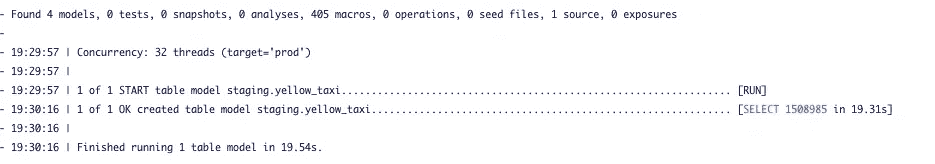

规范化数据。作者图片

我的结论是:如果你使用 dbt，Airbyte 将为你的整个管道模型添加一个漂亮的触感，即使不使用气流！如果你有气流，它也会很好地适合里面！