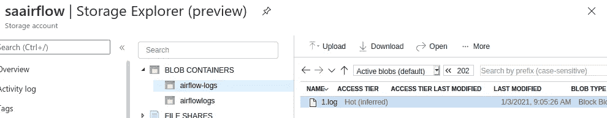

# Airflow 2.0 部署 Azure Kubernetes 服务

> 原文：<https://towardsdatascience.com/airflow-2-0-deployment-azure-kubernetes-service-35d8b8ba270a?source=collection_archive---------12----------------------->

## Airflow 推出了一个具有新功能的新版本(2.0.0 ),因此在将其部署到生产中之前，是时候开始测试了。本文提供了几个脚本，可以帮助有同样想法的人。

Pixabay — EdWhiteImages

我对部署的定义是:

*   Azure 云— Kubernetes 服务
*   库伯内特遗嘱执行人
*   Azure 存储帐户(远程日志)
*   Azure 注册表到容器图像
*   Postgresql 容器(气流后端)
*   Git-Sync(同步 Dag)

我写这篇文章的目的是帮助那些花费大量时间寻找例子来使用相同或等效的基础设施进行部署的人。气流文档并不是在所有场景中都有足够的帮助。

首先，我选择 Kubernetes executor 是因为我在云中工作，每个人都知道按需付费云系统是如何工作的。那么重要的是节约资源。然后 Kubernetes executor 这是一个很好的执行任务的方法，执行后杀死豆荚。远程日志系统可以将日志保存在存储器中，您可以在 airflow web 服务器 UI 中正常查看它们。最初，我想使用 helm，但我直接在 Kubernetes 中使用，我对所有部署步骤有更多的控制权。

好了，我们去码吧！

为了部署 Postgres，这是我的 YAML 文件。我使用了持久卷，这样我就限制了数据库的大小。你可以在不同的文件中分开，然后在 Kubernetes 中应用(我就是这样做的)，或者你可以自动化。

在下一步中，我创建了两个持久卷(opt/airflow/dags，opt/airflow/logs)。我将跳过这些脚本，因为它们与上面 PostgreSQL 部署中使用的脚本相同。我需要构建自己的映像，因为我正在使用 Kafka 和其他组件，但是您可以使用默认的映像，比如(来自 Apache/air flow:2 . 0 . 0-python 3.8-build)或您喜欢的其他映像。如果你使用你的图片并将它推送到 azure 注册表，你需要应用一个 Kubernetes 的秘密，并将“imagePullSecrets”设置为我下面的脚本。对于我的 git 密码，我创建了一个 Kubernetes configmap，避免了这些环境的硬代码，所有其他的我直接在 YAML 文件中做了代码，以显示如何设置这些环境。服务帐户有权创建、列出和删除窗格，这一点很重要。我之前说过，Kubernetes 执行器在部署后会删除豆荚。
这个脚本差不多就是我的部署脚本了。我更改了一些细节，因为我没有将调度程序与 airflow webserver 一起部署，我的资源限制是不同的，并且我在其他服务帐户中运行，为了便于理解，我做了一些简化。

好了，在应用这个部署之后，您将有两个 pod 在运行。你可以用 8080 端口绑定并访问 airflow 服务器。在我的开发环境中，我直接为 kubectl port-forward 命令这样做。

在最后一个脚本中，你可以看到我在 Azure 中创建了一个存储帐户，并建立了一个连接。我在 airflow > connections 中创建了一个连接，然后用这个连接设置了我的 env air flow _ _ LOGGING _ _ REMOTE _ LOG _ CONN _ ID。

因此，现在您可以使用 KubernetesPodOperator 运行您的任务。这种方法是可配置的，在启动之前可以更改 Kubernetes pod 配置。我喜欢创建自己的 pod_template 并设置这个 env:air flow _ _ KUBERNETES _ _ POD _ TEMPLATE _ FILE。你可以在上面看到我的剧本。但是没有这些模板设置也可以工作。

我希望这些脚本可以帮助人们快速找到 Kubernetes 的气流配置，并通过这种 Kubernetes executer 方法最小化云成本。