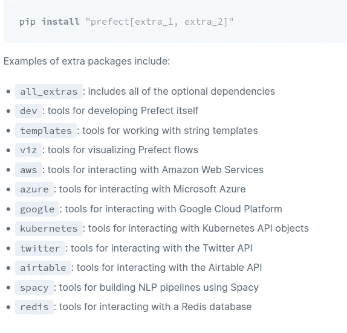
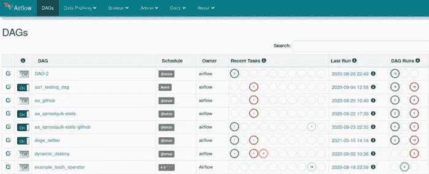
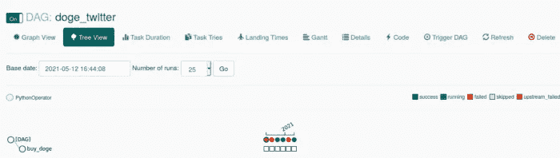
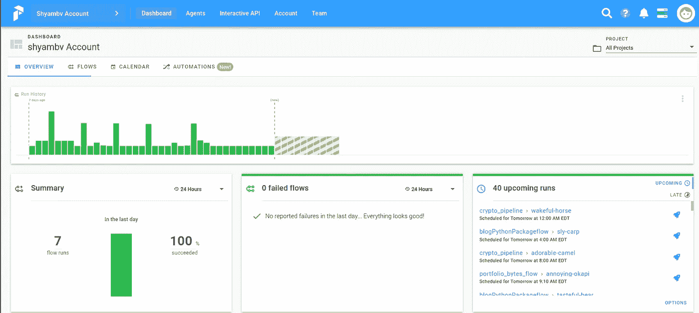
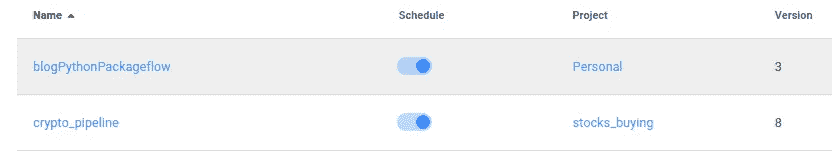

# 气流与完美—数据项目的工作流管理

> 原文：<https://towardsdatascience.com/airflow-vs-prefect-workflow-management-for-data-projects-5d1a0c80f2e3?source=collection_archive---------3----------------------->

# 介绍

我非常喜欢 [Airflow](https://airflow.apache.org/) 及其在工作流管理工具上的优势。然而，我最近开始在我的工作流程中使用[提督](https://cloud.prefect.io/)。两者都是使用 python 构建的。在本文中，我将讨论这两者之间的区别。

照片由[杰森·登特](https://unsplash.com/@jdent?utm_source=medium&utm_medium=referral)在 [Unsplash](https://unsplash.com?utm_source=medium&utm_medium=referral) 拍摄

# 为什么选择工作流管理？

工作流是许多生产相关应用程序不可或缺的一部分。它包括 MLOps、自动化、批处理、投资组合跟踪等。在数据世界中，一个系统需要按顺序处理数据并将数据发送给另一个系统/任务。

# 气流

Airflow 是 apache 孵化的项目，已经存在了相当长的时间。随着时间的推移，气流比最初的用例更加灵活。Airflow 还可以连接从 AWS Lambda 到 GCP 数据流的云服务。在大多数情况下，大到中等规模的组织使用 Airflow 来处理大量的数据，并在其上执行一些数据操作。它也可以在集群模式下运行。AWS 和 GCP 提供了气流的管理实例，以便与其他云服务一起使用。

1.  [AWS 管理的气流工作流程](https://aws.amazon.com/managed-workflows-for-apache-airflow/)
2.  [GCP 云作曲](https://cloud.google.com/composer/docs#docs)

阅读文章下方关于气流的更多信息。它将显示设置和创建

</under-appreciated-workflow-tool-airflow-a078a3c71a67> [## 不受重视的工作流程工具——气流

towardsdatascience.com](/under-appreciated-workflow-tool-airflow-a078a3c71a67) 

# 长官

[提督](https://www.prefect.io/)，市场新进入者，相比气流。它是一个开源项目；然而，有一个付费的云版本来跟踪你的工作流程。提督仍然落后于气流带来的所有铃声和哨声。然而，它完成了工作，并且有许多集成。

Prefect 还支持云，这意味着您可以在任何服务器上运行执行工作流，并监控/管理它[https://cloud . prefect . io](https://cloud.prefect.io)

# 比较

在下面的部分，我们将看到气流和提督的比较

# 设置

这两个工具都可以使用 pip、docker 等安装。气流增加了引擎盖下的一些不同的包；也可能会有一些冲突。为了让 Airflow 运行，您需要一个调度程序和 web 服务器。AWS 和 GCP 提供基于气流的托管服务。

Prefect 被整齐地组织成不同的附加组件，并与各种其他组件集成。

不同的附加组件— [来源](https://docs.prefect.io/orchestration/getting-started/install.html#basic-installation)

要起来跑，提督可以快速启动。提督只需要一个代理人来运行流程。

# 编码工作流

对任何程序员来说，编写工作流代码都是最重要的决定因素。我们经常为了学习而想学习新的语法和新的东西。

气流有一个学习曲线。你需要理解 DAG 和其中不同的操作符。

示例气流 Dag —来源作者

Prefect 就像初级 python 函数一样简单。我们需要用流把它包在**下。**

完美流示例—源代码作者

开发 Prefect 看起来像是 pythonic 式的编码方式。我们不需要学习很多来创造一个心流。

# 工作流 UI

## 气流

Airflow UI 非常适合监控工作流，并且易于启动。该界面作为 web 服务器的一部分创建。

气流用户界面— —源代码作者

作者执行 Dag 源作者

## 长官

默认情况下，没有提督用户界面。Else prefect 云环境是一个简单的设置。我们需要设置服务器。我们需要创建一个帐户和一个 API 密钥。然后需要在我们运行的系统中配置密钥。

完美用户界面—源代码作者

项目组织所有的流程。我们可以在一个项目中运行多个流程。总的来说，它组织得很好，执行起来没有问题。

# 版本化工作流

任何基于代码的系统的一个基本特征是能够*版本化*你的代码。

气流的一个最显著的缺点是使 DAGs 变得清爽。我们不知道当前执行的是哪个版本的工作流，也没有正确的版本控制。

另一方面，适当的版本控制和对流程的每次更新将被标记以纠正版本。

完美中的版本控制—源代码作者

# 结论

在本文中，我们已经触及了两个工作流工具。在成为 Airflow 的狂热用户之后，我开始喜欢上了 Prefect 和它的易用性。一个最突出的原因是我不需要重构代码来创建工作流。

我已经开始将我的许多工作流程/自动化迁移到 Prefect。然而，我仍然有我在气流沉重的工作流程。

# 获取代码

*请订阅我的* [***简讯***](https://codesprout.substack.com/welcome) *获取不同文章及其他更新。*