# 通过 GPS 和 Python 绘制后 Covid 时代的机场旅客行程图

> 原文：<https://towardsdatascience.com/airport-passenger-journey-mapping-post-covid-era-5864a877b47b?source=collection_archive---------18----------------------->

## 日本成田机场每个过程的 GPS 数据驱动时间测量

[JESHOOTS.COM](https://unsplash.com/@jeshoots?utm_source=medium&utm_medium=referral)在 [Unsplash](https://unsplash.com?utm_source=medium&utm_medium=referral) 上拍照

> 你好，奥马尔，我的航班将于 17:30 抵达成田机场，你能来接我吗？
> 
> **奥马尔:**当然，乐意之至！我应该什么时候去接你？
> 
> 巴特兰:等等！有很多新冠肺炎措施，我听说我们需要在抵达后进行测试，这可能需要时间。
> 
> **奥马尔:**没错，但是你知道在机场等待是很有挑战性的，所以我们想估计一下你是否会在 17:30 着陆——你预计什么时候到达行李领取处
> 
> **巴特兰:**网上找不到多少？要是有人测量过那个时间就好了。

新冠肺炎给旅游业带来了许多变化。它还增加了从着陆到行李认领的机场流程中现有流程的复杂性。其中一些变化是:

*   显示阴性 PCR 证书
*   给你测体温
*   做唾液测试，等待结果
*   填写许多文件和同意书
*   安装和配置运行状况监控应用程序

如此复杂的情况下，安排上门收件服务或建立任何依赖时间的承诺都是一项挑战。**在本文中，我们展示了成田机场从航班降落到行李认领的操作流程和时间的数据驱动可视化分析。**

# 数据

手机数据是了解和衡量不同地方进程时间的最佳方式之一。大多数移动电话收集用户位置数据以向用户提供更好的服务，并且它们通常允许用户访问他们的数据或请求副本。

一旦我们在成田机场着陆，我们就连上了互联网，GPS 定位开始被记录下来。平均每 5 秒收集一个点。通过观察一段时间内的点序列，很容易直观地看到我在什么时间在什么地方，并快速得出总距离或旅行总时间的结论。

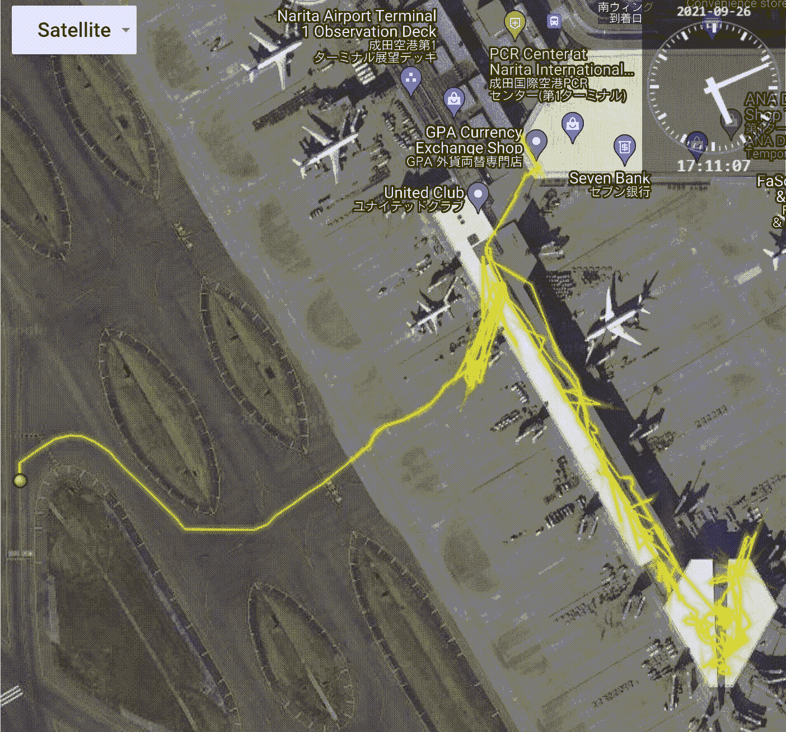

成田机场从航班降落到行李提取的移动模式。“作者图片”。使用[https://mobmap.locationmind.com/](https://mobmap.locationmind.com/)进行可视化

> *从航班落地到 2021 年 8 月提交报关单出境，我们用了* ***2 小时 20 分钟*** *。*

# 向下采样数据点

以降低复杂性并更清楚地看到数据趋势，例如点累积的停止点。让我们把点数减少到每 10 秒一点，而不是每 5 秒一点。这个过程被称为子采样，在时间序列分析中被广泛使用。

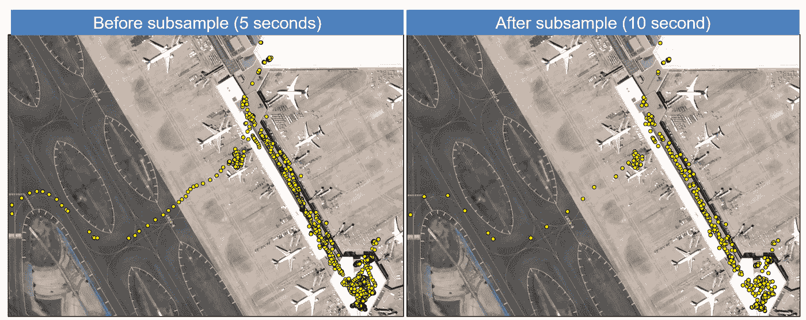

将 GPS 数据的采样时间从 5 秒缩减到 10 秒

既然已经对数据进行了缩减采样，我们只想提取停止点。停止点表示一项活动，例如当你排队等待进行唾液测试或当你等待领取行李时。当有人停在同一个位置时，GPS 数据点会在同一点不断积累，很容易发现趋势。

# 通过速度检测行走点

为了捕捉这些停顿，我们首先需要移除我们行走或跑步的点。为了做到这一点，我们可以通过与前一点的比较来计算每个点的速度。人类的平均行走速度约为每秒 1.4 米。对我来说，我和我 2 岁的女儿一起走，所以速度几乎是每秒 1 米，这是在 velocity_mps 中，指的是每秒 1 米。

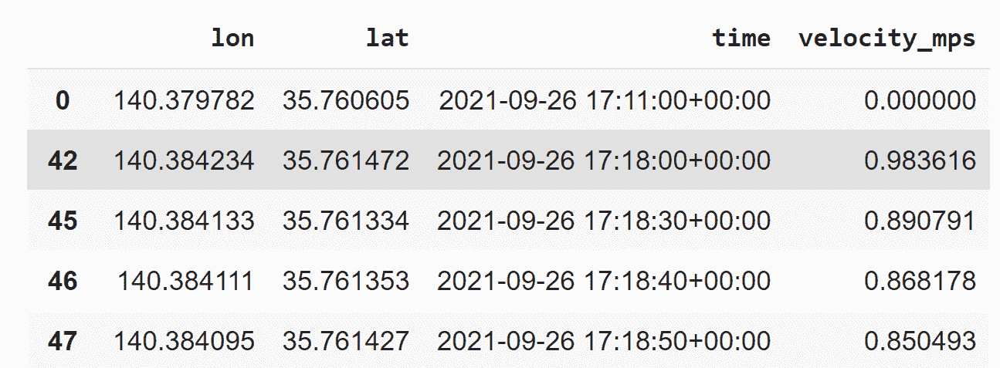

根据 GPS 数据计算速度(英里/秒)

接下来，我们要做的就是以等于或大于平均步行速度的速度丢弃数据点。由于我的行走速度本来就很低，所以去掉的都是高速点和飞机降落和移动时的点。然而以正常的行走速度。期待更好的结果。

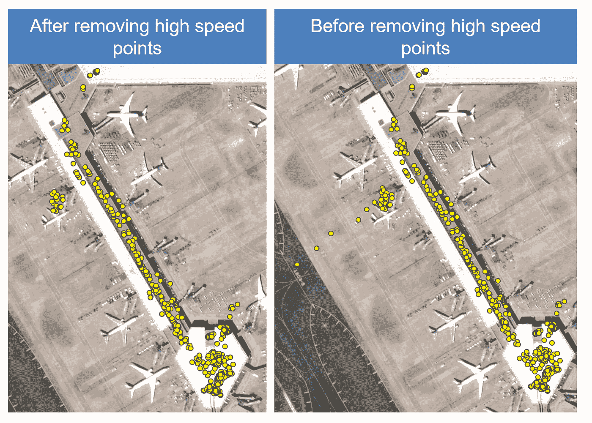

从移动的 GPS 轨迹中快速滤除点

# 通过聚类查找停靠点

聚类是一种寻找公共数据点的技术，时空密度聚类或 STDBSCAN 是一种无监督的机器学习算法，用于聚类在空间和时间上接近的点，这些点可以表示潜在的停止。一旦我们在数据点上运行模型并调整参数。我们可以提取代表运动相对静止的停止点的相关点，如下所示。

每一站都代表了一个活动或描述我们最初为什么停下来的东西。在大多数情况下，我们可以将站点映射到附近的商店或餐馆等等。但在这种情况下，它特定于操作，因此我们可以手动标记这些点。毕竟他们只是几个集群。

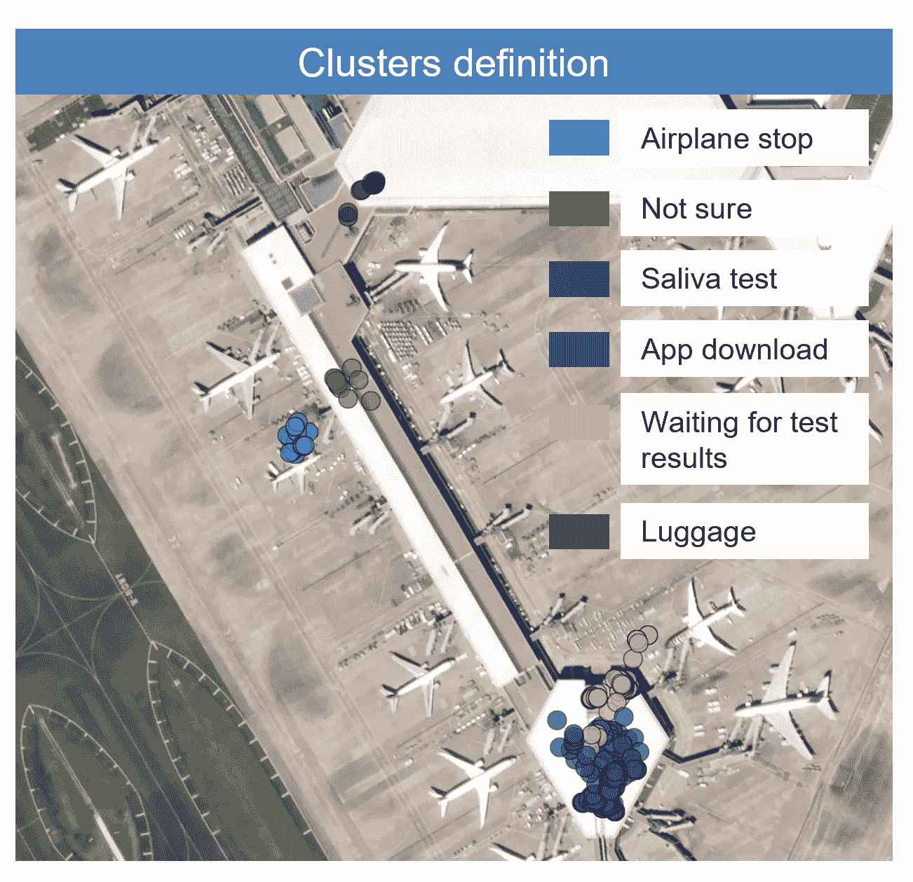

使用无监督机器学习时空密度聚类检测 GPS 数据中的停靠点

# 测量每一站花费的时间

> 每道工序需要多长时间？

如果我们查看每个 GPS 聚类点，我们可以简单地找到每个聚类中时间最小的点和时间最大的点。这将代表站点的开始和结束。两者的区别在于停留的时间。在下表中，每个集群的持续时间代表我们完成每个流程所花费的时间。我们很放松，没有理由匆忙，我们也有孩子。所以单人跑步的时间可能会更短。

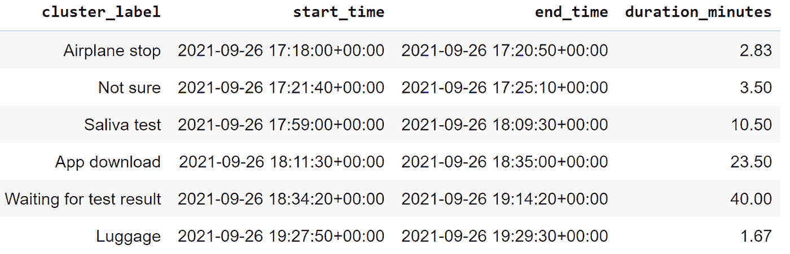

通过 STDBSCAN 聚类方法使用 GPS 数据测量停留时间

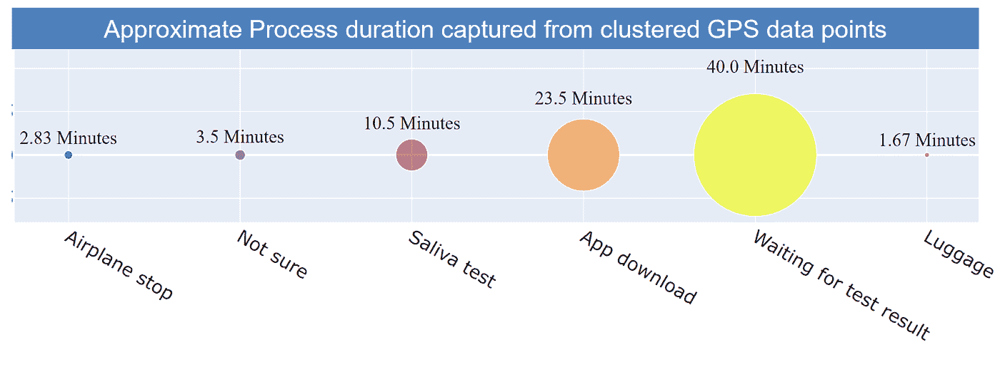

使用 GPS 数据为每个流程绘制机场旅客旅程图“图片由作者提供”

# 估计在机场的步行时间

步行时间是不同站点之间的时间，这是表征移动模式的一个重要部分。从一个地方走到另一个地方需要多长时间？根据数据计算，行走时间可以是上一个停靠点和下一个停靠点的第一个点之间的时间。下表列出了在中途停留的时间，包括四处闲逛或来回寻找下一站的时间，以及孩子们从玻璃上看飞机的时间。这是很常见的。尽管当一些点错误地没有被计算为聚类的一部分或者当一个小的停靠点被忽略时，行走时间可能被夸大。比如去洗手间。

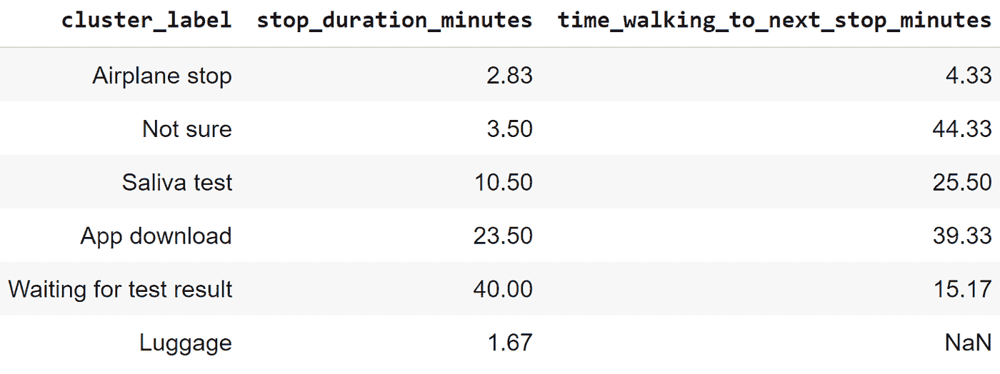

机场不同流程间的步行时间估计

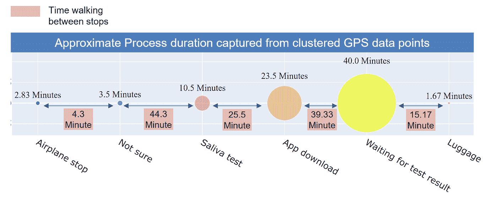

从成田机场的 GPS 数据点估计步行时间和停留时间

# 检测停止的大致位置

找到车站的大概位置有时很重要。当停车发生时，GPS 位置分散在一个点周围。这是因为移动电话中 GPS 的精度通常在 4 米左右。为了找到停止点的近似值，我们可以查看每个 GPS 点簇并估计该簇的质心位置。

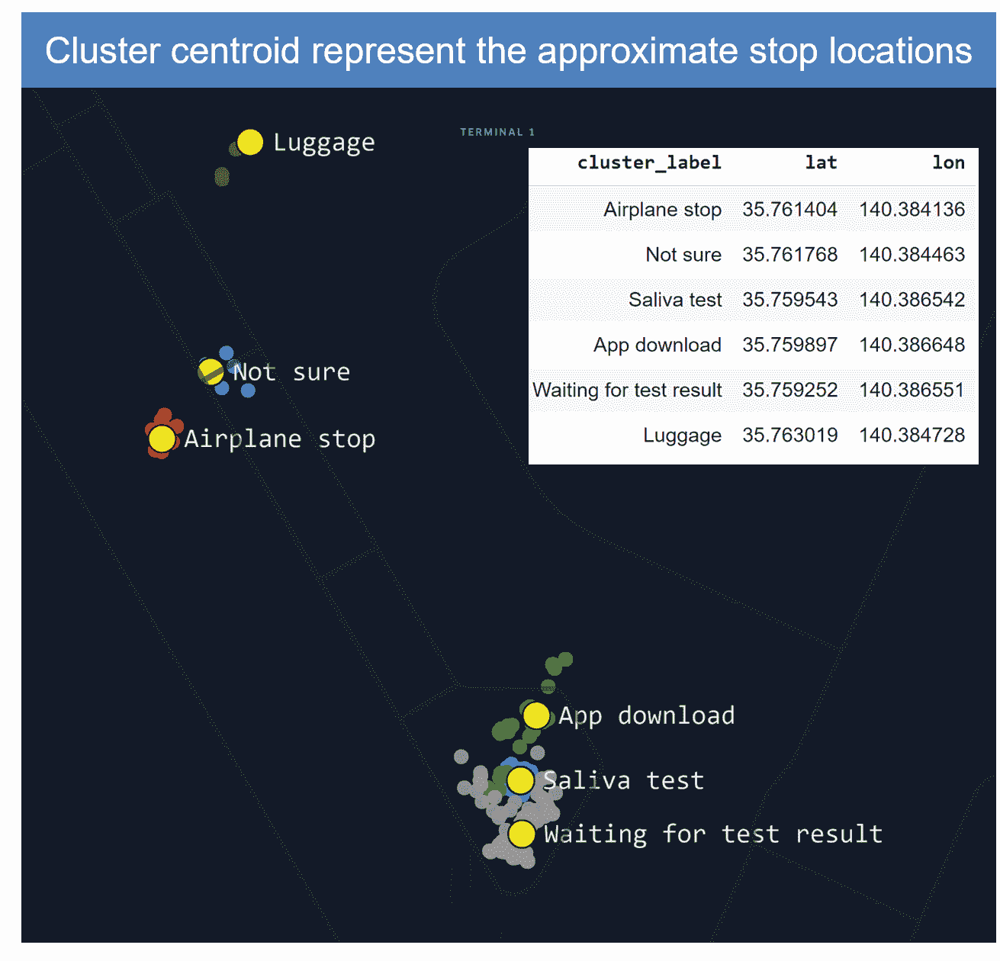

基于“作者图像”聚类的 GPS 数据停留位置估计

# 决赛成绩

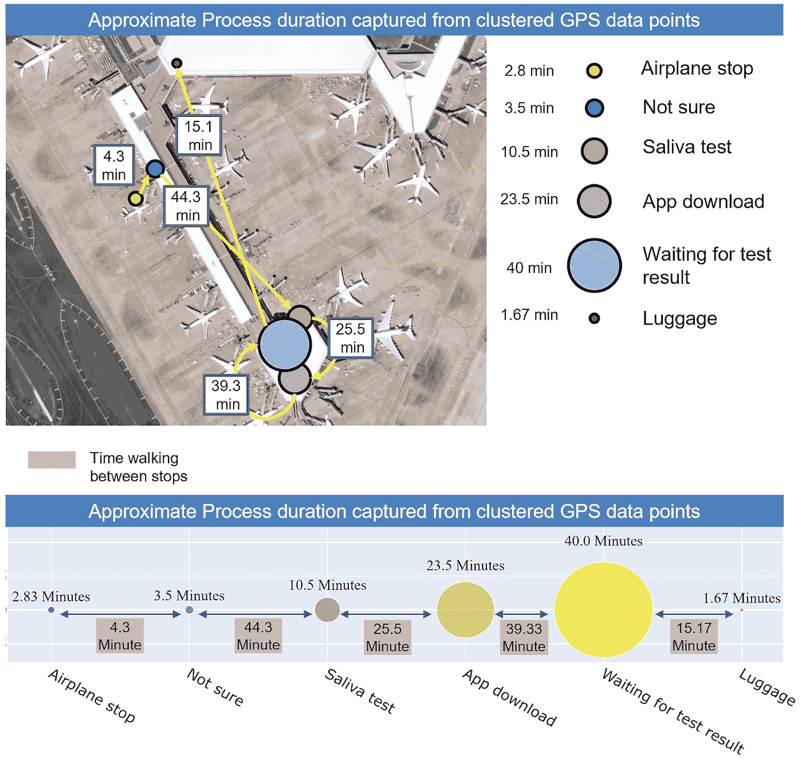

Covid Era 后的机场乘客旅程地图—成田机场从航班降落到行李认领的时间“图片由作者提供”

# 结论

*   从航班降落到行李领取和通关大约需要 2 小时 30 分钟。
*   等待唾液测试结果花费了大部分等待时间，随后是机场工作人员的应用程序下载和安装确认。
*   从飞机上走到唾液测试地点花了大部分时间
*   行李认领很快，因为现在使用成田机场的人很少

# 此分析/类似分析的商业机会

设计成功的设施体验始于监控现有情况。测量流程时间和绘制客户旅程可以反映这些流程的效率，以引入数据驱动的改进，并在迭代流程中不断改进运营(改善)。手机数据的无处不在和可用性为了解用户在离线世界的旅程和为这些客户提供的运营效率带来了机遇。引入数据驱动的性能监控产品有多个方面:

# 数据收集

数据收集带来了挑战，因为需要用户同意才能收集他们的数据。提供一种服务，例如一个专用于该设施的应用程序或免费 wifi，让客户同意提供他们的数据，并承诺保持匿名和安全，这是收集此类数据的一种方式。另一种途径是使用数据聚合公司或大规模运营手机应用的公司，并建立业务合作伙伴关系或数据共享协议。

# 数据代表性

收集的数据将始终代表一个样本。毕竟，并不是所有人都会安装这款应用或使用免费 wifi。即使与手机应用公司合作，也只能提供一小部分访问者。在计算聚合洞察时，这在数据处理标准中通常是可以接受的。此外，可以计算合适的比例因子，以获得有代表性的见解。

# 隐私

我很乐意在地图上告诉你我去过的地方。但是，大多数人知道这么多关于他们移动性的信息被提取出来并与他们的身份联系在一起，他们不会高兴的。此外，随着时间的推移，法规变得越来越严格。为了保持良好的隐私标准，需要遵循许多步骤，例如:

# 匿名化

来自用户的数据不应该追溯到他们的身份。这需要适当的私人信息散列在一个非反向的方式，如 SHA-2 或其他更复杂的散列不能反向工程。

# 聚合

应该聚合单个级别的计算洞察，以显示聚合产品的总体趋势或商业智能仪表板。例如，说名为 kyle、mark 和 Omar 的用户在这个过程中停留了 15 分钟，这不是一个好策略。相反，我们可以提取在该设施中停留的平均时间为聚合后 15 分钟+- 3 分钟。

# 访问控制

当确保只有相关人员能够访问这些信息时，最大限度地减少管理员或数据用户的数量是最佳做法。

# 最终注释

数据驱动的运营增强不再仅仅是概念验证工作。它已经在许多企业和许多应用中大规模引入。以保护数据隐私标准的方式开始数据收集的能力将是一个实体未来采用数据驱动技术的关键。

话虽如此，了解服务时间和客户旅程的应用程序可以应用于许多设施和许多行业。举个例子，

**商场**

*   根据需求对购物中心的不同区域进行动态定价
*   提取工作日、周末和节假日之间行为差异的见解，以便更好地分配安保人员

**工厂**

*   了解操作增强的每个过程所花费的时间
*   通过绘制利用率热图找出未使用的空间或设施
*   当紧急情况发生时，通过了解每个人的位置来管理人员安全

**机场**

*   更好地了解高峰时间以及不同日期和周末服务时间的变化
*   通过预测不同日期和不同地区的需求，分配更多或更少的人力资源

**智能城市和住宅小区**

*   了解住宅的移动模式，以便更好地设计定制服务
*   了解道路利用密度和 inro 根据重要性对道路进行排序的因素，以分配更好的维护策略

还有更多…

# 关于我

Mohamed Batran 是一名人工智能专家，也是一名在日本工作的数据货币化专家。在他的职业生涯中，他从事金融、电子商务、物流、电信、运输等行业的数据工作，设计数据利用来增加收入、降低成本或提高客户满意度。

您可以阅读同一篇文章或在此联系我，我将非常高兴收到任何评论、反馈或安排电话讨论合作事宜:

[http://mohamedbatran.com/](http://mohamedbatran.com/)