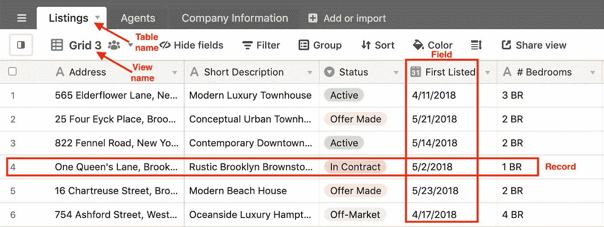
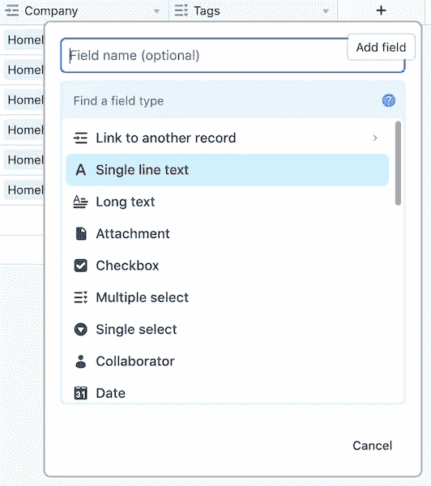
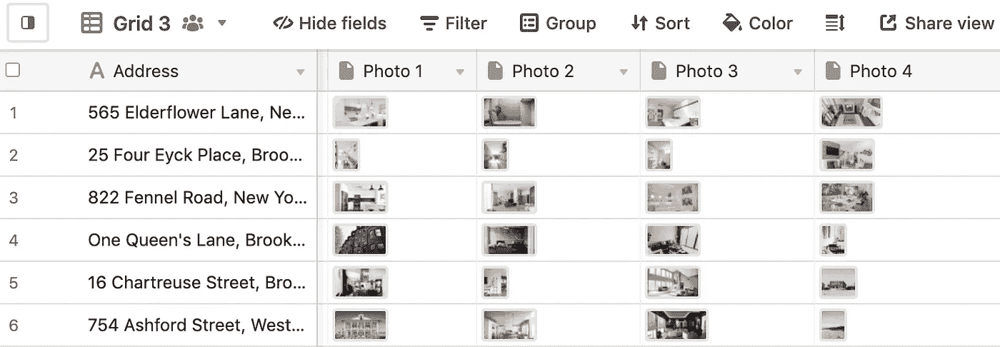
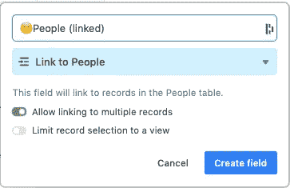
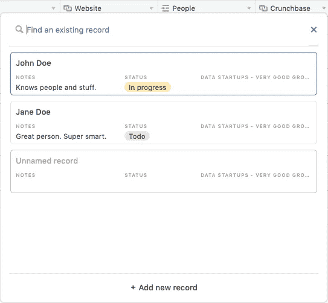
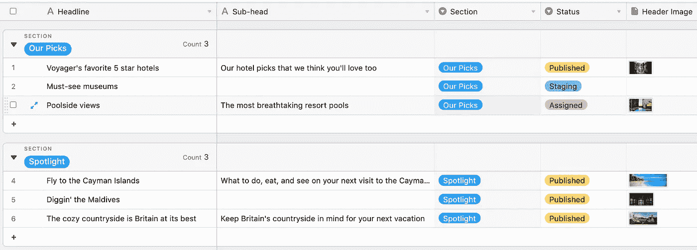
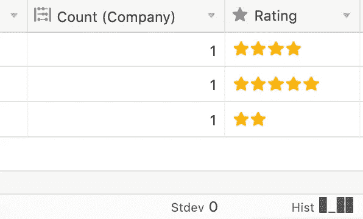
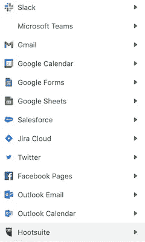
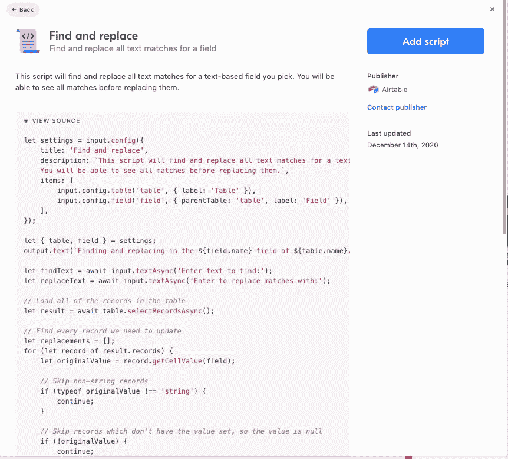
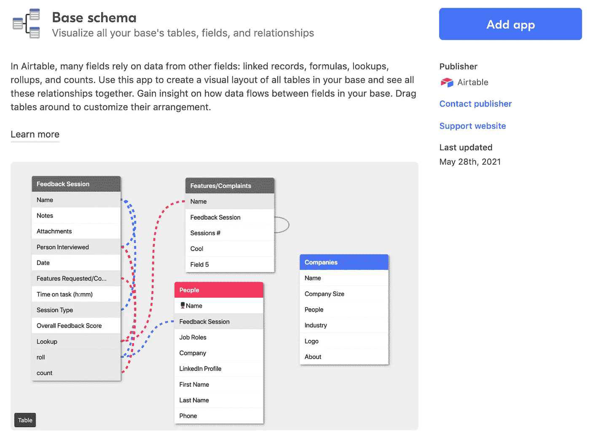

# 10 分钟后起飞

> 原文：<https://towardsdatascience.com/airtable-in-10-minutes-d06f7d73c6d1?source=collection_archive---------8----------------------->

## [实践教程](https://towardsdatascience.com/tagged/hands-on-tutorials)

## 使用 Airtable 快速上手，了解它何时适合您

# 为什么要用 Airtable？

Airtable 结合了数据库的强大功能和电子表格的便捷用户界面。然后它还会在上面加一些樱桃。🍒对于许多用例来说，这是一个可靠的选择。


资料来源:pixabay.com

如果您正在组建一个没有数据专家的团队，并且您想要自动化、组织化和洞察力，您可能希望使用 Airtable 作为您的数据中心。和 [Tableau](/tableau-basics-in-six-minutes-35b50ec9ae9b) 一样，这是一个快速学习的工具——也是你简历的一个很好的补充。🖋

在本文中，您将了解这种流行的关系数据库的基础知识，感觉就像是服用了类固醇的 Google Sheets。无论您是否使用过关系数据库，都会有一些陷阱——您也会看到。然后，我将分享如何充分利用 Airtable 的技巧。最后，我们将讨论一个可能让您组织中的技术人员和非技术人员都满意的解决方案。👍

有趣的是，谷歌正在推出自己的 Airtable 克隆版，[谷歌表格](https://tables.area120.google.com/u/0/about)——我可能会在未来的文章中探索它，所以请在 Medium 上关注 [me](https://medium.com/@jeffhale) 以确保你不会错过它。😀

## Airtable 解决的是什么问题？

电子表格是分析数据的好工具，只需点击几下鼠标和几个公式。但是它们不太适合跟踪和显示数据中的关系。

关系数据库是存储大量数据和显示跨表关系的好工具。然而，如果您不了解 SQL，它们并不适合快速分析数据。

SQL(结构化查询语言)是从数据库中提取信息的方式。学基础不难，但是是另一种语言。学习一门新语言需要时间，对许多人来说是一个很大的障碍。不要脸的塞，我写了本[记忆深刻的 SQL](https://memorablesql.com) 这样你就能很快学会基础了。😉

如果你想使用数据库，但想避免使用 SQL，你需要一个程序员来创建一个 API 来显示你的数据——可能通过网站上的一个表单。创建和维护接口的技术工作需要时间、金钱和技术人力。💰

Airtable 是解决这一问题的低成本解决方案。它就像是数据库的内置图形用户界面(GUI)。换句话说，苹果对令人生畏的 DOS 命令行所做的，Airtable 对 SQL 数据库所做的。

接下来让我们深入探讨 Airtable 概念。👍

# 飞行表概念

要使用 Airtable，您需要知道一些术语，其中许多是直接从 SQL 借用的。

*工作区*是 Airtable 最高级别的抽象。如果您有多个工作空间，它们可能是您工作的多个组织的工作空间。

*基地*是数据库。你不能用 SQL 访问它们，但这就是 Airtable 正在做的事情。🚙

*表*是 SQL 表。如果你没有使用过 SQL，你可以把表格想象成电子表格。

每一行都是一个*记录*。



Jeff Hale 添加了网格视图和标注的示例表格

列被称为*字段*。田地很重要，所以我们开始挖吧。

单个字段包含相同类型的数据。可能的数据类型包括通常的文本、整数、小数和日期。Airtable 为其他一些常见的数据类型增添了新的光彩，包括经过专门验证的字段，如电子邮件地址和电话号码。📞复选框是一个布尔值 True-False 列。✅



可以选择字段数据类型的菜单。

另一个字段选项是附件。这实际上只是一个指向存储在 Airtable 服务器上的文件的链接。如果你上传了一张图片，你可以点击缩略图来查看完整的版本，下载它，或者留下评论给其他用户看。



甚至还有条形码字段数据类型。作为库存跟踪系统的一部分，你可以扫描 Airtable 的 Android 或 IOS 应用程序的条形码。两款应用都获得了极好的评价。哦 Airtable 也有一个星型数据类型。⭐️⭐️⭐️⭐️⭐️

我发现 Android 应用程序易于安装和使用基本功能，但主要是在我的电脑上使用 Airtable，因为它有表格。😉

您也可以在公式字段*中输入公式。*语法类似于 Google Sheets 或者 Microsoft Excel。你可以组合列中的值，用 if 语句控制流程，等等。这里有一个游乐场，你可以在这里玩各种功能。

在*添加字段*菜单中，您可以创建到另一个表的连接。选择*链接到另一条记录*，然后在链接表中选择要加入的字段(您的外键是 you speak 数据库)。这就是在两个表之间创建持久连接的方法。😀



通过添加查找字段，您可以选择在下一个屏幕上显示更多的字段，但这不是必须的。稍后，您可以通过添加查找字段来选择显示更多来自连接的字段。

连接的表将链接字段作为一列。然后，您可以将特定记录添加到链接字段中。或者创建一个将被添加到链接字段的新记录。链接字段有点像两个表之间的魔法入口。💫



选择要链接的记录，或创建新记录

通过这些持久链接来连接表需要一些实践——无论您是数据库新手还是 SQL 专家。

Airtable 让你添加漂亮的元数据字段。例如，您可以看到谁以及何时创建和更新了记录。当然你也可以用我最常用的键盘快捷键 *CMD* + *Z* 在 Mac 上撤销事情(在 Windows 上是 *CTRL* + *Z* )。

# 凉爽的景色😎

Airtable 的观点是一个卖点。视图是以各种可视格式显示表格数据的方式。


从空中拍摄的漂亮照片！📸

*网格视图*是普通的表格，就像你从电子表格或数据库查询中得到的一样。您可以操纵网格视图来显示您想要的数据。例如，下面是一些伪 SQL，用于过滤、排序和隐藏列:

```
SELECT col1, col2
FROM my_table
WHERE col1 > 3
ORDER BY col2 DESC;
```

要在 Airtable 中创建这个查询，可以使用顶部的菜单按钮。


菜单按钮

创建视图时，可以隐藏除*列 1* 和*列 2 之外的所有字段。*或者你可以过滤所有满足某种条件的记录，比如 *col1 > 3。*您可以使用分组按钮对记录进行分组。最后，您可以通过单击鼠标按列对记录进行排序。👍



按*部分*分组

如果您了解 SQL，请将 Airtable 网格视图想象成 SQL 视图。

您可以隐藏视图中的字段。这就是为什么您会得到与在 SQL Select 语句中列出列相同的结果。

你查看的是一张桌子的实况。如果有人更新了为您的视图提供信息的表，它会以近乎实时的方式进行更新。

Airtable 有一种很好的方式来聚合字段中的信息。您可以通过在网格视图的底部显示字段的描述性统计信息甚至直方图来汇总列。



这些数据没有太大偏差。

网格视图不是显示数据的唯一方式。只需点击一下，您表格中的数据就可以显示为日历、看板或图库。付费计划也可以看到甘特图视图。这些观点超级俏皮。就好像他们给了你为团队成员添加各种前端应用的权力。🎉


看板视图

“视图”菜单也是您可以制作表单以将数据放入表格的地方。虽然把一个表单想象成一个视图有点奇怪，但这就是你在 Airtable 中找到选项的地方。🤔

Airtable 使用您的表格列和数据类型来自动生成可自定义的表单。


表单生成器视图

快速表单生成真的很好。👌

# 自动化🏄‍♀️

Airtable 自动化可以设置为每次触发某个触发器时运行。例如，当一个表中的记录被更新时，可以向另一个表中添加新行。每个月，Pro 计划让您运行 50，000 次自动测试。免费计划每月给你 100 英镑。

自定义自动化类似于 Zapier 的 zaps 或其他无代码解决方案。调试时，UX 可能会更清晰一点，错误消息可能会更有帮助一点，但是应用程序完成了工作。

截至 2021 年年中，Airtable 的内置自动化集成包括许多谷歌产品和其他几种流行的服务。我预计应用程序的数量很快会增加。



自动化集成的子集

如果你想要其他的操作，你可以使用你喜欢的集成工具，比如 Zapier， [Integromat](https://www.integromat.com/en/integrations/airtable) ，或者 [IFTTT](https://ifttt.com/airtable) 。例如，Zapier 有 24 个 Airtable 和 Slack 的集成。👍

# 应用程序

Airtable 在其内置应用程序下集合了许多功能。应用程序包括基本的数据可视化、数据透视表、重复数据删除、更高级的 CSV 导入和运行自定义脚本。例如，下面是运行脚本进行查找和替换的代码片段。



查找和替换脚本

这很容易，但如果能看到这个非常普通的操作被移植到 Airtable 的核心功能中，那就太好了。

在网格视图中快速查找记录是可能的，在 Mac 上使用可靠的键盘快捷键 *CMD* + *F* (在 Windows 上使用 *CTRL* + *F* )。

Airtable Base schema 应用程序非常适合可视化您的表以及表中字段的关系。您可能知道该示意图是企业资源图(ERD)。



ERD 航空公司

# 设置建议

以下是帮助您成功设置 Airtable 的一些提示。🎉

*   使用很少的碱基。你不能轻易地在基地之间分享信息。你的工作空间里可能只有一个基地，这很好。刚接触数据库或 Airtable 的人可能会创建一堆库。您不希望这样做，因为您失去了关系数据库的主要功能，即能够轻松地查看关系并保持数据同步。
*   为每条记录使用唯一的主键。您将使用第一列作为与其他表链接(联接)的主键。如果每条记录的主键不是唯一的，这种情况就会发生。您可能需要经常进行重复数据删除，以确保您的数据有意义。
*   如果您将相同的数据放入两个表中，那么您应该在其中一个表中使用链接列。这样，您就不必担心人们在一个地方更改了数据，而在另一个地方没有更改，从而导致表不同步。
*   自由使用视图。一个表可能有许多视图。

随着时间的推移，你应该有很少的基础，很多的表，很多的视图。👍

# 高级飞行表

如果您想要与您自己的 SQL 数据库自动同步——无论是查询该数据库还是使用像 PowerBI 这样的工具，您都可以使用 [Sync Inc](https://syncinc.so/) 。它旋转出一个可查询的数据库，并与你的 Airtable 数据库保持同步。

您可以使用 Airtable API 并构建自己的集成。 [Kaleb Nyquist](https://medium.com/u/495932917d8c?source=post_page-----d06f7d73c6d1--------------------------------) 有一些关于使用 Python 的请求库从 Airtable [上传和下载数据的精彩讨论和代码，这里](https://towardsdatascience.com/tagged/airtable?p=3075009abf98)和 [pyAirtable](https://github.com/gtalarico/pyairtable) 使得与 API 的交互更加容易。

您可以向基、表、字段和视图添加元数据说明。只需右击你想要描述的对象。这对团队沟通是有帮助的。

你可以很容易地设置 Airtable，当你被提到时，它会接收电子邮件或短信，因为谁不想要更多的提醒。🙃

如前所述，Airtable 支持使用 Javascript 编写[脚本。您可以创建操作脚本或使用脚本块。有什么区别？脚本块是为在 Airtable 中工作的人准备的。当您需要团队成员输入一些信息作为自动化的一部分时，可以使用它。相比之下，自动化脚本在后台自动运行。😎](https://www.airtable.com/developers/scripting)

还有一个可用的 [API](https://airtable.com/api) ，每秒最多 5 个请求。它有一个非常好的自我记录的例子。除了 Javascript Ruby 和。NET 客户端可用。文档中没有链接 Python 客户端，但是 [pyAirtable 包](https://github.com/gtalarico/pyairtable)可以很好地获取和更新记录。🐍

# 局限性和成本

那么为什么大家都不用 Airtable 而用 SQL 呢？有三个主要原因:成本、大小限制和没有原始 SQL 访问。

Airtable 有一个免费计划，但许多团队会发现他们需要每个用户 20 美元的 Pro 计划。我上次看到的 Enterprise 的起价是 60 美元一个座位，它提供了更多的功能，包括每个基座最多 100k 条记录。点击查看更多关于价格和功能的信息[。](https://airtable.com/pricing)

Airtable 不是大数据解决方案。Pro 计划为您提供每基地最多 50，000 条记录，Enterprise 为您提供 100，000 条记录。有几百万行数据？Airtable 不是你的工具。☹️

Airtable 不会让你轻易跨垒。你可以同步整个表格，或者用集成和管道胶带把一些东西拼凑在一起，但是不可能链接单独的记录。如果你正在为一个客户整理一碗满是馅料的意大利面，你可能会发现自己在下载 CSV 文件，并使用 Airtable 应用程序上传它们。🍝

与此相关的是，Airtable 不允许您直接在数据库上执行 SQL 查询。如上所述，与 Sync Inc .一起使用它对于大型团队来说可能是一个双赢的解决方案。没有技能的人可以在 Airtable 中添加数据和自助查询。你那些想做高级事情的数据分析师可以在 Airtable 之外为自己服务。🎉


Airtable 是满足您数据需求的瑞士军刀。资料来源:pixabay.com

# 我的团队应该使用 Airtable 吗？

如果你的团队和你的数据都不庞大，并且你没有额外的数据和技术人员，这是一个不错的选择。你可以用它来解决很多常见的商业问题，而且不会破产。

Airtable 的入职流程非常快。一个稍微使用过电子表格的相当精通技术的人应该能够在几天内掌握基本知识。Airtable 文档很棒，用户界面非常直观。也就是说，使用更有经验的人确实有助于确保你为成功做好准备。👍

值得注意的是，Airtable 公司并不是昙花一现。🍳这家资金雄厚的初创公司成立于 2013 年，最近估值近 60 亿美元。

正如[这个关于 Airtable 公司战略的大讨论](https://sacra.com/research/airtable-roblox-of-the-enterprise/)所解释的，Airtable 对于一个 1000 人的销售部门来说并不是最全面的解决方案。为此，有 Salesforce 或其他专门的解决方案。但是 Airtable 对于小团队来说是一把很棒的瑞士军刀。👍

# 包装

在本文中，您已经学习了如何使用 Airtable。现在出去把你的手弄脏。个人客户关系管理是一个很好的第一个项目，可以创造一些有价值的东西，并学习该工具的基础知识。

我希望这个指南对你有所帮助。如果你有，请分享到你最喜欢的社交媒体上。🚀

我教授、咨询和撰写关于[、Python](https://memorablepython.com) 、数据科学和其他技术主题的文章。如果你对此感兴趣，请在这里阅读更多的并订阅我的 [Data Awesome 时事通讯](https://dataawesome.com)，获取有用数据资源的不定期更新。


资料来源:pixabay.com

快乐播音！🛩

注:截图是我自己从 Airtable 的模板基础。