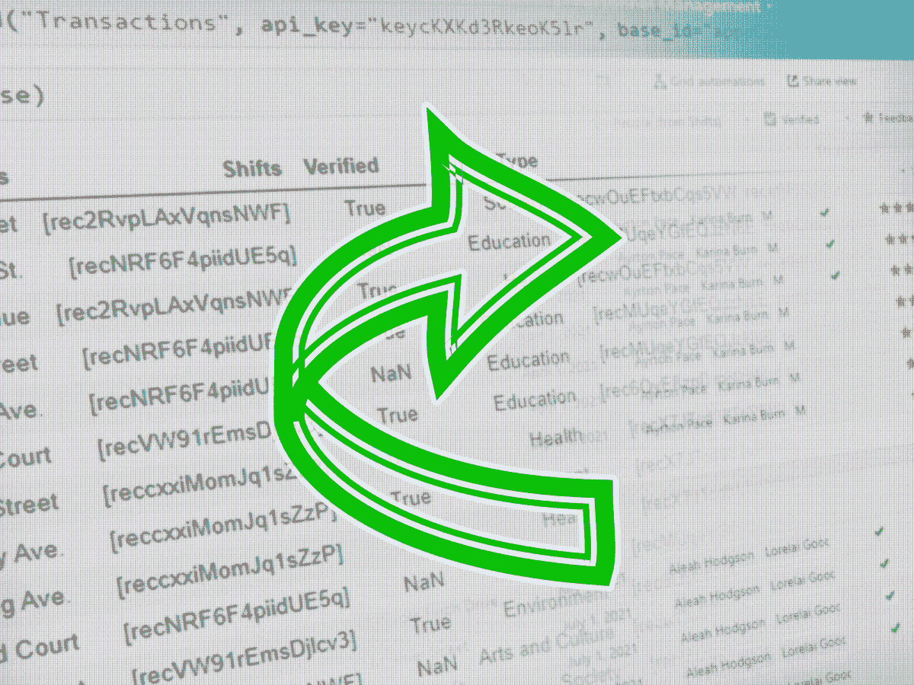
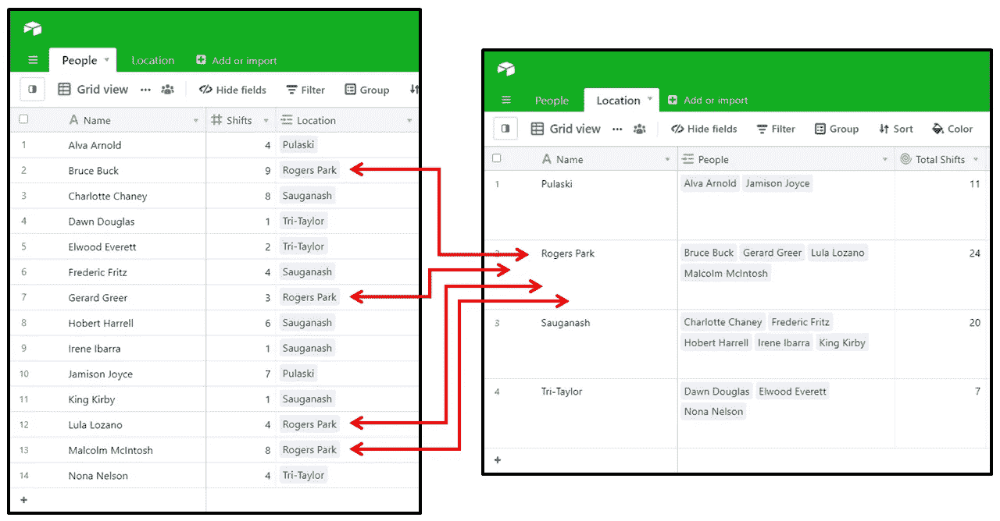
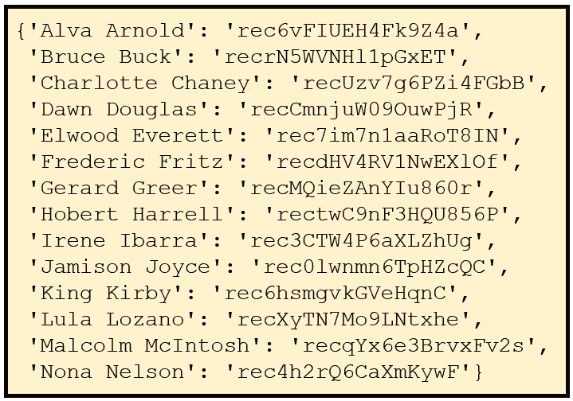
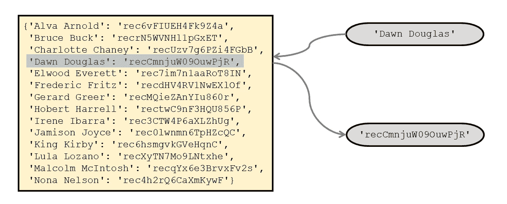
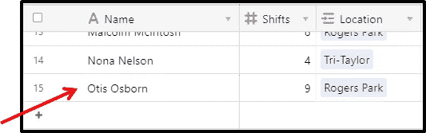
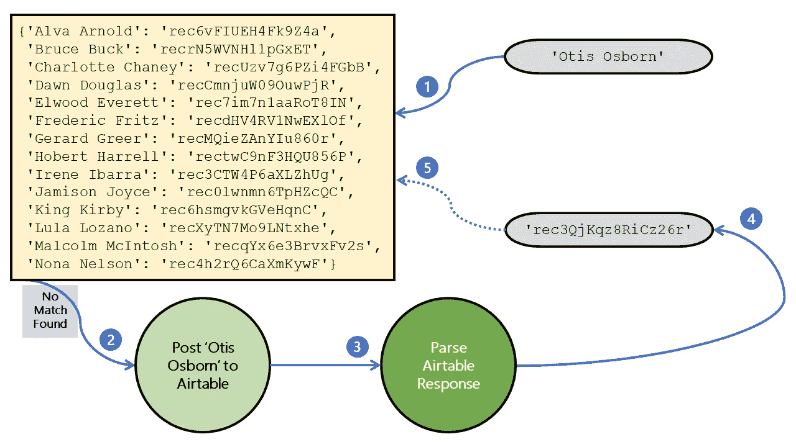
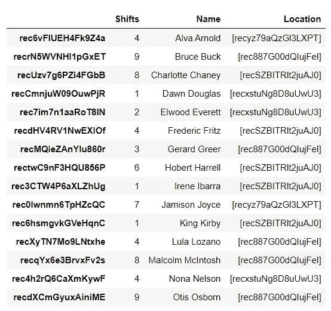

# Airtable & Python 使之成为可能 II:使用 Airtable 的 API 将数据从 Python 上传到 Airtable

> 原文：<https://towardsdatascience.com/airtable-python-made-possible-ii-uploading-data-into-airtable-from-python-using-airtables-api-3075009abf98?source=collection_archive---------14----------------------->



作者的图片说明。

## 如何将 Python 设计的数据存储回 Airtable 用户友好的关系数据库

## **内容:**

— [了解关系数据&记录 id](#5510)
—[匹配字段值到记录 id](#8863)
—[在 Airtable](#81e5)
— [匹配(&上传)多条记录](#e939)
— [更新 Airtable](#971b)
— [中的记录从](#08b3) `[pandas](#08b3)` [到 Airtable](#08b3)
— [🎉*复制粘贴表格功能*](https://gist.github.com/KalebNyquist/4424fc1ef3dc6bb4fc0b5a7122ada4bc)— [⏮️第一部分:将 Airtable 数据下载到 Python 中](/downloading-airtable-data-into-python-89e5c7107a24)

Python 是一种成熟的编程语言，尽管年代久远，但最近经历了某种复兴——[最近成为第二种最广泛使用的通用编程语言](https://www.wired.com/story/python-language-more-popular-than-ever/)。这种繁荣可能是由数据科学领域的快速发展推动的，Python 在这一领域占据主导地位，因为 Python 相对容易学习，但对数据工程和数据分析都很有用。


请务必阅读本教程的第一部分，使用 Airtable 的 API 将 Airtable 数据下载到 Python 中。

因为某些经济部门获取丰富数据的门槛相对较低，所以它们采用 Python 驱动的数据科学的速度相对较快。例如，金融部门从根本上讲是关于一个特定的数据点——[“价格”](https://link.springer.com/chapter/10.1057/978-1-137-41160-0_4#:~:text=Most%20notably%2C%20Hayek%20argued%20that,the%20members%20of%20society%2C%20for)——因此毫不奇怪，像[花旗集团这样的组织向其新任分析师](https://fortune.com/2018/06/14/citigroup-python-resume-languages/)教授 Python 来管理他们的价格数据。经验科学，无论是应用科学还是学术科学，从根本上讲都是关于数据驱动的观察，因此所有学科的许多[科学家都学习 Python](https://astrofrog.github.io/py4sci/) 作为他们教育的一部分，以理解他们观察到的所有数据点。当然还有软件开发部门，包括我们每天花费越来越多的时间参与的所有应用程序，如网飞，这些应用程序将我们在其平台上的每次点击、查看或其他交互记录为数据点。猜猜看，网飞在“整个内容生命周期”中使用 Python [来优化他们的产品。](https://netflixtechblog.com/python-at-netflix-bba45dae649e)

然而，在获取丰富数据方面，并不是每个组织都这么容易。例如，我的专业是非营利和社会变革部门。对于我们这些在“真实世界”(即，而不是在电脑屏幕或股票报价机后面)中工作的人来说，获得关于我们运营的有用数据可能需要一些真正的努力和规划。好消息是，一旦我们获得了这些数据，Python 的能力就变得唾手可得了。换句话说，我相信获取数据的最初障碍并不会使“真实世界”的组织丧失利用 Python 所提供的功能的资格。

进入[气动工作台](https://airtable.com/invite/r/9jyJBxR8)。Airtable 将关系数据库结构与用户友好的图形界面结合在一起，降低了入门门槛(特别是对于那些以低数据素养为特征的“真实世界”组织环境)。理想情况下，我们不仅希望能够在 Airtable 中收集可以在 Python 中使用的数据，还希望能够在 Python 中生成可以在 Airtable 中查看的数据集。拥有这种功能可以实现数据透明和审计，同时也使组织中的非程序员能够自己分析数据。

在之前的教程中，我一步一步地讲解了如何使用 Airtable 基础的 API 将 Airtable 数据下载到 Python 中。在这里，我带来了完整的教程:如何使用相同的技术和`requests`库将 Python 数据上传到 [Airtable](https://airtable.com/invite/r/9jyJBxR8) 的分步指南。然而，要充分利用 Airtable 的关系数据结构，需要一些仔细的预处理。本教程将涵盖这两个方面:首先是预处理步骤，然后是实际的上传步骤——上传步骤是在 Airtable 中创建新记录还是更新旧记录。

🎉*特别奖励*:如果你没有时间看完整的教程，请点击这里访问我的[防呆的 Airtable 上传功能](https://gist.github.com/KalebNyquist/f0e533caabf8fcd751a757d5eec28798)，我将其推广用于多个项目。您可以按原样运行它，它将指导您查找任何缺失的信息(例如，从哪里获取 API 密钥)并突出显示可能的错误。欢迎你免费复制、粘贴和修改这段代码，但是如果你想分享你的感激之情，你可以[点击这里给我买杯咖啡](https://ko-fi.com/kalebnyquist)。

# 了解关系数据和记录 id

与 Google Sheets 或 Microsoft Excel 相比，Airtable 的“魔力”在于关系数据的集成。除了更加规范的数据管理，Airtable 的关系数据结构意味着一个表中的数据可以在另一个表中访问，以便于分析。这是通过“链接到另一个记录”字段类型完成的。

例如，如下图所示，在“People”表中有四个条目在 Rogers Park 工作。这些人的名字是布鲁斯·巴克、杰拉德·格里尔、卢拉·洛扎诺和马尔孔·麦金托什，他们分别在 9、3、4 和 8 班工作。在“位置”表中，这些人汇总在一行中，总共有 24 个班次。



**图 1:“链接到另一个字段记录”字段类型如何创建关系数据结构。**图片作者。

在图形 web 界面中，关系数据由浅蓝色方框表示，带有与[“主字段”](https://support.airtable.com/hc/en-us/articles/202624179-The-Name-Field)相对应的可读文本。当我们通过 API 而不是图形 web 界面访问 Airtable 数据时，这种关系数据看起来非常不同，可能有点吓人。

请考虑“人员”表中的观察结果:

```
{'id': 'recrN5WVNHl1pGxET',
 'fields': {'Name': 'Bruce Buck',
             'Shifts': 9,
             'Location': ['rec887G00dQIujFel'],
 'createdTime': '2021-02-17T22:59:38.000Z'}
```

并且，从“位置”表中:

```
{'id': 'rec887G00dQIujFel',
 'fields': {'Name': 'Rogers Park',
            'People': ['recrN5WVNHl1pGxET',
                       'recMQieZAnYIu860r',
                       'recXyTN7Mo9LNtxhe',
                       'recqYx6e3BrvxFv2s'],
            'Total Shifts': 24,
 'createdTime': '2021-02-17T22:59:56.000Z'}
```

如果仔细观察，您会发现直观表示为“Bruce Buck”的数据的`id`为`recrN5WVNHl1pGxET`，而直观表示为“Rogers Park”的数据的`id`为`rec887G00dQIujFel`。通过像这样使用记录 id 来引用关系数据，Airtable 可以灵活地处理可能出现的复杂性(例如:如果有两个不同的 Bruce Bucks 呢？如果用户改变了定位的方式，不再用名字，而是用街道地址，那该怎么办？).

当通过 API 将数据从 Python 上传到 Airtable 时，这种关系数据结构就有了含义。例如，假设我们有一个编码的 webscraper 在一个关于 Rogers Park 的网站上寻找 Bruce Buck。webscraper 不是寻找与`"recrN5WVNHl1pGxET"`匹配的字符串，而是寻找与`"Bruce Buck"`匹配的字符串。但是如果我们上传`"Bruce Buck"`到一个关系数据字段，而不是一个记录 id 数组，Airtable 的 API 将为列 错误返回一个 ***无效值。***

幸运的是，这是一个简单的问题，有一个显而易见的解决方案，(除了几个例外)将可靠地工作，正如我们现在将看到的。

# 将字段值与记录 id 匹配

在 Python 中，字典是基本的“映射”类型，用于将一个值从另一个值或“键”转换。出于我们的目的，我们需要创建一个记录 id 和字段值的字典，如下所示:



**图 2:记录 id 和字段值的字典。**图片作者。

使用 Airtable 记录的列表，比如从本教程的[第一部分(“下载”)生成的记录，作为起点，只需要一些简单的 Python 代码就可以创建这个字典。](/downloading-airtable-data-into-python-89e5c7107a24)

```
1 | record_dict = {}
2 | match_field = "Name"3 | for record in airtable_records:
4 |     if match_field in record['fields']:
5 |         record_value = record['fields'][match_field]
6 |         record_dict.update({record_value : record['id']})
```

第(1)行创建一个空字典。第(2)行定义了 Airtable 列，我们将记录 id 与该列的值进行匹配。第(3)行开始对每个 Airtable 记录进行迭代，为了防止错误，第(4)行检查我们从中提取数据的字段中是否存在值。第(5)和(6)行获取这个值，将它与记录 id 匹配，并相应地更新字典。

⚠️ *注意，在这个解决方案中，如果有重复的值(例如，两个“Bruce Buck ”),就会产生冲突。这可以用 in air table(“Bruce Buck 1”和“Bruck Buck 2”)或 Python(用附加代码)解决。这个问题的最佳解决方案将依赖于上下文。*

创建了这个字典后，我们可以开始映射过程，如下图所示:



**图 3:使用 Python 字典从概念上匹配惟一字段值和 Airtable 记录 id。**图片作者。

有许多方法可以达到这个结果。对于单个值，`record_dict["Dawn Douglas"]`或`record_dict.get("Dawn Douglas")`都可以；对于熊猫数据系列，`pd.Series(data).map(record_dict)`将转换它能找到匹配的所有值。

但是，如果我们找不到匹配的呢？这就是将数据上传到 Airtable 的过程变得相当复杂的地方，但如果我们愿意采取一些额外的步骤，仍然是完全可行的。但是首先我们需要通过 API 在 Airtable 中创建新记录的基本机制。

# 在 Airtable 中创建新记录

在本教程的第一部分的[中，我们使用](/downloading-airtable-data-into-python-89e5c7107a24)`[requests](https://2.python-requests.org/en/master/)`库通过 [GET](https://restfulapi.net/http-methods/#get) 方法从 Airtable 下载数据。现在，使用类似的代码，我们将使用 [POST](https://restfulapi.net/http-methods/#post) 方法创建一条记录(稍后，我们将使用 [PATCH](https://restfulapi.net/http-methods/#patch) 方法更新一条记录)。

比较一下，注意用斜体标出的差异:

```
**# Download**
response = requests.*get*(url, *params=params*, headers=headers)**# Upload New** response = requests.*post*(url, *data=upload_json*, headers=headers)
```

我们可以使用相同的网址(`"https://api.airtable.com/v0/" + base_id + "/" + table_name`)用于下载和上传。但是，我们必须扩展标题，以便:

```
{"Authorization" : "Bearer " + api_key,
 "Content-Type" : "application/json"}
```

这个新的`Content-Type`头的存在是对我们的一个暗示，当上传数据到 Airtable 时，我们现在以 [JSON](https://restfulapi.net/introduction-to-json/) 的形式发送数据(你可能认为这是下载时传递参数的镜像)。

为了具体说明这一点，我们来看一个例子。

```
**# Step 1**
upload_data = {"Name" : "Otis Osborn",
               "Shifts" : 9,
               "Location" : ["rec887G00dQIujFel"]}**# Step 2**
upload_dict = {"records" : [{"fields" : upload_data}], 
               "typecast" : False}**# Step 3** upload_json = json.dumps(upload_dict)**# Step 4**
response = requests.*post*(url, data=upload_json, headers=headers)
```

步骤(1)创建了一个我们想要上传到 Airtable 的数据字典。请注意字符串、整数和列表数据类型的使用。这里确保字段名和数据类型匹配是很重要的——如果您遇到错误，请参考您的库的 [API 文档](https://airtable.com/api)。

步骤(2)将该数据子集化到 Airtable 的 API 可以读取的另一个字典中。您可以将`"typecast"`设置为真或假。如果由于某种原因，您无法在步骤 1 中获得匹配的数据类型，将此设置为 True 会将字符串转换为 Airtable 对相应数据类型的最佳猜测。

步骤(3)将这个字典转换成 JSON，步骤(4)将最终产品上传到 Airtable。如果成功，Airtable 将发送回一个响应，当调用`response.json()`时，该响应将如下所示:

```
{'records': [
  {'id': 'recoiMuxqVvbNMRlG',
   'fields': {'Name': 'Otis Osborn',
              'Location': ['rec887G00dQIujFel'],
              'Shifts': 9},
   'createdTime': '2021-02-19T14:41:41.000Z'}]}
```

请注意，除了“创建时间”之外，我们现在还有另一个关键的新数据，一个专门针对该记录的 id。

我们可以通过检查图形界面来验证是否添加了 Otis Osborn:



**图 4:在图形界面中识别新记录。**作者图片。

很简单。这样可以一次只向 Airtable 添加一条记录。然而，当我们开始批量匹配和创建多个任意大小的 Airtable 记录时，我们开始遇到匹配问题。

# 匹配(&上传)多条记录

之前，我们使用基于 Airtable 数据下载的 Python 字典将字段值与记录 id 进行匹配。然而，当我们将新数据上传到 Airtable 时，Python 字典就过时了。

例如，想象一下，如果我们在数据集中两次遇到“Otis Osborn ”,并且我们知道这个“Otis Osborn”是同一个人(即，不存在 Otis 1 和 Otis 2)。如果我们在匹配多个记录时没有保持 Python 字典的更新，那么将会为同一个 Otis Osborn 创建两个单独的记录。

一种解决方案是在每次新上传后重新下载 Airtable 数据，但这将是带宽密集型的，尤其是对于较大的数据集。一个更好的解决方案是使用我们在向 Airtable 上传新的关系数据条目时收到的响应数据来更新 Python 字典。

下面，这个过程就直观的表现出来了。



**图 5:当没有找到预先存在的匹配时，创建一个具有唯一字段值的新记录的过程。**与上面的[图 3](#3e28) 比较。图片作者。

在您将该图与上面的[图 3](#3e28) 进行比较之后，让我们考虑如何对这些步骤进行编码。

***步骤 1:尝试将字段值与记录 ID*** 匹配

```
match_value = "Otis Osborn"
record_id = record_dict.get(match_value)
```

这里，我们将一个 Airtable 字段值与一个记录 id 进行匹配。在这个特定的例子中，我们知道 Otis Osborn 不在字段值和记录 id 的字典中，所以`record_dict.get("Otis Osborn")`将返回一个 [Python NoneType 对象](https://realpython.com/null-in-python/)。

***第二步:在 Airtable 中新建一条记录***

```
match_field = "Name"
if record_id is None:
    upload_data = {match_field : match_value}
    upload_dict = {"records" : [{"fields" : upload_data}]}
    response = requests.post(url, data=upload_json, headers=headers)
```

因为记录 id 是`None`，我们指示计算机将 Otis Osborn 上传到 Airtable。我们创建一个简单的数据字典，将这个简单的字典添加到为 Airtable 上传而格式化的“上传字典”中，然后发送一个 POST 请求。

***第三步:解析 Airtable 响应***

```
airtable_record = response.json()['records'][0]
```

上面的代码帮助我们导航 Airtable 响应。因为我们成功上传了一条记录，所以我们取回了一条记录，索引在`[0]`。

***第四步:获取 Airtable 记录 ID***

```
record_id = airtable_record['id']
```

记录 ID 应该类似于:`rec3QjKqz8RiCz26r`。这使我们到达了相同的点，好像我们已经在字典中有了这个字段值和记录 ID 对，但是如果我们想要避免重复上传，我们还有一个步骤。

***第五步:更新字段值和记录 id 的字典***

```
record_dict.update({match_value : record_id})
```

恭喜你。至此，我们已经完成了进行匹配代码的另一次迭代所需的所有工作。保持这个 Python 字典与 Airtable 同步是通过 API 上传数据最困难的部分。

现在我们已经完成了匹配和/或创建记录的复杂过程，我们准备进入上传过程的最后一部分:*使用 Python 更新* Airtable 记录。

# 更新 Airtable 中的记录

在 Airtable 中更新记录的过程与创建记录的过程非常相似，只有几个关键的区别，具体如下。

第一个区别是 API 请求中使用的 URL:它需要指向我们正在更新的特定记录。幸运的是，我们需要做的只是将记录 ID 附加到我们用来创建新记录的 URL 上，就像这样:

```
url + "https://api.airtable.com/v0/" + base_id + "/" + table_name
record_url = url + "/" + record_id 
```

第二个区别是我们通过 API 发送的数据字典。由于我们在更新时一次只上传一条记录，所以字典要简单得多(参见上面的步骤 2)。

```
upload_dict = {“fields” : upload_data, “typecast” : typecast}
```

第三个区别是我们使用的 RESTful 方法。为了创作，我们发帖；为了更新，我们将打补丁，就像这样:

```
**# Upload Update** response = requests.*patch*(record_url, *data=*upload_json, headers)
```

与本教程的其余部分相比，这似乎没什么大不了的，但是更新 Airtable 记录的能力允许您创建可伸缩的数据解决方案，将 Python 的分析能力与 Airtable 的用户友好的数据存储能力结合起来。

# 从熊猫到飞行桌

`[pandas](https://pandas.pydata.org/)`是 Python 中一个流行的数据分析和操作包。在处理 Airtable 数据时，我们可能会有一个类似于下面这样的 pandas 数据帧，其中记录 id 构成了索引值:



**图 6:熊猫数据表，在 Jupyter 笔记本界面上显示。**图片作者。

在这种情况下，我们的第一步是将 dataframe (" `df`")转换为字典中的字典。我们可以使用代码为`df.to_dict(orient="index")`的来实现这一点，它将生成如下所示的内容:

```
{'rec6vFIUEH4Fk9Z4a': {'Shifts': 4,
  'Name': 'Alva Arnold',
  'Location': ['recyz79aQzGl3LXPT']},
 'recrN5WVNHl1pGxET': {'Shifts': 9,
  'Name': 'Bruce Buck',
  'Location': ['rec887G00dQIujFel']},
 'recUzv7g6PZi4FGbB': {'Shifts': 8,
  'Name': 'Charlotte Chaney',
  'Location': ['recSZBITRlt2juAJ0']},
 ...}
```

我们现在可以迭代字典中的每个键值对，如下所示:

```
dict_of_dicts = df.to_dict(orient="index")
for record_id, upload_data in dict_of_dicts.items():
   record_url = url + "/" + record_id
   upload_dict = {"records" : [{"fields" : upload_data}]}upload_json = json.dumps(upload_dict)
   requests.post(url, data=upload_json, headers=headers)
```

现在，我们可以无缝地从 pandas 转移到 Airtable，反之亦然([见本教程的第一部分下载 Airtable 数据到 pandas dataframe](/downloading-airtable-data-into-python-89e5c7107a24#7693) )！

# 结论

来源: [GIPHY](https://giphy.com/gifs/thinkproducts-LS9OaDuFiA09eR0Q1C)

首先，如果你遵循了上面的每一个步骤，仍然有问题，欢迎你将我的简单的 Airtable 帮助函数复制并粘贴到你的项目中。这个 Python 代码片段不仅将上述所有思想集成到一个函数中，而且还将打印故障排除消息，以帮助您找出不工作的地方。

一旦你把 Airtable 上传到工作中，天空就是极限。我使用 Python-to-Airtable 上传来促进数据审计方面的协作，增加数据分析的透明度，并用生成的数据作为数据库的种子。[给我写封短信](mailto:contact@kalebnyquist.me)分享你创造性的 Python-Airtable 集成！

对于 Python- [Airtable](https://airtable.com/invite/r/9jyJBxR8) 开发者来说，有令人兴奋的消息，据报道，更多的功能正在向我们走来。特别是，有一个元数据 API[正在开发中，它让开发者能够列出库、表、字段类型和视图。除此之外，这将使定位下载数据*和上传数据*更加容易，而不会因为键错误或数据类型不匹配而中断。当元数据 API 发布时，如果您对本教程的第三部分感兴趣，请对本文发表评论或鼓掌。](https://airtable.com/api/meta)

# 承认

*   这篇文章的最初草稿是作为熨斗学校华盛顿 DC 校区的奖学金的一部分而制作的。对于那些对学习 Python 驱动的数据分析感兴趣的人，我强烈推荐[熨斗学校的数据科学训练营](https://flatironschool.com/scholarships/2022q2ar/?utm_campaign=ec2a7f51-e911-403e-8e92-50950d9f7c32&utm_source=emailbatch&utm_medium=email&utm_term=txtlink)。
*   感谢 David T，这位读者发现了原始代码样本中的一个错误。你能发现这个错误吗？`{"Authorization" : "Bearer" + api_key, "Content-Type" : "application/json"}`
*   此外，感谢我在 BuyMeACoffee.com 和 Ko-fi.com[的支持者们，是他们让我有可能整理这些教程。如果这篇教程对你有价值，我会欢迎你的支持！☕](https://ko-fi.com/kalebnyquist)