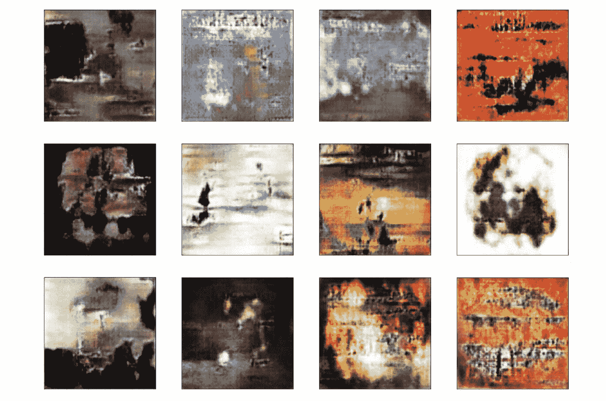
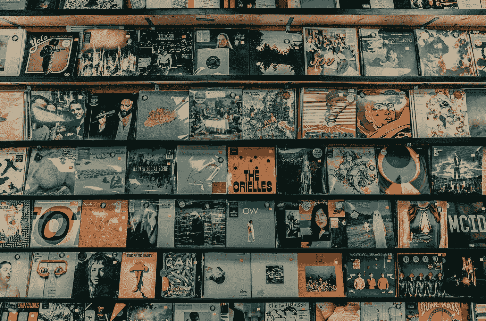
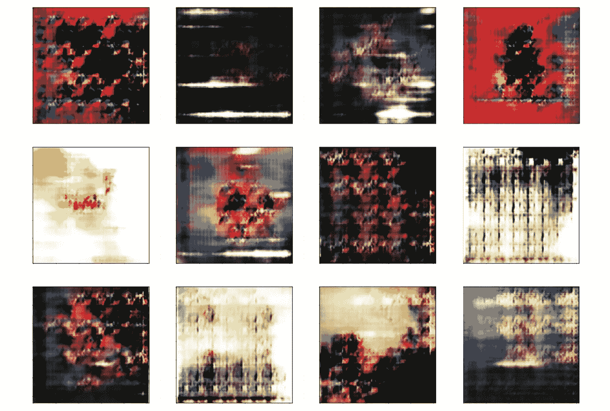
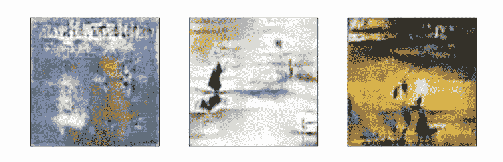
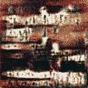

# 甘的专辑封面

> 原文：<https://towardsdatascience.com/album-covers-by-gans-c5c8ef48f50c?source=collection_archive---------28----------------------->

## 一步一步的代码和直觉指南生成专辑封面。

WGAN 生成的专辑封面随机样本

是的，甘斯很酷。

如果你不知何故偶然发现了这篇小文章，可以肯定地说，你对****g***generate***a******n***etworks—GANs 有点兴趣。*

*我绝对是。在网上看到无数令人惊奇的项目时，我也想创造一些有趣的东西。从人脸生成到图像恢复，GANs 的能力吸引了我——我需要学习更多。*

*完成了经典的 MNIST 和猫狗教程，我想知道…现在呢？正如你可能从标题和图片中知道的，是专辑封面抓住了我的好奇心。*

## *目录*

> *[1。为什么是专辑封面？](#03b8)*
> 
> *[2。编码专辑封面生成器](#9540)*
> 
> *[3。数据预处理](#a193)*
> 
> *[4。创建发电机](#981e)*
> 
> *[5。创建鉴别器](#981e)*
> 
> *6。培训时间*
> 
> *7。结果——任何项目中最激动人心的部分*
> 
> *[8。我们如何改进我们生成的专辑封面？](#c240)*
> 
> *[9。WGANs](#335f)*
> 
> *[10。WGAN 的实现](#b738)*
> 
> *[11。更好的 WGAN 结果！](#153c)*
> 
> *[**项目回购环节**](https://github.com/alexlin51/GANs-Album-Covers)*

# *为什么是专辑封面？*

*看看下面的专辑封面，你注意到了什么？*

**

*照片由[粘土银行](https://unsplash.com/@claybanks?utm_source=medium&utm_medium=referral)在 [Unsplash](https://unsplash.com?utm_source=medium&utm_medium=referral) 上拍摄*

*这个例子揭示了一个有趣的观察结果——这些不同的封面之间似乎很少有一致性，至少在我看来是这样。*

*事实上，当深入研究我们的[专辑封面数据集](https://www.kaggle.com/greg115/album-covers-images)时，有各种各样的颜色、图案、形状、纹理、文字……不胜枚举。*

*单纯的甘能看懂什么是专辑封面吗？如果有，这种理解会是什么样子？*

*我开始尝试回答这些问题。*

# *编码专辑封面生成器*

*作为对读者的一个快速提示，我假设对 GANs 的工作原理有一个基本的了解。网上有许多令人惊叹的资源可供学习，但这里有一些是我最喜欢的:*

*   *[路易斯·塞拉诺对甘斯的友好介绍](https://www.youtube.com/watch?v=8L11aMN5KY8)*
*   *[王洋对甘斯的数学介绍](https://arxiv.org/abs/2009.00169)*
*   *[我自己的甘介绍](https://www.canva.com/design/DAEfjLb86SE/YQ6NvxksmDhmsvtYwv-Z0g/view?utm_content=DAEfjLb86SE&utm_campaign=designshare&utm_medium=link&utm_source=publishsharelink#1)*

## *预处理数据*

*与任何机器学习项目一样，我们从预处理数据开始。*

*我们的目标是将原始数据集转换成可以将处理过的图像输入到我们的训练管道中的东西。通过利用 PyTorch 的数据加载器，我们可以用几行代码完成这两项任务。*

*将图像预处理到数据加载器中*

## *创建生成器*

*准备好数据加载器后，我们要设置生成器模型。我们的模型将基于 PyTorch 教程中的 DCGAN。*

*我们的生成器将负责生成专辑封面的创建。*

*发电机模型*

## *创建鉴别器*

*鉴别器是等式的下一部分。我们的鉴别器的工作是简单地将给定的图像分类为生成的或真实的。*

*由于创建专辑封面的复杂性，我们过于简单的生成器可能无法创建最令人信服的专辑封面。为此，我们可以满足于一个简单的卷积分类模型作为我们的鉴别器。*

*鉴别器模型*

## *训练时间*

*数据…检查。发电机…检查完毕。鉴别器…检查。训练时间到了！*

*GAN 的训练过程可以归结为我们的生成器和鉴别器之间的最小-最大博弈。我们希望训练这两种模型相互对抗，以改进彼此。*

*首先，我们初始化我们的模型并定义损失函数和优化器。对于我们的 GAN，二进制交叉熵损失函数将工作得很好。我们的优化器将利用学习率为 0.002 的 Adam 优化算法。*

*对于我们的鉴别器的训练管道，我们希望将生成的和真实的样本用正确的标签输入到我们的模型中。*

*这个过程将感觉非常类似于典型的两级分类训练管道。*

*甄别训练程序*

*对于我们的生成器，我们将输入 0 到 1 之间的值的正态分布向量，以生成 120 x 120 像素的 RBG 图像。生成之后，我们将要求鉴别器在计算损失值和相应地调整生成器之前对我们的图像进行分类。*

*发电机培训程序*

*现在已经定义了所有的培训管道，我们可以开始培训过程了。在 Google Collab 上运行这个模型 15 个时期花费了相当多的时间，所以吃点零食，放松一下，享受一部电影吧！你应得的！*

*训练周期*

## *结果——任何项目中最激动人心的部分*

*与大多数 GAN 项目一样，我们的损失值不能告诉我们多少关于生成图像的质量，所以我将从这里排除它。但是，让我们来看看我们生成的样本！*

**

*DCGAN 结果*

*嗯，它们看起来没有我希望的那么好。*

*有了香草甘架构，似乎我们能够捕捉专辑封面的一些基本特征。我们可以看到各种各样的颜色和形状。*

*然而，我们遇到了重复模式的问题，也被称为[模式崩溃](https://developers.google.com/machine-learning/gan/problems)。这些形状也不能把自己建成任何明确的结构。*

*总的来说，不是最好的结果。*

## *我们如何改进我们生成的专辑封面？*

*我们有几个选择可以探索。*

*我们可以尝试在我们的生成器模型中调整一些参数，但是超参数化模型的过程可能是冗长而缓慢的。*

*嗯，我们可以多训练我们的网络吗？大概不会。我们已经遇到了模式崩溃的迹象，所以进一步的训练可能会加剧这些影响。*

*那么我们为我们的 GAN 尝试不同的架构怎么样？*

*这可能行得通。*

# *WGANs*

*[Wasserstein GAN](https://www.google.com/url?sa=t&rct=j&q=&esrc=s&source=web&cd=&ved=2ahUKEwir2KeN7YnyAhUO3p4KHQVdDGcQFjAKegQIBhAD&url=https%3A%2F%2Farxiv.org%2Fabs%2F1701.07875&usg=AOvVaw39EAZveABsis2ggJu5U39h) 已经被证明可以显著提高 GAN 的生成能力，同时也解决了模式崩溃和[消失梯度](https://en.wikipedia.org/wiki/Vanishing_gradient_problem)的问题。*

*这两种架构的主要区别在于:*

*   *用批评家代替歧视者*
*   *在损失函数中使用[瓦瑟斯坦公制/推土机距离](https://en.wikipedia.org/wiki/Earth_mover%27s_distance)*
*   *权重正则化(梯度惩罚/权重剪裁)*

## *WGAN 的实现*

*让我们首先创建批评家。批评家和鉴别者真的是一样的，只是批评家最后没有包含一个 sigmoid 激活层。*

*我们将继续使用二进制交叉熵损失函数以及 Adam 优化算法。然而，我们将不得不对训练管道进行一些调整，以包括梯度惩罚。*

*梯度惩罚有助于约束批评家保持李普奇兹常数(有益于优化)。我们将采用这个梯度罚值，并将其纳入我们的评论家的损失。*

*定义了新的 WGAN 训练管道后，我们可以像以前一样运行相同的训练循环，并等待我们的新结果！*

## *更好的 WGAN 结果！*

*正如我们从这篇文章的第一张图片中看到的，与我们的 GAN 结果相比，WGAN 生成的样本看起来更像专辑封面。*

*生成器模型可以更好地捕捉抽象的形状、纹理、颜色范围，甚至可能的文本模式。*

*下面，是我最喜欢的几个！*

**

*我最喜欢的样品封面*

*在最左边，我看到图像顶部附近有一个较浅的模糊图案。对我来说，这类似于出现在许多专辑封面上的文字。一个建筑上的变化就能捕捉到这种抽象的模式，真是太神奇了。*

*右边的两幅图像似乎显示了一个人的场景。在左边，我看到一个人在向远处的另一个人挥手。在右边，我看到两个女孩站在一起，看着黄色的草地。*

*一个简单的 WGAN 可以生成如此细节和色彩的图像，这是非常令人惊讶的。*

**

*一些结果之间的插值*

*生成性对抗网络是强有力的工具。全世界都清楚，这种技术的实际应用是无穷无尽的。*

*唯一的问题是…你打算用它做什么？*