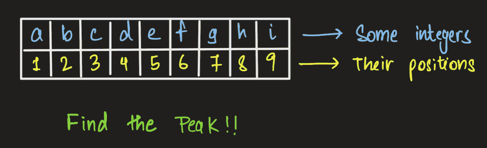
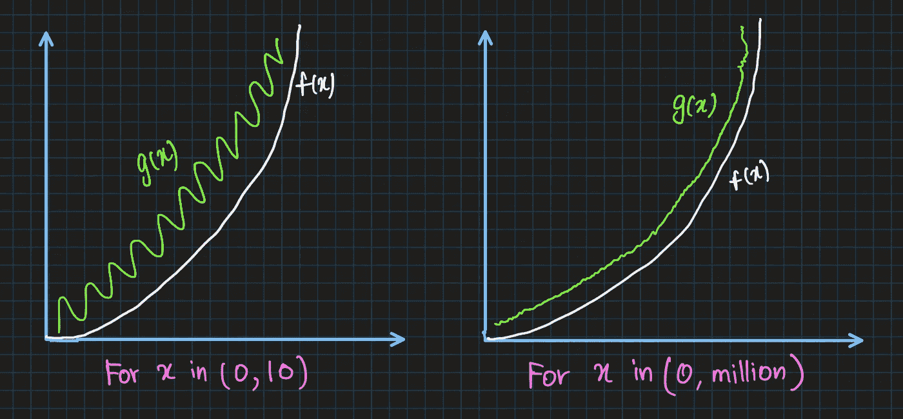

# 数据科学的算法思维

> 原文：<https://towardsdatascience.com/algorithmic-thinking-for-data-science-ab8c91416d83?source=collection_archive---------8----------------------->

## 数学和编程联系的衍生物


在 [Unsplash](https://unsplash.com?utm_source=medium&utm_medium=referral) 上拍摄的 [ThisisEngineering RAEng](https://unsplash.com/@thisisengineering?utm_source=medium&utm_medium=referral)

数据科学学生经常问的一个突出问题是，“为什么是算法？”老实说，我不怪他们。你会看到库和语言每天都在进步，使用 scikit-learn 的 Python 可以在一行代码中实现几乎任何数据结构。那么，为什么会有人想知道这些内置算法背后的科学和数学呢？

> 这与人类“学习”的方式有关。

回到你开始爬行和行走的时候，可能是 8 个月大的时候。几个月后，你开始听和说单词。几年后，你可以用父母教过的语言和他们交谈，你也可以用同样的语言和其他人交谈。这是在你上学之前。当学校开学的时候，教你的第一件事就是字母。当你已经可以用同一种语言与人交谈时，为什么还需要学习字母呢？因为学习不会停止。有了字母表和语言，你可以更有效地学习说和写。

几十年后，我们今天使用的算法可能不再适用。数据每秒都在呈指数级增长。五年前，1000 这个数字在货币和兆字节上都被认为很大。今天，这个数字很小。算法的根帮助我们理解它是如何构建的，这反过来又教会我们能够为现有算法从未见过的场景构建或修改这些算法的科学。这就是为什么，对于数据科学家、程序员和计算机科学行业的任何人来说，了解算法是如何从内部构建的非常重要。

# 什么是算法思维

概括算法的定义和实现就是算法思维。这意味着，如果我们有一个解决问题的标准，比如说一个排序问题，在问题陈述改变的情况下，我们不必完全修改方法。总会有一个攻击新习题集的起点。这就是算法思维的作用:它给出了一个起点。

> 为什么我们需要算法思维？–主要是为我们尚未遇到的问题建立新的解决方案。

设计任何算法时的两个关键要求是:

1.  **效率:**解决大问题的能力，就像解决小输入问题一样容易。
2.  **可伸缩性:**由于我们拥有的数据量每天都在增加，因此输入大小在未来总是会增加。我们今天设计的算法应该能够将自己扩展到输入的新高度。

## 理解算法思维的案例研究

让我们看看如何对一个问题实现算法思维，然后尝试改进我们原始的初始解决方案。我们从一个 ***寻峰器问题开始。*** 寻峰器(一维)是给我们一组输入整数，要求我们在那些数中找出峰值(最大的整数值)的问题。



假设字母(a 到 I)代表整数，这个数组的索引从 1 开始。我们需要找到作者的峰值(最大整数)|图像

## 策略 1:简单的算法

在我们的第一个策略中，我们简单地遍历给我们的整数数组，找到最大的元素。在上面显示的场景中，找到峰值需要多长时间？嗯，那要看情况。如果输入中的数字按降序排列，那么我们找到的第一个数字就是峰值。但是，无论哪种方式，要检查整个数组，我们都需要遍历它。**因此，在该算法中将有总共‘n’个事务或迭代，‘n’是数组的大小。**

## 策略 2:分而治之

在这个新策略中，我们尝试了一些不同的东西。我们尝试将输入数组分成两半。这种方法总共有三种可能的情况。要么中间的元素比左边的元素小，要么比右边的元素小，要么比两者都大。让我们看看下面的伪代码，了解分而治之找峰。

```
if a[n/2] < a[n/2 -1]
   search the left half { 1 -> a[n/2-1] } for peak
else if a[n/2] < a[n/2 + 1]
   search the right half { a[n/2+1] -> n } for peak
else
   middle number is the peak
```

我们观察到这个算法的迭代次数与我们最初的简单算法不同，这是为什么呢？**这是真的，因为即使在最坏的情况下，该算法也不必遍历数组的每个元素。**

# 不断增长的数据量的影响

为什么计算时间和空间的复杂性比以往任何时候都重要？这与我们之前讨论过的事情有关，即今天要处理的数据量。为了更好地解释这一点，让我们通过几个例子来展示大量数据在算法构建中的重要性。在测试场景中，当处理的数据量是我们处理的数据量的 100 多万倍时，我们在教室中随意创建的解决问题的算法与行业要求的算法非常不同。并且当输入大小明显较大时，时间复杂性总是可见的。

## 大数据问题的时间复杂度分析

当然，今天的计算机比以往任何时候都要快，内存也比以往任何时候都要大。但是，这些东西对我们来说都不是无限的。因此，计算时间是一种有限的资源，内存空间也是如此。因此，我们需要最佳地利用这些资源。

在这一节中，我们将回答为什么拥有在运行时节省空间和时间的高效算法如此重要。让我们以排序数字为例。排序中两个众所周知的算法是插入排序和合并排序。两者都工作得很好，都有专门的应用程序。我们想了解它们在非常大的输入下的性能。我们知道(在本文中我没有提供这些的证明)**插入排序**以 n 阶的效率运行。**合并排序**以 nlogn 的时间效率运行。这两种算法都有一些恒定定时的整数，但是在任何函数增长到非常大的数字时，这些 ***常数在函数各自的增长中不起任何重要作用(我们将在下面看到这一点的证明)。*** 非常清楚，如果我们将 log(n)与 n 进行比较，log(n)上的乘数永远较小。

> 取 n=1000，log(1000)大约是 10，即使 n 的值等于一百万，log(n)也是 20。另一方面，代表 1000 的 n 会跨越六位数，代表 100 万的 n 会更大。

让我们通过比较两台计算机 A 和 b 来考虑下面的工作示例。

**计算机 A 是一台快速机器，每秒执行 100 亿条指令**(这是假设的，目前很难在单个处理器上构建具有这种指令速率的机器)。**计算机 B 是一台很慢的机器，每秒大约运行 1000 万条指令。**从这些原始计算数据中，很明显**计算机 A 比计算机 b 快 1000 倍。**为了让事情更戏剧化，并将这种比较提升到另一个层次，让我们想象一个世界级的程序员用机器语言编写插入排序代码，运行时间复杂度为 2(n)。现在，一个编程新手，实现他的第一个合并排序代码，以 50n 的效率编写它。log(n)
我们在计算机 A 上运行**插入排序，在计算机 B 上运行**合并排序，输入**1000 万个数字**。

如果你算一下(单位时间内算法求解的指令/计算机处理的指令)你会看到**计算机 A 需要 20000 秒，大约是 5.5 小时。**而速度较慢的计算机运行代码效率低下，**计算机 B 需要 1163 秒，不到 20 分钟。**这是高效且可扩展的算法设计能够带来的计算影响。使用库中预先设计的算法不会给针对单个机器的能力优化代码的自由。

## 为什么常数不重要

在故事的前面，我提到算法，对于一些任务，需要花费固定的时间(例如，将一个变量写入内存或者给一个变量赋值，等等。)我还提到，如果算法正在计算非常大的输入，这些常数可以忽略。这是为什么呢？

看看下面的正弦和二次函数:

```
g(x) = 1.1x^2 + (10 + sin(x + 1.15) * x^1.5) + 6006f(x) = x^2
```

让我们看看，这些函数是如何随着 x 值的变化而增长的。



看到趋势的变化。随着输入范围的扩大，噪声几乎消失。|作者图片

我们看到，在某一点之后，曲线的形状改变了，变得类似于函数 f(x ),它没有任何常数。如果我们确实看到一些噪声，那只是因为 x ^1.5 项。因此，忽略时间和空间效率计算中的常数是一种做法，因为对于大量的数据输入，它们变得可以忽略不计。

## 阅读有关数据科学算法的更多信息

</logic-programming-and-the-design-of-humanistic-ai-using-python-6ddb7019caa2>  </the-ultimate-guide-to-functional-programming-for-big-data-1e57b0d225a3>  </a-guide-to-genetic-learning-algorithms-for-optimization-e1067cdc77e7>  

# 结论

这场争论可能永远不会结束！随着学习编码的方式越来越多，编程场景变得相对容易。甚至机器学习算法也在慢慢变成 AutoML 应用程序上的拖放，比如微软的 Azure ML Studio。但是，尽管如此，设计高效算法的需求永远不会消失。机器可能变得强大，但与此同时，每秒处理的数据量也在增加。因此，必须设计有效的算法来处理这些数据。这个故事的目的不是教你算法设计的艺术，而仅仅是指出算法对数据科学家也很重要。构建、设计和测试高效、可扩展算法的目的没有也永远不会消失。


照片由[西格蒙德](https://unsplash.com/@sigmund?utm_source=medium&utm_medium=referral)在 [Unsplash](https://unsplash.com?utm_source=medium&utm_medium=referral) 上拍摄

## 关于我

我是纽约哥伦比亚大学的一名软件工程师兼数据科学研究员，目前正在研究如何减少气候变化对世界贫困人口的影响。这些人受我们砍伐树木和在地球表面推混凝土的行为影响最大。如果你的研究或工作抱负也与我一致，请务必通过 [Twitter](https://twitter.com/rjrahul24) 或 [LinkedIn](https://www.linkedin.com/in/rjrahul24/) 与我联系，我们可以一起努力建设 ***负责任的人工智能。***

## 参考

1.  [https://www . cs . sjtu . edu . cn/~李江/teaching/cs 222/files/materials/Algorithm % 20 design . pdf](https://www.cs.sjtu.edu.cn/~jiangli/teaching/CS222/files/materials/Algorithm%20Design.pdf)
2.  [https://www.cs.princeton.edu/~wayne/kleinberg-tardos/](https://www.cs.princeton.edu/~wayne/kleinberg-tardos/)
3.  [https://github . com/davie 890/cs 102-Algorithm-Analysis/blob/master/Algorithm % 20 design % 20 by % 20 Jon % 20 kleinberg % 2C % 20 EVA % 20 tardos . pdf](https://github.com/davie890/CS102-Algorithm-Analysis/blob/master/Algorithm%20Design%20by%20Jon%20Kleinberg%2C%20Eva%20Tardos.pdf)
4.  [https://www . cs . ut exas . edu/users/DJI menez/utsa/cs 1723/lecture 2 . html](https://www.cs.utexas.edu/users/djimenez/utsa/cs1723/lecture2.html)
5.  [https://www . hackere earth . com/practice/basic-programming/complexity-analysis/time-and-space-complexity/tutorial/](https://www.hackerearth.com/practice/basic-programming/complexity-analysis/time-and-space-complexity/tutorial/)
6.  [https://www . geeks forgeeks . org/time-complexity-and-space-complexity/](https://www.geeksforgeeks.org/time-complexity-and-space-complexity/)
7.  [https://towards data science . com/a-data-scientists-guide-to-data-structures-algorithms-1176395015 A0](/a-data-scientists-guide-to-data-structures-algorithms-1176395015a0)
8.  [https://medium . com/swlh/why-data-scientists-should-learn-algorithms-and-data-structures-4d 93237 a 1026](https://medium.com/swlh/why-data-scientists-should-learn-algorithms-and-data-structures-4d93237a1026)
9.  [https://tdwi . org/articles/2018/07/02/adv-all-5-algorithms-for-big-data . aspx](https://tdwi.org/articles/2018/07/02/adv-all-5-algorithms-for-big-data.aspx)