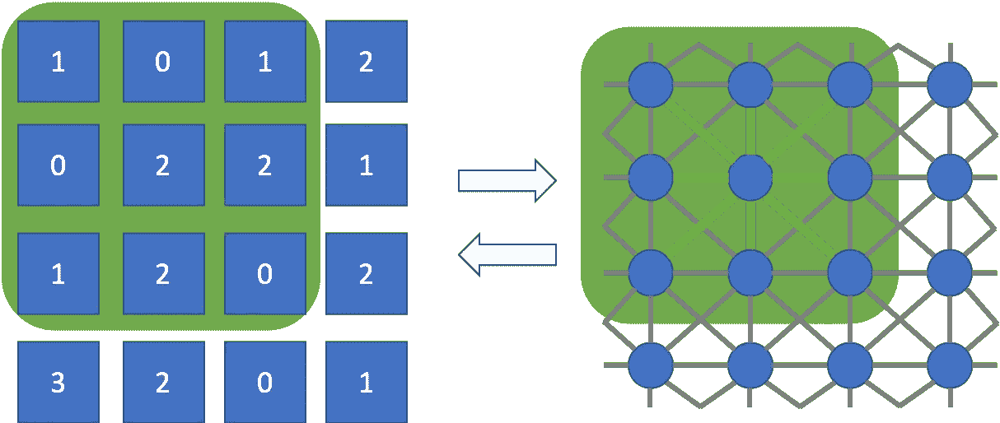
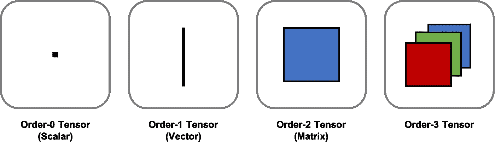
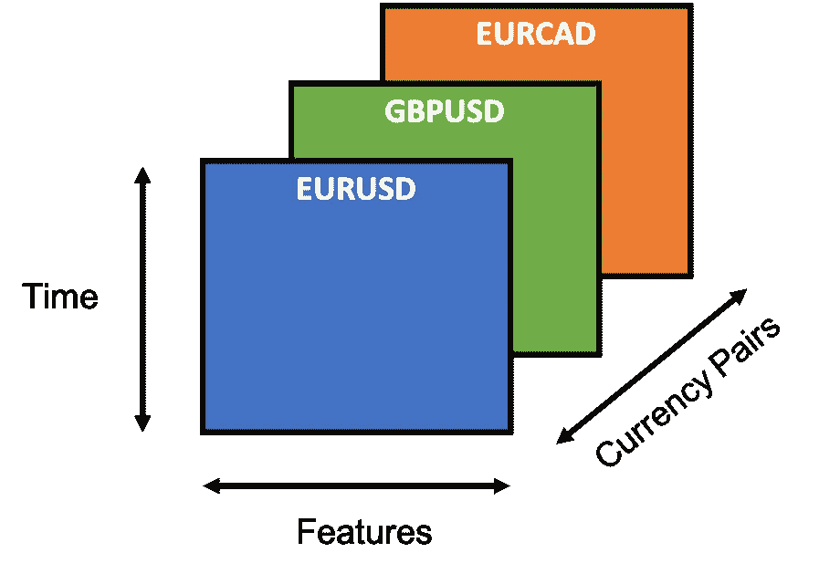
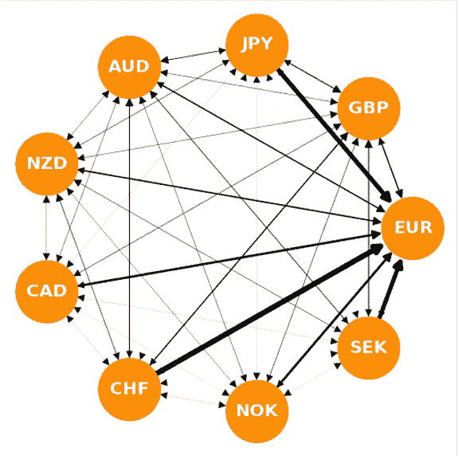
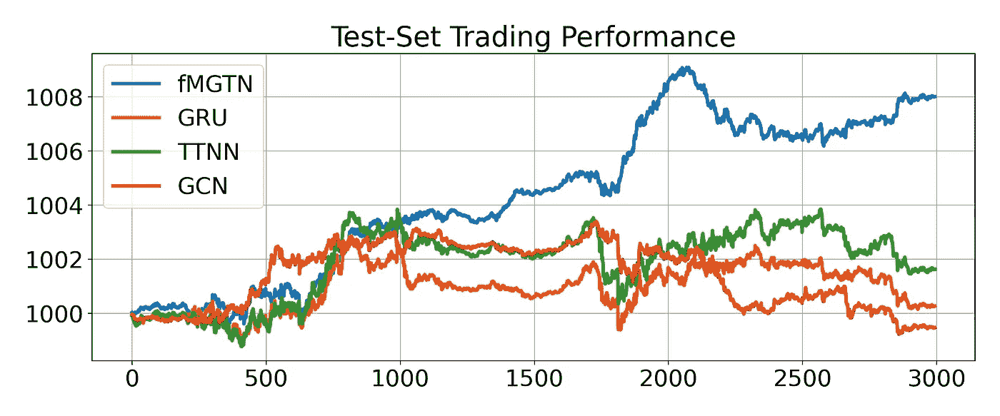

# 经济学驱动的深度学习算法交易

> 原文：<https://towardsdatascience.com/algorithmic-trading-with-economics-driven-deep-learning-50c219ee9334?source=collection_archive---------4----------------------->

## 将宏观经济理论融入深度学习模型

当开始学习金融 ML 时，很容易将一堆技术信号放入现成的 Keras RNNs 或 CNN 中。不用说，这些项目中的大部分都失败了，原因很简单，这些模型是为完全不同的应用开发的，不能反映金融数据的基本经济学。

今天，我们将看看在本文中开发的多图张量网络模型，并探索它如何将经济理论整合到更好的算法交易中。具体来说，我们将讨论如何将外汇(FX)套利因素(FX 回报的最重要驱动因素)纳入算法交易的深度强化学习代理的架构中。

([你可以在这里找到完整的代码和更多的细节](https://www.yaoleixu.com/quant-finance)

# 1.技术背景

为了将经济学原理纳入我们的深度学习模型，我们将不得不求助于在图形神经网络、张量网络和强化学习领域开发的工具。我们将在这里以非常概念性的方式讨论这些话题，因此请参考[论文](https://arxiv.org/abs/2010.13209)了解更多细节。此外，如果您已经熟悉这些主题，请随意跳过这一部分。

## 1.1.图形神经网络

图形神经网络(GNNs)是一种深度学习模型，用于处理在描述为图形的不规则域上定义的数据。与卷积神经网络(CNN)不同，它们不对底层数据几何做出假设，并且可以将卷积的概念推广到任何数据域。

下图直观地展示了如何将图像上的经典 2D 卷积(左)视为规则网格上互连像素图形上卷积的特殊实例(右)。

作者图片

## 1.2.张量分解

张量将向量和矩阵推广到多维数组。例如，矩阵是 2 阶张量，向量是 1 阶张量，标量是 0 阶张量。它们自然地描述许多类型的数据，例如图像(具有 3 种模态的 3 阶张量:x 轴、y 轴和 RGB 颜色)以及金融数据。

与矩阵类似，张量可以通过张量分解(TD)以低秩形式分解。TD 允许我们以对数方式大幅压缩大规模数据，这使我们能够有效地绕过维数灾难。

作者图片

## 1.3.深度 Q 强化学习

深度 Q 强化学习训练神经网络代理与给定环境交互，以最大化累积回报。这个学习框架特别适合算法交易，因为回报直接转化为代理买卖行为产生的利润。

作者图片

# **2。为什么金融深度学习经常失败**

> 金融数据经常违反深度学习模型的假设

在我们可以开发自己的金融深度学习模型之前，我们需要了解为什么传统的 CNN 和 rnn 往往对金融数据不起作用，原因很简单:**它们不是为这个领域开发的**。

每个深度学习模型都有自己的一套关于底层数据的假设，这可能不适用于金融市场，因为它有自己的一套独特的特征，正如本文[中](/financial-signal-processing-part-1-69c20fd5ad6d)所讨论的那样。

例如，CNN 是为计算机视觉任务开发的。他们假设基础数据是平移不变的，这对于图像来说是正确的，但是对于金融数据来说就不那么正确了。另一方面，RNNs 被开发用于序列建模。他们假设过去的状态可以通过可预测的趋势和季节性影响未来，这在一定程度上适用于金融数据，但往往不是一个充分的因素。

也就是说，通过非常仔细的问题公式化和数据预处理，我们可以绕过许多这样的问题，非常成功地将 CNN 和 RNNs 用于金融应用。因此，有必要仔细检查我们模型的基本假设，并确保它们反映了金融数据的基本经济学。

# 3.外汇金融背景

> 套利因素是外汇回报的主要驱动力，它与利率相关

现在让我们分析外汇数据的特征和驱动因素，以便我们能够设计我们的模型来反映基本的经济原则。

## 3.1.外汇数据的特征

外汇市场允许参与者以给定的*即期汇率*交易多种货币，即期汇率衡量一种货币在给定时刻相对于另一种货币的价值。

作者图片

外汇数据本质上是多模态的(多维的),因为它们包含随着时间的推移和跨几个相关资产索引的多个定价信息，这导致其计算遭受维数灾难的大维张量。这在过拟合方面具有严重的含义，这对于深度学习方法来说尤其成问题。

此外，由于市场中的套利力量，已知 FX 数据具有低信噪比，这使得模型训练特别容易过度拟合，尤其是对于深度学习模型。

最后，各种市场因素(如套利因素、价值因素、动量因素等。)，可以根据时间范围在不同程度上影响定价；这构成了不是很多机器学习算法可以处理的多分辨率问题。

## 3.2.外汇数据的驱动因素-外汇进位

有许多因素可以影响货币对的即期汇率，但最重要的驱动因素可以说是套利因素。

长话短说，外汇套利描述了货币对升值/贬值的趋势，取决于相应国家之间的利率差异。

例如，假设欧元兑美元的即期汇率为 1(即你可以用 1 欧元兑换 1 美元)，但利率在美国是 2%，在欧盟是 3%。你可以做的是以 2%的利率借入美元(短期)，转换成欧元(长期)，然后以 3%的利率贷出。如果即期汇率在年底前保持不变，你可以将欧元兑换回美元，由于利率差异，你实际上已经获得了 1%的无风险收益。

然而，在现实中，期望即期汇率完全保持不变是天真的。事实上，我们实际上预计欧元兑美元即期汇率会发生变化，以抵消利差。尽管过于简化，但这是利率平价背后的基本思想。

请注意，由于外汇数据是成对的，我们可以为每个货币对定义一个结转值。这允许我们定义下图所示的*进位图*，它以一种经济上有意义的方式对不同货币之间的成对关系进行编码。

作者图片

# 4.外汇交易的多图张量网络

在不涉及太多数学细节的情况下，本文在[开发的多图张量网络(MGTN)模型利用了张量分解的能力来建模多维数据，以及图在不规则域上建模数据的能力。这使得 MGTN 能够应对外汇数据的几个挑战，例如:](https://arxiv.org/abs/2010.13209)

*   FX 数据的多模态特性自然会导致张量表示，这可以通过 MGTN 的张量结构轻松处理。
*   该模型可以利用张量分解的强大低秩压缩特性，这种特性固有地不受维数灾难的影响，并提供一个正则化框架来解决 FX 数据的低信噪比特性。
*   长期市场因素如*套利*可以被封装在图形过滤器中，自然地吸引外汇数据的成对公式；这允许通过经济上有意义的低频图形拓扑来处理高频定价数据。

通过使用 MGTN 作为 deep-Q 强化学习代理的基础，我们可以训练它，并将其与其他深度学习代理进行比较，以完成 FX 算法交易的任务。下图显示了相应的样本外交易结果，其中 MGTN 模型的表现明显优于其他深度学习代理。

作者图片

> 需要强调的是，上述模拟做出了许多假设(例如，无延迟、无交易成本、无市场影响等)。)，所以对结果要半信半疑。这个模拟的目的是展示如何将经济原则融入深度学习模型中，从而产生更强大的交易算法。

我希望你喜欢这篇文章！如果你想看更多这样的内容，请关注我。

此外，检查出[我的网站](https://www.yaoleixu.com/quant-finance)的完整代码和其他资源。

***来自《走向数据科学》编辑的提示:*** *虽然我们允许独立作者根据我们的* [*规则和指导方针*](/questions-96667b06af5) *发表文章，但我们并不认可每个作者的贡献。你不应该在没有寻求专业建议的情况下依赖一个作者的作品。详见我们的* [*读者术语*](/readers-terms-b5d780a700a4) *。*