# 如何通过算法生成图像数据集

> 原文：<https://towardsdatascience.com/algorithmically-generated-image-dataset-71aee957563a?source=collection_archive---------7----------------------->

## 为机器学习创建您自己的图像数据集

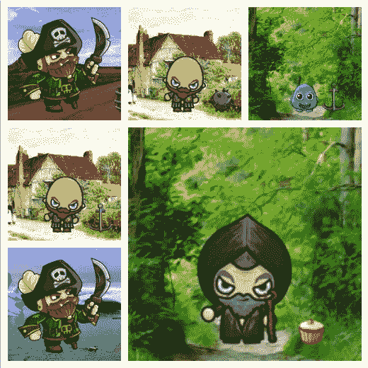

生成图像的示例。(沙漠背景)作者[林奈·马利特](https://www.publicdomainpictures.net/es/view-image.php?image=342429&picture=autopista-de-arizona) |(乡村背景)作者[道恩·哈德森](https://www.publicdomainpictures.net/es/view-image.php?image=200702&picture=casa-de-campo) |(森林背景)作者[乔治·霍丹](https://www.publicdomainpictures.net/es/view-image.php?image=167694&picture=bosque-de-la-pintura-al-oleo) |(冰川背景)作者[艾德·罗杰斯](https://www.publicdomainpictures.net/es/view-image.php?image=282737&picture=lago-glaciar-jokulsarlon) |(人物和物体)作者[craftpix.net](https://craftpix.net/)

这篇文章的灵感来自最近发布的 NFT 艺术收藏，如 Cryptopunks、Sollamas、ON1 Force 或 Bored Ape Yacht Club。在所有这些项目中，有一些项目的图像是由艺术家创作的，而另一些项目的图像是通过算法生成的。正如我们在数据科学博客中一样，我们创建图片集的有趣方式是第二种。

在这篇文章中，我们将使用 Python 创建一个随机图像的集合，这些图像之间有许多共同的特征。我们将从一些基础图像开始，我们将在其上添加元素，以配置将形成集合的最终图像。在这种情况下，我们将使用一个背景，我们将在其上放置不同类型的字符，我们将在其上添加一个对象。

最后，我们将有一个图像数据集，其中每个图像都有特定的属性。例如，一个带着油炸圈饼的沙漠海盗，或者一个带着钥匙的森林怪物。

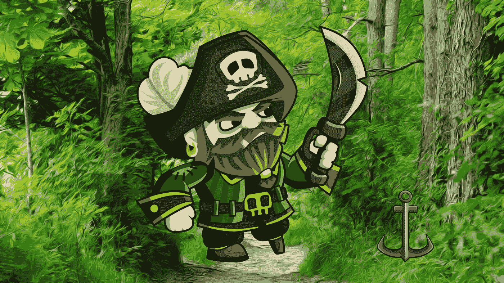

一个在森林里带着锚的海盗。(森林背景)作者[乔治·霍丹](https://www.publicdomainpictures.net/es/view-image.php?image=167694&picture=bosque-de-la-pintura-al-oleo) |(海盗兼主播)作者[craftpix.net](https://craftpix.net/)

由于目标不是创建艺术，我将把免费分发的像素艺术作为基础。我将使用这些图像作为基础来生成数百个衍生图像。作为一个有趣的练习，你可以选择一些不同的图像，创建自己完全不同的数据集。

我将使用三种类型的属性:背景、人物和物体。对于它们中的每一个，我将设置一个百分比形式的概率分布来定义每个特征的常见程度。您可以随意使用这些参数来创建不同种类的数据集。例如，一个数据集，其中 99%的图像使用一种特征，1%的图像使用另一种特征。通过做这类实验，并在此基础上建立预测模型，你可以学到很多东西。

## 属性的概率分布

为了生成文章的数据集，我将使用以下属性分布:

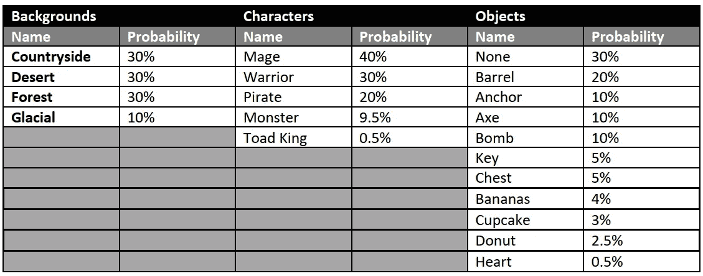

作者图片

# 让我们开始工作吧

第一步是找到将被用作基础的图像。利用各种各样的网站，我选择了一些图片作为基础。选择这些图像的主要标准是它们可以根据它们的许可进行修改和免费分发。您可以下载这个[存储库](https://github.com/albertsl/image-dataset-generator)中使用的所有图像。

一旦图像被选中，我们就可以开始编程算法图像生成器。为了生成图像，我将使用 Python 和 Pillow 库。这是生成图像的基本脚本:

```
from os import path, mkdirfrom PIL import Imageoutput_folder = "generated"if not path.exists(output_folder):mkdir(output_folder)background_file = path.join("backgrounds", "forest.png")background_image = Image.open(background_file)output_file = path.join(output_folder, "generated1.png")background_image.save(output_file)
```

首先生成“generated”文件夹来保存生成的文件。如果文件夹已经存在，我们什么也不做。我们加载一个背景，并将其保存在“生成”文件夹中。我们已经完成了第一次图像操作！现在只需要在上面添加更多的元素，直到生成最终的图像。

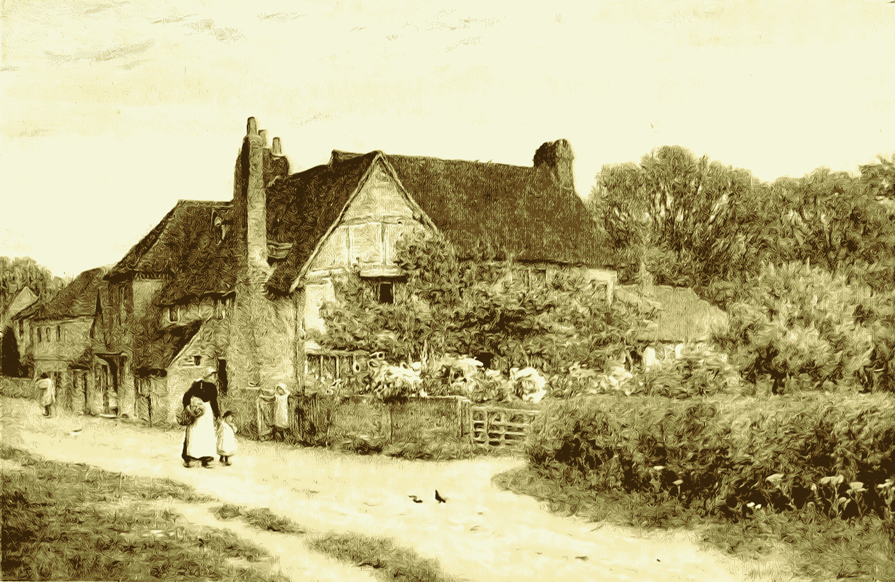

例子背景(乡村背景)由[道恩·哈德森](https://www.publicdomainpictures.net/es/view-image.php?image=200702&picture=casa-de-campo)

我们会给背景固定的尺寸，这样所有生成的图像都有相同的尺寸。为了简化工作，我把最大的背景图片缩放到和最小的一样大。我没有缩放字符，因为这个项目的目标是功能，而不是漂亮。我缩放了一些对象，因为它们明显比其他的要大，并且它们在图像之外。

所使用的背景图像在缩放后具有 1920x1078 px 的尺寸。

对字符和对象所做的唯一变换是消除边距，因为每幅图像的每一边都有不同的边距。这使得即使将它们放在相同的位置，其中一些也会比其他的更高或更靠右。

当在背景上添加人物和物体时，工作变得有点复杂。现在我们必须定义我们想要放置字符的位置以及它们应该有多大。为了定义位置，我们有几个选项:

-为所有图像定义固定位置
-为每种类型的人物/每种类型的风景定义固定位置
-随机化位置。如果我们选择后者，我们应该定义一些我们不希望图像出现的限制，我们不希望图像被放在边界上，只有一小部分被看到。

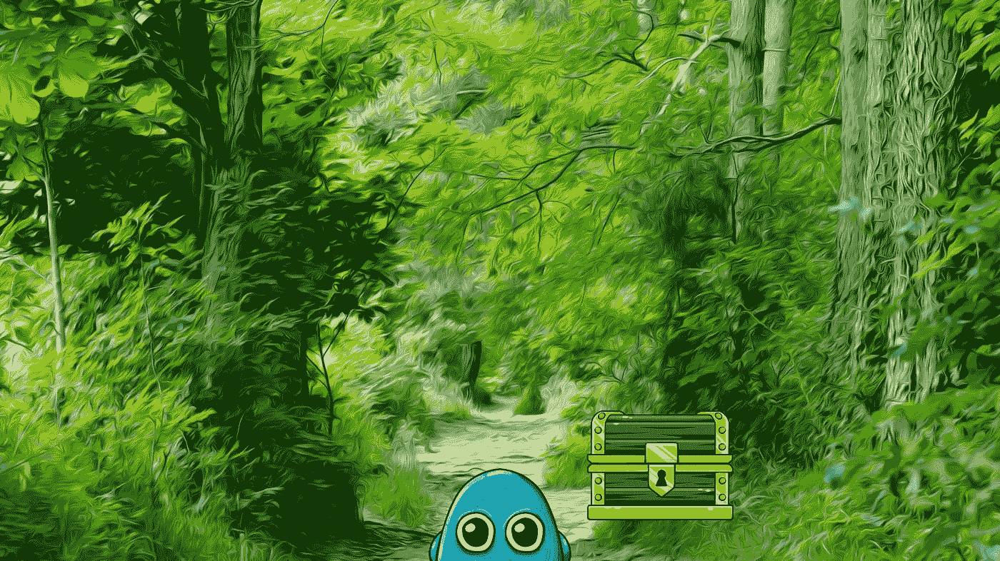

角色走了边。(森林背景)由[乔治·霍丹](https://www.publicdomainpictures.net/es/view-image.php?image=167694&picture=bosque-de-la-pintura-al-oleo) |(怪物和箱子)由[craftpix.net](https://craftpix.net/)

对于物体来说也是一样，我们必须根据角色在哪里或者在背景上的预定位置来定义放置物体的位置。对于这个数据集，我决定将对象放在字符的右边。

Pillow 使用的坐标系的原点在图像的左上角。如图所示:

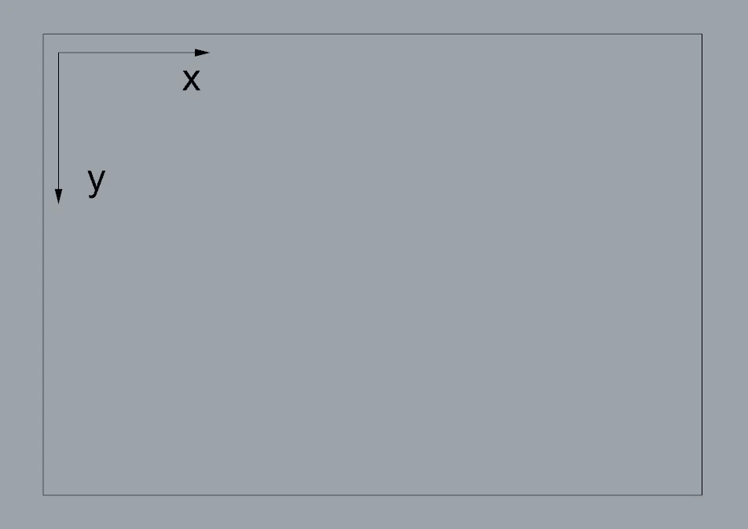

作者图片

为了简化工作，我决定将所有的角色放在背景中相同的固定位置。我将位置定义为图像底部水平居中的一个点。小矩形的尺寸， *h* 和 *w* 是字符的高度和宽度。用黑色标记的点是我们必须计算的，以告诉 Pillow 在图像中放置字符的位置。

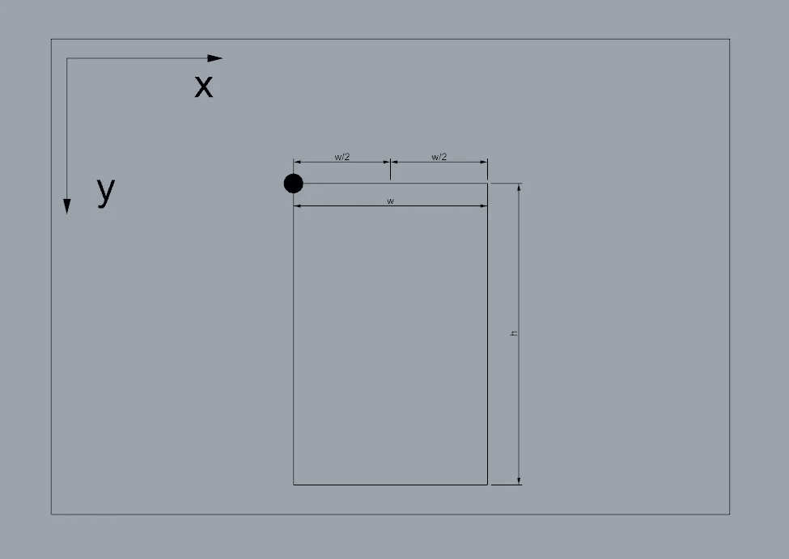

作者图片

这个点可以用下面的公式计算，其中 1920 是背景的宽度，我们除以 2 来找到中点。1000 是 1078 的近似值，以便在角色的脚和图像的底部之间留一些空白。

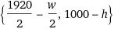

作者图片

为了将对象放置在字符的右边，我使用了一个类似的公式，在这个例子中，我添加了一个边距 *m* ，这样对象就不会碰到字符。对我来说效果很好的一个值是 30 px。注意， *h* 和 *w* 在这种情况下指的是角色的高度和宽度，而不是对象的高度和宽度，因为我们定位在角色的右侧。

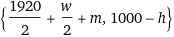

作者图片

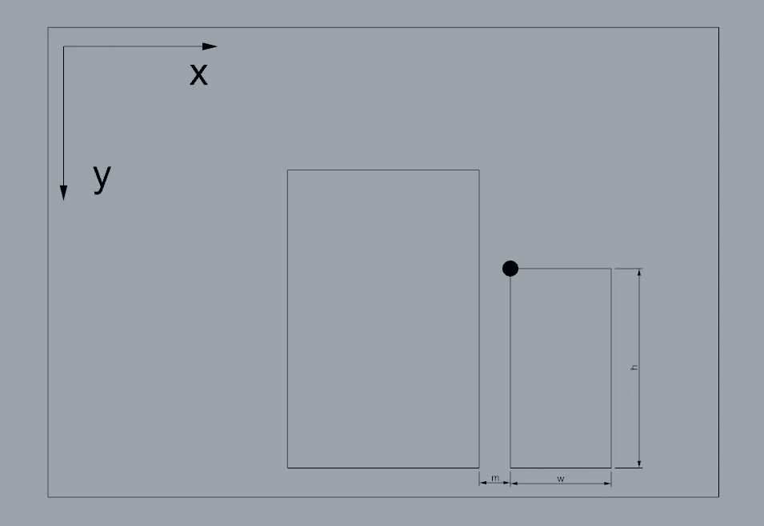

作者图片

所有这些计算转化成代码变成这样:

```
def generate_image(background, character, object, file_name): background_file = path.join("backgrounds", f"{background}.png") background_image = Image.open(background_file) #Create character character_file = path.join("characters", f"{character}.png") character_image = Image.open(character_file) coordinates = (int(1920/2-character_image.width/2), int(1000-character_image.height)) #x, y background_image.paste(character_image, coordinates, mask=character_image) #Create object if object != "none": object_file = path.join("objects", f"{object}.png") object_image = Image.open(object_file) coordinates = (int(1920/2+character_image.width/2+30), int(1000-object_image.height)) #x, y background_image.paste(object_image, coordinates, mask=object_image) output_file = path.join(output_folder, f"{file_name}.png") background_image.save(output_file)
```

# 好吧，但是…给我数据！

在我们生成图像的同时，我们还会将它们和它们的特征一起注册到数据库中。我们将使用 pandas 进行注册，并将数据保存在 CSV 文件中。

我们创建一个没有数据的 DataFrame，只命名列。每当我们生成一个图像，一个新的行将被添加到数据帧。最后，一旦生成了所有图像，CSV 将被保存。 *num* 变量是用于命名图像的顺序计数器。例如，生成的图像将被命名为*生成 1* 、*生成 2* 、*生成 2894* 、…。

保存图像文件的名称很重要，这样才能知道这些参数对应于哪个文件。

```
df = pd.DataFrame(columns = ["background", "character", "object", "generated image"])for … …. …. #Code to generate image data = [background, character, object, f"generated{num}"] s = pd.Series(data, index=df.columns) df = df.append(s, ignore_index=True)df.to_csv('data.csv', index=False)
```

## 我会得到多少图像？

您可以用一个简单的公式计算出可能的图像总数。只需将每个类别中可能的属性数量相乘即可。在我们的例子中，4 个背景* 5 个字符* 11 个对象= 220 张图像。

为了生成所有可能的图像，我们将使用这段代码。首先，我们为每个参数定义所有可能的值，然后对它们进行迭代。

```
backgrounds = ["countryside", "desert", "forest", "glacial"]characters = ["mage", "warrior", "pirate", "monster", "toadking"]objects = ["none", "barrel", "anchor", "axe", "bomb", "key", "chest", "bananas", "cupcake", "donut", "heart",]def generate_all_imgs(): num = 0 df = pd.DataFrame(columns = ["background", "character", "object", "generated image"]) for background in backgrounds: for character in characters: for object in objects: generate_image(background, character, object, f"generated{num}") data = [background, character, object, f"generated{num}"] s = pd.Series(data, index=df.columns) df = df.append(s, ignore_index=True) num += 1 df.to_csv('data.csv', index=False)
```

## 随机选择

在生成图像时，我们已经看到了如何生成所有可能的图像。在这种情况下，我们可以全部生成它们，因为它们很少，但是如果我们增加参数的数量或每个参数的可能性的数量，则可能要生成的图像的数量是巨大的。

使用这段代码，我们将生成给定数量( *total_imgs* )的图像。为了决定在每个图像中使用哪些特征，我们将求助于机会。请注意，可能会多次生成相同的图像，这在最有可能的参数的情况下是常见的(最有可能的背景，最有可能的角色和最有可能的对象，在我们的情况下，它可能是一个没有对象的森林中的法师)。

我们将使用上表中为每个属性定义的概率，并使用 Numpy 的 random.choice 函数来选择一个属性，同时考虑哪一个最有可能。

```
def generate_random_imgs(total_imgs): df = pd.DataFrame(columns = ["background", "character", "object", "generated image"]) for num in range(total_imgs): background = np.random.choice(np.arange(0,len(backgrounds)), p=[0.3, 0.3, 0.3, 0.1]) background = backgrounds[background] character = np.random.choice(np.arange(0,len(characters)), p=[0.4, 0.3, 0.2, 0.095, 0.005]) character = characters[character] object = np.random.choice(np.arange(0,len(objects)), p=[0.3, 0.2, 0.1, 0.1, 0.1, 0.05, 0.05, 0.04, 0.03, 0.025, 0.005]) object = objects[object] generate_image(background, character, object, f"generated{num}") data = [background, character, object, f"generated{num}"] s = pd.Series(data, index=df.columns) df = df.append(s, ignore_index=True) df.to_csv('data.csv', index=False)
```

注意不要使用太高的数字，因为生成过程可能需要几个小时，创建的图像可能会占用很多 GB。

# 结论

我们已经创建了一个小的基本程序来从基本图像生成合成图像的数据集。有了这个数据集，我们可以开始训练一个神经网络，根据背景的类型或根据人物的类型对图像进行分类。

有了这个脚本，我们就有了做更复杂事情的基础，我们可以给角色添加旋转，让他们有不同的大小，改变颜色等等…

您可以将此数据集生成器用作数据扩充技术的测试平台，例如，您可以创建新的图像，其中角色位于另一个位置，而不是始终相同。你可以创建角色或物体旋转的图像，等等…

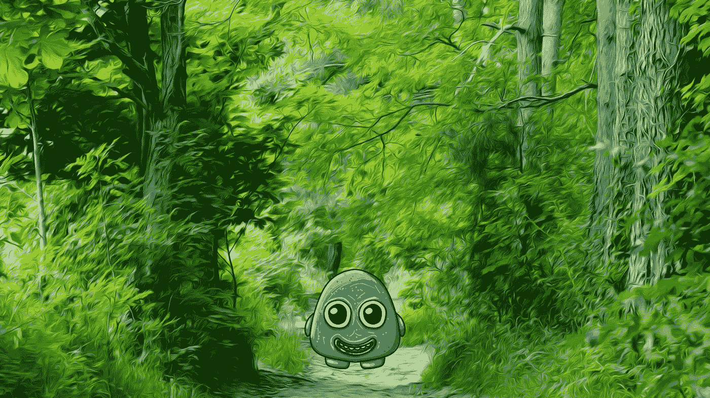

怪物说感谢阅读！(森林背景)作者[乔治·霍丹](https://www.publicdomainpictures.net/es/view-image.php?image=167694&picture=bosque-de-la-pintura-al-oleo) |(怪物)作者【craftpix.net】T2

你可以在这个 [Github 库](https://github.com/albertsl/image-dataset-generator)中找到所有的代码和原始图片。

用于创建数据集的图像不是我的，它们的原始来源是:

*   人物和物体:[https://craftpix.net/freebies/](https://craftpix.net/freebies/)
*   冰川背景:[https://www.publicdomainpictures.net/es/view-image.php?image = 282737&picture = lago-glaciar-jokulsarlon](https://www.publicdomainpictures.net/es/view-image.php?image=282737&picture=lago-glaciar-jokulsarlon)
*   沙漠背景:[https://www.publicdomainpictures.net/es/view-image.php?image=342429 &图片=亚利桑那州汽车城](https://www.publicdomainpictures.net/es/view-image.php?image=342429&picture=autopista-de-arizona)
*   农村背景:[https://www.publicdomainpictures.net/es/view-image.php?image = 200702&picture = casa-de-Campo](https://www.publicdomainpictures.net/es/view-image.php?image=200702&picture=casa-de-campo)
*   森林背景:[https://www.publicdomainpictures.net/es/view-image.php?image = 167694&picture = bosque-de-la-pintura-al-oleo](https://www.publicdomainpictures.net/es/view-image.php?image=167694&picture=bosque-de-la-pintura-al-oleo)