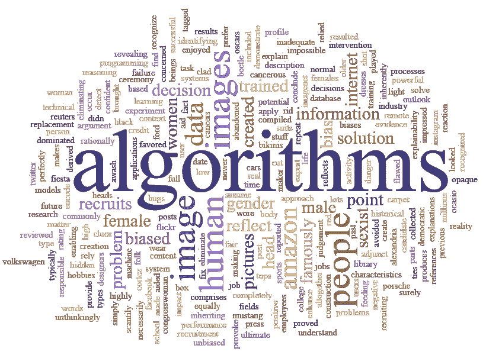

# 算法没有偏见:我们有

> 原文：<https://towardsdatascience.com/algorithms-are-not-sexist-we-are-795525769e8e?source=collection_archive---------39----------------------->

## 著名的人工智能创造了一个穿着比基尼的 AOC 的形象，它的行为是不恰当的，但却是理性的

如果你相信人工智能根据男性和女性的头像照片创造了男性和女性的形象，那么男性通常会穿西装，而女性则更喜欢低胸上衣和比基尼。

据媒体报道，这证明了人工智能的未来是性别歧视的。理由是，因为互联网上充斥着衣着暴露的女性照片，人工智能会认为这是正常的。

公平点？不一定——这项[研究](https://arxiv.org/pdf/2010.15052.pdf)的全部目的是证明从人类活动中收集的数据中继承偏见的危险。

该实验使用了 ImageNet 库，该库通常用于人工智能的训练，由数百万张不同的图像组成，标记有描述。使用这些图像，他们训练一个人工智能从某人的头部图像创建一个全身图像。在 43%的情况下，输入一个男人的头像会产生一个穿西装的男人。但是有了女人的头，53%的全身照片是穿着比基尼或低胸上衣的女人——这包括一张来自民主党国会女议员亚历山大·奥卡西奥-科尔特斯的头像照片。

显然，结果反映了图像数据库的内容。如果你要重复这个实验，但用的是奥斯卡典礼红地毯上的人的图像，人工智能肯定会得出结论，所有男人都打黑色领带，大多数女人喜欢暴露的裙子。对人工智能的任何使用都会反映这些偏见。

这告诉我们什么？这并不是说人工智能天生就有偏见，而是我们不能简单地依赖反映负责这些数据的人的偏见观点的数据。

ImageNet 和互联网都不能反映现实生活。人们在互联网上发布东西，无论是在 Flickr 上的图片，还是在脸书、Twitter、Instagram 或其他网站上的帖子，以激起人们的反应。虽然有一些人(好吧，很多人)试图产生负面影响，但在我看来，大多数人都是发布他们喜欢的东西。

> 它会认为保时捷比大众甲壳虫更像汽车

如果你训练一个人工智能从 Flickr 上的图片中识别汽车，你可能会发现它在识别福特野马方面比福特嘉年华更有信心；它会认为保时捷比大众甲壳虫更像汽车。

这是否意味着大多数汽车都是高端运动车型？不，当然不是。这种车的帖子比较多，是因为人们对它的印象比较深。

我再说一遍:互联网不能反映现实。因此，任何不加思考地基于其内容的人工智能也不会。或者，就此而言，任何由有缺陷的人(当然是我们所有人)编辑的信息。

在不同的背景下，路透社在 2018 年报道称，亚马逊已经[放弃了一个人工智能招聘系统](https://www.reuters.com/article/us-amazon-com-jobs-automation-insight/amazon-scraps-secret-ai-recruiting-tool-that-showed-bias-against-women-idUSKCN1MK08G)，因为它无法摆脱性别偏见。这种偏见来自以前招募的历史数据。情况正在好转，但在过去，技术和编程工作几乎完全由男性完成。因此，这些领域成功员工的特征之一就是他们是男性。

> 因此，当人工智能关注新的潜在雇员时，它偏爱男性

这并不是说女性不能同样出色地完成这些工作，而是她们没有在当时男性主导的行业中申请这些工作。因此，当人工智能关注新的潜在雇员时，它更青睐男性。

亚马逊解决这个问题的方法是尝试在求职申请中删除所有涉及性别的内容。但这被证明是一项不可能的任务，因为性别信息的线索可能隐藏在候选人个人资料的许多部分:他们上过的学校或大学，他们参加的运动，他们喜欢的爱好。

值得称赞的是，亚马逊认识到了这个问题，并试图解决它。如果有更多的最新信息，这种偏见或许可以避免。

因为不是说 AI 就不能不偏。检测癌症的机器学习算法是在已知是癌症的图像上训练的，因此偏差的可能性很小。不仅如此，这些图像还要由专家进行[审查，所以是人类在人工智能的帮助下，对干预是否合适做出最终判断。](https://www.bbc.com/news/health-50857759)

大概也是人类的判断导致了亚马逊招聘系统的失败。因此，使用真人作为最终决策者是解决人工智能不足的一种方法。

> 机器学习产生黑盒系统

另一个是[交代](https://royalsociety.org/-/media/policy/projects/explainable-ai/AI-and-interpretability-policy-briefing.pdf)。机器学习产生了黑盒系统，其决策过程对人类用户来说是不透明的。但是更新、更强大的系统可以为他们的决定提供解释，使用户能够理解他们的推理，或者允许他们的设计者修复任何错误。

因此，当数据是由人编制的，或者反映了不能完全公平和公正地依赖的人(换句话说，任何人)做出的历史决策时，问题就可能出现。

也许解决亚马逊问题的更好方法是编码更积极的女性数据——也许对新招聘的女性比年长的男性评价更高——而不是试图完全消除性别信息。至于男人和女人的形象建设，也许在训练前消除某些类型的形象是一个解决办法。

但也许最好的解决方案是将人工智能作为人类决策的辅助手段。也许让人工智能提高人类的表现并将其作为一种辅助手段而不是替代品更好——特别是当它能够更好地解释自己的时候。