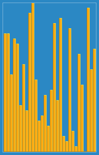

# 数据科学家的算法—插入排序

> 原文：<https://towardsdatascience.com/algorithms-for-data-scientists-insertion-sort-6caa69f906b3?source=collection_archive---------33----------------------->

## 你会学到的最简单的算法之一。


在 [Unsplash](https://unsplash.com/s/photos/coding?utm_source=unsplash&utm_medium=referral&utm_content=creditCopyText) 上拍摄的 [ThisisEngineering RAEng](https://unsplash.com/@thisisengineering?utm_source=unsplash&utm_medium=referral&utm_content=creditCopyText)

算法在计算和机器学习领域很常见。这篇文章很可能是 Medium 背后的内容推荐算法推荐给你的——一个 *ll 欢呼 Medium 算法！*

> 算法是技术的一种形式

更严重的是，算法驱动着社交媒体应用、谷歌搜索结果、银行系统以及更多。算法是技术的一种形式。最重要的是，数据科学家和机器学习实践者对分析、设计和实现标准和新颖的算法有一种直觉。

当应用于大规模计算任务时，有效的算法已经为公司节省了数百万美元，并且减少了内存和能量消耗。

这篇文章介绍了你可能遇到的最简单的算法。**插入排序**。

## 从这篇文章中可以期待什么:

*   *插入排序简介。*
*   *对插入排序算法中涉及的操作的解释。*
*   *插入排序算法在 python 中的实现*
*   *提供了关于插入排序时间复杂度的信息。*

# 插入排序说明

> 算法是一组指令，用于修改输入以产生期望的输出。

排序问题是数据科学家和其他编程学科遇到的典型编程任务。排序问题的主要任务是对一系列元素进行升序或降序排序。


照片由 [Andrik Langfield](https://unsplash.com/@andriklangfield?utm_source=unsplash&utm_medium=referral&utm_content=creditCopyText) 在 [Unsplash](https://unsplash.com/s/photos/cards?utm_source=unsplash&utm_medium=referral&utm_content=creditCopyText) 上拍摄

插入排序是排序问题的一种解决方案。通过考虑将一副牌按升序排列的方法，很容易描述插入是如何工作的。

在右边，你有一副面朝下的牌，在左边是一个初始的空白空间。第一张牌将在最初空着的左手空间，然后从右手堆中取出每张牌，与左手堆中的牌进行比较，以确定当前牌是否少于观察到的牌。

如果卡片不小于左侧被观察的卡片，则它留在当前位置。

本质上，本例中的左侧牌组始终是有序的。

下一节介绍正确插入排序的算法。一旦您对算法的工作原理有了直观的了解，后面的小节将展示插入排序算法是如何在 Python 中实现的。

# 算法描述


[插入排序 GIF](https://upload.wikimedia.org/wikipedia/commons/9/9c/Insertion-sort-example.gif) 。(该文件在[知识共享协议](https://en.wikipedia.org/wiki/en:Creative_Commons)下获得许可)

插入排序算法的工作方式类似于上面描述的一副牌的例子。该算法实际上将阵列分成左右两侧。分区左侧的元素是排序的，而右侧的元素不是。

在我们深入研究一些代码之前，下面是一个关于插入排序算法中涉及的操作的文本逐步信息，以升序对元素列表进行排序。

1.  *所有要排序的元素都放在一个列表或数组中。*
2.  从第一个元素到最后一个元素，遍历列表。
3.  *在每次迭代中，将引用的当前元素与其之前每个位置的元素(即左边的元素)进行比较。*
4.  *如果引用的元素小于前面的任何元素，它将从初始位置移动一个位置。*

# Python 中的插入排序

下面的代码使用插入排序算法将一个无序列表排序为升序。

```
A = [3, 6, 2, 7, 2, 7, 1, 6, 3]for i in range(0, len(A)):
    key = A[i]
    j = i - 1
    while j >=0 and A[j] > key:
        A[j + 1] = A[j]
        j = j - 1
    A[j + 1] = key

print(A)
>> [1, 2, 2, 3, 3, 6, 6, 7, 7]
```

1.  列表' *A'* 用无序数字序列初始化:[3，6，2，7，2，7，1，6，3]。
2.  遍历列表*‘A’*，当前迭代(key)中引用的**元素和前一个位置(j)** 的索引都保存在变量中。
3.  迭代的第一个实例(key)是 3，而(j)是-1。-1 不是列表的有效位置索引。为了确保运算中只考虑有效的索引，(j)必须大于或等于 0。
4.  还需要比较当前引用的元素(key)和前一个元素(A[j])的值。
5.  为了在当前迭代中遍历数组的左侧，使用了一个“ *while* ”循环。满足步骤 3 和 4 要求的完整 while 循环语句如下: **while j > =0 和一个【j】>键**
6.  如果满足这些条件，则保存在前一个索引(A[j])处的元素被放置在其当前位置之前一个位置，即交换到右侧。 **A[j + 1] = A[j]**
7.  变量(j)中保存的前一个元素的索引减少，表示虚拟向左移位。并且再次重复该过程，直到不再满足 while 循环条件。
8.  如果当前值(key)大于 A[j]中引用的值，那么 key 从当前值(j)向上移动一个索引位置: **A[j + 1] = key**
9.  对列表“A”中的每个元素重复整个操作，结果是一个按升序排序的列表。

# 复杂性和性能



[插入排序 Gif](https://commons.wikimedia.org/wiki/File:Insertion_sort.gif) (该文件在[知识共享](https://en.wikipedia.org/wiki/en:Creative_Commons)下获得许可)

使用[大 O 符号](https://justin.abrah.ms/computer-science/big-o-notation-explained.html)，插入排序算法的时间**复杂度为 O(n )** 。简单保留，最里面的语句执行两次(n*n)。

在列表已经按照期望的顺序排序的情况下，插入排序算法的时间复杂度为 O(n)。在这种情况下，只有一次迭代，并且没有执行内部循环中的操作。

插入排序通常适用于对小型列表或数组进行排序。然而，当面对包含更多元素的更大的列表时，有比插入排序算法更有效的算法可以使用。我将在以后的文章中探讨这些替代算法。

# 结论

插入排序是排序列表的最简单算法之一。这是一个简单的算法，可以用各种语言理解和实现。

对于一些机器学习从业者来说，回避算法的话题是典型的。算法的主题与复杂性相关联。

但就像计算和机器学习的所有学科领域一样，通过适当的资源、练习和时间，即使是最复杂的算法也很容易掌握。

*感谢阅读。*

[](/5-ways-to-provide-value-as-a-data-scientist-ce7bba57af02) [## 作为数据科学家提供价值的 5 种方式

### 机器学习实践者如何成为任何组织中不可或缺的资产。

towardsdatascience.com](/5-ways-to-provide-value-as-a-data-scientist-ce7bba57af02) [](/how-to-become-a-computer-vision-engineer-in-2021-c563545d4c9a) [## 2021 年如何成为计算机视觉工程师

### 排名第一的大规模开放式在线课程(MOOCs)

towardsdatascience.com](/how-to-become-a-computer-vision-engineer-in-2021-c563545d4c9a) 

**要联系我或找到更多类似本文的内容，请执行以下操作:**

1.  订阅我的 [**邮箱列表**](https://richmond-alake.ck.page/c8e63294ee) 获取每周简讯
2.  跟我上 [**中**](https://medium.com/@richmond.alake)
3.  通过 [**LinkedIn**](https://www.linkedin.com/in/richmondalake/) 联系我