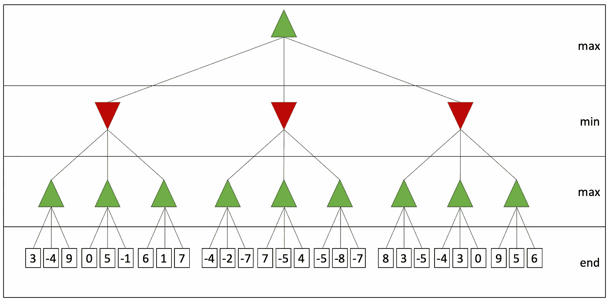
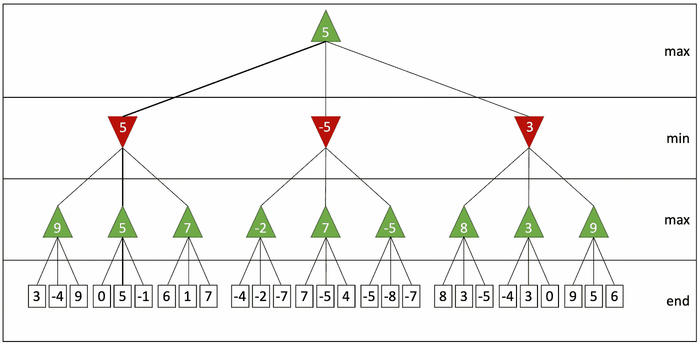
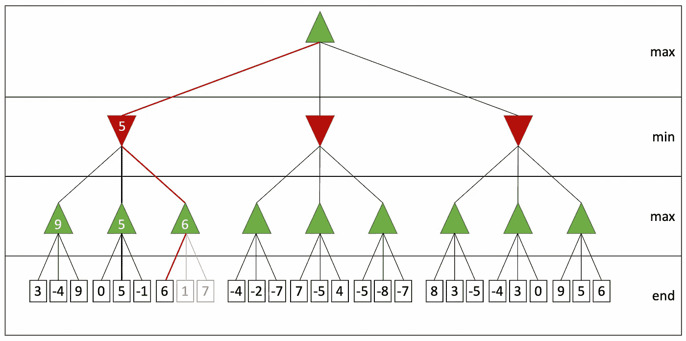
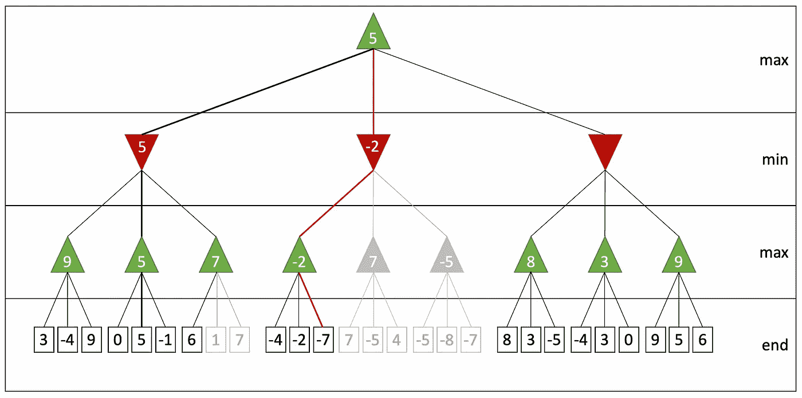
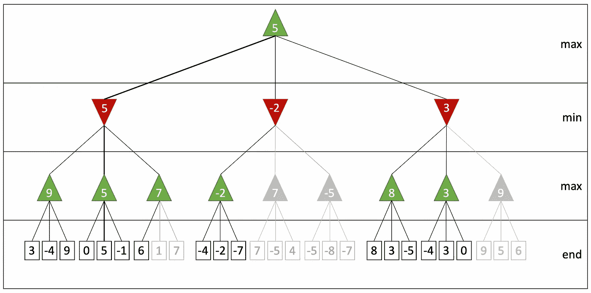

# 背景#7 中的算法:决策树和阿尔法-贝塔剪枝

> 原文：<https://towardsdatascience.com/algorithms-revisited-part-7-decision-trees-alpha-beta-pruning-9b711b6bf109?source=collection_archive---------23----------------------->

## 你的人工智能对手在机器学习之前是如何做决定的


由 [Unsplash](https://unsplash.com?utm_source=medium&utm_medium=referral) 上的 [Pietro Jeng](https://unsplash.com/@pietrozj?utm_source=medium&utm_medium=referral) 拍摄

> 1997 年，IBM 的超级计算机“深蓝”在一场国际象棋比赛中击败了世界冠军加里·卡斯帕罗夫。人工智能历史上的一个标志性时刻，的确！在这一节中，我们将看到编写人工智能算法并不像在好莱坞电影中那样有趣。

# 决策树

想想任何双人棋盘游戏:国际象棋、西洋双陆棋，无论你喜欢什么...你和你的对手轮流，你们每个人都试图达到决定性的状态，你粉碎你的对手。在任何时候，你都有一套有限的移动，在每一步，你的目标是做出最好的移动。但这是人类玩游戏的方式，机器呢？

他们使用一种叫做**决策树**的东西。我们从一个根节点开始，它象征着游戏的当前状态。我们在那一点上的每一个可能的移动都将是那个节点的子节点。然后对于每个孩子，对手都有一套新的可能的行动。该树分支直到它覆盖游戏中的每一个可能的状态，并且当它到达一个叶节点时游戏结束。

最早的人工智能算法是基于在决策树上进行**强力搜索**。搜索算法试图到达使机器获胜的任何叶节点，并做出决定，以便它能够到达这些获胜节点之一。我们现在将看到这些算法中的一个在运行。

# 极大极小算法

现在把你自己从游戏中抽象出来，假设我们已经给游戏的每一个可能的结果分配了一个分数。分数被分配给树的叶节点。正分数表示机器赢了，负分数表示你赢了。所以，人工智能的目标是最大化分数，而你的目标是最小化分数。绿色箭头表示 AI(最大化者)的回合，红色箭头表示你的(最小化者)回合。



**minimax** 算法非常简单，它是**深度优先搜索**的修改版本。人工智能(绿色)将总是选择具有最大可能结果的移动，假设它的对手(红色)将总是选择最小可能结果。明智的做法是假设你的对手打得最好，这样你就可以做好最坏的打算。现在花一点时间，跟着树从底部到顶部，看看每个对手的举动。



你可以看到这个算法通过暴力搜索了所有可能的场景。如果我们假设 **b** 是分支因子 **d** 是决策树的深度，那么算法在 **O(bᵈ)** 哪个指数上起作用。

如果你正在实现一个**井字游戏**，这可能没那么糟糕。毕竟，第一回合有 9 种可能的走法，接下来是 8 种，7 种，以此类推，总共是 9 种！场景总数。然而，如果你正在做一个**象棋**游戏，可能性的数量将会以一个疯狂的数量增长！任何计算机要计算出所有的可能性都需要数百万年的时间。

> 需要我说一定有更好的方法吗？

# 阿尔法-贝塔剪枝

Alpha-beta 修剪是消除对解决方案没有帮助的分支的策略。我将用一个例子来解释这一点。**下面树中的红线标记了我们搜索的当前状态。**最大化器(AI)选择了 9 和 5，这是相应子树上的最大可达值。此时，极小值当前保持值 5，这是 9 和 5 中较小的一个。

还有一个分支需要搜索，深度优先搜索看到的第一个值是值 6。现在我们知道无论最大化者选择什么都至少是 6。但是我们也知道 minimizer 选择了 5，已经小于 6 了。在这一点上，我们不再需要检查剩余的孩子(1 和 7 ),因为我们肯定知道最小化将选择 5。



反过来也可能是正确的:如果最大化器已经选择了一个比最小化器选择的值更大的值，我们就不需要搜索其余的子树。在下面的树中，最大化器已经在根节点选择了 5。因为-2 小于 5，并且最小化器选择的任何东西最多是-2，所以我们不再需要搜索其余的子树。



所以继续吧，把这个策略应用到你的整个搜索中，从决策树中剔除 c**p。在最右边还有最后一个子树可以删除，我把它留给你来检查为什么我们可以跳过它。阿尔法-贝塔修剪算法的最终结果应该是这样的:



我们把树修剪了不少。Alpha-beta 修剪可以提供高达原始 minimax 算法的性能的**平方根的性能优化。它也可能根本没有提供性能改进，这取决于你有多倒霉。**

# 深度受限搜索

即使 alpha-beta 修剪提供了大量的性能改进，搜索整个可能的场景集仍然是多余的。我们可以采用智能策略来避免搜索整个树，并且仍然可以得到非常好的结果。

一种这样的策略是深度受限搜索，它听起来确实如此。不是搜索整个树，而是在预先定义的有限深度内搜索。例如，您可以在国际象棋中搜索下 5 步棋。但是为了做到这一点，你需要一种确定性的方法来对游戏的当前状态进行评分，因为当你到达搜索的终点时，你不再知道谁赢得了游戏。为此，我们将使用一个评估函数。

**注意:**深度受限搜索还有其他选择，比如迭代深化，但为了保持故事简短，我不喜欢包括它们。

> 你的搜索有多深入？明白了吗？那是个玩笑…

# 评估功能

所以，你决定将你的搜索限制在你和你的对手在游戏中的下 5 步棋。然后你意识到大部分时间游戏在 5 步之后仍然继续，你现在卡在这个中间步骤。你如何把数字输入到极大极小算法中？你需要的是一个评价函数。

一个**评估函数**是一种确定性地给游戏的当前状态打分的方法。例如，如果你在下棋，评估函数可以是你和你的对手拥有的棋子数量之间的数字差。差距越大，你的机会就越大。

一个更好的评估函数可以使用加权计算，其中每个部分都有一个取决于其重要性的权重。这可能会产生比简单地计数更好的结果。更好的是，除了它们的重量之外，还可以使用棋盘上的位置。

你如何定义你的评价函数完全取决于你自己。请注意，这将是你的算法中最关键的部分。**你的评价函数有多好决定了游戏的状态，会很大程度上影响你算法的成功。当你写一个评估函数的时候，还有两件事你应该小心:**

1.  **函数应该是确定性的:**给定相同的状态，应该总是产生相同的结果。
2.  **函数应该运行得很快:**您将会对您的评估函数进行很多调用。如果它工作缓慢，那么你的人工智能就会反应缓慢。

这是深度受限的极大极小算法的伪代码:

```
int minimax(Node* current, int depth, bool isMaximizer) { if (depth == DEPTH_LIMIT || current.isLeaf()) {
        return evaluate(current);
    } if (isMaximizer) { int val = INT_MIN;
        for (Node* child : current.getChildren()) {
            val = max(val, minimax(child, depth + 1, false));
        } return val; } else { int val = INT_MAX;
        for (Node* child : current.getChildren()) {
            val = min(val, minimax(child, depth + 1, true));
        } return val;
    }
}
```

加上α-β修剪，我们得到这样的结果:

```
int minimax(..., **int alpha, int beta**) { ... if (isMaximizer) { int val = INT_MIN;
        for (Node* child : current.getChildren()) {
            val = max(val, minimax(..., **alpha, beta**));
            **alpha = max(alpha, val);
            if (alpha >= beta) {
                break;
            }
**        } return val; } else { int val = INT_MAX;
        for (Node* child : current.getChildren()) {
            val = min(val, minimax(..., **alpha, beta**));
            **beta = min(beta, val);
            if (beta <= alpha) {
                break;
            }** } return val;
    }
}
```

我还有一个改进的建议。在您的搜索中，算法很可能会一次又一次地出现相同的状态。因此，您可以使用一个**查找表**来存储结果，而不是多次运行评估函数。见鬼，你甚至可以预先计算所有可能的结果。如果你想了解这个策略，你可以阅读我之前关于[动态编程](https://medium.com/swlh/algorithms-revisited-part-2-dynamic-programming-9a645f8b11f0?source=friends_link&sk=c9b6b460d94b2072a7b36dd1249c8a46)的故事。

> 你知道好莱坞电影中那些帅气的科学家走过一个长长的大厅，发表魅力演讲，讲述他们如何取得科学突破，并能用几句话向警察局长解释吗？是啊，那不是真的。事实上，有畸形的身体，没有生命的眼睛，彼此之间有沟通问题。当然除了我…