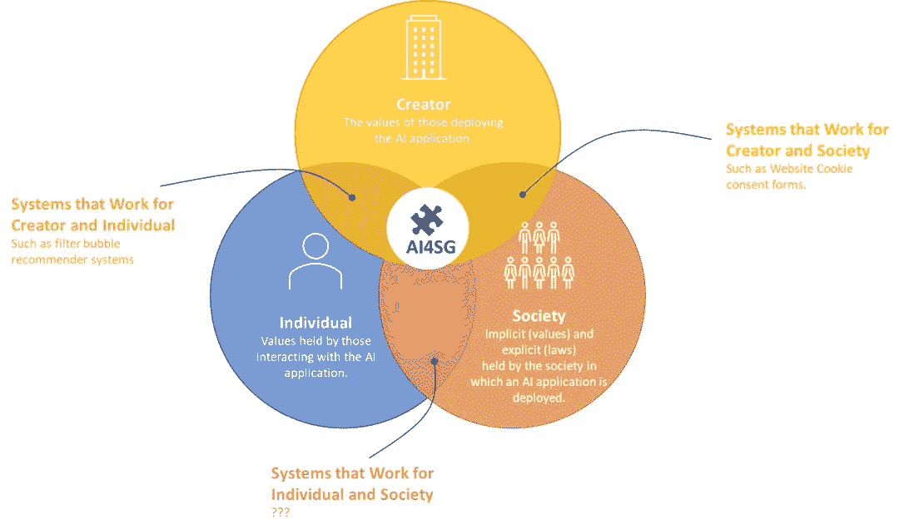

# 在人工智能应用中调整价值观

> 原文：<https://towardsdatascience.com/aligning-values-in-ai-applications-afc9b814c000?source=collection_archive---------41----------------------->

## 最成功的人工智能系统与其用户、创造者和整个社会的价值观是一致的。

人工智能(AI)无处不在。当你使用互联网或一般计算机时，你会(有时不知不觉地)与数十个使用某种形式人工智能的系统互动。当你浏览网页时，广告网络为你提供个性化的广告，你的电话纠正你的拼写，你计算机的操作系统决定哪些程序优先使用计算资源。有些系统很好，有些不太好。我相信最成功的人工智能应用程序都有三方一致的价值观。

人工智能造福社会(图片由作者提供)

1.  与系统互动的人，
2.  这个系统的创造者，
3.  所有者和参与者生活的社会。

所有的人工智能应用都或多或少地与这三组不同的价值观保持一致。我将简要阐述值集是什么，给出有不匹配的 AI 应用程序的例子，并以所有值都一致的例子结束。

# 三套价值观

# 与系统互动者的价值观

不同类型的人与人工智能系统交互，人工智能系统对他们的影响也不同。人们的理解水平和价值观各不相同。你可以肯定，与你的人工智能应用程序交互的人有一些价值观，从非常基本的价值观，比如发现能够养活自己和/或家人很重要。或者更复杂，比如发现有一个宽泛的参照系很重要。无论哪种方式，你的系统提供给他们的东西都会对他们追求价值的程度产生影响。

此外，人们可能或多或少地自愿与系统交互。他们不一定选择与一个系统互动，甚至可能没有意识地与它互动。一家银行开发了一个自动评估贷款申请的人工智能应用程序，迫使客户和员工都与它进行交互。人们可能没有意识到推荐系统会影响他们所呈现的内容，而这些内容会受到他们过去观看行为的影响。

人工智能系统可能会影响他们的价值观。贷款申请评估系统决定了人们是否会得到贷款。推荐系统影响他们接触的内容。

# 系统创造者的价值观

任何一方部署人工智能应用程序，无论出于何种原因，无论是服务于他们的客户群还是改善内部流程，都是基于一套价值观。这些可能非常琐碎，比如增加收入或降低成本。他们可能更无私，比如不浪费资源。或者，它们甚至可能是非常规范的，例如促进改善生活质量的健康生活方式。人工智能应用程序的目标是使部署系统的一方达到来自其价值观的目标。特别是对于推荐系统，[对同时追求多个目标的系统的研究已经开始](https://recsys.acm.org/recsys21/mors/)。一个系统可以增加人们观看或购买的视频数量，同时提供一个多样化的、广泛的参考框架。

# 部署应用程序的社会的价值观

现在，部署系统的一方和与系统互动的个人都是社会的一部分。这可能是国家层面的，但越来越多的是在全球社会中。现在一个社会也有价值观。法律和立法捕捉或正式化了这些价值观的一部分，而其他的价值观则稍微含蓄一些。例如，荷兰法律规定了广告商可以和不可以宣称什么来保护荷兰人免受欺骗。荷兰政府监察机构 Reclame Code Commissie 对此进行控制。另一方面，道德行为准则规定记者或编辑委员会在报道时应如何提供信息。虽然不符合他们的道德准则，但没有法律阻止他们不遵守这一准则。

# 使配合不当

有很多人工智能不成功的例子，因为不是所有的价值观都是一致的。上图提供了值之间只有部分匹配的 AI 应用程序的示例。

**为创造者和个人服务的系统。**

推荐系统是人工智能应用的例子，它符合个人和部署方的价值观。就我个人而言，我对 YouTube 和它为我创造的漂亮的循环过滤泡泡非常满意。我可以无休止地观看高度相关和令人愉快的骑行视频，完全符合我的个人喜好。我看视频，YouTube 可以给我看广告。双赢！然而，从社会的角度来看，我把所有的时间都花在看骑行视频上是不理想的，因为我也可以看新闻或其他话题，让自己得到更多的发展。如果我把时间花在看别的东西上，社会和我自己不会受益吗？

**为造物主和社会服务的系统。**

也有符合部署方及社会价值观的应用。虽然不是严格意义上的人工智能应用，但几年来，所有网站(应该)都要求我们同意通过 cookies 跟踪我们的行为。这完全符合部署方的价值观:他们没有支付罚款的风险，他们被允许使用我们的数据。这也符合我们的社会价值观:每个社会成员都拥有自己数据的所有权。但这符合我们作为公民的价值观吗？我们想拥有这种所有权吗？我们想被迫同意或拒绝同意吗？我个人重视毫不费力地浏览互联网，我不喜欢点击这种对我隐私的额外控制。法律的实施根本不能满足这一要求。

为社会和个人服务的系统。

我真的想不出这样的例子，这有什么意义，因为什么样的政党/组织会部署一个符合社会和个人，但不符合其自身价值观的系统？如果我们稍微搜索一下，可能会有一些例子，但我想这些例子不会存在很长时间，因为在某个时候部署方会拔掉这些例子的插头。

# 当所有三组值对齐时

在我读博士期间，我们也试图达到一致。在我们关于推荐系统中的[选择过载的工作中](https://dl.acm.org/doi/abs/10.1145/1864708.1864724)，我们设计并测试了一个多样化算法来降低选择难度。当我们向用户提供一系列建议时，我们迫使他们做出决定。这个决定可能更容易，也可能更困难。我们的目标是创建易于选择的推荐列表，同时保持或提高满意度。通过大量研究，我们展示了增加推荐集多样性的效果，同时保持预测的相关性不变。这个想法是用户应该有满意的结果，但是从中选择不应该花费不必要的选择难度。然而，我们确实忽略了社会价值观。

一些系统将所有三组值对齐。这些系统的一个名字是 AI for Social Good (AI4SG ),这个运动正在通过[学术研讨会](https://amulyayadav.github.io/AI4SG2021/)、期刊、平台、LinkedIn 团体、博客获得越来越多的动力。也许并不奇怪，大多数 NGO 都在积极开发 AI4SG，例如通过[使用机器学习来打击偷猎](https://silverpond.com.au/wp-content/uploads/2019/09/WPS-Casestudy-Highlighter-web.pdf)。

那么，我们应该以什么为目标，又该如何实现呢？我不完全确定，但我 100%确信，无论我们在人工智能领域做什么，我们都必须开始沿着这三套价值观评估我们的举措。你有一个能让公司收入增加 20%的主意？酷！现在，去看看这个倡议与那些将与你的系统互动的人是如何一致的，以及社会将如何看待你的想法。你能确定你的想法会导致的结果符合你自己的价值观，与它互动的人的价值观，以及你将部署你的系统的社会所持有的价值观吗？那就去争取吧！否则，细化修改。我个人将确保我在 Obvion 的数据科学团队将对所有人工智能计划进行这些评估。我认为永远不出现任何不匹配是不现实的，但至少我们可以将任何无意识、无意的不匹配的可能性降至最低。

# 在实践中调整价值观

在我目前的角色中，我们正在创造人工智能。在早先的一篇文章中，我描述了我将如何尝试以一种对价值敏感的方式来做这件事，通过开发和部署人工智能，同时沿着两条轴线前进。我们成长的第一个方向是决策支持与自动化。我们将从为决策提供信息的模型开始，而不是自动决策。经理们最初可以使用预测贷款申请数量的模型来确保有足够的员工来处理这些申请。这种型号以后可以自动增加或减少容量。然而，这只有在经历了如何使用预测之后才会发生。其次，我们将从影响我们内部流程和利益相关者的人工智能开始，然后向外发展，到影响顾问和客户的人工智能。这也是为了确保我们可以实际检查我们的努力在多大程度上符合那些受我们人工智能影响的人的价值观。

*原载于 2021 年 9 月 27 日*[*【https://markgraus.net】*](https://markgraus.net/aligning-values-in-ai-applications/)*。*