# 提高不平衡机器学习分类器的性能

> 原文：<https://towardsdatascience.com/all-about-imbalanced-machine-learning-classifiers-60563014d2b3?source=collection_archive---------13----------------------->

## 机器学习。数据科学。PYTHON。

## 处理不平衡数据集的综合指南

# **简介**

作为一名菜鸟数据科学家，我犯的一个错误是高度重视准确性指标。现在，这并不是要否定准确性作为机器学习(ML)性能衡量标准的重要性。在某些模型中，我们的目标是具有高精度。毕竟，这个指标是高管和商业领袖最了解的。

但是，让我给你一个现实生活中的场景，当这样的指标可能会误导:

*“你在一家成功的金融科技公司工作。你的老板给你一个识别欺诈性金融交易的模型。*

*用你的分类算法知识武装起来，你设计并实现了一个返回高达 98%准确率的算法。你的推销很成功，管理层对你这么快就想出这个模型印象深刻。*

*为了确保万无一失，他们希望你用真实世界的数据来尝试一下(实际上这是一个很常见的请求):一个用于欺诈性交易，一个用于非欺诈性交易，* ***都来自你的训练数据集*** *。令您惊讶的是:对于这两种情况，您的分类器都返回了* ***【非欺诈】*** *。这是怎么发生的？*

*您进行了调查，并了解到您使用的训练数据集包含 98%的非欺诈性交易和 2%的欺诈性交易(顺便说一句，这应该在探索性数据分析部分完成)”*

直观地说，事情是这样的:因为数据集严重不平衡，而你的评分标准是“准确性”，它知道通过总是返回“非欺诈性”，它将总是有 98%的机会获得正确答案。


照片由 [Alex Block](https://unsplash.com/@alexblock?utm_source=medium&utm_medium=referral) 在 [Unsplash](https://unsplash.com?utm_source=medium&utm_medium=referral) 上拍摄

在分类机器学习(ML)模型的上下文中，不平衡数据集指的是数据不均匀分布在它所具有的类中的数据集。例如，在两个类的分类模型中，平衡数据集是指每个类在训练数据集中有五十(50%)个观察值。其他任何比例都是不平衡的。

在上面的示例中，我们称之为严重不平衡，因为与其他类(也称为多数类)相比，属于其他类(我们称之为少数类)的数据集比例非常小。

像我们例子中这样的不平衡数据集比你想象的更常见，也更重要。由于大多数数据科学家可能会在工作中处理它们，让我们概述一下我们可以做些什么来提高我们的不平衡数据集模型的性能。

对于下面的文章，我们将有一个直观的和理论的(数学讨论)，我们将讨论一些代码。我们将以这种方式组织它，这样读者可以直接跳到他们最感兴趣的部分。

# **概要**

为了让读者有机会跳到相关部分，下面是本文的大纲。

1.  关于“原始”分类器方法的统计解释和直觉
2.  适当的补救措施

对于适当的补救措施:我们将讨论以下内容

1.  使用适当的指标
2.  设定一个新的门槛:如何选择合适的门槛？
3.  收集更多数据
4.  扩充数据集和欠采样
5.  重新思考模型的特征
6.  方法(集合方法)

## 朴素分类器的统计理解

为了我们讨论的目的，让我们把我们在介绍中开发的分类器称为“简单分类器”。朴素分类器(与*朴素贝叶斯分类器*不同)之所以被称为朴素分类器，是因为它在产生或标记输出时过分简化了假设。

这方面的一个例子是总是预测多数类的分类器或总是预测少数类的分类器。另一种是从一组输出中随机猜测的分类器。

在上面的例子中，由于分类器总是输出多数类，所以这是一个简单分类器的例子。

我们直观地注意到，**通过将准确性设置为性能度量，**模型了解到通过总是返回多数类，它可以提供高准确性。

但是让我们试着用统计数据来理解为什么模型会有这样的反应。(*这个借用了本* [*帖*](/handling-imbalanced-datasets-in-machine-learning-7a0e84220f28) *中的理论解释。*)

## **编码—信用评分数据集**

让我们使用哈佛大学的信用评分数据，这样我们就可以有一个具体的例子。

在使用的一个数据集中，我们分析了违约和非违约借款人的贷款金额分布。多数类属于非默认值(默认值== 0)，少数类属于默认值(默认值== 1)。

让我们保持简单，只观察一维密度，因为直觉适用于更高维度。

```
#Individual Densities
fig,ax = plt.subplots(figsize=(10,12))
sns.kdeplot(df4[df4.default == 0]['total_inst_due'], color='#966fd6', linestyle="--")
sns.kdeplot(df4[df4.default == 1]['total_inst_due'],c='#900603', linestyle="--")fig.legend(labels=['p(x given Default == 0)p(Default == 0)','p(x given Default == 1)p(Default == 1)'])
plt.savefig("Individual Density.png")
```

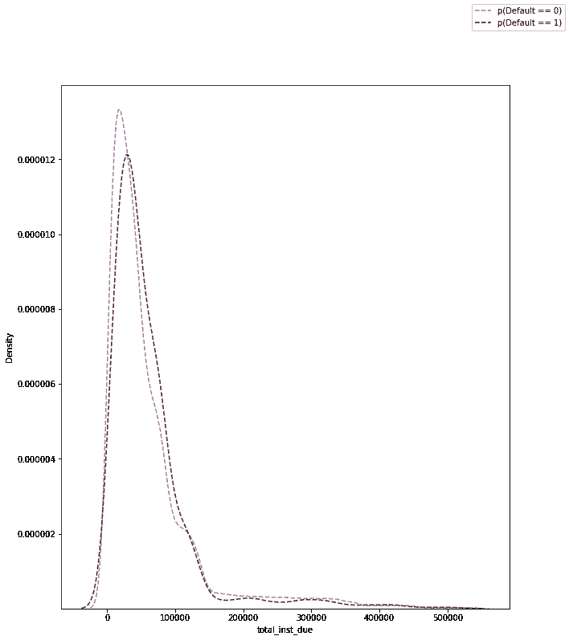

违约与非违约的独立概率。(又名边际密度)。

从上图中，我们可以看到，就贷款金额而言，客户违约或未违约的概率遵循几乎相同的分布。

这将是有意义的，因为违约和非违约借款人都经历了相同的筛选过程，从这一逻辑出发，可以认为他们属于同质群体。这可能是也可能不是，取决于数据集和所讨论的变量。

但是，假设我们想要查看分类器输入特定类的概率，例如，它将为给定数据集输出“非默认”的概率。

为了解决这个问题，我们求助于贝叶斯定理中的全概率法则，并使用它们的联合密度来可视化这些类:

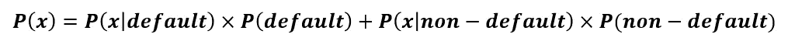

贝叶斯定理中的全概率定律应用于我们的例子。

如果我们考虑比例(也称为联合概率密度)并将其可视化，我们会得到以下结果:

```
#Joint-Densities
fig,ax = plt.subplots(figsize=(10,12))
sns.kdeplot(data = df4, x ='total_inst_due', hue='default',alpha =0.1, shade=True, legend=False)
fig.legend(labels=['p(Default == 0)','p(Default == 1)'])
plt.savefig("Joint-Density Plots.png")
```

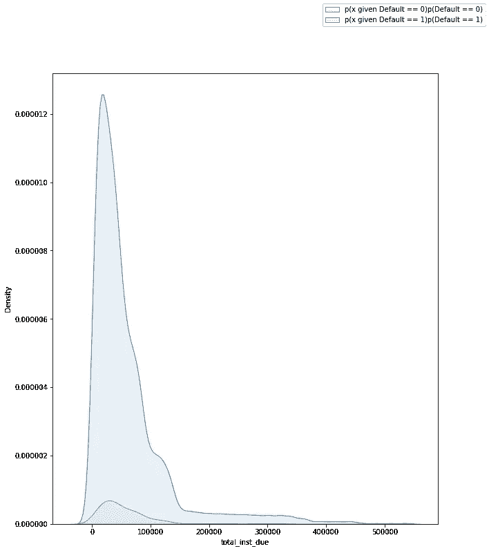

联合密度图。

基于上面的密度图，我们看到，对于变量 x 的所有实例，属于多数类(非违约借款人)的图高于少数类的图。

这意味着:

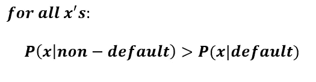

简单来说，假设借款人没有违约，x 发生的概率总是大于借款人违约的概率。

因此，对于基于概率做出输出决策的分类器来说，总是预测多数类是很有意义的。

下图综合了上述所有图，便于参考:

```
#Combined Density Plots
fig,ax = plt.subplots(figsize=(10,12))
sns.kdeplot(df4[df4.default == 0]['total_inst_due'], color='#966fd6', linestyle="--")
sns.kdeplot(df4[df4.default == 1]['total_inst_due'],c='#900603', linestyle="--")
sns.kdeplot(data = df4, x ='total_inst_due', hue='default',alpha =0.1, shade=True, legend=False)fig.legend(labels=['p(x given Default == 0)p(Default == 0)','p(x given Default == 1)p(Default == 1)','p(Default == 0)','p(Default == 1)'])
plt.show()
```

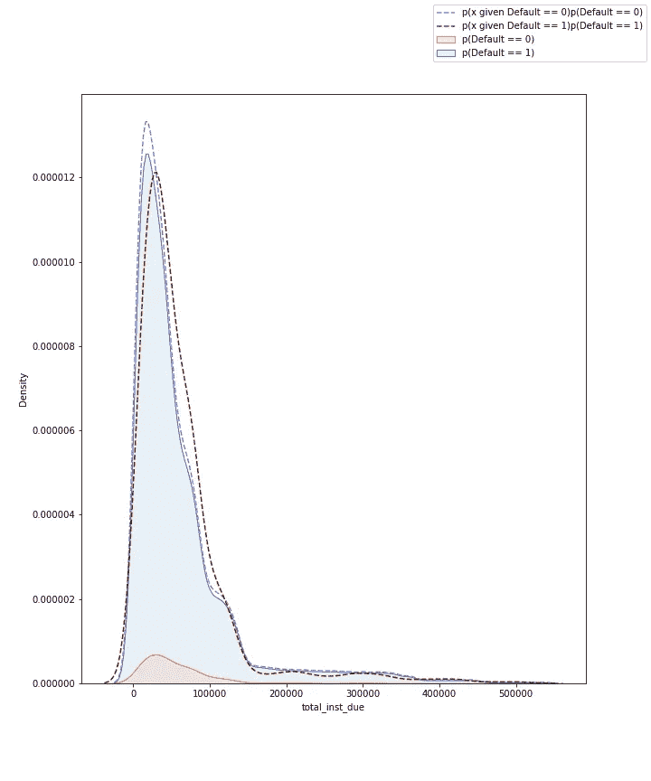

便于参考的组合密度图。

## **如果各个阶层的人口差异很大怎么办？**

假设类的个体密度显著不同。也就是说，不像在我们的信用决策数据集中，绘制它们显示人口有最小的重叠。

为了形象化这一点，让我们使用 seaborn 的虹膜数据集。

```
iris = sns.load_dataset('iris')
```

假设我们关心的是开发一个只能分类两个物种的分类器: *setosa* 和 *versicolor* ，并且我们的数据集是不平衡的。

要查看单个(边缘)密度:

```
fig,ax = plt.subplots(figsize=(10,10))
sns.kdeplot(data = iris[iris.species.isin(['setosa', 'versicolor'])], 
            x ='petal_length', hue='species',alpha =0.1, shade=True, legend=False)#legend labels follow the order of plots according to the codes executed
fig.legend(labels=['P(species = setosa)', 'P(species = versicolor)'])plt.savefig("Iris.png")
```

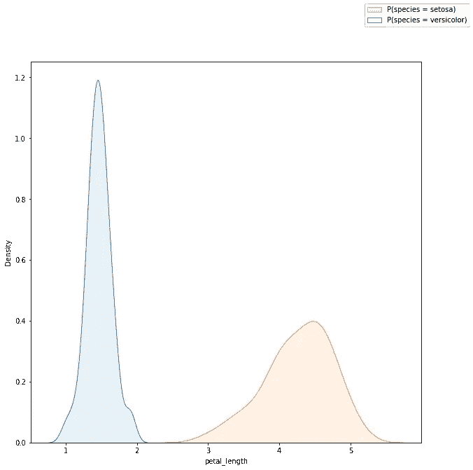

一维——两个类别的个体密度:Setosa 和 Versicolor

因为个体密度彼此显著不同，我们将开发的分类器模型，即使它们不平衡，也不一定只预测多数类。

## **使用适当的指标**

评估分类器性能的最常用方法之一是使用混淆矩阵。简单地说，混淆矩阵告诉我们，我们的模型在预测和识别数据集中的类时表现如何。从混淆矩阵中，我们可以推导出我们可以使用的多个度量标准。

为了便于理解，让我们定义将在公式中使用的因子。

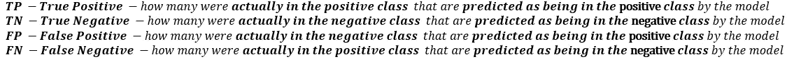

将在指标公式中使用的变量的定义。在某些材料中，正类和负类被概括为 1 类和 2 类。

为了容易记住公式，只需知道第一个词(对或错)指的是预测的正确性，第二个词是预测的内容。

因此，混淆矩阵可以被形象化为:

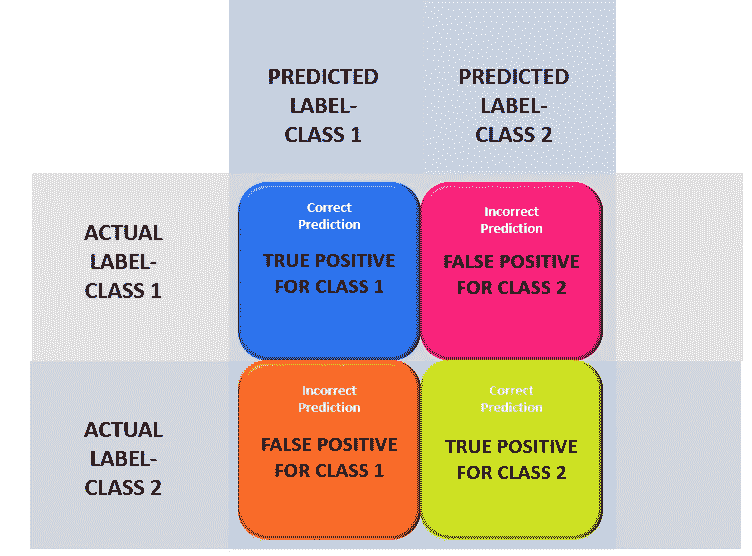

我们使用 1 类和 2 类作为一般术语，但也可以称为“积极与消极类”，在我们的情况下，“多数与少数”类。

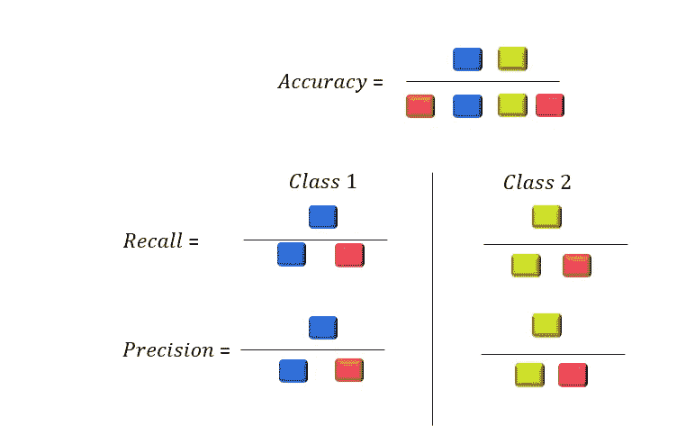

使用彩色块的分类度量。为了容易记住这一点，要知道对于任何类的精度和召回率，分子总是该类的“真正值”。现在对于分母，我通常认为对于“精度”，分母以字母“P”开始，因此是“类的预测”。(精确度听起来也更接近预测)。因此，通过排除过程，回忆在分母中具有该类别的“实际”。

回想一下，准确性告诉我们我们的模型获得了多少正确的预测。所以，通过正确，我们需要所有开头带“真”字的都是分子。

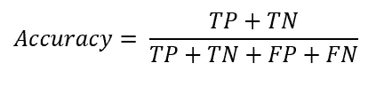

在这种情况下，我们使用“积极的”和“消极的”，但它们可以被称为“多数”对“少数”或更一般的“1 类”和“2 类”。注意，这里的分母只是预测的总数(N)。

所以这对于不平衡的类来说不理想的一个原因是，分子总是有一个高的 TP。

为了形象化，让我们试着为我们的信用决策示例编码并绘制一个混淆矩阵:

```
#Plotting for the ANN model
plot_confusion_matrix(mlp, X_test, y_test)  
plt.show()
```

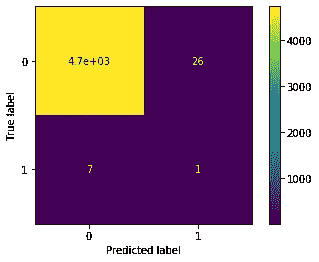

信用决策分类器(ANN)的混淆矩阵

对于不平衡的二元分类器，我们上面的图是典型的，其中多数类的 TP 非常高，但少数类的 TP(或一些参考的假阴性)非常低。

请注意，scikit 和大多数机器学习包根据字母数字意义上哪个先出现来排列标签。由于我们期望的输出由“0”和“1”组成，分别代表“非违约借款人”和“违约借款人”，因此我们在混淆矩阵的左上角使用数字“0”作为其第一个元素。这恰好也是多数阶级。然而，如果我们翻转标签，请注意多数类的 TP 现在将显示在右下角。

***精确和召回***

对于不平衡的二元分类器，多数类的*精度*和*召回率(又名灵敏度或真阳性率(TPR))* 将总是高的。正如我们在上面所看到的，多数阶级的 TP 往往很高。

仅在分母上*精度*和*召回*不同，其中精度具有该类别的预测总数，而召回具有该类别的观察总数。

精确度和召回率告诉我们模型的不同方面。 *Precision* 告诉我们模型在预测特定类别时的预测可靠性，而 *recall* 告诉我们模型识别特定类别的能力。理想的分类器应该同时具有高召回率和高精确度。

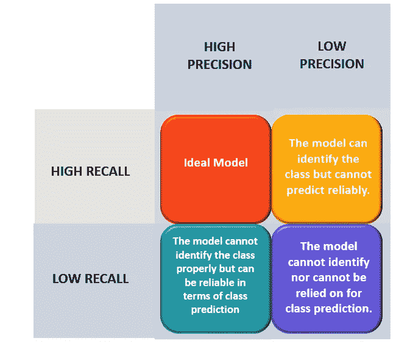

对此的解释借用了这个[的帖子](/handling-imbalanced-datasets-in-machine-learning-7a0e84220f28)。

为了创建一个表来提供每个类的精度和召回分数，让我们使用下面的代码。

```
labels = [0,1] #For a binary model, we use 0,1 but this can extend to multi-label classifiers
metrics =['precision', 'recall']def imbalance_classifier_metrics(labels, metrics, y_test, y_pred):
    summary = pd.DataFrame(columns=[i for i in metrics])
    summary.index.name = 'classes'for i in labels:
        precision = precision_score(y_test, y_pred, pos_label=i)
        recall = recall_score(y_test, y_pred, pos_label=i)
        summary.loc[len(summary)] = [precision, recall]
    return summaryimbalance_classifier_metrics(labels, metrics, y_test, y_pred)
```

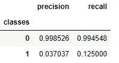

以上函数的结果

如前所述，多数类的准确率和召回率都很高。我们理想地想要一个分类器，它能给我们一个少数类可接受的分数。让我们稍后讨论我们可以做些什么来改善这一点。

请注意，在一些

***F1——得分***

F1 分数，或者有些人可能称之为 F 分数，是精确度和召回率的加权调和平均值。

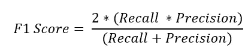

作为调和平均值，该度量惩罚精度和召回的极值。以高召回率(比如 0.95)和低召回率(比如 0)为例。).使用上面的公式，整个事情变成 0，表明该模型根本没有用。

请注意，F1 衡量标准对精确度和召回率赋予了相同的权重，但也可能对这些衡量标准赋予不同的权重。调和平均值在 F1 测量中的应用是最受欢迎的。

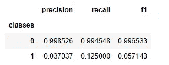

我们上面的函数的结果，包括 f1 分数

## **ROC 和 AUC**

ROC 曲线同样有助于开发我们的分类器。然而，根据我的经验，我在细化部分使用它。

ROC 曲线代表受试者工作特性曲线。它是我们改变阈值时分类器如何执行的图形表示。

通常，二元分类器使用 50%作为默认阈值。这意味着为了将一个对象分类为属于某一类，该对象属于该类的概率应该大于 50%。

统计数据显示:

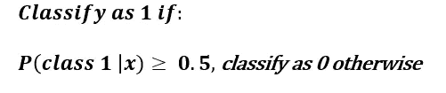

如果对象属于一个类别的条件概率大于或等于 50%，则该对象被分类为属于该类别。

然而，对于不平衡的数据集，默认阈值不起作用。更多细节请参考上面的统计解释。

然而，如果我们调整阈值 T，我们可能能够提高分类器的性能。

前面我们的分类器条件的一般形式如下:

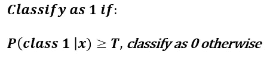

因此，ROC 曲线告诉我们，当我们改变这个阈值时，分类器性能会发生什么。

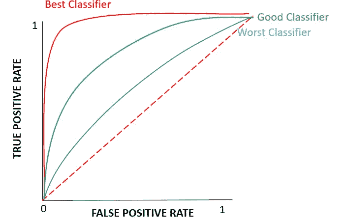

根据模型性能不同的 ROC 曲线。

在我们上面的图中，红色图被认为是最好的分类器，因为它只牺牲了一点点精度来增加回忆。如果你看看精确度的公式，假阳性越高，精确度越低。图中最差的分类器牺牲了很多精度来提高召回率。

顾名思义，AUC 或(曲线下面积)测量曲线下的面积。此指标的最低可能值为 0.5，而最高可能值为 1。AUC 的好处是，它能够在一个缩放的级别上比较模型值。

为了在我们的示例中生成 ROC 和 AUC，让我们使用我们生成的三个模型之一，即随机森林。我们需要得到输出概率而不是输出标签:

```
#For Random Forestyhat = forest.predict_proba(X_test)
#retain only the positive class probability
yhat = yhat[:,1]fpr, tpr, thresholds = roc_curve(y_test, yhat)
roc_auc = metrics.auc(fpr, tpr)#PLOT
plt.title('Receiver Operating Characteristic')
plt.plot(fpr, tpr, 'b', label = 'AUC = %0.2f' % roc_auc)
plt.legend(loc = 'lower right')
plt.plot([0, 1], [0, 1],'r--')
plt.xlim([0, 1])
plt.ylim([0, 1])
plt.ylabel('True Positive Rate')
plt.xlabel('False Positive Rate')
plt.show()
```

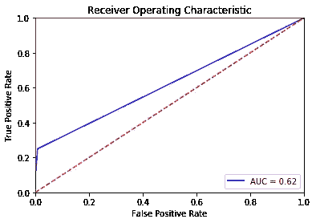

我们看到 AUC 得分为 0.62，这并不是很好，因为最低得分为 0.5。如果 AUC 分数是 0.5，这告诉我们的分类器“没有技能”。

## **如何选择合适的门槛？**

为不平衡的分类器选择正确的阈值本身就是一门科学，我们需要问自己，我们想要为此优化什么。

给出一些决策规则:

1.  **使特异性(1-FPR)和敏感性(TPR)** 之和最大化。这是直观的，因为这最大化了所有类的总正确预测。数学上:


```
T_func = (1-fpr) + tpr
ix = np.argmax(T_func)
best_thresh = thresholds[ix]
print('Best Threshold=%f' % (best_thresh))
```

2.**将敏感性和特异性之间的差异最小化。**根据希门尼斯-瓦尔夫德& Lobo (2007) **，**的研究，使用阈值导致**灵敏度和特异性之间的最小差异的分类器，**往往比使用阈值使两者之和最大化的分类器表现*稍好*。这是真的，尤其是如果犯错误和不犯错误的代价一样大的话。

3.选择哪个导致特异性和敏感性的最高**几何平均值**。其逻辑遵循第一点，我们的目标是选择一个具有高特异性和敏感性的模型。

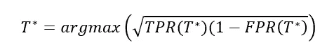

实际上，这简化成了尤登的 J 统计量:

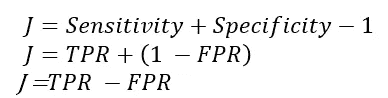

```
J = tpr - fpr
ix = np.argmax(J)
best_thresh = thresholds[ix]
print('Best Threshold=%f' % (best_thresh))
```

4.**基于成本的阈值**。

分类器算法通常使用两个假设:类是平衡的，错误的代价是相等的。因此，需要考虑类别不平衡和成本不平等，以优化使用默认假设的分类器。

根据分类器的使用情况，假阳性可能比假阴性代价更高。

举一个极端的例子，将嫌疑人归类为死刑。将一个无辜的人归类为“阳性”以判死刑(*假阳性*)，比将一个有罪的嫌疑人归类为无辜(*假阴性*)的代价要大得多。

对于这些情况，单独的研究应该指出这些成本的权重以及它们最终将如何影响阈值。

下面是一个最小化成本函数的示例:

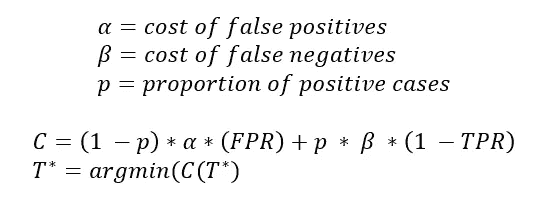

正如 W.B .兰登建议的那样。这个成本函数的好处是，它考虑了阶级不平衡和成本不平等。

```
alpha  = 1
beta = 2 #Let us assume that the cost of missing a positive case is twice as costly as incorrectly marking one as positivep = sum(y_test ==1)
p_prime = len(y_test) - p#Cost function
C = (p_prime*alpha*fpr)+(p*beta*(1-tpr))
ix = np.argmax(C)
best_thresh = thresholds[ix]
print('Best Threshold=%f' % (best_thresh))
```

选择阈值后，使用以下代码来使用阈值:

```
#Use the predict_proba method of your classifier
y_pred = (forest.predict_proba(X_test)[:,1] >= best_thresh).astype(bool)
```

## 收集更多数据

有时，尽管我们对模型进行了修改，它们仍然不能产生能够可靠地预测少数阶级的模型。

收集更多的数据是你能做的唯一最好的事情，以提高你的模型的有效性，最好是少数民族的模型。更多的数据有助于模型更好地学习该类的特征，从而提高其识别和预测该类的可靠性。

## **扩充数据集和欠采样**

虽然这是大多数数据科学家采用的一种技术，但在应用这种技术时应该小心，因为这不能代替收集更多数据。

在不平衡机器学习的上下文中，欠采样和过采样分别指删除多数类的实例和创建少数类的新实例。

**扩增和欠采样的危险在于，它改变了潜在的类别比例，这可能与现实世界中的比例不同。那么，人工比例将是你的模型所学习到的，在现实世界中进行预测时可能不合适。**

关于数据扩充的一个论点是，它可以用来使样本比例达到人口比例。例如，如果你知道人口中有 10%的少数民族，而你的样本只有 5%，那么数据扩充可能会弥补他的差距。这可能会给数据科学家一种虚假的安全感，因为数据扩充(甚至欠采样)**不会产生任何** **新信息。有可能我们刚刚完成的是改变我们的模型学习的比例，因此使它在现实世界中无效。**

出于这些目的，可以采用**分层抽样来分割训练和测试数据集，交叉验证**。这有效地考虑了训练和测试数据集中类的比例。

```
X_train, X_test, y_train, y_test = train_test_split(X,y, stratify=y)
```

我们同样可以应用不平衡学习包中的 SMOTE。SMOTE 意味着合成少数过采样技术。顾名思义，它用于对 minority 类进行重采样，以便它在数据集中具有更高的代表性。同样，数据科学家在使用这些技术时应该谨慎。

## **反思模型的特点**

有可能模型发现识别少数民族类具有挑战性，因为其分布在某些特征上与多数民族相似。但是，如果您碰巧有一个特征，其中类之间的分布差异很大，则模型可能会使用该特征来正确识别和预测。

使用 seaborn 包的 pairplot 可以帮助您快速识别这一点。如果将色调参数设置为类变量，配对图的主对角线(密度图)将告诉您是否存在多数类和少数类分布显著不同的要素。

```
sns.pairplot(df2, hue='default')
```

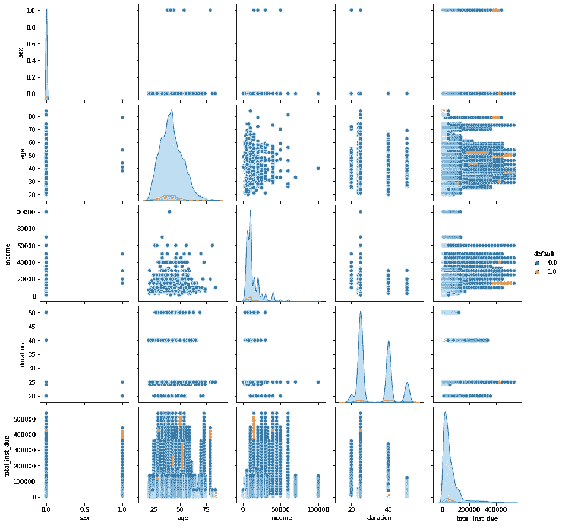

来自信用评分数据集的第二个交易数据集的 Pairplot。从最初看，似乎没有可用的特性可以帮助模型更好地学习这两个类。然而，如果我们观察“年龄”的密度，我们会发现在 X 轴的后半部分有一些分离。这意味着随着人们变老，他们更有可能违约。将此添加到模型中可能会提高模型性能。

## 集成方法

根据关于该主题的大量实验，集成方法是健壮的学习器，并且在处理不平衡数据集时比我们上面讨论的任何采样方法更有效。

集合方法的超参数需要改进，但我建议你不要使用 scikit 的内置参数，因为它是为了“准确性”而调整的。从头开始创建一个函数，并以 F1 值较高的函数为目标。

```
#Example of code to tune the learning rate:lr_list = [0.05, 0.075, 0.1, 0.25, 0.35, 0.5, 0.6, 0.75, 0.9, 1]
labels = [0,1] #For a binary model, we use 0,1 but this can extend to multi-label classifiers
metrics_to_calc =['precision', 'recall', 'f1']#we used the function above re: precision, recall, f1 scorerfor learning_rate in lr_list:
    gb_clf = GradientBoostingClassifier(n_estimators=20, learning_rate=learning_rate, max_depth=10, random_state=0)
    print("Learning rate: ", learning_rate)
    y_pred = gb_clf.fit(X_train_scaled, y_train).predict(X_test_scaled)
    display(imbalance_classifier_metrics(labels, metrics_to_calc , y_test, y_pred))
```

让我们用上面的数据集来举一个具体的例子:

```
models = {"Logistic Regression": logreg,
          "Multilayer Perceptron": mlp,
          "Random Forest": forest,
          "Gradient Boosting": gb_clf}titles = list(models.keys())#Generate the AUC plot for the models
fig, axes = plt.subplots(2,2, figsize=(12,12))
fig.suptitle("AUC for Different Models", fontsize=20)
plt.subplots_adjust(left=None, bottom=None, right=None, top=None, wspace=0.4, hspace=0.4)for i in range(4):
    #Calculate the metrics
    yhat = models[titles[i]].predict_proba(X_test_scaled)
    yhat = yhat[:,1]
    fpr, tpr, thresholds = roc_curve(y_test, yhat)
    roc_auc = metrics.auc(fpr, tpr)

    #Plo
    axes[i//2][i%2].plot(fpr, tpr, 'b', label = 'AUC = %0.2f' % roc_auc)
    axes[i//2][i%2].legend(loc = 'lower right')
    axes[i//2][i%2].plot([0, 1], [0, 1],'r--')
    axes[i//2][i%2].set_xlim([0, 1])
    axes[i//2][i%2].set_ylim([0, 1])
    axes[i//2][i%2].set_ylabel('True Positive Rate')
    axes[i//2][i%2].set_xlabel('False Positive Rate')
    axes[i//2][i%2].title.set_text("{}".format(titles[i]))
```

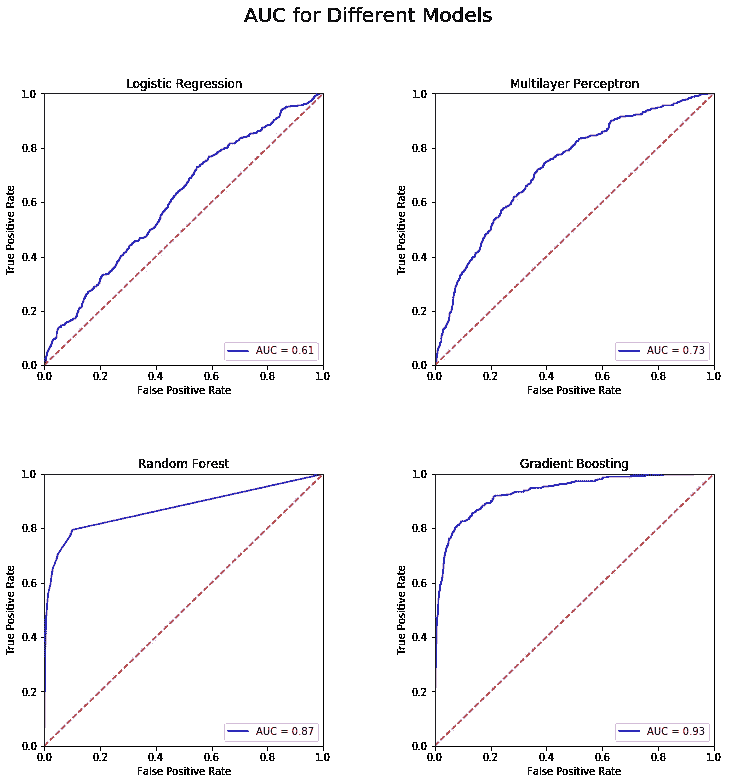

随机森林和梯度推进分类器在识别和预测少数类方面表现都非常好。回想一下，AUC 用于提供性能的标量测量，最高可能值为 1.0。对于梯度推进分类器，我们得到 0.93。

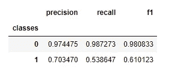

梯度推进分类器在精确度、召回率和 F1 分数方面的巨大改进。

以下是我们为提高该特定数据集的少数民族类的模型性能所做的工作:

1.  选择具有更多默认值的事务数据集(收集更多数据，df2 比 df4)
2.  反思特征:增加了“年龄”,因为分布在 x 轴的后半部分显示了潜力
3.  使用分层参数来训练和测试数据集
4.  使用超参数调整的集成方法来产生稳健的分类器
5.  可选:人们甚至可以选择结合我们在*中学习的技术来选择正确的阈值*部分。

对于更加定制的算法，您可以使用具有分裂标准的集成方法，例如[海灵格距离](https://link.springer.com/chapter/10.1007/978-3-319-06608-0_18)(例如*海灵格距离额外决策树(HeDEx)* )

# 结束语

不平衡的数据集是数据科学悖论的典型例子。一方面，虽然数据科学家处理不平衡的分类器(甚至可能比平衡的分类器更多)非常常见，但目的通常是识别*不常见的*类。

在处理这一问题时，没有一个放之四海而皆准的解决方案，虽然我们讨论了许多可能的补救措施，但人们应该注意到，处理不平衡的分类器可以早在数据收集阶段(*例如收集更多数据*)和探索性数据分析(*例如查看密度以确定应该包括的特征*)就开始了。

我们的清单虽然全面，但绝不完整。我鼓励每个人都尝试自己的补救措施，并与我们分享，这样我们所有人都能学得更好。

感谢您的阅读！

完整代码可以在[我的 Github 页面](https://github.com/francisadrianviernes/Machine-Learning/tree/master/Imbalanced%20Dataset%20Classification)找到。

# **参考文献**

[处理机器学习中的不平衡数据集](/handling-imbalanced-datasets-in-machine-learning-7a0e84220f28)

[针对不平衡分类的阈值移动简介](https://machinelearningmastery.com/threshold-moving-for-imbalanced-classification/)

[混淆矩阵](https://www.python-course.eu/confusion_matrix.php)

[如何使用概率开发和评估朴素分类器策略](https://machinelearningmastery.com/how-to-develop-and-evaluate-naive-classifier-strategies-using-probability/)

[准确度 vs F1 分数](https://medium.com/analytics-vidhya/accuracy-vs-f1-score-6258237beca2)

[用 SciKit 学习 Python 中的梯度增强分类器](https://stackabuse.com/gradient-boosting-classifiers-in-python-with-scikit-learn/)

[选择最佳阈值的常用方法](https://stats.stackexchange.com/questions/278964/what-are-some-common-methods-for-choosing-a-discriminating-threshold-from-an-roc)