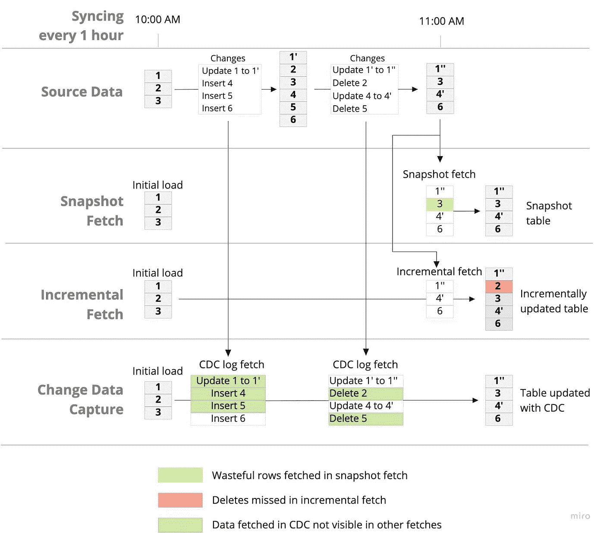
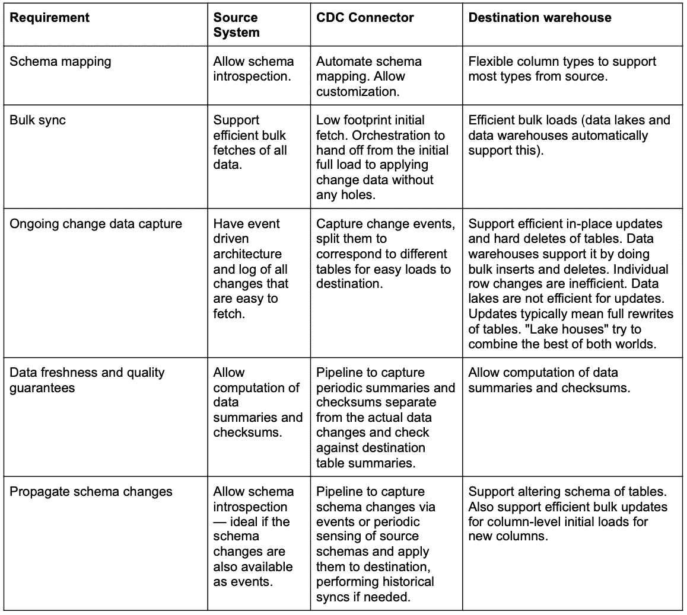
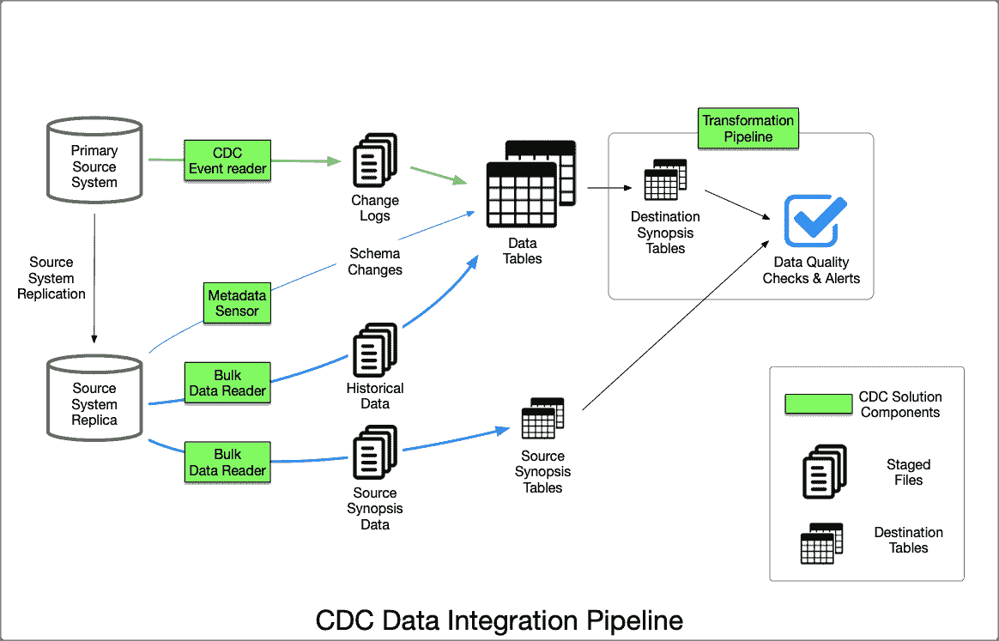
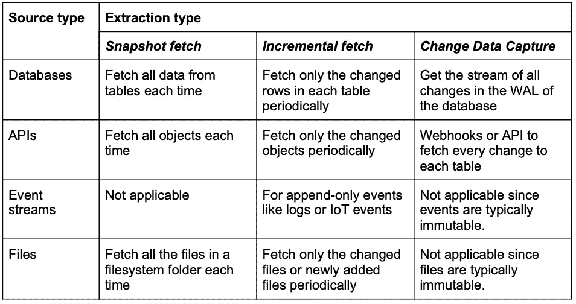

# 所有数据集成都应该使用变更数据捕获

> 原文：<https://towardsdatascience.com/all-data-integrations-should-use-change-data-capture-a1d207091773?source=collection_archive---------17----------------------->

唐纳德·詹纳蒂在 [Unsplash](https://unsplash.com/@wizwow?utm_source=unsplash&utm_medium=referral&utm_content=creditCopyText) 上的照片

数据集成已经存在了几十年，但最近出现了新的、引人注目的数据集成公司，这些公司提供云原生的、易于配置的连接器以及对高价值分析的快速访问。这些产品来自 Fivetran、Stitch Data、Matillion 和 Airbyte 等公司。任何数据团队都很难知道是坚持现有的数据堆栈还是采用这些新工具。虽然很高兴看到数据集成变得越来越主流，新方法不断涌现，**我们认为这个领域的新进入者正在创造越来越大的差距**。今天的一些更难的问题要么被忽略，要么在未来的版本中承诺，但是客户今天就需要解决方案。让我们仔细看看数据集成现在处于什么位置，以及我们认为它们在未来需要走向哪里。

TL；DR: ***所有数据集成都应构建基于日志的变更数据捕获(CDC)架构！***

# 什么促成了健壮的数据集成？

数据集成是将来自多个来源的数据汇集到一个集中的存储库(如数据仓库或数据湖)的过程。集成和连接器从这些源中批量(大部分)提取数据，并将提取的数据加载到数据仓库中，以便进一步清理和转换。然后，这些数据混合在一起，产生有意义的商业见解。

数据分析师依靠来自多个来源的集中式数据来形成这些见解。分析师的目标是通过切片和切块获得对数据的最佳[理解。当对数据如何随时间变化有一个清晰的概念时，数据是最容易理解的。但是并不是所有的](https://www.3pillarglobal.com/insights/blog-posts/understanding-data-data-science/#:~:text=The%20objectives%20of%20data%20understanding,values%2C%20inaccuracies%2C%20and%20outliers.)[数据集成都是相同的](https://www.datacoral.com/blog/making-change-data-capture-work-for-you/)，这使得[很难清楚地了解数据的变化](https://www.datacoral.com/blog/basics-change-data-capture/)。很少有集成架构能够捕获所有的数据变更，这就是为什么我们相信**变更数据捕获是数据集成的最佳设计模式**。

CDC 更胜一筹，因为它**提供了数据源**数据如何随时间变化的完整画面——我们称之为数据的**“动态叙述”。**基于日志的 CDC 提供了一种低开销、高性能的方式来捕获每一个数据更改，无论其大小如何。通过 CDC，数据集成可以以轻量级的方式提取数据变更，以低风险为生产基础架构提供高价值。

# 一个例子:获取电子商务中数据的动态叙述

让我们考虑一家电子商务公司，其用户通过将产品添加到购物车来进行购买。该公司的一名分析师正试图确定一组类似产品的受欢迎程度。为了了解为什么有些产品不太受欢迎，分析师调查了所有用户的购物车变化。记录购物车的每一次更改可以让您更深入地了解几个注意事项:

1.  用户是否经常将特定品牌的产品添加到购物车中，但并不购买它？
2.  用户是用一个品牌换另一个品牌吗？
3.  用户是否在购买前弃车？

购物车的变化提供了用户行为的动态叙述，以及对产品性能的更丰富的理解。通过访问完整的数据集，分析师可以向业务或产品团队提出更好的建议。

## 获取购物车数据

让我们看看为上面的例子获取购物车变化数据的不同方法。数据集成从源同步数据有三种方式:

1.  快照
2.  增量拉动
3.  变更数据捕获

每种数据同步机制的工作方式不同，并为数据分析师提供不同级别的支持。

## 快照:可以处理删除，但可能会浪费资源且成本高昂—数据不完整

来自数据源的表/对象的定期快照提供了数据在时间点的**高保真副本。分析快照可以让分析师了解数据随时间的变化，但可能会造成**浪费和成本**。拉快照的持续时间与数据更改量成比例增加。这可能会给数据源带来压力，危及生产工作负载的性能和可用性。**

换句话说，源位置的数据更改越多，获取快照所需的时间就越长。获取快照的时间越长，性能风险就越大。由于这些快照通常直接针对生产数据库运行，这对于客户和内部利益相关者来说可能是一个大问题。

即使一些对象/行在源中没有改变，它们仍然在快照拉取中被获取，**导致不需要的获取**。高性能应用和最新的分析需要大量的关心和关注。没有时间处理“额外”的数据、行或计算。

最后，由于快照是定期获取的，因此数据分析师看不到获取之间发生的**数据更改**。为了进行补偿，分析师会查看快照之间的变化并做出假设。更改的粒度取决于拍摄快照的频率。快照之间发生的所有购物车更改都可能丢失，并且**分析师不得不根据不完整的信息拼凑一个故事**。

## 增量读取:比快照成本低，但无法有效处理删除，而且数据不完整

在某些方面，定期增量读取比快照要好。它们**仅获取自上次拉取**以来更改过的数据，这并不像一直获取所有数据那样昂贵。但是**它们也会错过读取之间的数据更新**。

在我们的例子中，分析师仍然需要做出假设来填补数据缺口。如果用户数据每 15 分钟进行一次增量提取，并且在这 15 分钟的时间间隔内对购物车进行了多次更新，则增量提取将仅在最后一次更新应用于源之后提取购物车的最终状态。这 15 分钟间隔内的任何其他变化都不可用于分析。所以分析师可能不会看到用户购物车的每一次变化。

此外，**增量获取通常不能很好地处理硬删除。**已删除的数据不会显示在增量拉动中，因为它在源中不再存在。事实上，**快照处理硬删除更好**，因为快照获取自动包括硬删除。

## 变更数据捕获:完整数据—不折不扣！

与快照和增量获取不同， **CDC 提供了源端数据如何随时间变化的完整画面**。对于支持通过 CDC 提取数据的连接器来说，**源必须支持发布对每个数据元素**的每个更改。对于大多数来源来说，这是一个很高的要求。

幸运的是，**数据库可以为灾难恢复和高可用性**用例编写完整且健壮的变更日志。使用 CDC 的数据库连接器从这些更改日志中提取数据。变更日志的健壮性直接转移到数据集成本身。CDC 提升了数据集成的游戏级别，并提供了数据动态叙述的完整视图。

为了更好地理解 CDC 如何提供完整的数据视图，让我们看看下图。

图片由 Datacoral 提供

上图显示了对于相同的每小时数据延迟，快照、增量和 CDC 方法的行为。源表在 10:00 和 11:00 之间获得两组更改。

快照提供高保真拷贝(源表和目标表在 11:00 是相同的)，但不捕获中间更改。因此，分析师无法看到以下缺失的数据:

1.  '将 1 更新到 1 '
2.  插入 4(只有 4 '可见)
3.  插入 5
4.  删除 5

此外，即使是未更改的行(第 3 行)也会被不必要地提取。另一方面，增量读取更有效，因为它们只读取已更改的行，但是它们也面临与快照读取相同的数据丢失问题。

**CDC 显然对源数据如何随时间演变有最完整的了解。**没有浪费的行提取，所有的删除都被捕获，没有丢失任何数据更改。

你可能会问自己，**“如果 CDC 这么棒，那为什么大家都不用呢？”**这是一个很好的问题，我们有一个简单的答案:**构建和维护一个健壮的 CDC 连接器需要付出很多努力。**此外，CDC 数据集成的源系统和目标系统也应服从高效的 CDC 管道。在下一节中，我们将介绍如何构建一个鲁棒的 CDC 连接器。

# 获得强大的 CDC 数据集成需要什么？

支持 CDC 的系统应提供以下功能，以实现可靠的数据集成:

*   捕获每个数据项的所有更改，包括硬删除
*   允许自省(即提供检测哪些对象被添加、删除或编辑的方法)
*   允许快速批量提取初始加载的所有数据，也称为“[历史同步](https://www.datacoral.com/blog/performing-historical-syncs-for-database-cdc-connectors/)

三个不同的系统必须协同工作进行数据集成，以成功提供 CDC:

1.  源系统
2.  CDC 连接器
3.  目的仓库

最后，功能 CDC 连接器的要求如下:

1.  模式映射:在连接器添加过程中，在目标仓库中创建与源模式/对象相对应的表。
2.  批量同步:用于初始加载或从故障中恢复的批量提取和加载。能够预填充连接器添加过程之前存在的历史数据。
3.  持续的变更数据捕获:将所有插入、删除和更新从源传播到目的地。
4.  数据新鲜度/质量保证:围绕数据新鲜度和数据质量提供可见性和保证。
5.  传播模式更改:检测和应用模式更改，如添加新表、删除表、添加列、删除列和更新列。

在下表中，我们列出了三个不同的系统应该如何针对上面列出的功能的不同部分进行设计，以针对给定的源和目标对获得稳健的 CDC 解决方案。

图片由 Datacoral 提供

# CDC 数据集成蓝图

上图展示了为任何源系统构建健壮的 CDC 解决方案所需的端到端管道。需要将多个组件协调在一起，不仅要让数据流动，还要提供数据新鲜度和质量保证。

*   CDC 事件读取器—高效地从源系统获取更改日志，并确保源系统不会被备份。更改日志由对源中所有对象或表的更改组成，因此读者还必须将更改日志分成特定于表的更改，然后将这些更改应用到目标中相应的数据表。
*   元数据传感器—捕获源系统中的表/对象结构，并将该结构(模式)映射到目标表模式。如果源表/对象结构不断发生更改，元数据传感器还会协调将更改传播到目标表，并根据需要使用批量数据读取器执行历史同步。
*   批量数据读取器—直接从源系统获取数据(而不是只获取更改日志)。对于数据库，大容量读取器可以在源数据库上运行 SQL 查询并检索结果。SQL 查询可以用于初始历史同步，也可以用于数据质量检查的计算概要(聚合和校验和)。
*   转换管道-计算目标表上的概要，并执行实际的数据质量检查。当数据具有质量保证时，此管道可以生成事件，或者当数据质量检查失败时，可以生成警报。

在本节中，我们提供了如何构建 CDC 数据集成管道的蓝图。我们过去也曾[写过](https://www.datacoral.com/blog/basics-change-data-capture/)关于 Datacoral 如何使用我们的端到端数据管道实现来构建 CDC 连接器，该实现是用[元数据优先架构](/how-to-use-metadata-to-future-proof-your-data-stack-97c4885f97f6)构建的。

# 目前哪些源系统支持 CDC 数据集成？

用于数据集成的 CDC 有许多好处，但不是每个源系统都能提供这些好处。不同类型的数据源提供不同的数据检索功能。我们将这些来源分为以下几类:

*   数据库
*   文件系统
*   蜜蜂
*   事件流

下表总结了连接器如何使用我们讨论过的提取类型从不同类型的源中提取数据。

图片由 Datacoral 提供

如您所见，并不是所有的源系统都支持 CDC 连接器。数据库早就提供了构建 CDC 连接器所需的所有属性。**我们认为具有批量数据集成 API 的服务也应该提供变更日志**来捕获服务中每个对象的变更。基于 Webhook 的服务正在实现，但通常只提供了一部分变化。数据集成仍然需要使用其他 API 来获取 webhooks 没有覆盖的更新对象，这导致了类似于定期快照或增量获取的数据间隙。**像** [**Stripe 这样的服务在提供 CDC API**](https://stripe.com/docs/api/events) **方面处于领先地位，我们希望其他人也能效仿。**

已经有很多关于事件驱动架构如何成为未来的文章，但是在很多情况下，事件驱动架构也与实时需求相关联。我们相信事件驱动架构支持更丰富的数据分析，即使分析是通过批处理事件来完成的！

# 结论

我们很高兴看到如此多的公司进入数据集成领域。他们为众多公司带来了更多的数据分析意识。商业和技术领导者正在体验数据的动态叙事。但是快照和增量获取还不够。我们希望 CDC 无处不在，以便分析师和数据团队能够真正利用数据堆栈的力量。

快照支持硬删除和高保真数据，但它们不能捕捉完整的画面，并且存在性能风险。增量获取通常比快照更有性能，但会错过硬删除，而且也不完整。**变更数据捕获是唯一一种能够在几乎没有性能风险的情况下全面了解数据的架构**。Stripe 等公司正在提供事件驱动的 API，为其环境中的对象提供完整的更改日志。我们希望看到更多这样的情况。

**建立一个强大而高效的疾病预防控制中心渠道需要大量的努力和策略。**需要协调几个系统，必须满足功能需求，并且应该利用元数据来实现自动化模式更改检测和其他重要特性。

[在 Datacoral](http://datacoral.com/?utm_campaign=article3) ，我们使用元数据优先的数据管道为 PostgreSQL 和 MySQL 等数据库构建了 CDC 连接器。在 CDC 和其他 80 个连接器上工作过之后，我们确信 CDC 提升了数据集成的水平。没有 CDC 的数据集成仅仅提供了用于分析的数据全貌的影子。如果所有的数据源都开始支持事件 API，那么所有的数据集成最终都会变成一个软件。

如果你有兴趣了解更多，请访问我们的网站或在 hello@datacoral.co 给我们留言。