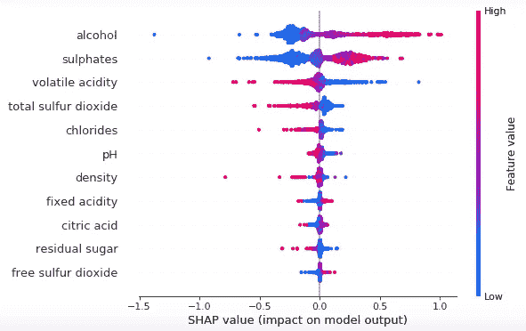
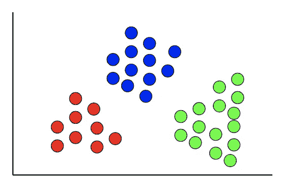
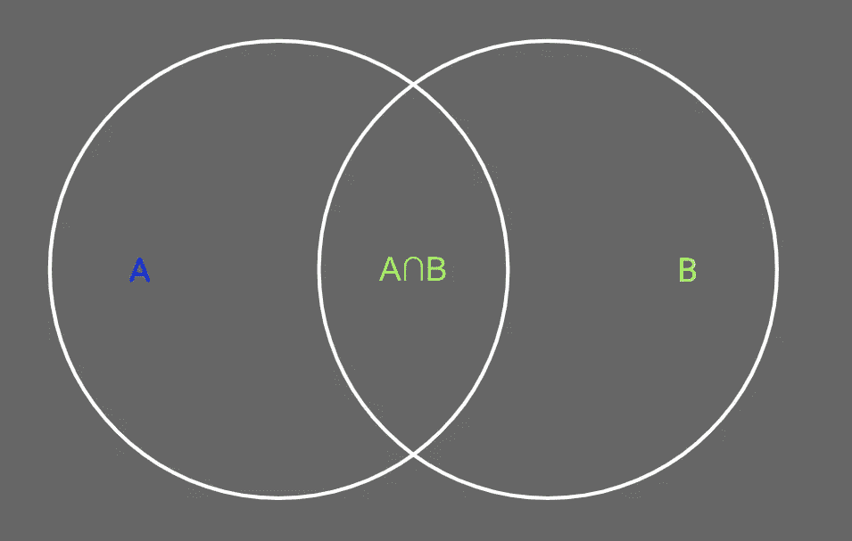

# 2022 年你应该知道的所有机器学习算法

> 原文：<https://towardsdatascience.com/all-machine-learning-algorithms-you-should-know-in-2022-db5b4ccdf32f?source=collection_archive---------1----------------------->

## 最流行的机器学习模型的直观解释

安德烈·德·森蒂斯峰在 [Unsplash](https://unsplash.com/s/photos/machine-learning?utm_source=unsplash&utm_medium=referral&utm_content=creditCopyText) 上拍摄的照片

> ***请务必*** [***订阅此处***](https://terenceshin.medium.com/membership) ***千万不要错过另一篇关于数据科学指南、诀窍和技巧、生活经验等的文章！***

去年我写了一篇名为[*2021 年你应该知道的所有机器学习算法*](/all-machine-learning-algorithms-you-should-know-in-2021-2e357dd494c7) 的文章，那么我为什么要为 2022 年再写一篇呢？在过去的一年里，有那么多新的算法出现吗？

> 嗯，没有。

但是今年，我想改变这篇文章的结构。我不想列出所有的机器学习算法，而是想提供几种**类型**的机器学习模型，以及每种类型最广泛使用的模型。

> 我为什么要这么做？

1.  **应用**。如果知识不能应用于任何事情，它实际上是无用的。通过提供模型的一般类别，你会更好地理解*你能解决什么问题*而不是*有什么模型存在*。
2.  **关联性**。事实是，并非所有的机器学习模型都是相关的。您将立即看到，像朴素贝叶斯和支持向量机这样的传统算法没有包含在本文中，原因很简单，它们被增强算法远远超过了。
3.  **消化率**。我想让这个尽可能容易消化。网上有成千上万的资源可以教你如何实现我将要谈到的模型。因此，我将更多地关注何时使用每种类型的模型。

话虽如此，让我们深入探讨 5 种最重要的机器学习模型:

1.  集成学习算法
2.  解释性算法
3.  聚类算法
4.  降维算法
5.  相似性算法

> ***如果您想测试这些 ML 算法，请查看*** [***土星云***](https://saturncloud.io/?utm_source=Medium+&utm_medium=TDS&utm_campaign=Terence+Shin&utm_term=All+Machine+Learning+Algorithms+You+Should+Know+in+2022) ***，这是一个可扩展的、灵活的数据科学平台，有免费层和企业层。***

# 1.集成学习算法(随机森林 XGBoost，LightGBM，CatBoost)

## 什么是集成学习算法？

为了理解什么是集成学习算法，你首先需要知道什么是集成学习。**集成学习**是一种同时使用多个模型来实现比单个模型本身更好的性能的方法。

从概念上讲，考虑以下类比:

作者创建的图像

想象一下，如果一个学生必须解决一个数学问题，而不是整个教室。作为一个班级，学生可以通过检查彼此的答案来合作解决问题，并一致决定一个单一的答案。另一方面，个人没有这个特权——如果他/她的答案是错的，没有其他人来验证他/她的答案。

因此，有几个学生的教室类似于一个集成学习算法，几个较小的算法一起工作来制定最终的响应。

*如果你想了解更多关于集成学习的知识，可以看看这篇文章:*

 [## 在 3 分钟内解释集成学习、打包和增强

### 直观的解释和揭开基本概念的神秘面纱

towardsdatascience.com](/ensemble-learning-bagging-and-boosting-explained-in-3-minutes-2e6d2240ae21) 

## 它们什么时候有用？

集成学习算法对于回归和分类问题或者监督学习问题是最有用的。由于其固有的性质，它们优于所有传统的机器学习算法，如朴素贝叶斯、支持向量机和决策树。

## 算法

*   [随机森林](https://www.youtube.com/watch?v=J4Wdy0Wc_xQ)
*   XGBoost
*   [LightGBM](https://medium.com/@pushkarmandot/https-medium-com-pushkarmandot-what-is-lightgbm-how-to-implement-it-how-to-fine-tune-the-parameters-60347819b7fc)
*   [CatBoost](/why-you-should-learn-catboost-now-390fb3895f76)

> ***如果您想测试您的 ML 技能，请查看*** [***【土星云】***](https://saturncloud.io/?utm_source=Youtube+&utm_medium=TDS&utm_campaign=Terence+Shin&utm_term=All+Machine+Learning+Algorithms+You+Should+Know+in+2022) ***，这是一个可扩展、灵活的数据科学平台，有免费层和企业层。***

# 2.解释性算法(线性回归、逻辑回归、SHAP、LIME)

## 什么是解释性算法？

解释性算法允许我们识别和理解与结果有统计显著关系的变量。因此，我们可以创建解释性模型来理解模型中变量之间的关系，而不是创建模型来预测响应变量的值。

从回归的角度来看，这里非常强调**具有统计意义的**变量。为什么？几乎总是，您将处理一个数据样本，它是整个总体的一个子集。为了对给定样本的总体做出任何结论，确保有足够的显著性来做出自信的假设是很重要的。

作者创建的图像

最近，还出现了两种流行的技术，SHAP 和莱姆，用于解释机器学习模型。

## 它们什么时候有用？

当您想要了解“为什么”做出决策，或者当您想要了解两个或多个变量“如何”相互关联时，解释性模型非常有用。

在实践中，解释你的机器学习模型做什么的能力与机器学习模型本身的性能一样重要。如果你不能解释*一个模型是如何工作的*，没有人会信任它，也没有人会使用它。

## 算法

基于假设检验的传统解释模型:

*   线性回归
*   逻辑回归

解释机器学习模型的算法:

*   [SHAP](/shap-explain-any-machine-learning-model-in-python-24207127cad7)
*   [石灰](/understanding-model-predictions-with-lime-a582fdff3a3b)

> ***务必*** [***订阅此处***](https://terenceshin.medium.com/membership) ***或至我的*** [***独家快讯***](https://terenceshin.substack.com/embed) ***千万不要错过另一篇关于数据科学的指南、窍门和技巧、生活经验等！***

# 3.聚类算法(k 均值、层次聚类)

作者创建的图像

## 什么是聚类算法？

聚类算法用于进行聚类分析，这是一项无监督的学习任务，涉及将数据分组为**个簇**。与目标变量已知的监督学习不同，聚类分析中没有目标变量。

## 它们什么时候有用？

当您想要发现数据中的自然模式和趋势时，聚类特别有用。在 EDA 阶段进行聚类分析以揭示更多关于数据的见解是非常常见的。

类似地，聚类允许您基于不同的变量识别一组数据中的不同段。最常见的聚类细分类型之一是用户/客户细分。

## 算法

两种最常见的聚类算法是 k-means 聚类和层次聚类，尽管还有更多算法:

*   [K-均值聚类](https://www.youtube.com/watch?v=4b5d3muPQmA)
*   [层次聚类](https://www.youtube.com/watch?v=7xHsRkOdVwo)

# 4.降维算法(PCA，LDA)

作者创建的图像

## 什么是降维算法？

降维算法是指减少数据集中输入变量(或特征变量)数量的技术。降维主要用于解决[维数灾难](https://en.wikipedia.org/wiki/Curse_of_dimensionality)，这是一种现象，即“随着维数(输入变量的数量)的增加，空间体积呈指数增长，导致数据稀疏。

## 它们什么时候有用？

降维技术在许多情况下很有用:

1.  当数据集中有数百甚至数千个要素，而您需要选择少数要素时，它们非常有用。
2.  当您的 ML 模型过度拟合数据时，它们非常有用，这意味着您需要减少输入要素的数量。

## 算法

以下是两种最常见的降维算法:

*   [主成分分析](https://www.youtube.com/watch?v=FgakZw6K1QQ&t=331s)
*   [线性判别分析](https://www.youtube.com/watch?v=azXCzI57Yfc)

# 5.相似性算法(KNN、欧几里德距离、余弦、Levenshtein、Jaro-Winkler、奇异值分解等)

作者创建的图像

## 什么是相似度算法？

相似性算法是那些计算记录/节点/数据点/文本对的*相似性*的算法。有比较两个数据点之间距离的相似性算法，如欧几里德距离，也有计算文本相似性的相似性算法，如 Levenshtein 算法。

## 它们什么时候有用？

相似性算法可以在各种应用中使用，但是它们对于**推荐**特别有用。

*   Medium 应该根据你之前阅读的内容向你推荐哪些文章？
*   你可以用什么成分来代替蓝莓？
*   根据你已经喜欢的歌曲，Spotify 应该推荐什么歌曲？
*   亚马逊应该根据你的订单历史推荐什么产品？

这些只是我们日常生活中使用相似性算法和推荐的许多例子中的几个。

## 算法

下面是一些相似性算法的非穷举列表。如果你想了解更多的距离算法，请查看这篇文章。同样，如果你想阅读更多的字符串相似性算法，请查看本文。

*   [K 个最近邻居](https://www.youtube.com/watch?v=HVXime0nQeI)
*   [欧几里德距离](https://www.youtube.com/watch?v=Dd16LVt5ct4&t=90s)
*   [余弦相似度](https://www.youtube.com/watch?v=Dd16LVt5ct4)
*   [Levenshtein 算法](https://medium.com/@appaloosastore/string-similarity-algorithms-compared-3f7b4d12f0ff)
*   [贾罗-温克勒算法](https://medium.com/@appaloosastore/string-similarity-algorithms-compared-3f7b4d12f0ff)
*   [奇异值分解(SVD)](https://www.youtube.com/watch?v=P5mlg91as1c&t=34s) (不完全是相似性算法，但间接涉及相似性)

> ***如果您想测试您的 ML 技能，请查看*** [***【土星云】***](https://saturncloud.io/?utm_source=Youtube+&utm_medium=TDS&utm_campaign=Terence+Shin&utm_term=All+Machine+Learning+Algorithms+You+Should+Know+in+2022) ***，这是一个可扩展、灵活的数据科学平台，有免费层和企业层。***

# 感谢阅读！

> ***如果你喜欢这篇文章，请务必*** [***订阅***](https://terenceshin.medium.com/membership) ***千万不要错过另一篇关于数据科学指南、技巧和提示、生活经验等的文章！***

读完这篇文章后，你不仅应该对现有的各种 ML 模型有更好的了解，而且你还应该知道什么时候适合使用这些模型。

现在出去看看你能用 ML 解决什么问题！

一如既往，我祝你在数据科学的努力中一切顺利。如果你喜欢这篇文章，我会很感激你给我一个关注。:)

不确定接下来要读什么？我为你挑选了另一篇文章:

 [## 2021 年 10 大最佳数据可视化

### 关于财富分配、环境、新冠肺炎等等的令人敬畏的可视化！

towardsdatascience.com](/the-10-best-data-visualizations-of-2021-fec4c5cf6cdb) 

**还有一个:**

 [## 2022 年你应该知道的 10 个最实用的数据科学技能

### 实际上能让你就业的技能

towardsdatascience.com](/10-most-practical-data-science-skills-you-should-know-in-2022-9487d7750e8a) 

# 特伦斯·申

*   ***如果你喜欢这个，就*** [***订阅我的媒介***](https://terenceshin.medium.com/membership) ***获取内容！***
*   [***同样，您也可以订阅我的独家简讯***](https://terenceshin.substack.com/embed)
*   ***跟我上***[***LinkedIn***](https://www.linkedin.com/in/terenceshin/)***其他内容***