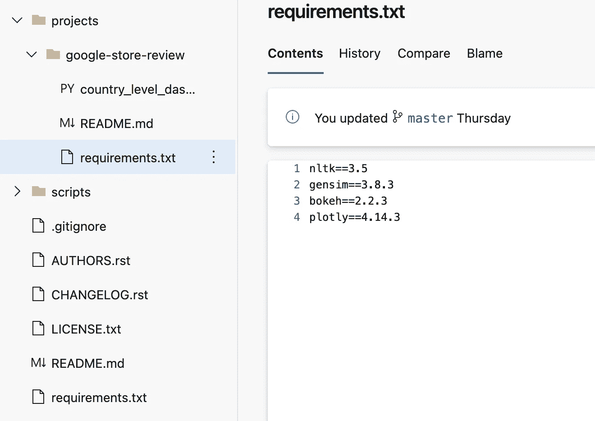
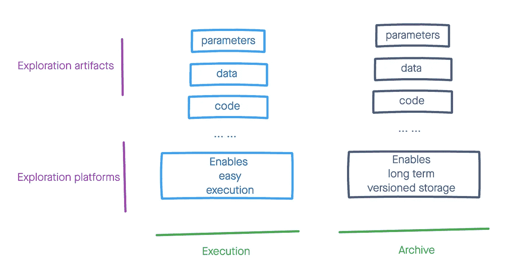

# 所有有意义的数据科学探索都应该是可复制的

> 原文：<https://towardsdatascience.com/all-meaningful-data-science-explorations-should-be-reproducible-194edc25c9b6?source=collection_archive---------27----------------------->

凯文·Ku 在[拍摄的照片](https://www.pexels.com/photo/black-farmed-eyeglasses-in-front-of-laptop-computer-577585/)

# 摘要

如果你没有时间，这里有 30 秒的版本:

*   如果您或您的团队正在进行一项并非完全浪费的数据科学探索工作，您需要以这样一种方式保存这项工作，以便您、您的团队或其他人可以在以后没有太多麻烦的情况下重新开始这项工作。一个想法的价值始于探索，而探索的价值始于以一种易于复制的方式分享。
*   在探索的时候，提到运行在你或你的团队可以访问的平台上的笔记本可能很有诱惑力，例如托管的 [JupyterHub](https://jupyter.org/hub) 、 [Databricks](https://docs.databricks.com/workspace-index.html) 等。然而，这种方法经受住时间考验的概率很低。越难复制的作品，数月或数年后不被仔细研究的几率就越高。这种情况可能会增加接受先前探索所否定的假设的可能性，拒绝推荐的命题，或者更糟糕的是，重新进行得出相同结论的相同探索。
*   复制数据科学工作需要维护其依赖项的版本，即代码、数据(输入和输出)以及参数。此外，它还需要一个指南来解释问题是什么、解决方法、解决方案的假设和限制、潜在的未来工作、什么是代码执行环境以及如何在该环境中执行代码、数据位于何处以及在执行代码时如何访问/加载数据、对操纵代码和结果分析至关重要的关键参数和指标的解释，以及对结果和结论的简要分析。
*   建议的方法是将代码放在分布式版本控制系统中，如 [GitHub](https://github.com/) ，库及其版本定义在显式文件中，如 [requirements.txt](https://pip.pypa.io/en/stable/reference/pip_install/) ，参数和数据路径保存在嵌套文件结构中，如 yaml，一个基础设施描述文件，它定义了代码可以执行的环境，如 [environment.yml](https://docs.conda.io/projects/conda/en/latest/user-guide/tasks/manage-environments.html) 或 [Dockerfile](https://docs.docker.com/engine/reference/builder/) ， 像 [README.md](https://en.wikipedia.org/wiki/README) 这样的用户指南，包含尽可能多的细节以方便手动步骤，例如，在外部平台上运行代码、加载数据、理解代码、分析结果等。

版本化探索工作的样本结构(作者提供照片)

如果你感兴趣并且有更多的时间，这里有一个更长的版本:

# **背景**

数据科学探索是理解有助于 AI/ML 解决方案的技术方法的需求和可行性的过程。在写这篇文章的时候，我正在和一家时装零售商合作。这里有几个探索的例子，可能与时装零售商有关。*请在评论中提供您对探索领域的想法，以便更广泛地了解探索的工作方式。*

照片由 [Artem Beliaikin](https://www.pexels.com/photo/photo-of-discount-sign-2529787/) 在[像素上](https://www.pexels.com/photo/photo-of-discount-sign-2529787/)

1.  我们可以使用图像特征来识别相似/互补的服装吗？
2.  能否通过模拟评估折扣策略对服装库存的影响？
3.  如果我们选择分配策略 X 而不是 Y，我们可以在客户订单履行上节省多少时间？
4.  购买同一件衣服的不同款式会增加退货的可能性吗？

这些探索变化很大。从范围的角度来看，探索可以回答数据源上的一个简单问题，也可以回答需要对真实世界的流程进行建模的更复杂的问题。从人力资源的角度来看，它可以由单个专家来完成，也可以由几类专家组成的团队来完成。从持续时间的角度来看，它可以从一周到几个月不等。从一个领域的角度来看，它可以包括数据分析、概念的工程证明、算法实验或所有这三个领域的某种组合。

探险本身就是混乱的。不能保证它会产生一个好的、有用的结果。应用工程和科学的许多其他学科都是如此，例如航空、制药等。如果对这些领域的探索者的期望是尽可能多地保留每个重要实验的细节，那么我们为什么要降低标准，尤其是当我们的决定很有可能影响数百万人的生活时，这些决定往往会受到我们探索的影响。

目前，数据科学中的探索通常意味着编写一些代码来研究数据中的一些东西，以得出结论来回答问题或在平台中暴露问题/假设，这些平台允许轻松执行代码、分析结果，并保存探索表格、模型和图，这些表格、模型和图可与许多其他合作者共享/查看。Databricks 和[谷歌联合实验室](https://research.google.com/colaboratory/faq.html)是基于云的平台的例子，被世界各地的组织和公司广泛采用。对于这些强大的平台，我们的工作无疑已经变得更好，因为在这些平台上完成探索已经变得明显更快了。对于这些平台的用户来说，通常的做法是只将探索作为笔记本(具有某些状态)存档在平台中。这是一种反模式，来自对数据科学领域影响很大的软件工程学科。这种方法有几个问题，可能会改变最初开发人员传达的事实:

1.  能接触到笔记本的人可以修改密码
2.  平台中的源代码和其他类型的文件可能被有权访问该环境的人删除/重命名/移动
3.  如果代码读取的数据是实时数据，该数据可能会改变
4.  数据和结果可能会被最近执行的最新数据所覆盖
5.  平台可能是暂时的，可能会被清除

在上述任何一种情况下，由于平台的灵活性，很容易无意中导致问题。

# 建议的方法

建议的方法非常明显。我确信在我之前有成千上万的人提倡这一点。然而，这个问题如此重要，需要反复说明。

再现探索需要归档探索工作，包括探索工件、过程和细节，以保证它们的版本在很长时间内保持完整。这意味着我们执行探索的平台不应与归档平台相混淆。除非执行平台是专门为优化存档活动而设计的，例如，版本控制探测的所有方面，即使平台被清除，存档的长寿命，探测的“提升和转移”迁移等。

作者照片

我不具备这种平台的广泛知识。然而，就我所了解的情况来看，我还没有发现一个可扩展的平台能够保证探索的简单执行和持久存档。这可能会在不久的将来成为现实。在这一时刻到来之前，我们必须使用我们当前的武器库来制定可行的归档策略。所以，这里有一些建议:

1.  **数据版本:**将您的输入和输出数据保存为快照，如果可能的话，将版本化的快照保存在长期存储设备中。避免在代码的版本控制系统中对数据进行版本控制，因为它们是为不同的目的而构建的，维护小文件而不是大文件。
2.  **代码/参数版本:**在分布式版本控制系统中维护您的实验和分析代码和参数。将您的数据生成管道作为代码维护在版本控制系统中。如果不能保证数据的再现性，避免使用图形工具生成数据。应该明确提到代码和数据访问路径中使用的外部库。在一个单独的系统中维护参数可能很诱人，但是这种方法保持了它的简单性。
3.  **导读:**添加一篇小报道，讲述如何结合以上几点去理解和再现作品。报告也可以包含在代码版本中，因为它可能是一个小文件。避免在报告中使用大尺寸的图像。

请注意，我并不提倡在执行平台中进行归档。在执行平台中存档探索以便立即使用是非常有益的。然而，这种益处随着时间的推移而减少。

# 具体例子

我将提供一个具体的例子，这个例子是由我目前的探索工作方式启发而来的。*如果您认为符合上述原则，请在评论中提供与您的观点相符的建议。了解所有的可能性真的很好。*

我最近使用的一个堆栈包括以下内容:

1.  [Python](https://www.python.org/)
2.  [Azure 数据块](https://docs.databricks.com/workspace-index.html)
3.  [蔚蓝回购](https://azure.microsoft.com/en-us/services/devops/repos/)
4.  [蔚蓝数据湖](https://azure.microsoft.com/en-us/solutions/data-lake/)
5.  [微软 Sharepoint](https://www.microsoft.com/en-us/microsoft-365/sharepoint/collaboration)

以下是我的建议，基于上面的堆栈:

**数据版本:**保留从 Azure datalake 中的数据库/Data lake/其他表/流中提取的所有非聚合/非连接但已过滤的输入，Azure Data lake 应该是长期存在的。数据版本控制技术仍处于起步阶段。使用先进的技术可能很诱人，例如[三角洲湖](https://delta.io/)，但是要理解它的局限性。对于输出来说，保存生成图或分析的数据比保存图和分析本身更重要。对于探索来说，保存几个版本就足够了，这可以通过简单的策略来管理，例如，遵循单调递增的数字(例如，整数、时间戳等)的目录。如果您的堆栈基于其他一些公共/私有云，请选择允许保存各种文件格式的 datalake，包括但不限于 [csv](https://en.wikipedia.org/wiki/Comma-separated_values) 、 [parquet](https://parquet.apache.org/documentation/latest/) 、 [avro](https://avro.apache.org/docs/current/) 、 [png](https://en.wikipedia.org/wiki/Portable_Network_Graphics) 、 [pkl](https://wiki.python.org/moin/UsingPickle) 、 [json](https://www.json.org/json-en.html) 、 [yml](https://pyyaml.org/wiki/PyYAMLDocumentation) 等。

**代码/参数版本:**在分布式版本控制领域，技术已经有了显著的改进，不仅在效率方面，而且在存储库到不同平台的可移植性方面。无论你的代码是在 [Azure repos](https://azure.microsoft.com/en-us/services/devops/repos/) 、 [Bitbucket](https://bitbucket.org/) 还是 [Github](https://github.com/) 中维护，都没什么区别。在存储库中维护所有代码。添加以下文件以提供依赖关系信息，即使您没有明确使用它们:

*   requirements.txt 中的库及其版本号
*   执行环境文件，如 conda 的 environments.yml、Docker 的 Dockerfile 或 yaml 文件中的 Databrick 的集群描述
*   json 或 yml 文件中的代码操作参数、数据访问路径(及其版本号)、外部集成信息(不惜一切代价避免包含敏感信息)

**指南:**在代码库中添加一个 README.md 文件，该文件包括以下内容:

1.  联系信息，例如开发人员的姓名、电子邮件地址、角色和团队
2.  对问题、解决方案、假设/限制和未来工作的简要描述。浅析勘探及其结论。这些信息通常包含在演示材料中，如 powerpoint 或 pdf 文件。在这种情况下，将文件保存在 Sharepoint(或您拥有的任何文档存档解决方案)中，并在本指南中添加指向该文件的链接。如果探索使用了其他人发表的方法，请参考出版物。
3.  对执行环境的简要描述，解释集群配置、库安装、数据文件加载、机密管理等。如果存在支持文件，例如 requirements.txt，请参考这些文件。如果您使用模型管理系统，例如 [MLflow](https://www.mlflow.org/docs/latest/tracking.html) ，请提及实验名称。

# 放弃

在这篇文章中，我根据常识和经验表达了我的观点。我不认为它会符合你的现实。然而，就像我的代码一样，我的观点也有版本。下周或下个月不会有太大变化，但明年可能会有很大变化。如果你不同意我的观点，或者更喜欢我的建议，请在评论中提供反馈。在创作这个作品的时候，我听了比尔·马厄的演讲，他提倡说出你的想法。我可能受到了一些影响。