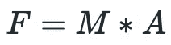
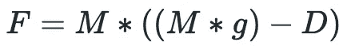
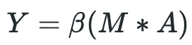
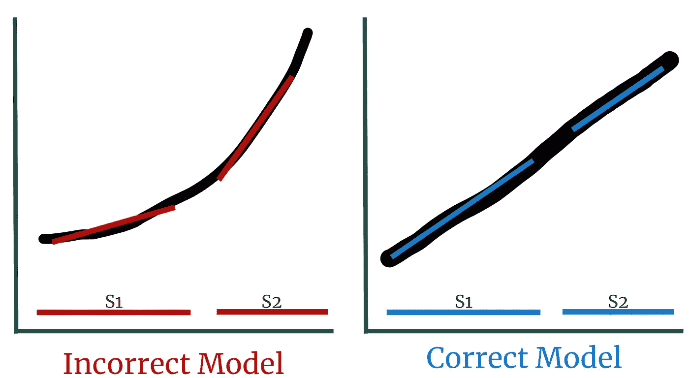

# 如何使用倾向假设的方法进行正确的推理

> 原文：<https://towardsdatascience.com/all-models-are-wrong-a75103196cdb?source=collection_archive---------34----------------------->

## 为什么所有的模型都是错的，但有些是有用的。

米歇尔·玛特隆在 [Unsplash](https://unsplash.com?utm_source=medium&utm_medium=referral) 上的照片

统计是基于假设的。如果这些假设变得无效，基于这些假设的所有结论同样也变得无效。

> “所有的模型都是错误的，但有些是有用的”——乔治·博克斯

宾夕法尼亚大学的统计学家提出的一种[假设倾斜方法](http://Statistics is a practice that's based on assumptions. If those assumptions become invalid, all conclusions based on those assumptions likewise become invalid.)概述了如何从我们的数据中得出更有说服力的结论。该方法描述了一种用于解释模型系数以及置信区间计算的新语言，该置信区间计算对于基于假设的方法是稳健的。

虽然这种方法有细微差别，但它的计算效率很高，实现起来也很简单。

# 技术 TLDR

*   在实践中，保证一个正确指定的模型是非常困难的。“真实”模型要求包括所有相关预测值，并且噪声项为 IID。
*   **采用*假设-精益方法*。因为通常不可能证明我们有所有相关的预测值，我们简单地假设数据是独立同分布的(IID)。**
*   **考虑到仅使用 IID 假设，我们改变了置信区间的计算。**讨论的两种方法是三明治方法和我们观察数据的自助法。

# 好吧，但是到底发生了什么？

让我们慢一点，理解我们如何从数据中得出结论。

## 一个简单的例子

在本例中，我们希望对力的方程进行建模:

图 1:力的方程式。图片作者。

这种关系是倍增的，两个预测变量是质量(M)和加速度(A)。理论上，如果我们有一个线性模型以及一些质量和加速度数据，我们可以完美地预测力。对吗？

是的，但我们不是生活在理论中。我们生活在现实世界中，人际关系模糊而混乱。例如，如果我们测量一个物体从建筑物上掉下来的力会发生什么？突然，我们不得不包括阻力(D)和重力常数(g)。等式变得更加复杂:

图 2:下落物体的力的方程式— [来源](https://www.grc.nasa.gov/www/K-12/airplane/falling.html)。图片作者。

风呢？下雨了，水滴打在物体上怎么办？

如果我们不考虑所有这些因素，我们可能会得到不正确的预测系数估计。用数学术语来说，我们下面的 *β* 可能不完全是 1.0。

图 3:力方程的线性回归。图片作者。

力是一个众所周知的等式，但如果我们试图用一个未知的关系来建模，会发生什么呢？我们能**知道**所有相关的预测因素都包括在内吗？

这是乔治 E.P 博克斯的观点。模型简化了复杂的现象，所以它们从来都不是完美的。

## 模型误差的类型

尽管大多数模型都是“不完美的”，但有些不完美比其他的更糟糕。这里，我们将讨论两类错误:

第一类是*噪声* (ε)。噪声是我们数据中的波动，它完全独立于一切，也就是说，即使我们有完美的数据，我们也无法对其建模。在上面的例子中，噪声可能是力的非系统测量误差。

几乎所有的建模技术都假设因变量中存在噪声。

第二类被称为*误差，由于模型错误设定* ( *η* )。它不包含在大多数统计建模框架中。相反，我们经常假设一个“完美”的模型，因此 *η* 为零。

但是如果博克斯博士是对的，为什么我们要假设模型是正确指定的呢？这个假设允许我们做出因果结论。如果我们有一个完美的力的方程，我们可以随便地宣称 F=M*A。

**在实践中，我们从来没有一个完美的模型，因此通常假设由于模型设定错误而导致的*误差只是噪声。***

# 问题是

这个假设是个问题。统计学是一种依赖于假设的精确方法。如果假设是错误的，就不能保证结论是准确的(尽管它们可能接近正确答案)。

现在，我们知道缺少预测变量是有问题的，所以让我们解决另一个关键假设:我们的模型有**能力**来拟合 X 和 y 之间的关系。因此，如果我们的数据显示线性关系，我们将使用线性模型。如果关系是抛物线，我们应该用 X 代替 X。

如果我们无法满足这一假设，那么在查看新数据时，我们可能会观察到非常不同的拟合值。

图 4:错误指定的指数数据线性模型和正确指定的线性模型之间的差异。图片作者。

以图 4 为例。我们可以看到左边有一个错误指定的模型；X 和 Y 之间的关系是非线性的，但我们用线性模型拟合。如果我们选择样本 1 (S1 ),它的 X 值很小，那么我们直线的估计斜率将比我们选择更大的 X 值(S2)要小得多。

现在在实践中，我们希望有整个数据集的代表性样本，但这个例子强调了一个错误指定的模型对数据中的微小变化是多么敏感。

另一方面，如果我们正确地指定了我们的模型，我们应该看到 X 的任何样本都有相似的斜率，如右图所示。此外，随着我们适应更大的样本量，我们的准确性将会提高。对于一个错误指定的模型，情况可能并非如此。

# 解决方案

为了解决这个问题，宾夕法尼亚大学的统计学家开发了一种不假设模型正确的方法。

这种*假设-精益方法*只要求我们的数据是独立的和同分布的(IID)。在英语中，IID 意味着我们的观察不是系统相关的，它们是从同一人群中随机抽样的。

只要有一个 IID 假设，我们就可以解释博克斯悖论，并对我们的模型做出正确的解释。然而，我们确实失去了因果解释，因为我们没有假设我们的模型包括所有相关的预测。

下面是开发一个有效的假设精益模型所需的两个变化:

## 1 —置信区间计算

正如你可能想象的那样，在一个不正确指定的模型中，置信区间(CI)更大——我们对自己的估计不太有信心。为了说明一个潜在的错误模型，提出了两种方法。

第一种称为*三明治方法*，使用*异方差一致性标准误差*来估计对模型错误设定稳健的置信区间。这些估计的计算超出了本文的范围，但是在大多数编程语言中都有进行计算的库。

第二种叫做 *bootstrap 标准误差*，包括多次重新采样数据，并从重新采样的分布中得出百分位数。同样，计算也超出了本文的范围，但是 bootstrap 采样在大多数编程语言中也很常见。

每种方法的估计置信区间几乎没有差别，因此您可以使用任何一种方法。第一种方法的主要优点是计算效率更高。然而，bootstrap 抽样给你更多的数据来得出结论——例如，你可以用 QQ 图来检验正态假设。

## 2 —口译语言

我们还需要考虑因果关系的缺失。通常，在解释模型系数时，我们会说:

> “对于 X 中的一个单位变化，我们将看到 Y 中的β单位变化，保持所有其他预测因子不变。”

这里 beta ( *β* )是我们的线性回归系数。然而，这种语言假设了一个正确指定的模型，因此为了涵盖我们有一个不正确模型的可能性，我们改为说:

> β是在所有其他预测值保持不变的情况下，X 的单位差与 Y 的最佳线性近似值之差

# 这是不是矫枉过正？

这是一个很难简明回答的问题。

在大多数数据科学应用中，我们不需要做到完美。但是，如果你想尽可能做到统计上的严谨，你应该采用这个框架。

在大多数行业应用中，如果我们希望从一个模型中开发因果推断，我们希望包括许多预测因素，以开发最可靠的模型。然而，如果你同意 Box 的基本原理，完美的模型是不可能的。

作者建议使用“不正确的”模型进行探索性推理，然后使用 A/B 检验来确定真正的因果关系。

# 实施说明

*   模型的正确说明被广泛接受。如果你不是资深员工，在向团队其他成员推销之前，最好能真正理解这些细微差别。
*   有时候，我们不需要真正的因果关系来做出决定。如果我们有一个“真实”模型的很好的近似，我们仍然可以开发精确的推论——我们只是不能保证准确性。

*感谢阅读！我将再写 43 篇文章，将“学术”研究引入 DS 行业。查看我对开发* ***正确*** *型号的链接/想法的评论。*