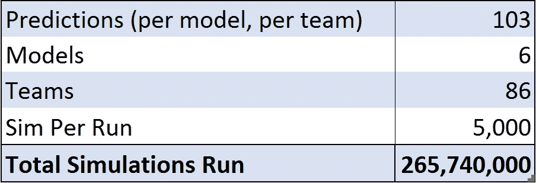
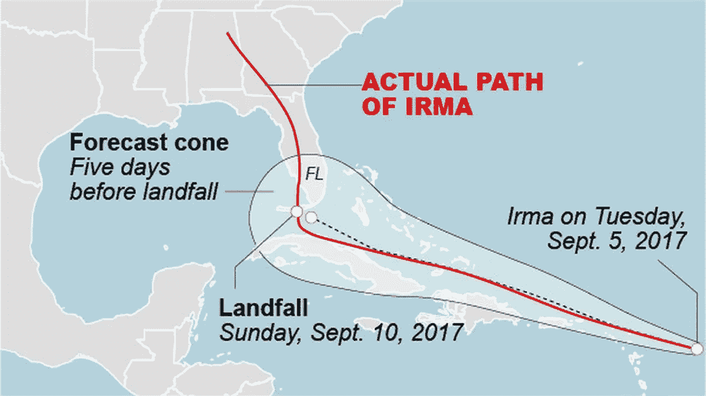
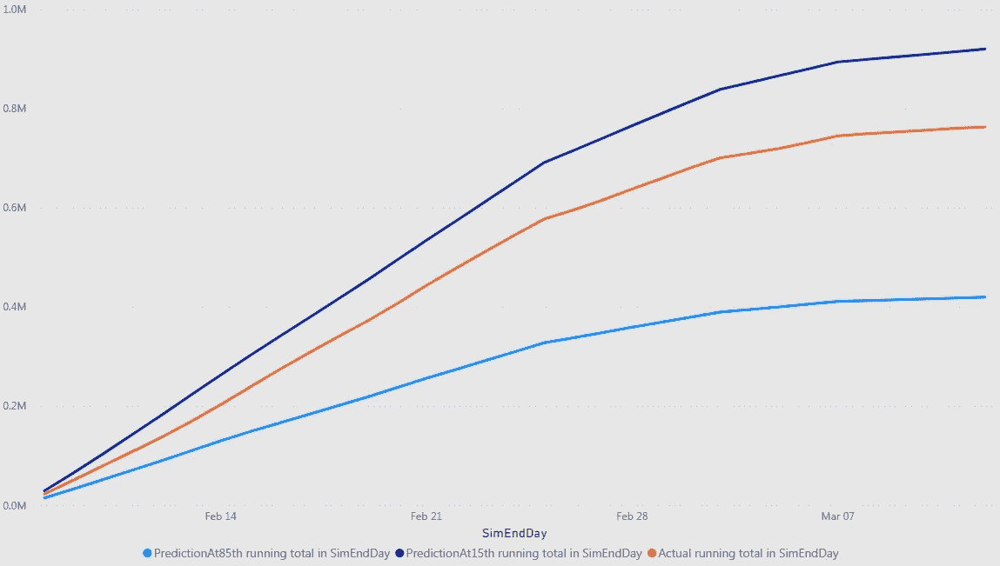
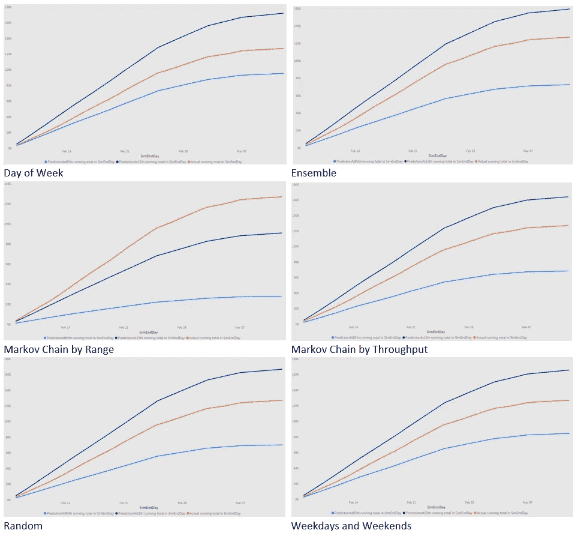
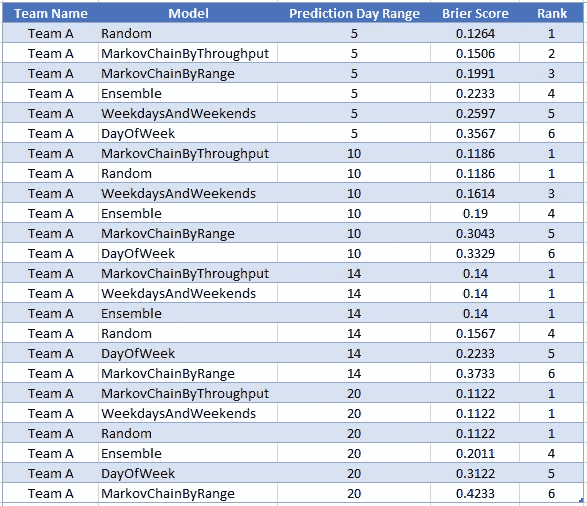
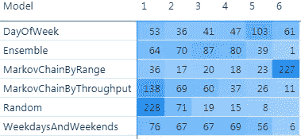
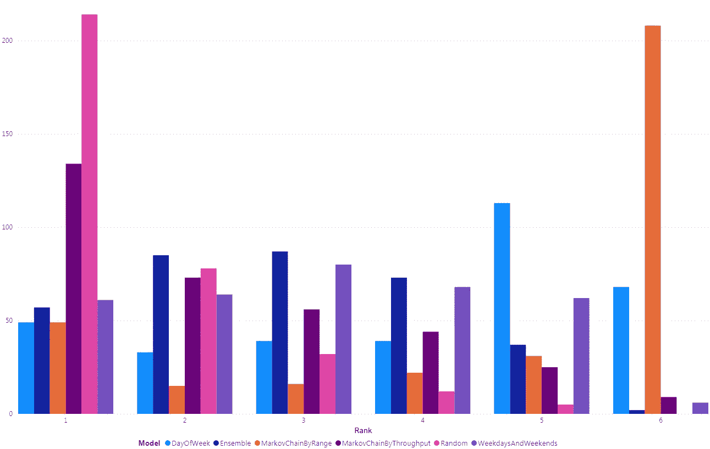
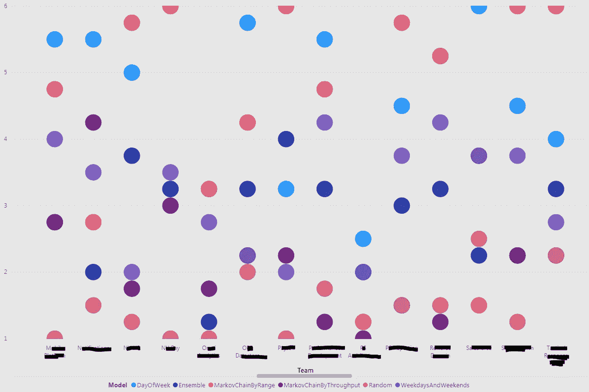
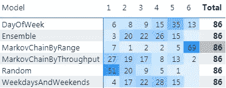
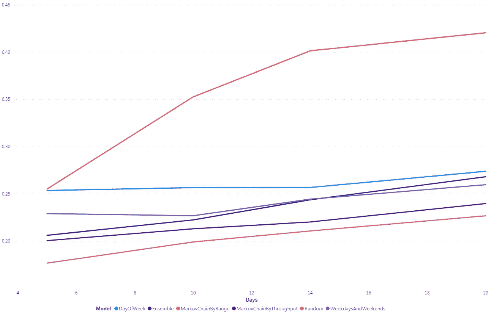

# 所有模型都是错的，但有些是随机的…

> 原文：<https://towardsdatascience.com/all-models-are-wrong-but-some-are-random-25ff1491406f?source=collection_archive---------33----------------------->

## [*小窍门*](https://towardsdatascience.com/tagged/tips-and-tricks)

## 比较各种采样模型，以确定哪种模型产生最准确的结果。

***TL；博士****——如果你不想经历整个分析，而只是对结果感兴趣，跳到随机模型部分，然后跳到本文结尾的总结*

我从丹尼尔·瓦坎蒂那里学到了如何使用蒙特卡洛模拟来预测一个团队在一段时间内可以完成多少工作。Dan 使用他的可操作敏捷工具演示了如何从团队过去的数据中随机抽样来运行这些模拟。运行数千次这样的模拟可以帮助获得一个团队可以完成多少工作的概率预测。

本文的其余部分取决于对使用团队吞吐量的蒙特卡罗模拟的基本理解。下面的#DrunkAgile 视频是我和 Dan 之间的一段对话，概述了这项技术。

醉酒敏捷第三集——使用蒙特卡罗模拟的概率预测

这些 MC 模拟的中心过程是从过去的数据中随机抽样的概念。利用团队的真实数据，预测他们可能的未来。学数学的学生会告诉你，并非所有的随机变量都是一样的。我们可以使用多种不同的模型从过去的数据中“随机”取样。这种分析是要弄清楚不同的随机抽样模型表现如何。我们很好地回测了这些模型的预测，并确定了哪些模型在什么条件下表现最好。

# 随机性模型

照片由 [Erica Li](https://unsplash.com/@sept_pancake?utm_source=medium&utm_medium=referral) 在 [Unsplash](https://unsplash.com?utm_source=medium&utm_medium=referral) 上拍摄

下面是我们将用来做预测的六个模型。这些模型的实现复杂程度不同。Random 是最简单的，而 Markov Chain By Range 是最复杂的。正如所料，从速度的角度来看，Random 运行速度最快，而 Markov Chain By Range 执行速度最慢。

## 随意

这是最简单最纯粹的随机抽样模型。它从均匀分布中生成一个随机数。然后，使用源数据集的大小对该数字进行缩放。选择由缩放数字表示的源数据集中的一天，并将其吞吐量用作模拟中第二天的样本。

## 工作日和周末

这个模型类似于随机模型，除了从两个不同的集合中进行采样。源数据分为两组——

集合 1:属于工作日(周一至周五)的所有数据
集合 2:属于周末(周六和周日)的所有数据

如果我们模拟的未来日期是工作日，我们从集合 1 中取样，否则从集合 2 中取样。预期周末设置将具有较低的吞吐量，并且以这种方式进行采样将为我们提供更好的结果。

## 星期几

该模型将“工作日和周末”模型中使用的抽样方法向前推进了一步。我们没有将源数据分成两组，而是分成 7 组

集合 1:属于周一的所有数据
集合 2:属于周二的所有数据
集合 3:属于周三的所有数据
集合 4:属于周四的所有数据
集合 5:属于周五的所有数据
集合 6:属于周六的所有数据
集合 7:属于周日的所有数据

根据模拟的未来日期属于一周中的哪一天，我们选择要从中采样的集合。例如，如果被模拟的一天是星期三，我们将从集合 3 中取样。我们期望这个模型能够更好地模拟一周中某些天吞吐量的下降(或上升)。

## 吞吐量马尔可夫链

该模型使用马尔可夫链来分配下一个样本的概率，然后使用这些概率伪随机地选择下一个样本。马尔可夫链表示从一种状态转移到另一种状态的概率。

马尔可夫链示例(维基共享)

例如，吞吐量 0 后跟吞吐量 1 的概率是 35%。首先，我们根据过去的数据创建马尔可夫链。我们将源数据按日期排序，这样就可以按时间顺序遍历过去。当我们遍历源数据时，每个唯一的吞吐量都成为一个状态。从一个吞吐量转移到另一个吞吐量会增加这两个状态之间的边缘权重。

此后，我们通过将从状态 1 到状态 2 的边的权重除以从状态 1 发出的边的总权重来确定从一个状态移动到另一个状态的概率。知道从一个状态移动到所有其他状态的概率被用来伪随机地选择在模拟中第二天要采样的日期。预期这将比纯粹的随机选择更接近团队的吞吐量趋势。

## 按范围划分的马尔可夫链

该模型将来自团队的源数据分割成三个集合，然后在它们之间创建一个马尔可夫链。数据分割如下——

集合 1:吞吐量最低三分之一的所有数据(L)
集合 2:吞吐量中间三分之一的所有数据(M)
集合 3:吞吐量最高三分之一的所有数据(H)

注意—周末往往会使这些 H、M 和 L 分类的分布发生偏斜。我们使用与“工作日和周末”模型相同的程序对周末进行采样。如上所示，工作日吞吐量分为三组。

正如我们在创建吞吐量马尔可夫链时所做的那样，我们按照时间顺序遍历源数据。我们创建三个状态(H、M 和 L)之间的马尔可夫链。然后，我们使用这些状态之间的转移概率来导出用于模拟的样本吞吐量。我们的期望是，这个模型可以获得团队吞吐量的季节性，并使用它来有效地进行预测。

## 全体

该模型是上述五种模型的组合。每个运行集包含 2500 个模拟。在集合模型中，在每次蒙特卡罗模拟开始时，从上述五个模型中随机选择一个。这就创建了一个模型，它可以从所有五个编码模型中收集结果，并将它们作为一组结果呈现出来。这种方法已被 NOAA 成功地用于创建飓风的一致预测。人们的期望是，这一模型将产生一套平衡的预测。

# 数据

为了回测这里描述的模型，我们将使用 86 个不同团队的真实数据。对于这些团队中的每一个，我们获取了这些团队在 2021 年 1 月 10 日和 2021 年 3 月 17 日之间每天的实际吞吐量。我们将使用一个 28 天的滑动窗口作为运行蒙特卡罗模拟的源数据(稍后将详细介绍)。对于每个团队，我们将做出并测试 5、10、14 和 20 天的预测。对于滑动窗口，这将导致每个团队针对每个模型测试总共 103 个预测。每次预测我们将运行 5000 次模拟。

总之，我们将运行超过 2.65 亿次模拟，以测试 6 个模型的有效性，每个模型为 86 个不同的团队做出 103 个预测。这应该会导致在各种不同的条件下对这些模型进行一些非常健壮的测试。

# 疯狂的方法

我们想测试预测的准确性。在我们继续之前，我们应该建立一个准确性的衡量标准。测量单点预测的准确性比概率预测的准确性相对容易。对于单点确定性预测，我们可以查看预测值与实际值的差距。概率结果就没那么容易了。

## 布赖尔乐谱

为了判断概率结果的准确性，我们将使用 Brier 评分。为了解释这个分析的结果，理解 Brier 分数不是必要的。读者只要知道 [Brier 评分](https://en.wikipedia.org/wiki/Brier_score)是判断概率预测准确性的标准方法就足够了，分数越低，预测越好。

## 生成预测

如前所述，为了运行模拟，我们将使用 28 天的滑动窗口作为采样的源数据。对于每个团队，我们将以前 28 天(1/10 到 2/7)的吞吐量作为源数据。使用这些第一个数据集，我们将尝试预测团队在 5、10、14 和 20 天内可以产生多少吞吐量。因为我们是从概率上来看的，所以我们将在以下两种概率下生成预测—
**第 15 百分位预测** —我们有 15%的信心团队可以做到这一点或更多。
**第 85 百分位预测** —我们有 85%的信心团队可以做到这一点或更多。

飓风伊尔玛的预测与实际

然后，我们将这些预测与团队完成的实际吞吐量进行比较。预计 70%的情况下，实际吞吐量将介于这两个预测值之间。然后，我们将所有数据向前移动一天，并使用新的一组 28 天(1/11 到 2/8)的吞吐量作为源数据。再次进行 5、10、14 和 20 天的预测，并将它们与实际吞吐量进行比较。

这一过程将在我们评估的 6 款车型中重复进行。然后，我们应该能够通过评估实际吞吐量落入第 85–15 百分位“圆锥”的频率来判断我们的模型的准确性。Brier 分数将用于捕捉模型在团队和预测持续时间中的整体表现。

# 结果呢

首先，让我们从使用每个模型的所有团队的所有预测表现的总体评估开始。下面显示的预测圆锥是整个数据集中第 15 百分位(深蓝色)、第 85 百分位(浅蓝色)和实际值(橙色)的累积轨迹。正如我们所看到的，我们的实际总和很好地跟踪了我们 85%到 15%的信心预测。它似乎更倾向于第 15 百分位。这是否意味着我们的预测通常是悲观的？

总体预测圆锥

上图的分析充其量是一个嗅觉测试。它只是告诉我们，我们的预测并没有错。这张图表中的各种元素需要单独梳理和探究。让我们从笼统的概括转向一些具体的细节。单个模型的表现如何。下面是由模型过滤的同一个圆锥体的网格。

模型预测锥

我们看到，对于大多数模型来说，实际(橙色)线在圆锥的中间跟踪得相当好。除了我们最复杂的模型——马尔可夫链。该模型在预测吞吐量的总体趋势方面似乎不错，但在预测实际吞吐量方面相当糟糕。这一个模型的结果就是为什么总体平均值似乎是悲观的。

## 对模型进行排序

使用我们为模型收集的 Brier 分数，我们可以对我们的模型进行排名，看哪些模型对每个团队和预测日范围表现最好。我们可以尝试确定一个模型在预测 5、10、14 和 20 天时对一个团队的效果如何。基于 Bier 评分，我们可以对 6 个模型进行排名。提醒一下，Brier 分数越低越好。例如，我们数据集中的一个团队在评分和排名时会产生以下预测排名—

样本分数和排名

我们解释这些结果的方式是，在为团队 A 预测他们在 5 天内可以完成的工作量时，随机抽样模型在准确性方面排名第一，星期几模型排名最后(第六)。同样，在预测 14 天后，按吞吐量划分的马尔可夫链最准确(第 1)，按范围划分的马尔可夫链最不准确(第 6)。

在所有 86 个团队和 4 个预测日范围内，总共有 300 多个机会对模型进行排名。这些等级使用相同预测日范围的相同基础数据来比较模型。这些同类比较可以让我们更好地了解哪种模型在每种情况下表现更好。它还可以帮助我们对哪些模型在大多数情况下表现良好，哪些表现最差做出一些概括的陈述。下表显示了每个型号达到某个等级的频率。

模特排名

标题“1”下的列表示该模型在每个单独的上下文中最擅长生成预测的频率。“6”以下的数字是他们预测最差的频率。这里有明显的赢家和输家。

**在这 86 支球队的背景下，似乎最简单的模型——纯随机抽样表现最好**。在超过 66%的案例中，它排在第一位。在超过 87%的预测上下文中，Random 是表现最好或第二好的模型。

同时，我们也有我们整体表现最差的模型。**最复杂的模型——马尔可夫链表现最差**。在超过 66%的上下文中，马尔可夫链是表现最差的模型。随机的，我们表现最好的模型在任何情况下都没有排名第六。

模型排名的频率

不过有一点需要注意，即使是我们表现最差的模型也在 36 个案例中排名第一。虽然我们可以说，一般来说，我们有一个明确的赢家和输家，进入细节，一般来说，“失败”的模型可能对某些团队和预测日范围表现更好。然而，深入地看，这似乎发生在具有高度不稳定和不稳定吞吐量的团队中。事实上，按范围划分的马尔可夫链是性能最好的模型，它应该(在大多数情况下)指向过程改进和生产能力稳定的机会。

## 机器学习蒙特卡罗

我们可以在这个分析中更上一层楼。按团队汇总这些排名可以帮助我们了解这些模型在团队中的表现。哪些模型最适合预测每个团队的吞吐量？当我们按团队看这些排名时，我们确实看到不同的模型更适合不同的团队。

按团队列出的模型平均排名

上图显示了一个团队的平均排名。图表上模型的点越低，该模型对该团队的预测就越好。这些信息现在可以用于确定每个团队应该使用哪个模型进行预测。

蒙特卡洛引擎现在可以成为一个学习系统。我们可以根据特定团队在过去几个月中表现最好的模型来切换模型。我们对未来使用哪种模式的选择现在是由机器做出的动态选择，而不是根据个人偏好进行选择。

按团队对模特进行排名

正如所预料的，当聚集到团队级别时，模型如何被分级的分布与非聚集等级的分布非常相似。随机模型是大多数团队的首选模型，马尔可夫链是大多数团队的最后选择模型。

## 预测范围的影响

我们可以用这些数据回答的另一个问题是，当我们预测越来越远时，我们的预测会怎么样。随着我们对未来的预测越来越深入，欧石南的得分会发生什么变化？下图试图回答这个问题。

超出预测范围的模型的 Brier 分数

首先要注意的是，这张图也证实了之前的结论。因为 Brier 分数越低越好，所以随机线(粉色)位于所有其他线的下方。马尔可夫链的直线距离远高于其他所有直线距离。按吞吐量划分的马尔可夫链是第二个最成功的模型。

我们确实看到图中所有的线都有上升的趋势。随着我们预测的天数的增加，我们的模型的准确性下降。他们仍然大部分保持他们的相对位置，但是他们的准确性的绝对测量在更长的预测期间变得更差。

# 摘要

让我们通过回答我们详细探究的问题来总结这个分析。

## 一款车型是否总体上优于其他车型？

是的，看起来最简单的模型——Random out 执行更复杂的采样模型。按范围划分的马尔可夫链是表现最差的模型。其他模型都落在中间的某个地方。

## 某些型号更适合某些团队吗？

是的，似乎即使是总体表现不佳的模型也更适合预测某些球队。对此进行更深入的分析可以发现，这些团队的系统非常不稳定。

## 模型性能会随着我们对未来的预测而改变吗？

总的来说，随着我们对未来的预测，模型性能似乎会受到影响。比起长期预测，我们更喜欢做短期预测。

## 在蒙特卡罗模拟中，我应该使用哪些采样模型？

从随机开始，除非你想做我在这里做过的学术练习，否则就随机停止。这是本次回测分析中最成功的一次。如果随机没有给你好的结果，很可能是系统的问题，而不是模型的问题。纯随机采样也是最容易实现的。这无疑是巴克模型最大的支持。