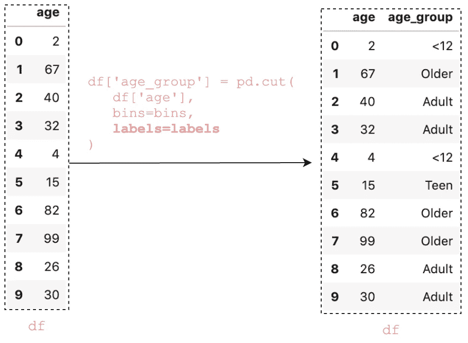

# 所有熊猫切()你应该知道把数值数据转换成分类数据

> 原文：<https://towardsdatascience.com/all-pandas-cut-you-should-know-for-transforming-numerical-data-into-categorical-data-1370cf7f4c4f?source=collection_archive---------1----------------------->


所有的熊猫切()你应该知道如何将数字数据转换成分类数据(图片由作者使用[canva.com](https://www.canva.com/))

数值型数据在数据分析中很常见。通常情况下，您会得到连续的、大范围的或高度倾斜的数值数据。有时，将这些数据绑定到离散的区间会更容易。当值被分成有意义的类别时，这有助于执行描述性统计。例如，我们可以将确切的年龄分为幼儿、儿童、成人和老人。

Pandas 内置的`cut()`函数是一种将数值数据转换成分类数据的好方法。在本文中，您将学习如何使用它来处理以下常见任务。

1.  离散成大小相等的箱
2.  添加自定媒体夹
3.  向垃圾箱添加标签
4.  用`right=False`配置最左边的边缘
5.  用`include_lowest=True`包括最低值
6.  将一只`IntervalIndex`传给`bins`
7.  带`retbins=True`的回收箱
8.  创建无序类别

> 请查看[笔记本](https://github.com/BindiChen/machine-learning/blob/master/data-analysis/026-pandas-cut/pandas-cut.ipynb)获取源代码。

# 1.离散成大小相等的箱

`cut()`最简单的用法必须有一个列和一个整数作为输入。它将值离散化到大小相等的容器中。

```
df = pd.DataFrame({'age': [2, 67, 40, 32, 4, 15, 82, 99, 26, 30]})df['age_group'] = pd.**cut(df['age'], 3)**
```


(图片由作者提供)

你观察过 ***年龄组*** 栏的那些区间吗？那些间隔值在开始有一个圆括号，在结尾有一个方括号，例如`**(1.903, 34.333]**`。基本意思是圆括号边的任何值都不包含在区间内，方括号边的任何值都包含在内(数学上称为**开区间和闭区间**)。

现在，让我们来看看新的专栏 **age_group** 。

```
df['age_group']
```


(图片由作者提供)

它显示带有 3 个标签值的`dtype: category`:`**(1.903, 34.333]**`、`**(34.333, 66.667]**`和`**(66.667, 99.0]**`。这些标签值按照符号`<`的指示进行排序。在主题后面，为了生成大小相等的容器，间隔计算如下:

```
interval = (max_value — min_value) / num_of_bins
         = (99 - 2) / 3
         = 32.33333 (<--32.3333-->] < (<--32.3333-->] < (<--32.3333-->] **(1.903, 34.333] < (34.333, 66.667] < (66.667, 99.0]**
```

# 2.添加自定媒体夹

让我们将上述年龄值分为 4 个自定义组，即 0-12 岁、12-19 岁、19-60 岁、61-100 岁。为此，我们可以简单地将列表中的值(`[0, 12, 19, 61, 100]`)传递给参数`bins.`

```
df['age_group'] = pd.cut(df['age'], **bins=[0, 12, 19, 61, 100]**)
```


(图片由作者提供)

我们在新列 **age_group** 中添加了年龄的组值。通过观察柱子

```
df['age_group']0      (0, 12]
1    (61, 100]
2     (19, 61]
3     (19, 61]
4      (0, 12]
5     (12, 19]
6    (61, 100]
7    (61, 100]
8     (19, 61]
9     (19, 61]
Name: age_group, **dtype: category**
Categories (4, interval[int64]): **[(0, 12] < (12, 19] < (19, 61] < (61, 100]]**
```

我们可以看到`dtype: category`有 4 个有序的标签值:`(0, 12] < (12, 19] < (19, 61] < (61, 100]`。

让我们按列**年龄组:**对数据帧进行排序

```
df**.sort_values('age_group')**
```


(图片由作者提供)

让我们数一数有多少个值落入每个容器中。

```
**df['age_group'].value_counts().sort_index()**(0, 12]      2
(12, 19]     1
(19, 61]     4
(61, 100]    3
Name: age_group, dtype: int64
```

# 3.向垃圾箱添加标签

将这些**年龄组**值标记为“< 12”、“青少年”、“成人”、“老年人”更具描述性。为此，我们可以简单地将列表中的值传递给参数`labels`

```
bins=[0, 12, 19, 61, 100]
**labels=['<12', 'Teen', 'Adult', 'Older']**df['age_group'] = pd.cut(df['age'], bins, **labels=labels**)
```



(图片由作者提供)

现在，当我们查看该列时，它显示的是标签

```
df['age_group']0      <12
1    Older
2    Adult
3    Adult
4      <12
5     Teen
6    Older
7    Older
8    Adult
9    Adult
Name: age_group, dtype: category
Categories (4, object): **['<12' < 'Teen' < 'Adult' < 'Older']**
```

同样，在分类和计数时，它会显示标签


(图片由作者提供)

```
**df['age_group'].value_counts().sort_index()**<12      2
Teen     1
Adult    4
Older    3
Name: age_group, dtype: int64
```

# 4.用`right=False`配置最左边的边缘

熊猫`cut()`中有一个参数`right`用来配置 bin 是否包含最右边。`right`默认为`True`，表示`[0, 12, 19, 61, 100]`这样的仓表示`(0,12]`、`(12,19]`、`(19,61]`、`(61,100]`。为了包含最左边的边，我们可以设置`right=False`:

```
pd.cut(df['age'], bins=[0, 12, 19, 61, 100], **right=False**)0      **[0, 12)**
1    **[61, 100)**
2     **[19, 61)**
3     **[19, 61)**
4      **[0, 12)**
5     **[12, 19)**
6    **[61, 100)**
7    **[61, 100)**
8     **[19, 61)**
9     **[19, 61)**
Name: age, dtype: category
Categories (4, interval[int64]): [**[0, 12) < [12, 19) < [19, 61) < [61, 100)**]
```

# 5.用`include_lowest=True`包括最低值

假设您想将上述年龄值分为 2–12，12–19，19–60，61–100。将箱子设置为`[2, 12, 19, 61, 100]`时，您将获得包含`NaN`的结果。

```
df['age_group'] = pd.cut(df['age'], bins=[2, 12, 19, 61, 100])
```


(图片由作者提供)

我们得到一个`NaN`,因为值`2`是第一个面元`(2.0, 19.0]`的最左边的边缘，并且不包括在内。为了包含最低值，我们可以设置`include_lowest=True`。或者，您可以将`right`设置为`False`以包含最左边的边缘。

```
df['age_group'] = pd.cut(
    df['age'], 
    bins=[2, 12, 19, 61, 100], 
    **include_lowest=True**
)
```


(图片由作者提供)

# 6.将一个`IntervalIndex`传递给`bins`

到目前为止，我们已经向`bins`传递了一个数组。除了数组，我们还可以传递一个`IntervalIndex`。

让我们创建一个有三个箱子`(0, 12]`、`(19, 61]`、`(61, 100]`的`IntervalIndex`:

```
**bins = pd.IntervalIndex.from_tuples([(0, 12), (19, 61), (61, 100)])** IntervalIndex([**(0, 12], (19, 61], (61, 100]**],
              closed='right',
              dtype='interval[int64]')
```

接下来，让我们把它传递给论点`bins`

```
df['age_group'] = pd.cut(df['age'], **bins**)
```


(图片由作者提供)

请注意，`IntervalIndex`未覆盖的值被设置为`NaN`。基本上，为`bins`传递一个`IntervalIndex`会准确地得到那些类别。

# 7.带`retbins=True`的回收箱

有一个名为`retbin`的参数用于返回 bin。如果它被设置为`True`，结果将返回`bins`，当`bins`作为单个数值被传递时，它是有用的

```
result, bins = pd.cut(
    df['age'], 
    **bins=4,            # A single number value**
    retbins=True
) # Print out bins value **bins**
array([ 1.903, 26.25 , 50.5  , 74.75 , 99\.   ])
```

# 8.创建无序类别

`ordered=False`传递标签时会产生无序类别。此参数可用于允许非唯一标签:

```
pd.cut(
    df['age'], 
    bins=[0, 12, 19, 61, 100], 
    labels=['<12', 'Teen', 'Adult', 'Older'], 
    ordered=False,
)0      <12
1    Older
2    Adult
3    Adult
4      <12
5     Teen
6    Older
7    Older
8    Adult
9    Adult
Name: age, dtype: category
Categories (4, object): **['<12', 'Teen', 'Adult', 'Older']**
```

# 结论

Pandas `cut()`函数是一种将数值数据转换成分类数据的快速便捷的方法。

我希望这篇文章能帮助你节省学习熊猫的时间。我建议你查看一下关于`cut()` API 的[文档](https://pandas.pydata.org/pandas-docs/stable/reference/api/pandas.cut.html)，并了解你可以做的其他事情。

感谢阅读。请查看[笔记本](https://github.com/BindiChen/machine-learning/blob/master/data-analysis/026-pandas-cut/pandas-cut.ipynb)获取源代码，如果你对机器学习的实用方面感兴趣，请继续关注。

## 你可能会对我的其他一些熊猫文章感兴趣:

*   [熊猫系列实用介绍](/a-practical-introduction-to-pandas-series-9915521cdc69)
*   [使用熊猫方法链接提高代码可读性](https://medium.com/@bindiatwork/using-pandas-method-chaining-to-improve-code-readability-d8517c5626ac)
*   如何对熊猫数据帧进行自定义排序
*   [为了数据分析你应该知道的所有熊猫移位()](/all-the-pandas-shift-you-should-know-for-data-analysis-791c1692b5e)
*   [何时使用 Pandas transform()函数](/when-to-use-pandas-transform-function-df8861aa0dcf)
*   [你应该知道的熊猫串联()招数](/pandas-concat-tricks-you-should-know-to-speed-up-your-data-analysis-cd3d4fdfe6dd)
*   [熊猫的应用()和变换()的区别](https://medium.com/@bindiatwork/difference-between-apply-and-transform-in-pandas-242e5cf32705)
*   [所有的熊猫合并()你应该知道](/all-the-pandas-merge-you-should-know-for-combining-datasets-526b9ecaf184)
*   [在 Pandas 数据框架中处理日期时间](/working-with-datetime-in-pandas-dataframe-663f7af6c587)
*   [熊猫阅读 _csv()你应该知道的招数](https://medium.com/@bindiatwork/all-the-pandas-read-csv-you-should-know-to-speed-up-your-data-analysis-1e16fe1039f3)
*   [用 Pandas read_csv()解析日期列应该知道的 4 个技巧](/4-tricks-you-should-know-to-parse-date-columns-with-pandas-read-csv-27355bb2ad0e)

更多教程可以在我的 [Github](https://github.com/BindiChen/machine-learning) 上找到