# 所有熊猫 groupby()你应该知道分组数据和执行操作

> 原文：<https://towardsdatascience.com/all-pandas-groupby-you-should-know-for-grouping-data-and-performing-operations-2a8ec1327b5?source=collection_archive---------1----------------------->

## 熊猫帮助你开始数据分析的提示和技巧


由[absolute vision](https://unsplash.com/@freegraphictoday?utm_source=unsplash&utm_medium=referral&utm_content=creditCopyText)在 [Unsplash](/s/photos/grouping-data?utm_source=unsplash&utm_medium=referral&utm_content=creditCopyText) 上拍摄的照片

在探索性数据分析中，我们经常希望通过一些类别来分析数据。在 SQL 中，`GROUP BY`语句将具有相同类别值的行分组到汇总行中。在 Pandas 中，SQL 的`GROUP BY`操作是使用类似命名的`groupby()`方法执行的。Pandas 的`groupby()`允许我们将数据分成不同的组来执行计算，以便更好地进行分析。

在本文中，您将学习“分组”过程(拆分-应用-合并)以及如何使用 Pandas 的`groupby()`功能对数据进行分组和执行操作。这篇文章的结构如下:

1.  什么是熊猫`groupby()`以及如何访问群组信息？
2.  “分组依据”流程:拆分-应用-合并
3.  聚合
4.  转换
5.  过滤
6.  按多个类别分组
7.  用`as_index`重置索引
8.  处理缺失值

为了演示，我们将使用 Kaggle 上的 [Titanic 数据集](https://www.kaggle.com/c/titanic/overview)。

```
df = pd.read_csv('data/titanic/train.csv')
df.head()
```

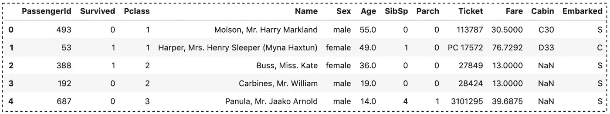

泰坦尼克号数据集(图片由作者提供)

请查看[笔记本](https://github.com/BindiChen/machine-learning/blob/master/data-analysis/032-pandas-groupby/pandas-groupby.ipynb)获取源代码。

# 1.什么是熊猫`groupby()`以及如何访问群组信息？

`groupby()`的作用是在我们想按某些类别分析数据的任何时候。最简单的调用必须有一个列名。在我们的例子中，让我们使用 ***性别*** 列。

```
df_groupby_sex = df.**groupby('Sex')**
```

这句话的字面意思是我们想通过不同的性别值来分析我们的数据。通过对结果调用`type()`函数，我们可以看到它返回了一个 **DataFrameGroupBy** 对象。

```
>>> **type(df_groupby_sex)**pandas.core.groupby.generic.**DataFrameGroupBy**
```

`groupby()`函数返回一个 **DataFrameGroupBy** 对象，但本质上描述了原始数据集的行是如何被拆分的。我们可以使用一些属性和方法来访问组信息

我们可以使用`ngroups`属性来获得组的数量

```
>>> df_groupby_sex.**ngroups**2
```

使用`groups`属性获取 groups 对象。列表中的整数就是行号。

```
>>> df_groupby_sex.**groups**{**'female':** [1, 2, 5, 8, 10, 21, 22, 25, 26, 27, 36, 41, 44, 47, 51, 58, 60, 65, 70, 71, 72, 76, 77, 78, 80, 87, 88, 93, 94, 95, 100, 102, 104, 105, 109, 113, 116, 119, 120, 121, 123, 129, 134, 138, 144, 146, 147, ...], **'male':** [0, 3, 4, ...]}
```

我们可以使用`size()`方法来计算和显示组大小。

```
>>> df_groupby_sex**.size()**Sex
female    256
male      456
dtype: int64
```

要预览分组，我们可以调用`first()`或`last()`来预览第一个或最后一个条目的结果。

```
df_groupby_sex**.first()**df_groupby_sex**.last()**
```

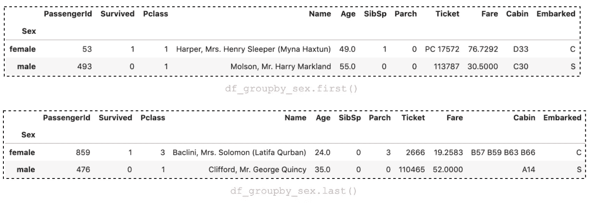

(图片由作者提供)

我们可以使用`get_group()`方法来检索一个已创建的组

```
df_female = df_groupby_sex**.get_group('female')**
df_female.head()
```

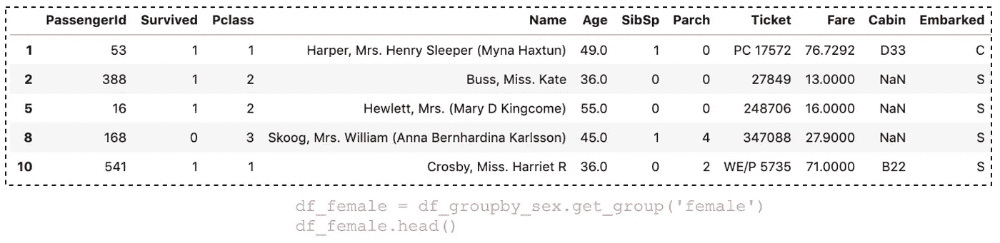

(图片由作者提供)

# 2.“分组依据”流程:拆分-应用-合并

一般来说，“分组依据”指的是涉及以下一个或多个步骤的过程:

> (1)将数据分组。(2).将函数独立地应用于每个组，(3)将结果组合成数据结构。
> 
> 在这些当中，熊猫`groupby()`被广泛用于分步法，它是最简单的。事实上，在许多情况下，我们可能希望与这些群体一起做一些事情。在应用步骤中，我们可能希望执行以下操作之一:
> 
> **聚合**:计算每个组的汇总统计。例如，总和、平均值或计数。
> 
> **转换**:执行一些特定于组的计算，并返回一个相似索引的对象。例如，标准化组内的数据或替换组内缺失的值。
> 
> **过滤**:根据评估`True`或`False`的分组计算，丢弃一些分组。例如，丢弃属于只有几个成员的组的数据，或者根据组总和或平均值过滤掉数据。
> 
> By 熊猫官方教程: [groupby:拆分-应用-合并](https://pandas.pydata.org/pandas-docs/stable/user_guide/groupby.html) [1]

在下面的文章中，我们将探索“分组”过程的真实用例。

# 2.聚合

一旦 **DataFrameGroupBy** 被创建，几种方法可用于对分组数据进行计算。一个显而易见的方法是执行聚合——为每个组计算一个汇总统计。

## 带列

对特定列执行聚合

```
>>> df.groupby('Sex')**.Age.max()**Sex
female    63.0
male      80.0
Name: Age, dtype: float64
```

## 用`agg()`方法

有一个叫做`agg()`的方法，它允许我们一次指定多个聚合函数。

```
df.groupby('Sex').Age.**agg(['max', 'min', 'count', 'median', 'mean'])**
```

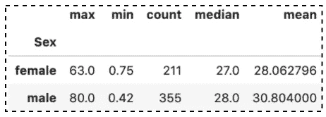

(图片由作者提供)

有时，您可能更喜欢使用自定义列名:

```
df.groupby('Sex').Age.agg(
    **sex_max=('max')**,
    **sex_min=('min')**,
)
```

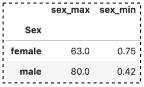

(图片由作者提供)

如果您想使用自定义聚合函数:

```
**def categorize(x):
    m = x.mean()
    return True if m > 29 else False**df.groupby('Sex').Age.agg(['max', 'mean', **categorize**])
```

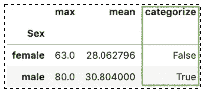

(图片由作者提供)

我们也可以使用 lambda 表达式

```
df.groupby('Sex').Age.agg(
    ['max', 'mean', **lambda x: True if x.mean() > 50 else False**]
)
```

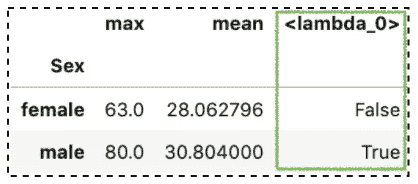

(图片由作者提供)

## 不带列

事实证明，当编写一个`groupby()`时，我们实际上并不需要指定一个像**年龄**这样的列。如果没有列，它将对所有数字列执行聚合

```
df.**groupby('Sex').mean()**
```

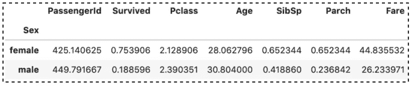

(图片由作者提供)

同样，我们可以不使用列来调用`agg()`。

```
df.**groupby('Sex').agg(['mean', 'median'])**
```

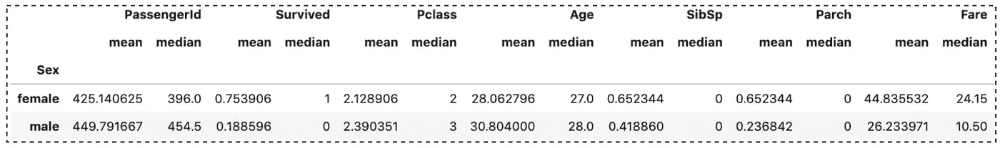

(图片由作者提供)

# 3.转换数据

转换是一个过程，在这个过程中，我们执行一些特定于组的计算，并返回一个相似索引(相同长度)的对象。在寻找转换数据时，`transform()`和`apply()`是最常用的函数。

让我们为[标准化](https://en.wikipedia.org/wiki/Feature_scaling#Standardization_(Z-score_Normalization))创建一个λ表达式。

```
standardization = lambda x: (x - x.mean()) / x.std()
```

用`transform()`对**年龄**栏进行标准化

```
df.groupby('Sex').**Age.transform(standardization)**0      1.630657
1      1.516751
2      0.574994
        ...   
707   -0.294321
708         NaN
709    0.956720
710    0.282784
711         NaN
Name: Age, Length: 712, dtype: float64
```

使用`apply()`对**年龄**栏进行标准化

```
df.groupby('Sex').**Age.apply(standardization)**0      1.630657
1      1.516751
2      0.574994
        ...   
707   -0.294321
708         NaN
709    0.956720
710    0.282784
711         NaN
Name: Age, Length: 712, dtype: float64
```

如果您想了解更多`transform()`和`apply()`，请查看:

[](/when-to-use-pandas-transform-function-df8861aa0dcf) [## 何时使用 Pandas transform()函数

### 一些最有用的熊猫把戏

towardsdatascience.com](/when-to-use-pandas-transform-function-df8861aa0dcf) [](/introduction-to-pandas-apply-applymap-and-map-5d3e044e93ff) [## 熊猫应用简介，应用地图和地图

### 一个直观的熊猫教程，介绍如何使用 apply()和 applymap()应用一个函数，以及如何替换值…

towardsdatascience.com](/introduction-to-pandas-apply-applymap-and-map-5d3e044e93ff) 

# 4.过滤

过滤是一个过程，在这个过程中，我们根据评估真或假的分组计算来丢弃一些分组。

让我们看看如何丢弃属于只有几个成员的组的数据。

首先，我们按**舱**将数据分组，并快速查看每组的大小。

```
df.groupby('Cabin').size()Cabin
A10    1
A14    1
A16    1
A19    1
..
F2     2
F33    3
F4     1
G6     2
T      1
Length: 128, dtype: int64
```

现在，让我们过滤数据，返回居住在客舱中的所有乘客人数≥ 4 人。为此，我们使用带有 lambda 表达式的`filter()`方法。

```
df.groupby('Cabin').**filter(lambda x: len(x) >= 4)**
```

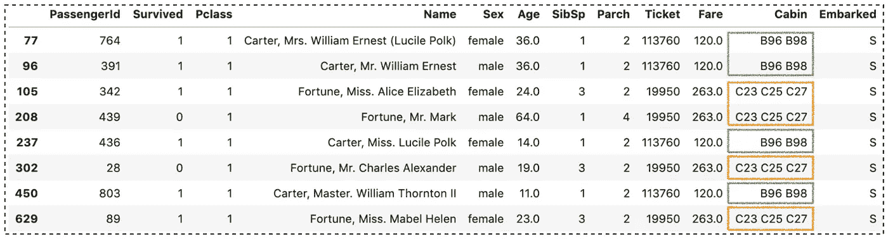

(图片由作者提供)

# 6.按多个类别分组

到目前为止，我们已经向`groupby()`传递了一个标签，通过一列对数据进行分组。除了标签，我们还可以传递一个标签列表来处理多个分组。

```
# Creating a subset
df_subset = df.loc[:, ['Sex', 'Pclass', 'Age', 'Fare']]# Group by multiple categories
df_subset.groupby(**['Sex', 'Pclass']**).mean()
```

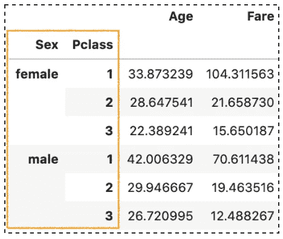

(图片由作者提供)

# 7.用`as_index`重置索引

按多个类别分组将产生一个多索引数据框架。但是，当我们需要执行一些数据分析时，将 **Sex** 和 **Pclass** 列作为索引是不实际的(见上图)。

我们可以调用 DataFrame 上的`reset_index()`方法来重置它们，并使用默认的从 0 开始的整数索引。

```
df_groupby_multi = subset.groupby(['Sex', 'Pclass']).mean()# Resetting index
df_groupby_multi**.reset_index()**
```

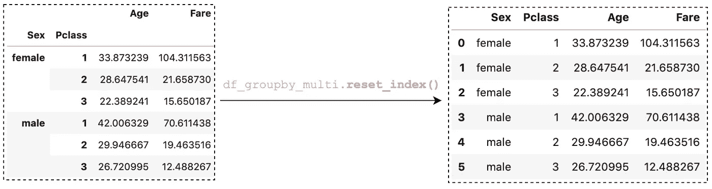

(图片由作者提供)

但是使用`as_index`参数有一个更有效的方法。参数是配置索引是否是组标签。如果设置为`False`，组标签表示为列而不是索引。

```
subset.groupby(['Sex', 'Pclass'], **as_index=False**).mean()
```

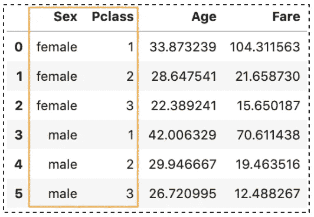

(图片由作者提供)

# 8.处理缺失值

默认情况下，`groupby()`函数会忽略缺失的值。让我们首先在性别列中创建一些缺失值。

```
# Creating missing value in the Sex column
**subset.iloc[80:100, 0] = np.nan**# Validating the missing values
subset.isna().sum()**Sex        20**
Pclass      0
Age       146
Fare        0
dtype: int64
```

在计算**性别**列中每个类别的平均值时，我们不会得到任何关于缺失值的信息。

```
# The groupby function ignores the missing values by default.
subset**.groupby(['Sex', 'Pclass'])**.mean()
```

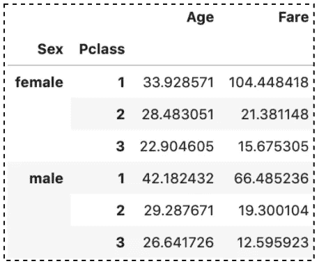

(图片由作者提供)

在某些情况下，我们还需要了解缺失值的概况。我们可以将`dropna`参数设置为`False`来包含丢失的值。

```
subset.groupby(['Sex', 'Pclass'], **dropna=False**).mean()
```

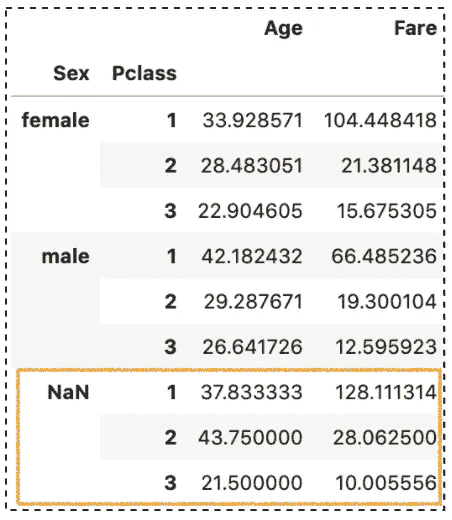

(图片由作者提供)

# 结论

Pandas `groupby()`函数是数据分析中应用最广泛的函数之一。它非常重要，因为它能够聚合、转换和过滤每个组中的数据。

我希望这篇文章能帮助你节省学习熊猫的时间。我建议你查看一下关于`groupby()` API 的[文档](https://pandas.pydata.org/pandas-docs/stable/reference/api/pandas.DataFrame.groupby.html)，并了解你可以做的其他事情。

感谢阅读。请查看[笔记本](https://github.com/BindiChen/machine-learning/blob/master/data-analysis/032-pandas-groupby/pandas-groupby.ipynb)获取源代码，如果您对机器学习的实用方面感兴趣，请继续关注。

## 你可能会对我的其他一些熊猫文章感兴趣:

*   [所有熊猫 json_normalize()你应该知道的扁平化 JSON](/all-pandas-json-normalize-you-should-know-for-flattening-json-13eae1dfb7dd)
*   [使用熊猫方法链接提高代码可读性](https://medium.com/@bindiatwork/using-pandas-method-chaining-to-improve-code-readability-d8517c5626ac)
*   [如何对熊猫数据帧进行自定义排序](/how-to-do-a-custom-sort-on-pandas-dataframe-ac18e7ea5320)
*   [为了数据分析你应该知道的所有熊猫移位()](/all-the-pandas-shift-you-should-know-for-data-analysis-791c1692b5e)
*   [何时使用熊猫变换()函数](/when-to-use-pandas-transform-function-df8861aa0dcf)
*   [你应该知道的熊猫串联()招数](/pandas-concat-tricks-you-should-know-to-speed-up-your-data-analysis-cd3d4fdfe6dd)
*   [Pandas 中应用()和转换()的区别](https://medium.com/@bindiatwork/difference-between-apply-and-transform-in-pandas-242e5cf32705)
*   [所有熊猫合并()你应该知道](/all-the-pandas-merge-you-should-know-for-combining-datasets-526b9ecaf184)
*   [在熊猫数据帧中处理日期时间](/working-with-datetime-in-pandas-dataframe-663f7af6c587)
*   [熊猫阅读 _csv()你应该知道的招数](https://medium.com/@bindiatwork/all-the-pandas-read-csv-you-should-know-to-speed-up-your-data-analysis-1e16fe1039f3)
*   [用 Pandas read_csv()](/4-tricks-you-should-know-to-parse-date-columns-with-pandas-read-csv-27355bb2ad0e) 解析日期列应该知道的 4 个技巧

更多教程可以在我的 [Github](https://github.com/BindiChen/machine-learning) 上找到

## 参考

*   [1]熊猫官方教程:[分组依据:拆分-应用-合并](https://pandas.pydata.org/pandas-docs/stable/user_guide/groupby.html)