# 扁平化 json 你应该知道的所有熊猫 json_normalize()

> 原文：<https://towardsdatascience.com/all-pandas-json-normalize-you-should-know-for-flattening-json-13eae1dfb7dd?source=collection_archive---------0----------------------->

## 一些最有用的熊猫把戏


所有熊猫 json_normalize()你应该知道的扁平化 json(图片由作者使用[canva.com](https://www.canva.com/))

读取数据是任何数据科学项目的第一步。作为机器学习实践者或数据科学家，您肯定会遇到 JSON (JavaScript 对象表示法)数据。JSON 是一种广泛使用的存储和交换数据的格式。比如像 MongoDB 这样的 NoSQL 数据库是以 JSON 格式存储数据的，REST API 的响应大多是以 JSON 的形式提供的。

虽然这种格式很适合存储和交换数据，但需要转换成表格形式以便进一步分析。您可能要处理两种类型的 JSON 结构，一个 JSON 对象或一个 JSON 对象列表。在内部 Python 行话中，你最有可能处理的是一个字典或字典列表。

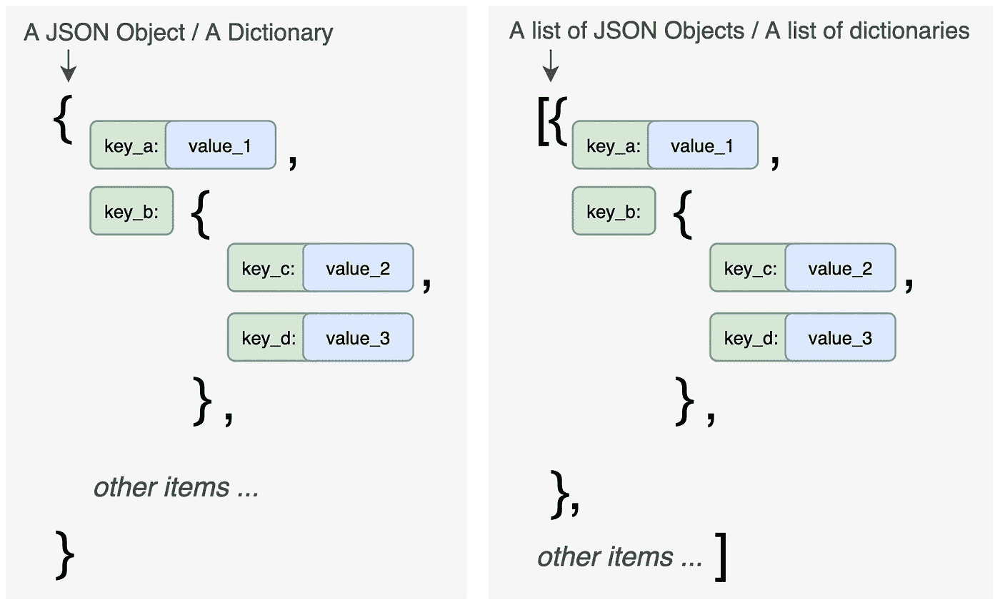

字典和字典列表(图片由作者提供)

在本文中，您将学习如何使用 Pandas 的内置函数`json_normalize()`将这两种类型的 JSON 展平成 Pandas 数据帧。这篇文章的结构如下:

1.  简化一个简单的 JSON
2.  用多个级别扁平化 JSON
3.  用嵌套列表扁平化 JSON
4.  如果键不总是存在，则忽略 **KeyError**
5.  使用`sep`自定义分隔符
6.  为元数据和记录数据添加前缀
7.  使用本地文件
8.  使用 URL

请查看[笔记本](https://github.com/BindiChen/machine-learning/blob/master/data-analysis/028-pandas-json_normalize/pandas-json_normalize.ipynb)获取源代码。

# 1.简化一个简单的 JSON

让我们从 2 个简单的 JSON、一个简单的 dict 和一个简单的 dict 列表开始。

## 当 JSON 是一个简单的字典时

```
a_dict = {
    'school': 'ABC primary school',
    'location': 'London',
    'ranking': 2,
}df = **pd.json_normalize(a_dict)**
```

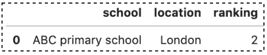

(图片由作者提供)

结果看起来很棒。让我们来看看使用`df.info()`的数据类型。我们可以看到，数值列被转换为数值类型。

```
>>> **df.info()**<class 'pandas.core.frame.DataFrame'>
RangeIndex: 1 entries, 0 to 0
Data columns (total 3 columns):
 #   Column    Non-Null Count  Dtype 
---  ------    --------------  ----- 
 0   school    1 non-null      object
 1   location  1 non-null      object
 2   ranking   1 non-null      **int64** 
dtypes: int64(1), object(2)
memory usage: 152.0+ bytes
```

## 当数据是字典列表时

```
json_list = [
    { 'class': 'Year 1', 'student number': 20, 'room': 'Yellow' },
    { 'class': 'Year 2', 'student number': 25, 'room': 'Blue' },
]**pd.json_normalize(json_list)**
```

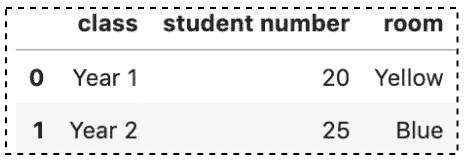

(图片由作者提供)

结果看起来很棒。`json_normalize()`函数能够将列表中的每条记录转换成一行表格形式。

不总是出现的键怎么办，例如，***num _ of _ students***在第二条记录中不可用。

```
json_list = [
    { 'class': 'Year 1', 'num_of_students': 20, 'room': 'Yellow' },
    **{ 'class': 'Year 2', 'room': 'Blue' }, # no num_of_students**
]pd.json_normalize(json_list)
```

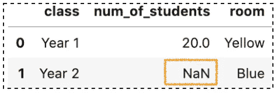

(图片由作者提供)

我们可以看到没有抛出错误，那些丢失的键显示为`NaN`。

# 2.用多个级别扁平化 JSON

熊猫`json_normalize()`非常适合简单的 JSON(被称为扁平化 JSON)。多层次的 JSON 呢？

## 当数据是字典时

让我们先来看看下面的格言:

```
json_obj = {
    'school': 'ABC primary school',
    'location': 'London',
    'ranking': 2,
    **'info': {
        'president': 'John Kasich',
        'contacts': {
          'email': {
              'admission': '**[**admission@abc.com**](mailto:admission@abc.com)**',
              'general': '**[**info@abc.com**](mailto:info@abc.com)**'
          },
          'tel': '123456789',
      }
    }**
}
```

**info** 的值是多级的(称为嵌套字典)。通过调用`pd.json_normalize(json_obj)`，我们得到:

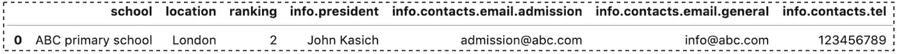

结果看起来很棒。所有嵌套值都被展平并转换为单独的列。

如果您不想深入到每个值，请使用`max_level`参数。使用参数`max_level=1`，我们可以看到我们的嵌套值 **contacts** 被放到一个单独的列 **info.contacts** 中。

```
pd.json_normalize(data, **max_level=1**)
```

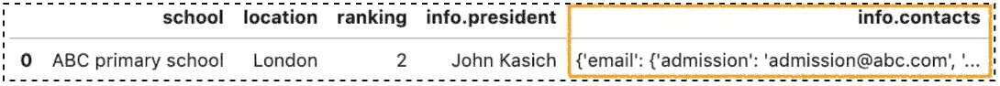

(图片由作者提供)

## 当数据是字典列表时

```
json_list = [
    { 
        'class': 'Year 1', 
        'student count': 20, 
        'room': 'Yellow',
        'info': {
            'teachers': { 
                'math': 'Rick Scott', 
                'physics': 'Elon Mask' 
            }
        }
    },
    { 
        'class': 'Year 2', 
        'student count': 25, 
        'room': 'Blue',
        'info': {
            'teachers': { 
                'math': 'Alan Turing', 
                'physics': 'Albert Einstein' 
            }
        }
    },
]pd.json_normalize(json_list)
```

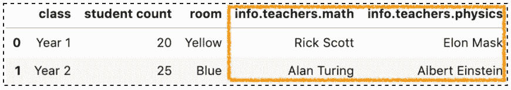

(图片由作者提供)

我们可以看到，列表的每个记录中的所有嵌套值都被展平并转换为单独的列。类似地，我们可以使用`max_level`参数来限制级别的数量，例如

```
pd.json_normalize(json_list, **max_level=1**)
```

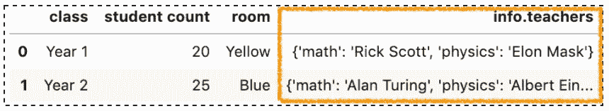

(图片由作者提供)

# 3.用嵌套列表扁平化 JSON

有嵌套列表的 JSON 呢？

## 当数据是字典时

让我们看看如何将下面的 JSON 展平到一个数据帧中:

```
json_obj = {
    'school': 'ABC primary school',
    'location': 'London',
    'ranking': 2,
    'info': {
        'president': 'John Kasich',
        'contacts': {
          'email': {
              'admission': '[admission@abc.com](mailto:admission@abc.com)',
              'general': '[info@abc.com](mailto:info@abc.com)'
          },
          'tel': '123456789',
      }
    },
    **'students': [
      { 'name': 'Tom' },
      { 'name': 'James' },
      { 'name': 'Jacqueline' }
    ],**
}
```

注意**学生**的值是一个嵌套列表。通过调用`pd.json_normalize(json_obj)`，我们得到:

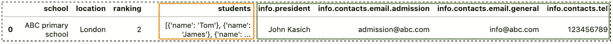

(图片由作者提供)

我们可以看到，我们的嵌套列表被放入一个单独的列 **students** 中，其他值被展平。如何才能将嵌套列表扁平化？为此，我们可以将参数`record_path`设置为`['students']`:

```
# Flatten students
pd.json_normalize(data, **record_path=['students']**)
```

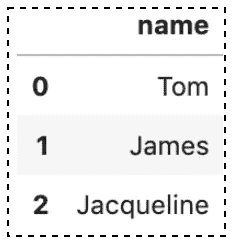

(图片由作者提供)

结果看起来很棒但是不包括**学校**和**电话。为了包含它们，我们可以使用参数`meta`来指定我们想要的结果中的元数据列表。**

```
pd.json_normalize(
    json_obj, 
    record_path =['students'],
    **meta=['school', ['info', 'contacts', 'tel']],**
)
```

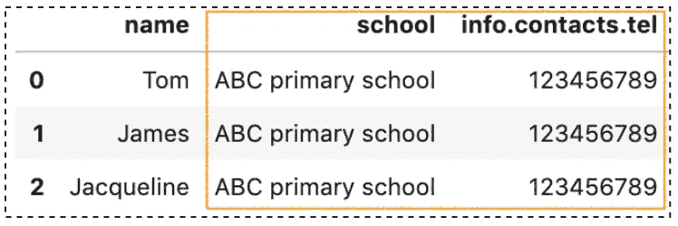

(图片由作者提供)

## 当数据是字典列表时

```
json_list = [
    { 
        'class': 'Year 1', 
        'student count': 20, 
        'room': 'Yellow',
        'info': {
            'teachers': { 
                'math': 'Rick Scott', 
                'physics': 'Elon Mask' 
            }
        },
        **'students': [
            { 
                'name': 'Tom', 
                'sex': 'M', 
                'grades': { 'math': 66, 'physics': 77 } 
            },
            { 
                'name': 'James', 
                'sex': 'M', 
                'grades': { 'math': 80, 'physics': 78 } 
            },
        ]**
    },
    { 
        'class': 'Year 2', 
        'student count': 25, 
        'room': 'Blue',
        'info': {
            'teachers': { 
                'math': 'Alan Turing', 
                'physics': 'Albert Einstein' 
            }
        },
        **'students': [
            { 'name': 'Tony', 'sex': 'M' },
            { 'name': 'Jacqueline', 'sex': 'F' },
        ]**
    },
]pd.json_normalize(json_list)
```

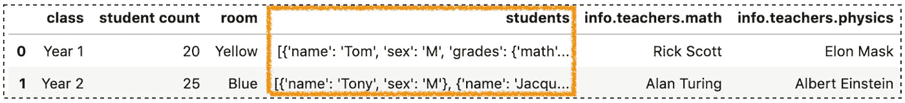

(图片由作者提供)

所有嵌套的列表都放在一个单独的列中**学生**，其他值被展平。为了展平嵌套列表，我们可以将参数`record_path`设置为`['students']`。请注意，并非所有记录都有**数学**和**物理**，那些缺失的值显示为`NaN`。

```
pd.json_normalize(json_list, **record_path=['students']**)
```

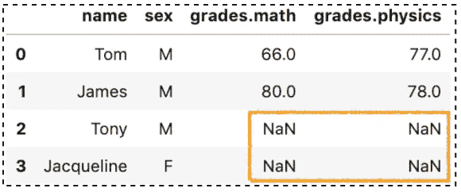

(图片由作者提供)

如果您想包含其他元数据，请使用参数`meta`:

```
pd.json_normalize(
    json_list, 
    record_path =['students'], 
    **meta=['class', 'room', ['info', 'teachers', 'math']]**
)
```

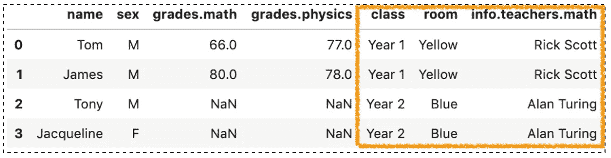

(图片由作者提供)

# 4.`errors`参数

`errors`参数默认为`'raise’`，如果`meta`中列出的键并不总是存在，将引发 **KeyError** 。例如，数学老师从第二条记录中不可用。

```
data = [
    { 
        'class': 'Year 1', 
        'student count': 20, 
        'room': 'Yellow',
        'info': {
            'teachers': { 
                **'math': 'Rick Scott',** 
                'physics': 'Elon Mask',
            }
        },
        'students': [
            { 'name': 'Tom', 'sex': 'M' },
            { 'name': 'James', 'sex': 'M' },
        ]
    },
    { 
        'class': 'Year 2', 
        'student count': 25, 
        'room': 'Blue',
        'info': {
            'teachers': { 
                 **# no math teacher**
                 'physics': 'Albert Einstein'
            }
        },
        'students': [
            { 'name': 'Tony', 'sex': 'M' },
            { 'name': 'Jacqueline', 'sex': 'F' },
        ]
    },
]
```

当试图拉平数学时，将抛出一个 **KeyError** 。

```
pd.json_normalize(
    data, 
    record_path =['students'], 
    meta=['class', 'room', **['info', 'teachers', 'math']**],
)
```

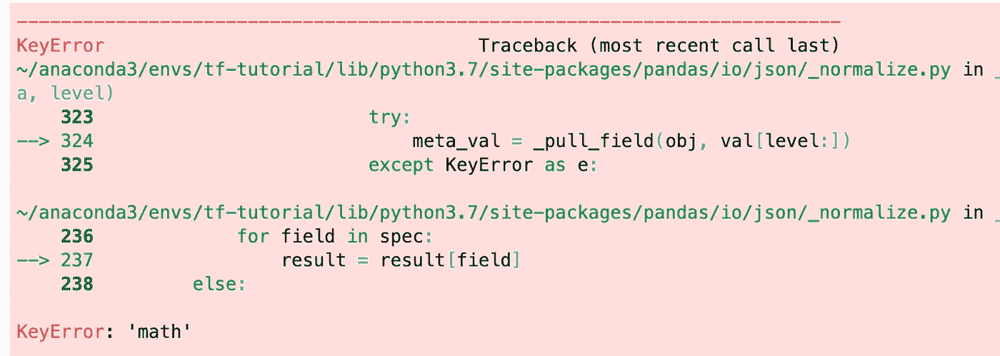

(图片由作者提供)

为了解决这个问题，将参数`errors`设置为`'ignore'`，那些缺少的值用`NaN`填充。

```
pd.json_normalize(
    data, 
    record_path =['students'], 
    meta=['class', 'room', ['info', 'teachers', 'math']],
    **errors='ignore'**
)
```

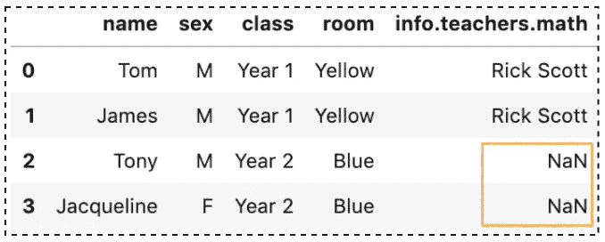

(图片由作者提供)

# 5.使用`sep`参数的自定义分隔符

默认情况下，所有嵌套值将生成由`.`分隔的列名。例如 **info.teachers.math** 。要用其他东西分隔列名，可以使用`sep`参数。

```
pd.json_normalize(
    data, 
    record_path =['students'], 
    meta=['class', 'room', ['info', 'teachers', 'math']],
    **sep='->'**
)
```

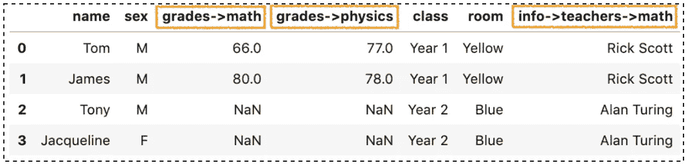

(图片由作者提供)

# 6.为元数据和记录数据添加前缀

有时，为列名添加前缀可能更具描述性。为了对`meta`和`record_path`执行此操作，我们可以简单地将字符串分别传递给参数`meta_prefix`和`record_prefix`:

```
pd.json_normalize(
    data, 
    record_path=['students'], 
    meta=['class'],
    **meta_prefix='meta-',**
    **record_prefix='student-'**
)
```

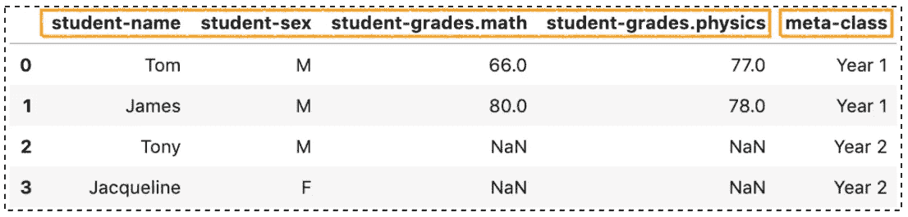

(图片由作者提供)

# 7.使用本地文件

通常，您将处理的 JSON 数据作为一个**存储在本地。json** 文件。然而，Pandas `json_normalize()`函数只接受一个字典或字典列表。要解决这个问题，你需要第三个模块的帮助，例如 Python **json** 模块:

```
**import json**
# load data using Python JSON module
**with open('data/simple.json','r') as f:**
    **data = json.loads(f.read())**

# Flattening JSON data
pd.json_normalize(data)
```

`data = json.loads(f.read())`使用 Python **json** 模块加载数据。之后，对数据调用`json_normalize()`将其展平成 DataFrame。

# 8.使用 URL

JSON 是在 REST APIs 中传输数据的标准格式。通常，您需要使用 JSON 格式的 API 响应。最简单的方法是使用 Python **请求**模块:

```
**import requests**URL = '[http://raw.githubusercontent.com/BindiChen/machine-learning/master/data-analysis/027-pandas-convert-json/data/simple.json'](http://raw.githubusercontent.com/BindiChen/machine-learning/master/data-analysis/027-pandas-convert-json/data/simple.json')
**data = json.loads(requests.get(URL).text)**# Flattening JSON data
pd.json_normalize(data)
```

# 结论

Pandas `json_normalize()`函数是将 JSON 展平成数据帧的一种快速、方便和强大的方式。

我希望这篇文章能帮助你节省整理 JSON 数据的时间。我建议你查看一下`json_normalize()` API 的[文档](https://pandas.pydata.org/pandas-docs/stable/reference/api/pandas.json_normalize.html)，并了解你可以做的其他事情。

感谢阅读。请查看[笔记本](https://github.com/BindiChen/machine-learning/blob/master/data-analysis/028-pandas-json_normalize/pandas-json_normalize.ipynb)获取源代码，如果您对机器学习的实用方面感兴趣，请继续关注。

## 你可能会对我的其他一些熊猫文章感兴趣:

*   [Pandas cut()函数，用于将数值数据转换为分类数据](/all-pandas-cut-you-should-know-for-transforming-numerical-data-into-categorical-data-1370cf7f4c4f)
*   [使用熊猫方法链接提高代码可读性](https://medium.com/@bindiatwork/using-pandas-method-chaining-to-improve-code-readability-d8517c5626ac)
*   [如何对熊猫数据帧进行自定义排序](/how-to-do-a-custom-sort-on-pandas-dataframe-ac18e7ea5320)
*   [数据分析你应该知道的所有熊猫移位()](/all-the-pandas-shift-you-should-know-for-data-analysis-791c1692b5e)
*   [何时使用 Pandas transform()函数](/when-to-use-pandas-transform-function-df8861aa0dcf)
*   [你应该知道的熊猫串联()招数](/pandas-concat-tricks-you-should-know-to-speed-up-your-data-analysis-cd3d4fdfe6dd)
*   [Pandas 中 apply()和 transform()的区别](https://medium.com/@bindiatwork/difference-between-apply-and-transform-in-pandas-242e5cf32705)
*   [所有的熊猫合并()你应该知道](/all-the-pandas-merge-you-should-know-for-combining-datasets-526b9ecaf184)
*   [在 Pandas 数据帧中处理日期时间](/working-with-datetime-in-pandas-dataframe-663f7af6c587)
*   [熊猫阅读 _csv()你应该知道的招数](https://medium.com/@bindiatwork/all-the-pandas-read-csv-you-should-know-to-speed-up-your-data-analysis-1e16fe1039f3)
*   [你应该知道的用熊猫 read_csv()解析日期列的 4 个技巧](/4-tricks-you-should-know-to-parse-date-columns-with-pandas-read-csv-27355bb2ad0e)

更多教程可以在我的 [Github](https://github.com/BindiChen/machine-learning) 上找到