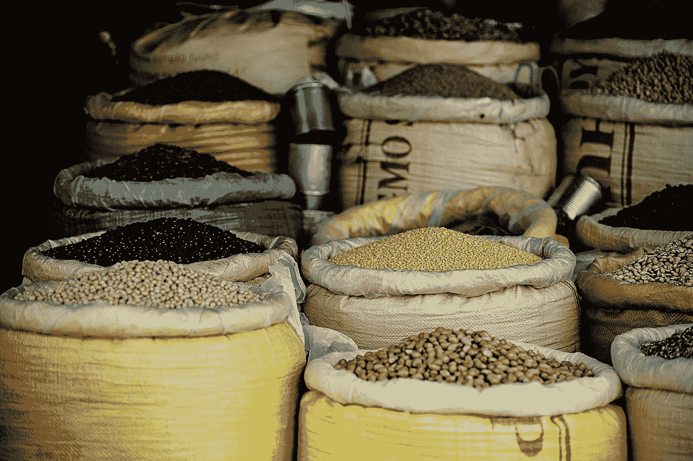

# 基于样本分位数的宁滨数字数据

> 原文：<https://towardsdatascience.com/all-pandas-qcut-you-should-know-for-binning-numerical-data-based-on-sample-quantiles-c8b13a8ed844?source=collection_archive---------9----------------------->

## 将数值数据转换成分类数据的技巧和诀窍



照片由 [v2osk](https://unsplash.com/@v2osk?utm_source=unsplash&utm_medium=referral&utm_content=creditCopyText) 在 [Unsplash](https://unsplash.com/s/photos/category?utm_source=unsplash&utm_medium=referral&utm_content=creditCopyText) 上拍摄

数值型数据在数据分析中很常见。通常情况下，您会得到连续的、大范围的或高度倾斜的数值数据。有时，将这些数据绑定到离散的区间会更容易。当值被分成有意义的类别时，这对于执行描述性统计非常有帮助。例如，用年龄组代替确切的年龄，用体重级别代替确切的体重，用年级级别代替确切的分数。

Pandas 有两个内置函数`cut()`和`qcut()`，用于将数值数据转换为分类数据。

*   `cut()`根据箱边缘将数据装入离散区间
*   **`qcut()`根据样本分位数将数据分入离散区间**

****在上一篇文章中，我们已经介绍了`cut()`函数。****

****[](/all-pandas-cut-you-should-know-for-transforming-numerical-data-into-categorical-data-1370cf7f4c4f) [## 所有熊猫切()你应该知道把数值数据转换成分类数据

### 数值型数据在数据分析中很常见。通常你有连续的数字数据，或非常大的规模，或…

towardsdatascience.com](/all-pandas-cut-you-should-know-for-transforming-numerical-data-into-categorical-data-1370cf7f4c4f) 

在本文中，您将学习如何使用`qcut()`基于样本分位数对数字数据进行分类。这篇文章的结构如下:

1.  离散成大小相等的桶
2.  用分位数列表离散化到桶中
3.  添加自定义标签
4.  带`retbins=True`的回收箱
5.  配置箱精度

> 请查看[笔记本](https://github.com/BindiChen/machine-learning/blob/master/data-analysis/041-pandas-qcut/pandas-qcut.ipynb)获取源代码。
> 
> 访问 [Github Repo](https://github.com/BindiChen/machine-learning) 获取其他教程**** 

# ****1.离散成大小相等的桶****

****与[熊猫](/all-pandas-cut-you-should-know-for-transforming-numerical-data-into-categorical-data-1370cf7f4c4f)类似，`qcut()`最简单的用法必须有一列和一个整数作为输入。它将值离散化到大小相等的桶中:****

```
**df = pd.DataFrame({
   'age': [2, 67, 40, 32, 4, 15, 82, 99, 26, 30, 50, 78]
})df['age_group'] = pd.qcut(**df['age']**, 3)**
```

********

****作者图片****

****让我们数一数有多少个值落入每个容器中。****

```
**df['age_group']**.value_counts()**(1.999, 28.667]     4
(28.667, 55.667]    4
(55.667, 99.0]      4
Name: age_group, dtype: int64**
```

****我们可以看到已经选择了箱，因此结果在每个箱中具有相同数量的记录(称为**大小相等的桶**)。****

****此外，您可能会注意到那些区间值在开头有一个圆括号，在结尾有一个方括号，例如`(1.999, 28.667]`。基本意思是圆括号边的任何值都不包含在区间内，方括号边的任何值都包含在内(数学上称为**开区间和闭区间**)。****

****现在，让我们来看看新的专栏**年龄组**。****

********

****作者图片****

****显示`dtype: category`，有三个标签值:`**(1.999, 28.667]**`、`**(28.667, 55.667]**`和`**(55.667, 99.0]**`。这些标签值按照符号`<`的指示进行排序。让我们按列**年龄组**对数据帧进行排序:****

```
**df.**sort_values('age_group')****
```

********

****作者图片****

# ****2.用分位数列表离散化到桶中****

****先前方法的一个问题是，结果在每个箱中总是具有相同数量的记录。换句话说，每个箱具有相同的比例/百分比。例如:****

```
**pd.qcut(df['age'], **2**) 
Result: **|<- 50% ->|<- 50% ->|**pd.qcut(df['age'], **3**) 
Result: **|<- 33.3% ->|<- 33.3% ->|<- 33.3% ->|**pd.qcut(df['age'], **4**)
Result: **|<- 25% ->|<- 25% ->|<- 25% ->|<- 25% ->|**pd.qcut(df['age'], **5**)
Result: **|<- 20% ->|<- 20% ->|<- 20% ->|<- 20% ->|<- 20% ->|****
```

****在某些情况下，您可能希望明确选择比例，而不是大小相等的存储桶，例如:****

```
**10%, 40%, 50%**
```

****为此，我们可以将一个分位数列表传递给第二个参数。****

```
**df['age_group'] = pd.qcut(df['age'], **[0, .1, .5, 1]**)df.sort_values('age_group')**
```

********

****作者图片****

****注意，4 个值`[0, .1, .5, 1]`用于产生 3 个比例/百分比`10%`、`40%`和`50%`****

****为了验证结果，让我们按如下方式对每个容器中的值进行排序和计数:****

```
**df.sort_values('age_group')['age_group']**.value_counts()****(36.0, 99.0]    6
(5.1, 36.0]     4
(1.999, 5.1]    2**
Name: age_group, dtype: int64**
```

# ****3.添加自定义标签****

****将这些**年龄段**的价值观贴上“千禧一代”、“X 世代”、“婴儿潮一代”、“最伟大”的标签更能说明问题。为此，我们可以简单地将列表中的值传递给参数`labels`****

```
****labels=['Millennial', 'Gen X', 'Boomer', 'Greatest']**
df['age_group'] = pd.qcut(df['age'], [0, .1, 0.3, .6, 1], **labels=labels**)**
```

********

****作者图片****

****现在，当我们查看该列时，它显示的是标签****

```
**df['age_group']0     Millennial
1       Greatest
2         Boomer
3         Boomer
4     Millennial
5          Gen X
6       Greatest
7       Greatest
8          Gen X
9         Boomer
10      Greatest
11      Greatest
Name: age_group, dtype: category
Categories (4, object): ['Millennial' < 'Gen X' < 'Boomer' < 'Greatest']**
```

****同样，在分类和计数时，它会显示标签****

```
**df.sort_values('age_group')**
```

********

****作者图片****

```
**df['age_group'].**value_counts().sort_index()**Millennial    2
Gen X         2
Boomer        3
Greatest      5
Name: age_group, dtype: int64**
```

# ****4.用`retbins=True`返回箱子****

****有一个名为`retbin`的参数用于返回 bin。如果设置为`True`，结果将返回`bins`。当第二个参数`q`作为单个数值传递时，这很有用。****

```
**result, **bins** = pd.qcut(
    df['age'], 
    **5,                  # A single number value**
    retbins=True
)# Print out bins value
**bins**
array([ 2\. , 17.2, 30.8, 46\. , 75.8, 99\. ])**
```

# ****5.配置箱精度****

****您可能会注意到，到目前为止我们制作的所有 bin 间隔值都有一些小数点，例如`pd.qcut(df['age'], 3)`****

```
**pd.qcut(df['age'], 3)0      (1.999, 28.667]
1       (55.667, 99.0]
2     (28.667, 55.667]
3     (28.667, 55.667]
4      (1.999, 28.667]
5      (1.999, 28.667]
6       (55.667, 99.0]
7       (55.667, 99.0]
8      (1.999, 28.667]
9     (28.667, 55.667]
10    (28.667, 55.667]
11      (55.667, 99.0]
Name: age, dtype: category
Categories (3, interval[float64]): [**(1.999, 28.667] < (28.667, 55.667] < (55.667, 99.0]**]**
```

****一般来说，年龄组间隔不使用小数位。幸运的是，有一个名为`precision`的参数来定义在计算 bin 精度时使用多少个小数点。我们可以将`precision`设置为`0`来避免任何小数位。****

```
**pd.qcut(df['age'], 3, **precision=0**)0      (1.0, 29.0]
1     (56.0, 99.0]
2     (29.0, 56.0]
3     (29.0, 56.0]
4      (1.0, 29.0]
5      (1.0, 29.0]
6     (56.0, 99.0]
7     (56.0, 99.0]
8      (1.0, 29.0]
9     (29.0, 56.0]
10    (29.0, 56.0]
11    (56.0, 99.0]
Name: age, dtype: category
Categories (3, interval[float64]): [**(1.0, 29.0] < (29.0, 56.0] < (56.0, 99.0]**]**
```

****您也可以将其设置为任何其他值，例如`precision=1`表示 1 位小数。****

```
**pd.qcut(df['age'], 3, **precision=1**)0      (1.9, 28.7]
1     (55.7, 99.0]
2     (28.7, 55.7]
3     (28.7, 55.7]
4      (1.9, 28.7]
5      (1.9, 28.7]
6     (55.7, 99.0]
7     (55.7, 99.0]
8      (1.9, 28.7]
9     (28.7, 55.7]
10    (28.7, 55.7]
11    (55.7, 99.0]
Name: age, dtype: category
Categories (3, interval[float64]): [(1.9, 28.7] < (28.7, 55.7] < (55.7, 99.0]]**
```

# ****结论****

****Pandas `qcut()`函数是一种基于样本分位数的宁滨数值数据的快捷方式。****

****我希望这篇文章能帮助你节省学习熊猫的时间。我建议你查看一下`qcut()` API 的[文档](https://pandas.pydata.org/pandas-docs/stable/reference/api/pandas.qcut.html)，并了解你可以做的其他事情。****

****感谢阅读。请查看[笔记本](https://github.com/BindiChen/machine-learning/blob/master/data-analysis/041-pandas-qcut/pandas-qcut.ipynb)获取源代码，如果您对机器学习的实用方面感兴趣，请继续关注。****

## ****你可能会对我的其他一些熊猫文章感兴趣:****

*   ****[熊猫系列实用介绍](/a-practical-introduction-to-pandas-series-9915521cdc69)****
*   ****[使用熊猫方法链接提高代码可读性](https://medium.com/@bindiatwork/using-pandas-method-chaining-to-improve-code-readability-d8517c5626ac)****
*   ****如何对熊猫数据帧进行自定义排序****
*   ****[为了数据分析你应该知道的所有熊猫移位()](/all-the-pandas-shift-you-should-know-for-data-analysis-791c1692b5e)****
*   ****[何时使用 Pandas transform()函数](/when-to-use-pandas-transform-function-df8861aa0dcf)****
*   ****[你应该知道的熊猫串联()招数](/pandas-concat-tricks-you-should-know-to-speed-up-your-data-analysis-cd3d4fdfe6dd)****
*   ****[熊猫的应用()和变换()的区别](https://medium.com/@bindiatwork/difference-between-apply-and-transform-in-pandas-242e5cf32705)****
*   ****[所有熊猫合并()你应该知道](/all-the-pandas-merge-you-should-know-for-combining-datasets-526b9ecaf184)****
*   ****[在 Pandas 数据帧中处理日期时间](/working-with-datetime-in-pandas-dataframe-663f7af6c587)****
*   ****[熊猫阅读 _csv()你应该知道的招数](https://medium.com/@bindiatwork/all-the-pandas-read-csv-you-should-know-to-speed-up-your-data-analysis-1e16fe1039f3)****
*   ****[用 Pandas read_csv()解析日期列应该知道的 4 个技巧](/4-tricks-you-should-know-to-parse-date-columns-with-pandas-read-csv-27355bb2ad0e)****

****更多教程可以在我的 [Github](https://github.com/BindiChen/machine-learning) 上找到****