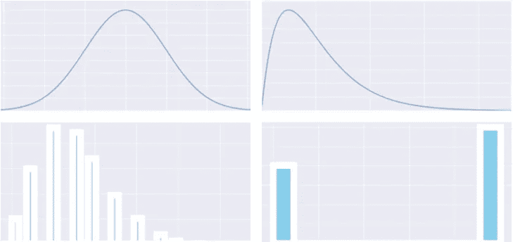
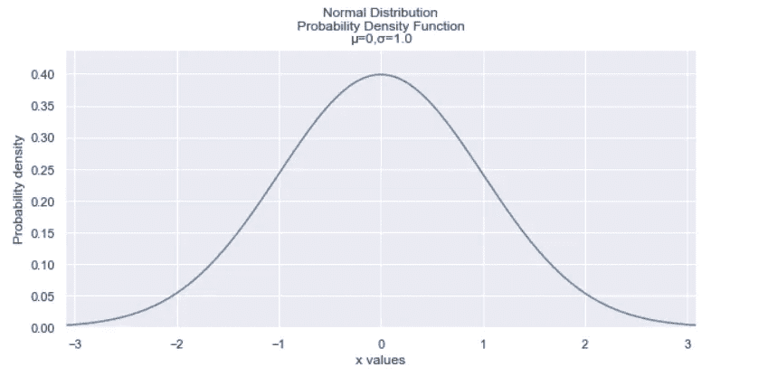
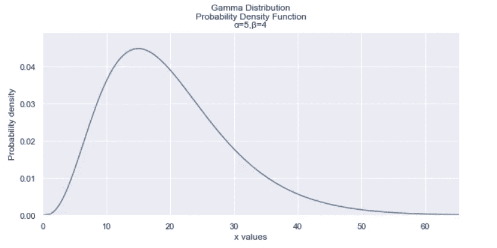
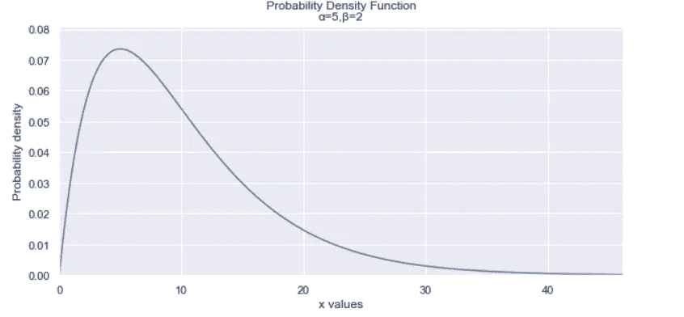
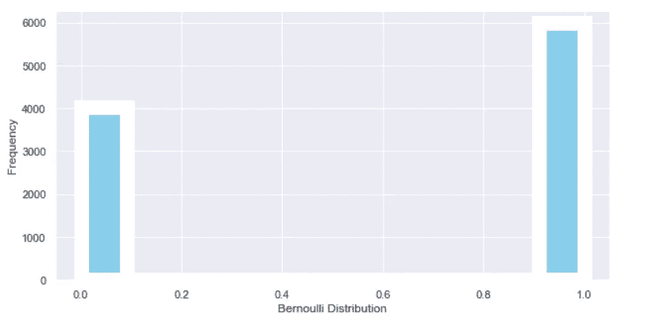
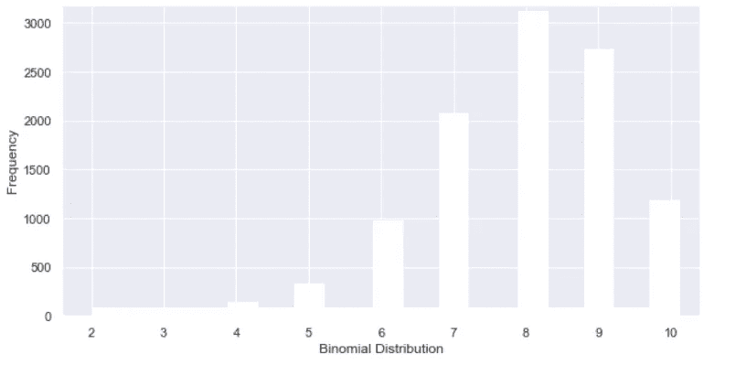
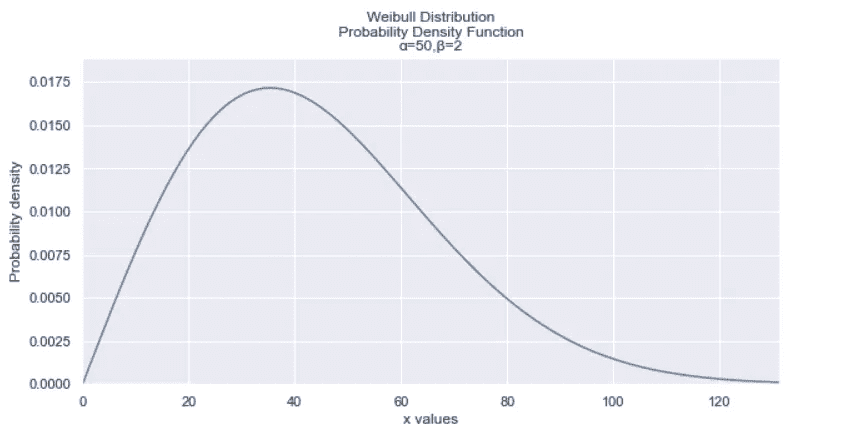
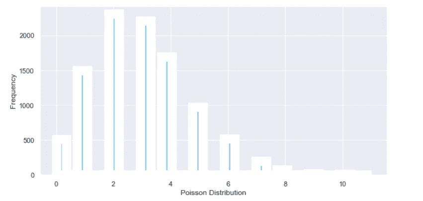
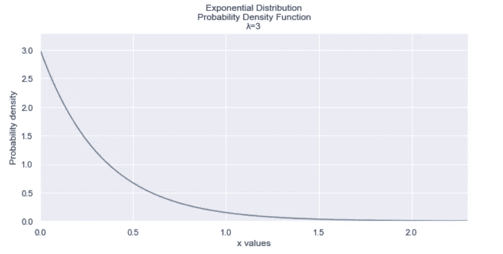

# 六分钟内解释所有概率分布

> 原文：<https://towardsdatascience.com/all-probability-distributions-explained-in-six-minutes-fe57b1d49600?source=collection_archive---------5----------------------->

## 最重要的概率分布的直观解释

作者创建的图像

# **简介**

当我第一次看到概率分布时，它是如此令人生畏，部分原因是它们太多了，而且它们都有如此陌生的名字。

快进到今天，我意识到它们实际上是非常简单的概念，当你去掉它们背后的所有数学知识时，这就是我们今天要做的。

我将从概念上回顾一下我认为最基本和最重要的概率分布，而不是进入事物的数学方面。

到本文结束时，你不仅会了解到几种概率分布，而且还会意识到其中许多分布彼此之间有多么密切的联系！

首先，你需要知道几个术语:

*   一个**概率分布**简单地显示了得到不同结果的概率。例如，翻转头或翻转尾的分布是 0.5 和 0.5。
*   **离散分布**是一种分布，其中数据可以呈现的值是**可数的**。
*   另一方面,**连续分布**是数据可以呈现的值**不可数**的分布。

> ***请务必*** [***订阅此处***](https://terenceshin.medium.com/membership) ***或至我的*** [***独家快讯***](https://terenceshin.substack.com/embed) ***千万不要错过另一篇关于数据科学的指南、技巧和提示、生活经验等！***

# 1.正态分布

作者创建的图像

正态分布可以说是最重要的分布，因为许多现象都符合这个分布。智商、身高、鞋码、出生体重都是正态分布的例子。

**正态分布**呈钟形曲线，具有以下特性:

*   它有对称的钟形
*   平均值和中值相等，都位于分布的中心
*   约 68%的数据落在平均值的 1 个标准偏差内，约 95%的数据落在平均值的 2 个标准偏差内，约 99.7%的数据落在平均值的 3 个标准偏差内。

正态分布也是统计学的一个组成部分，因为它是几种统计推断技术的基础，包括线性回归、置信区间和假设检验。

# 2.t 分布

t 分布类似于正态分布，但通常较短，尾部较厚。当样本量很小时，它用来代替正态分布。

需要注意的一点是，随着样本量的增加，t 分布收敛于正态分布。

> ***务必*** [***订阅此处***](https://terenceshin.medium.com/membership) ***或至我的*** [***独家快讯***](https://terenceshin.substack.com/embed) ***千万不要错过另一篇关于数据科学的指南、窍门和技巧、生活经验等！***

# 3.γ分布

作者创建的图像

伽玛分布用于预测未来事件发生之前的等待时间。当某事物的自然最小值为 0 时，这是有用的。

也是卡方分布和指数分布的广义分布(后面会讲到)。

# 4.卡方分布

作者创建的图像

如上所述，卡方分布是伽马分布的一个特例。由于卡方分布有很多内容，所以我不会讲得太详细，但它有几种用途:

*   它允许您估计总体标准差的置信区间
*   当基础分布为正态时，它是样本方差的分布
*   您可以测试预期值和观察值之间的差异偏差
*   你可以进行卡方检验

注意:如果这个版本让你感到困惑，不要太担心，因为下面的版本更容易理解和掌握！

# 5.均匀分布

均匀分布非常简单——每个结果都有相等的概率。这方面的一个例子是滚动染料。

上图显示了一个近似均匀分布的分布。

# 6.二项分布

作者创建的图像

为了理解伯努利分布，你首先需要知道什么是伯努利试验。**伯努利试验**是一个随机实验，只有两种可能的结果，成功或失败，每次成功的概率都是相同的。

因此，**伯努利分布**是一次伯努利试验的离散分布。

例如，投掷硬币可以用伯努利分布来表示，在染料上滚动奇数也是如此。

# 7.二项分布

作者创建的图像

现在您已经了解了伯努利分布，二项分布简单地表示了多次伯努利试验。具体来说，**二项式分布**是一种离散分布，表示从 n 次独立的伯努利试验中获得 x 次成功的概率。

下面是一些使用二项式分布的例子:

*   10 次掷硬币中有 5 次正面朝上的概率是多少？
*   100 封邮件中获得 10 次转化的概率是多少(假设转化概率相同)？
*   从 500 份客户反馈调查中得到 20 份回复的概率是多少(假设得到回复的概率相同)？

关于二项分布的一个有趣的事情是，当 n(伯努利试验的次数)变大时，它收敛到正态分布。

> ***务必*** [***订阅此处***](https://terenceshin.medium.com/membership) ***或至我的*** [***独家快讯***](https://terenceshin.substack.com/embed) ***千万不要错过另一篇关于数据科学的指南、窍门和技巧、生活经验等！***

# 8.几何分布

几何分布也与伯努利分布有关，就像二项式分布一样，只是它回答的问题略有不同。**几何分布**代表在第一次成功之前出现 x 次伯努利(p)失败的概率？换句话说，它回答了“在你第一次成功之前需要多少次尝试？”

这方面的一个例子是，“我需要买多少张彩票才能买到一张中奖的彩票？”

您还可以使用几何分布来找出在失败之前**伯努利(1-p)成功次数的概率。几何图形还可用于检查事件是否符合分布。**

# 9.威布尔分布

作者创建的图像

威布尔分布类似于几何分布，只是它是一种连续分布。因此，**威布尔分布**模拟了某件事情发生故障所需的时间或故障间隔时间。

威布尔分布可以回答如下问题:

*   一个特定的灯泡多久会熄灭？
*   顾客多久会有反应？

# 10.泊松分布

作者创建的图像

**泊松分布**是一个离散分布，代表一个事件在特定时间段内可能发生的次数。

泊松分布最常用于排队论，它回答了类似于“在给定的时间内有多少顾客可能会来(排队)”的问题。

# 11.指数分布

作者创建的图像

**指数分布**与泊松分布密切相关。如果到达是泊松分布，那么到达之间的时间(也称为到达间隔时间)具有指数分布。

# 感谢阅读！

> ***如果您喜欢这篇文章，请务必点击*** [***订阅此处***](https://terenceshin.medium.com/membership) ***或至我的*** [***独家快讯***](https://terenceshin.substack.com/embed) ***千万不要错过另一篇关于数据科学的指南、技巧和提示、生活经验等文章！***

不确定接下来要读什么？我为你选了另一篇文章:

 [## 2021 年你应该知道的所有机器学习算法

### 最流行的机器学习模型的直观解释

towardsdatascience.com](/all-machine-learning-algorithms-you-should-know-in-2021-2e357dd494c7) 

**又一个！**

 [## 数据科学面试中你应该知道的 10 个统计概念

### 学习聪明，不努力。

towardsdatascience.com](/10-statistical-concepts-you-should-know-for-data-science-interviews-373f417e7d11) 

# 特伦斯·申

*   ***如果你喜欢这个，*** [***订阅我的媒介***](https://terenceshin.medium.com/membership) ***获取独家内容！***
*   ***或*** [***跟我上***](https://medium.com/@terenceshin)
*   ***有兴趣合作吗？下面我们连线上***[***LinkedIn***](https://www.linkedin.com/in/terenceshin/)