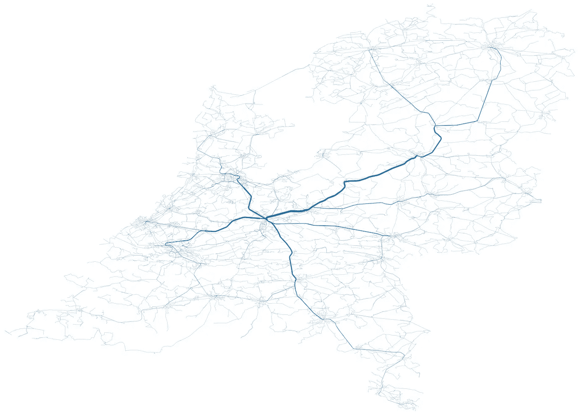

# 所有的公共交通都通向乌得勒支，而不是罗马

> 原文：<https://towardsdatascience.com/all-public-transport-leads-to-utrecht-not-rome-bb9674600e81?source=collection_archive---------38----------------------->

## [实践教程](https://towardsdatascience.com/tagged/hands-on-tutorials)

## 我们都知道“条条大路通罗马”这句谚语。在这篇文章中，我会告诉你这在定义上不适用于公共交通。事实上，在荷兰，所有的公共交通都通往乌得勒支。

通往乌得勒支的所有公共交通路线详情(图片由作者提供)

是的，我们都知道“条条大路通罗马”这句话。在这篇文章中，我将展示在过去的 2000 年里发生了很多变化。“条条大路通罗马”可能仍然是对的，但在荷兰，公共交通不是这样。都去乌得勒支，乌得勒支中央车站。有几个通往罗马的所有道路的可视化，但我将第一次向你展示公共交通前往乌得勒支。

这将基于荷兰的 [GTFS 数据](http://gtfs.ovapi.nl/nl/)，行程规划器 [OpenTripPlanner](https://opentripplanner.org/) 和一些带有 [GeoPandas](https://geopandas.org/) 和 Python 的魔法。这些将用于计算所有公共交通站和乌得勒支之间的路线，并绘制路线图。

这篇文章的完整代码可以在 G [ithub](https://github.com/lmeulen/GTFS-Visuals) 上找到。

## 计算所有到乌得勒支的路线

第一步是计算从该国所有公共交通站点到乌得勒支的所有路线。所有计划计算都使用 OTP 执行。OTP 需要一个 OpenStreetMap PBF 文件，其中包含您感兴趣区域的街道和步行时间，以及 GTFS 的公共交通时刻表。OTP jar 是从 [Maven](https://repo1.maven.org/maven2/org/opentripplanner/otp/2.0.0/) 下载的。阴影部分是为了简单起见，因为它包括了所有的依赖项。OSM PBF 从 [GeoFabrik](https://download.geofabrik.de/europe/netherlands.html) 获得，命名为‘Netherlands-latest-osm . pbf’。GTFS 从 [OVapi](http://gtfs.ovapi.nl/nl/) 下载，并以 zip ('gtfs-nl.zip ')格式下载。这三个文件都存储在同一个位置。

OTP 从命令行启动:

它将在当前目录中找到 OSM 和 GTFS 文件，并开始构建网络图。由于规模(我们正在创建一个整个国家的地图，而不是一个单一的城市)这将需要一些时间，但最终 OTP 服务器启动。需要 12G 的堆大小才能在内存中加载网络图。要测试服务器，请尝试 URL[http://localhost:8080](http://localhost:8080/)。除了 web 接口之外，还有一个 REST API 用于使用 OTP-server，它将在下面的代码中使用。

使用所有公共交通站(公共汽车、电车、地铁、火车等)。从这些站点中的每一个计算到乌得勒支中央车站的路线。首先，编译要计算的路线集。

数据集包含起点和终点位置，其中终点位置是乌得勒支中央车站前广场的 GPS 位置。数据集还包含路线计算的日期和时间，这对于所有要计算的路线都是相同的，在本例中为 2021 年 3 月 17 日 16:00。停用位置的 GTFS 数据集可能包含重复条目，因此这些条目将被移除以防止多余的计算。

荷兰的 GTFS 数据也包含国外的一些车站，因为这些车站可以通过国际列车到达。通过使用 GeoPandas 可用的国家边界来移除国家以外的这些站。

国家边界是从 GeoPandas 分布中可用的世界边界数据集获得的(第 4 行和第 5 行)。起止数据集被转换为 GeoPanda(第 1 行和第 2 行)，并通过 *sjoin* 命令与边界数据集连接，即空间连接。该连接根据地理空间关系连接两个数据集，在这种情况下，它确定每个点是否在 *nl* GeoPanda 的边界内。最后，对数据集进行过滤，使其仅包含荷兰的点。

*路线*数据集现在被用作路线计算的输入。对于数据集中的每个条目，计算公共交通路线并将其添加到包含所有路段的数据集中(计算出的路线包含一条或多条路段):

对于*路线*数据帧中的每一行，计划请求被发送到 OTP。结果是一个带有路线描述的 JSON。一条路线由一条或多条线路组成。对于每个非步行(换乘)路段，路线细节被存储并添加到结果数据帧中。根据可用的硬件，此步骤需要几个小时。请耐心等待:-)

大多数航段将被多条航线使用。最后两行计算每个航段的出现次数，并删除重复的航段条目。

包含所有折线的数据框(图片由作者提供)

## 线段的计算

在下一步中，我们可以使用路段的起止位置，并使用 GTFS 数据集重建旅程。但是很方便的是，OTP 返回腿的 GPS 轨迹作为 [Google polyline](https://developers.google.com/maps/documentation/utilities/polylinealgorithm) 。解码这个字符串(lat，lon)对比基于 GTFS 的重建“稍微”简单，但是仍然有些麻烦。幸运的是，可以在网上找到示例实现。

所有分支都被解码成它们的底层段，其中段是(lat，lon)对。这是地图上的一条直线。将该段中的出现次数复制到段中。最后一步是合并所有相等的段，并对其出现次数求和。

我们现在有一个经纬度格式的(x，y)对的数据集，其中包含该路段在*所有*计划路线中的出现次数。

所有部分的数据框架(图片由作者提供)

**标图片段**

在我们绘制数据之前，要执行的最后一步是将*段*数据帧转换为由两个点之间的*线段*组成的 GeoPanda 数据帧。

最后一行将出现的*计数*标准化为 0 到 5 之间的行*宽度*。我们的第一个图只绘制了片段，以检查最终数据集的内容:

通往乌得勒支的所有公共交通路线(图片由作者提供)

这张图片显示了所有的公共交通路线，看起来是正确的。它很好地概述了这个国家所有的公共交通线路。观察 Afsluitdijk 上的总线如何令人惊讶地成为图表的一部分。从弗里斯兰的一个或多个地点出发，穿过阿夫斯卢伊特街去北荷兰会更快。从西南部(Zeeuws-Vlaanderen)开始，一些路线穿过比利时。如果我们在图像中添加一张地图，就可以清楚地看到这一点:

所有带 OpenStreetMap 背景的路线(图片由作者提供)

最后一步是使用图中线段的计算宽度。为了提高可见度，[0，5]的范围宽度减小到[0.1，2.9]。如果不采用这种方式，最粗的线条会太粗，使图像混乱，而最细的线条则不可见。

这是最终的结果，显示所有的公共交通确实都去了乌得勒支:

所有路线都通向乌得勒支(图片由作者提供)

该地图显示了从该国所有公共交通站到乌得勒支中央车站的所有路线。线条的粗细表示线条服务的停靠点数量。它不代表乘客的数量，只代表停靠站的数量。但是这张地图看起来很壮观，它就像是这个国家的心血管系统。

我希望你喜欢这篇文章。要获得更多关于使用公共交通开放数据的灵感，请查看我的其他文章:

*   [用开放数据和开普勒](/visualization-of-crowdedness-for-dutch-trains-with-kepler-f55057a3ba24)来想象荷兰火车的拥挤
*   [使用 OTP 和 QGIS 可视化行程时间](/visualization-of-travel-times-with-otp-and-qgis-3947d3698042)

*免责声明:本文包含的观点和意见仅归作者所有。*