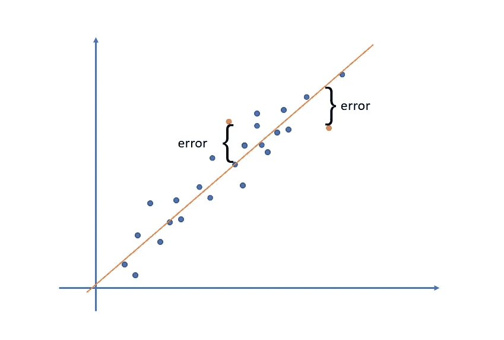
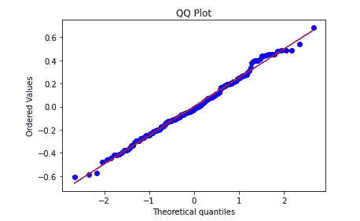
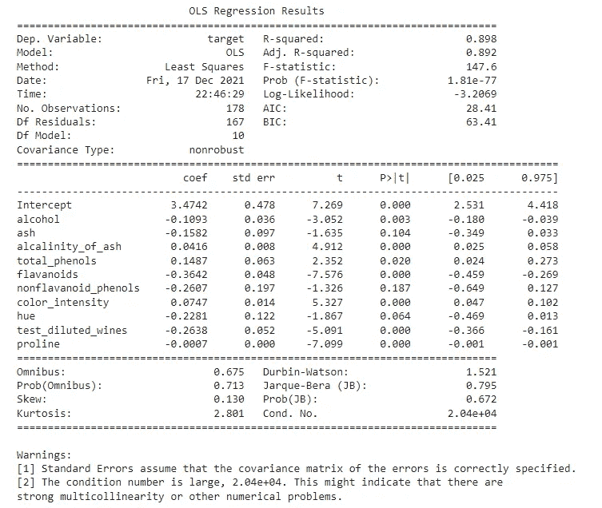

# 为了一个好的线性回归，你必须做的所有统计测试

> 原文：<https://towardsdatascience.com/all-the-statistical-tests-you-must-do-for-a-good-linear-regression-6ec1ac15e5d4?source=collection_archive---------5----------------------->

## 线性回归不仅仅是运行代码和评估 R。


由 [Maksym Kaharlytskyi](https://unsplash.com/@qwitka?utm_source=unsplash&utm_medium=referral&utm_content=creditCopyText) 在 [Unsplash](https://unsplash.com/s/photos/wine?utm_source=unsplash&utm_medium=referral&utm_content=creditCopyText) 上拍摄的照片

## 摘要

这篇文章的目的是展示许多围绕线性回归的统计测试。我知道这听起来可能有些重复(“*又一篇关于线性回归的文章”)，*但是我将要写的信息并没有像我们想象的那样广泛传播。

我们将涵盖以下主题:

*   线性回归模型的必要假设是什么
*   检验残差的正态性
*   检验残差的可变性
*   检查残差中的异常值
*   检验残差的独立性
*   着眼于多重共线

不要担心，我会把整个代码留在最后，在那里你可以看到我为每个测试导入了什么。

作为数据集，我将使用来自`sklearn`的关于葡萄酒的“玩具数据集”。

对于建模和测试，我将使用`statsmodels`，因为它有库中需要的所有测试。您可以用 statsmodels 执行测试，然后用 sklearn 构建它。你的电话。

```
# Load the dataset
import sklearn.datasets
data_ = sklearn.datasets.load_wine()# Create dataframe
df = pd.DataFrame(data_.data, columns=data_.feature_names)
df['target'] = data_.target
df.rename(columns={'od280/od315_of_diluted_wines': 'test_diluted_wines'}, inplace=True)
```

## 初步考虑

好了，在“又一篇关于线性回归的文章”这一点上，我想说一些事情。

首先，我知道上面的数据集很适合线性回归，我也知道它只是为了研究的目的。这里的想法是显示每个测试的执行方式，以及模型实际通过测试时的样子，这样我就可以给你理解和评估数据的关键。

其次，现实生活是艰难的，人们。老实说，来自*现实生活*的大多数数据集不会通过这些测试，你必须对它们进行处理，转换数据，进行特征工程，调整模型，甚至选择不同的算法来为你的数据建模。这就是你报名参加的工作——数据科学家。

最后，但同样重要的是，当我们执行线性回归模型时，我们应该遵循许多假设。正如查尔斯·惠兰在他的巨著《赤裸裸的统计》中所说:

> LR 在操作上易于执行。即使是一个孩子也可以用现在可用的优秀软件做到这一点，但是要正确地完成它，那就是另一回事了。

## 线性回归

普通最小二乘法(OLS)是 LR 最常用的方法，简而言之，它试图在给出最佳拟合的点之间画一条线，当我们将实际值与回归线之差相加时，它会给出最小的数字。

这种差异就是著名方程*y = a+bx+****e .***的误差成分,【OLS】方法将对这些误差进行平方，并对这些量进行求和，试图达到最小数作为结果，这将产生最佳拟合方程的系数。



OLS 方法。图片由作者提供。

作为等式中的误差部分，它非常重要。在一篇出色的文章中，作者 Dalson [FIGUEIREDO FILHO、Felipe NUNES、Enivaldo CARVALHO DA ROCHA、Manoel LEORNARDO SANTOS、Mariana BATISTA e joséAlexandre SILVA JUNIOR 在 Revista Política Hoje，Vol.20，n. 1，2001](https://periodicos.ufpe.br/revistas/politicahoje/article/download/3808/31622) 中描述了我们应该测试 LR 残差的许多假设，我们将在本文中描述和编码这些假设:

*   残差必须服从正态分布。
*   残差是齐次的，有齐次方差。
*   误差中没有异常值。
*   误差中没有自相关。
*   自变量之间没有多重共线性。

## 误差必须服从正态分布

当我们创建 LR 模型时，有时我们会听到变量必须遵循正态分布。这不完全正确。必须遵循这种分布的是残差。

> LR 模型的残差必须遵循正态分布，因此通过 OLS 方法找到的估计量不会有偏差，并且更有效(FIGUEIREDO FILHO et all，2011)。

这是在数据集加载后如何完成的。

```
**# Regression Model**model = smf.ols('target ~ alcohol + ash + alcalinity_of_ash + total_phenols + flavanoids + nonflavanoid_phenols + color_intensity + hue + test_diluted_wines + proline', data = df).fit()**# Extract the residuals**
model_resid = model.resid
```

测试常态。

```
**# Kolmogorov-Smirnov test**
_, p = lilliefors(model_resid, dist='norm')
print('Not normal | p-value:' if p < 0.05 else 'Normal | p-value:', p)
print('-------------------------------')**# Anderson**
stat, p3, _ = scs.anderson(model_resid, dist='norm')
print('Anderson:')
print('Not normal | stat:' if stat > p3[2] else 'Normal | stat:', stat, ':: p-value:', p3[2])**[OUT]:**
Normal | p-value: 0.2 ------------------------------- 
Anderson: Normal | stat: 0.35916418199656164 :: p-value: 0.77
```

我还可以绘制 QQ 图，看看数据在哪里偏离了正态分布，当情况就是这样。

```
**# QQPlot**
scs.probplot(model_resid, dist='norm', plot=plt)
plt.title('QQ Plot')
plt.show()
```



残差的 QQ 图。图片由作者提供。

## 同方差性

残差必须是齐次的。如果我们从逻辑上考虑，这很有意义。我的意思是，如果我们正在分析线性关系的数据，我想表明 Y 随着 X 和 Z 的增加而增加，那么很明显，误差将在一定范围内。误差不应该离直线太远，否则我们就谈不上良好的线性关系。

我们可以用数字和图形来验证。

```
# Ho = Homocedasticity = P > 0.05
# Ha = There's no homocedasticity = p <=0.05**# Homocedasticity test**
stat, p, f, fp = sms.het_breuschpagan(model_resid, model.model.exog)
print(f'Test stat: {stat}')
print(f'p-Value: {p}')
print(f'F-Value: {f}')
print(f'f_p_value: {fp}')**[OUT]:**
Test stat: 14.254047656267216
p-Value: 0.16171589669144282
F-Value: 1.45373117596194
f_p_value: 0.16108656286704198
```

形象地说。

```
plt.scatter(y= model_resid, x=model.predict(), color='red')
plt.hlines(y=0, xmin=0, xmax=4, color='orange')
plt.xlabel('Predicted values')
plt.ylabel('Residuals')
plt.show()
```


误差看起来是恒定的。图片由作者提供。

## 异常值检验

除了最后一个测试，另一个好的测试是残差中异常值的存在。该测试将帮助我们确定是否有我们的模型不能给出令人满意的结果的地方。它证实了模型的质量。建议数字在-3 和 3 之间甚至-5 和 5 之间。

```
**# Outliers test**
outliers = model.outlier_test()print(outliers.max())
print(outliers.min())**[OUT]:** student_resid    3.254315
unadj_p          0.999499
bonf(p)          1.000000
dtype: float64
student_resid   -2.460243
unadj_p          0.001377
bonf(p)          0.245188
dtype: float64
```

## 残差独立性

残差的独立性意味着观测值也是独立的。所以在 t1 时刻的测量不会影响 t2 时刻的测量。

这里，测试的统计量越接近 2 越好。这意味着相关性(r)接近于零，当代入这个公式 *2 x (1-r)* 时，结果将是 2。

```
print( f'Test stat: {durbin_watson(model_resid)}')**[OUT]:** Test stat: 1.5212847896408088
```

## 多重共线性

多重共线性会搞乱线性回归模型。

当它存在时，计算 OLS 的模型会丢失信息。因此，多重共线性越多，模型的信息就越少。

> 多重共线性的问题是估计参数的方差增加。这是因为自变量之间的高度相关性使得精确估计每个变量对因变量的影响变得不可能。(菲格雷多·菲尔霍等人，2011 年)。

```
# check correlations
variables = df.drop('target', axis=1)variables.corr()
```

你也可以使用变动通货膨胀因素，因为这给你一个单一的数字来看。它计算受其他变量影响的给定变量的方差。根据经验，这个数字应该低于 10。有人说低于 7。

```
from statsmodels.stats.outliers_influence import variance_inflation_factor
from statsmodels.tools.tools import add_constant**# VIF Test**
vif = add_constant(variables)
pd.Series([variance_inflation_factor(vif.values, i) for i in range(vif.shape[1])], index=vif.columns)const                   680.485185
alcohol                   2.460372
malic_acid                1.656647
ash                       2.185448
alcalinity_of_ash         2.238732
magnesium                 1.417855
total_phenols             4.334519
flavanoids                7.029350
nonflavanoid_phenols      1.796380
proanthocyanins           1.975683
color_intensity           3.026304
hue                       2.551447
test_diluted_wines        3.785473
proline                   2.823849
dtype: float64
```

## 模型分析

在模型通过了所有这些测试之后，我们现在可以很好地评估它的总结了。`statsmodels`带来了一个伟大的。

```
print( model.summary() )
```



模型的总结。图片由作者提供。

我们的模型很好。我们应该看看 R 平方的 T4，看看这个线性方程能解释多少关系。是 89%。如果我们想知道这些选择的变量实际上如何影响目标并解释方差，那么我们应该看看 R2 调整的，通常也用于与 AIC 和 BIC 一起比较模型(最后提到的两个指标，越低越好)。

> R2 和调整后的 R2 都让你知道有多少数据点落在回归方程的直线上。然而，R2 和调整后的 R2 之间有一个主要区别:R2 假设每个变量都可以解释因变量的变化。调整后的 R2 告诉你仅由实际影响因变量的自变量解释的变化的百分比。

查看 P > |t|列，这是每个变量的 P 值。它解释了该模型的统计意义。理想情况是所有数据的显著性水平都低于 0.05。门槛那边有几个人。

由于某些原因，我们损失了 10%的方差。为了改进这个模型，应该有一个完整的数据探索，特征工程，必要时执行转换。嗯，很多可能性。

## 在你走之前

LR 是一个强大的工具。特别是当你知道如何创建它并测试它的假设时。

记住要经常进行这些测试。它们并不僵硬。他们应该是灵活的，应该给你一个好的方向，无论你的模型是好是坏。

以下是完整的代码:

## 参考

[什么是 VIF 可以接受的价值观？](https://quantifyinghealth.com/vif-threshold/)

在 LR 中什么该做，什么不该做。

[R2 和 R2 的区别——调整后的](https://www.statisticshowto.com/probability-and-statistics/statistics-definitions/adjusted-r2/)。

如果你喜欢这个内容，探索并关注我的博客。

[](https://medium.com/gustavorsantos) [## 古斯塔夫·桑托斯

### 让我们做出更好的决定。数据驱动的决策。我用 Python，R，Excel，SQL 创建数据科学项目。

medium.com](https://medium.com/gustavorsantos)