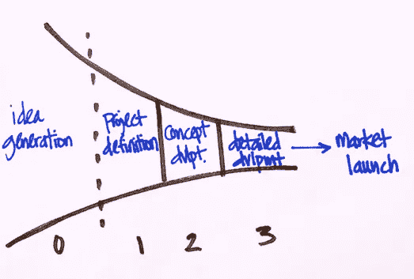

# 扩大人工智能创新漏斗的模型

> 原文：<https://towardsdatascience.com/all-things-tend-towards-chaos-a-model-for-widening-the-ai-innovation-funnel-aa5690b086c?source=collection_archive---------60----------------------->

帕特里克·托马索在 [Unsplash](https://unsplash.com?utm_source=medium&utm_medium=referral) 上的照片

几年前，一个朋友分享说，他是一个集装箱商店的超级粉丝——他认为所有的事情都趋向于混乱，有一个地方来组织你的生活令人难以置信地放松。这是我在 2020 年上半年留下的印象，当时我正在构建一套流程，以在现有业务内**促进人工智能(AI)创新。对某些人来说，这完全是在混乱中强加秩序(从事有商业价值的项目)(建立一种产生新想法的文化)。**

从那以后，我开始接受另一种观点。

*   首先，一个合适的运营模式提供了*约束，可以促进新想法*(这是我几年前在与 [BuzzFeed 的前设计副总裁](https://medium.com/@cap)的一次对话中实际学到的，但并没有意识到！).
*   第二，新想法可能是偶然发现的，但对新想法的探索是通过严格的系统实验框架完成的。合适的运营模式应该有助于创新者浮出水面，强化这些创意所带来的价值。

经过反思，我认为这种态度上的变化归结为两件事:1)对“[颠覆性创新](https://www.christenseninstitute.org/disruptive-innovations/)”的精确定义有了清晰而深刻的理解，2)认识到实施的核心*正在改变文化*——这不是一个小壮举(我将在第五节详细阐述这两件事)。

那么，在一个更大的组织中，*什么是“合适的”运营模式呢？总的来说，有很多关于创新战略的伟大文献，在科技领域，我想起了几个孵化器的例子。在这篇文章中，我分享了我对现有机构内人工智能创新的看法(第一节& II)。我将这一系列过程(价值观、运营模式和工作标准)称为产品孵化器过程。*

我很高兴我的观点发生了转变。它让我走上了一条迷人的道路，用科学来塑造科学过程(第三部分)。尽管产品孵化器过程对我们的团队产生了积极的影响，一个追踪各种成功标准的过程(第四节)，我公开分享这项工作的动机是为了促成更大的讨论。我很想听听其他组织的人是如何努力克服这个问题和相关挑战的。

为科学的过程使用科学…(【http://gph.is/1hyPhds】T2)

## **一、问题**

我们知道[现有业务的创新对于长期增长是必要的](https://en.wikipedia.org/wiki/The_Innovator%27s_Dilemma)。这意味着精心设计一个稳健的运营模式和激励结构(不止两年一次的黑客马拉松！)至关重要，必须及时完成，并影响公司最终构建的产品([康威的模型](https://en.wikipedia.org/wiki/Conway%27s_law)；也就是，“[你发货你的组织](https://jacobian.org/2021/jan/5/designing-engineering-organizations/)”。这很难做到，因为公司通常以创造短期商业价值为导向。

为了建立产品孵化器流程，我专注于这种二分法的核心问题:在一个价值超过成本的现有机构中，你如何找到并激发创新的人工智能想法？

(还有其他问题，但几乎都归结到这个问题。例如:

*   你如何创造一个鼓励而不是抑制探索的过程？
*   什么时候你鼓励对一个想法进行更深入的挖掘(开发)？
*   你能确保在短期内为企业创造价值吗？
*   您如何衡量短期内实施这种运营模式的成功程度？)

## **二。解决方案(产品孵化器结构概述)**

产品孵化器流程列出了详细的工作标准和完整的运营模式指南，用于创新、孵化和扩大团队的工作漏斗。

*   工作的**标准**包括 1)预期的结果，2)成功的标准，以及 3)建议的工件。
*   **运营模式**提供了一个框架来回答具体的战术问题，例如每个提案的创新者数量、投资者委员会的组成、每个阶段的时间限制以及审核的节奏。

在高层次上，产品孵化器流程可以被认为是一个风险投资(VC)模型(T1)，它被映射到一个 T2 产品发布漏斗(T3)的顶部。

*   与典型的风险投资模式不同，产品孵化器过程中的价值既包括“近端的”(明显的和财务的)利益，也包括“扩散的”(第二或第三)利益。扩散利益可以包括，例如，产品对社会的影响，创新者的知识获取，或与组织内其他团队建立关系。
*   通常，产品发布漏斗包含四个阶段。产品孵化器流程大致指的是下图中的阶段 1 和阶段 2。我包括了从每个阶段过渡到下一个阶段的指南，以及针对阶段 0 的轻量级指南，以及从产品孵化器中走出来的指南。

产品发布漏斗的高级视图(Anita Mehrotra)。

*   随着每个后续阶段的进行，尽职调查的程度会变得更深，从而可以更准确地估计潜在价值和执行建议想法的预计成本(例如，时间、资金、数据采集、所需的基础设施)。

最终，如果创新者和投资者委员会对成本和价值进行了评估，那么一个被提议的想法就会离开产品孵化器。

## **三世。为科学而科学&迭代测试**

在开发这些过程中，我借鉴了从软件工程到数学和金融的一系列框架和理论。

有非常丰富的文献涵盖了上述内容，这为产品孵化器过程提供了一个极好的理论起点。然而，*现实的*约束并没有显露出来，直到这个过程用真实的用例进行了电池测试。

为此，在开始创建过程之前，我与团队的所有 25 名成员进行了一系列的用户需求收集和头脑风暴会议。这使得团队能够参与进来，并对产品孵化器的成功至关重要。然后，我对产品孵化器过程进行了两个测试:1)一个独立的、原型的提议想法，它“跑在”2)一个更大的、团体的“试运行”的前面。

1.  从 2020 年 2 月 15 日到 3 月 31 日， **alpha 测试**是一个典型的提议想法，我与我们组织中的一个商业伙伴团队一起独立工作。作为流程的第一步，该测试告知了对预期、与潜在合作伙伴团队合作的方式以及评估试运行成功的运营模式的更新。
2.  测试版测试是一次试运行，我的团队中有 10 名参与者，从 2020 年 2 月 26 日持续到 3 月 20 日。大多数参与者没有 100%成为产品孵化器的带宽，第一阶段的最后期限是交错的。这使得试运行能够具体测试以下内容:围绕一系列想法召集一组人，以及确定时间限制阶段 1 的合理时间窗口(分别用 4、6 和 2 个提案测试了 1.5 周、2.5 周和 3.5 周)。此外，试运行还提供了一个实验平台，用于测试从以交付为中心到以“失败没关系”为心态的有组织混乱的文化演变。事实证明，管理相互竞争的优先级比部署产品孵化器时更具挑战性，也更不现实。

## **四世。测量影响**

产品孵化器流程根据预先定义的六个指标来跟踪成功。(特别欢迎在此讨论；测量模糊的东西是很困难的，你会在下面的第 6 条中看到！)

1.  到 2020 年 5 月 15 日(2020 年 Q2 中期)，在产品积压中用一句话捕捉 100 个想法
2.  在 2020 年 3 月 31 日前提交 20 份单页简报，包括业务案例、提议的方法和估计的影响
3.  2020 年 6 月 30 日前的 10 个价值证明
4.  5 在 2020 年 6 月 30 日前提交完整提案。完整的建议书包括:价值证明演示；我们团队和合作伙伴团队的业务主管就价值和归属达成一致；轻量级/概要产品需求文档和估计的产品路线图
5.  到 2020 年 7 月 1 日，整个组织内至少有七个强大的合作伙伴关系，其中有三至四个新业务
6.  一种“群聚并领导”的团队动力，带有“适当的工具”

最终，仅试运行的影响是:

*   在产品孵化器产品积压中提出了 80 多个想法
*   12 个单页工件，通过第一阶段标准进行尽职调查
*   3 个提议的想法通过 MVP 阶段获得资助，并从产品孵化器中移出
*   4 与公司业务团队的新合作伙伴关系

## **五、建立产品孵化器过程中克服的挑战**

**语言的清晰。**术语和定义的语言和一致性对于产品孵化器流程的成功至关重要。

1.  在这个旅程的早期，我就知道*颠覆性创新*已经被过度使用；根据我和谁说话以及什么时候说话，它会产生不同的效果(从眼球转动到渴望)。我面临的部分挑战是，当我们谈论推动一种支持颠覆性创新的模式时，确保所有利益相关者都清楚这意味着什么:
    “一个产品或服务最初在市场底部的简单应用程序中扎根，然后不断向市场高端移动，最终取代现有竞争对手的过程。”
2.  “变得创新”不仅需要改变人们如何一起工作，[还需要改变他们如何感受](https://www.fastcompany.com/3001239/3-ways-kill-your-companys-idea-stifling-shame-culture)*。著名的羞耻感和脆弱性研究员 Brene Brown 博士咨询了那些努力培养创新文化的企业领导人，一次又一次地证明*只有当一个组织拥有让人们对失败感到舒适的空间时，他们才能真正具有创新精神*。尽管从零开始创造这种文化具有难以置信的挑战性，但改变现有的文化使之成为这样就更难了。*

*不同的工作方式。最大的挑战之一是提供一种结构，同时不让流程抑制创造力。对于我们团队中的一些研究人员来说，这种思维模式的改变很难驾驭，他们觉得文档很麻烦。对我来说，这是一个关于转变心态和做出文化决定的有趣观点。*

*产品孵化器过程的长期影响仍有待观察，但最终，它们提供了一个似乎站得住脚的框架。创造它们的旅程也是一个独特的机会，将科学的“思维方式”融入到我们团队的运营中。*

## ***参考文献***

*在开发产品孵化器过程中参考文献的子集可以在这里找到。*

*   *网飞文化宣言。[https://jobs.netflix.com/culture/#introduction](https://jobs.netflix.com/culture/#introduction)*
*   *克里斯滕森和雷诺，《创新者的困境》(2003)。*
*   *赖夫，2020 年 3 月 5 日。A、B、C 系列融资:运作方式。<[https://www . investopedia . com/articles/personal-finance/102015/series-b-c-funding-what-it-all-means-and-how-it-works . ASP](https://www.investopedia.com/articles/personal-finance/102015/series-b-c-funding-what-it-all-means-and-how-it-works.asp)>*
*   *Zider，1998 年 11 月至 12 月号。风险投资是如何运作的。<[https://hbr.org/1998/11/how-venture-capital-works](https://hbr.org/1998/11/how-venture-capital-works)*
*   *伯恩哈德松，2019 年 4 月 15 日。为什么软件项目花费的时间比你想象的要长:一个统计模型<[https://Erik Bern . com/2019/04/15/why-software-projects-take-long-than-you-think-a-statistical-model . html](https://erikbern.com/2019/04/15/why-software-projects-take-longer-than-you-think-a-statistical-model.html)>*
*   *格雷厄姆，“做不可扩展的事情”(2013 年 7 月)。<[http://paulgraham.com/ds.html](http://paulgraham.com/ds.html)*
*   *产品计划。产品管理:产品发布。【https://www.productplan.com/glossary/product-launch/<*
*   *Gottesdiener，e . 2019 年 1 月 15 日。使用产品画布定义您的产品:入门。<[https://www . ebg consulting . com/blog/using-product-canvas-define-product-get-started/](https://www.ebgconsulting.com/blog/using-product-canvas-define-product-getting-started/)>*
*   *传统的 POC 已经死亡。视点万岁。<[https://www.omnetric.com/blog/iot-poc-pov](https://www.omnetric.com/blog/iot-poc-pov)*
*   *赖斯，2009 年 8 月 3 日。摘自《创业经验》最低可行产品:指南。<[http://www . startuplessonslearned . com/2009/08/minimum-viable-product-guide . html](http://www.startuplessonslearned.com/2009/08/minimum-viable-product-guide.html)>*
*   *英国楚门，2016 年 12 月 25 日。产品和解决方案:你知道区别吗？<[https://hacker noon . com/products-and-solutions-do-you-know-the-difference-4ff 9169 cefe 3](https://hackernoon.com/products-and-solutions-do-you-know-the-difference-4ff9169cefe3)>*
*   *贝尔，2001 年。“社会研究方法”，第三章:研究设计，概念化，操作化，测量。社会研究方法/研究设计。<[https://en . wiki books . org/wiki/Social _ Research _ Methods/Research _ Design](https://en.wikibooks.org/wiki/Social_Research_Methods/Research_Design)>*
*   *2015 年 4 月 17 日，j。谷歌著名的“20%时间”政策的真相。<[https://www . business insider . com/Google-20-percent-time-policy-2015-4](https://www.businessinsider.com/google-20-percent-time-policy-2015-4)>*
*   *2020 年 1 月 15 日。公交因素。<[https://en.wikipedia.org/wiki/Bus_factor](https://en.wikipedia.org/wiki/Bus_factor)*
*   *希克森，2016 年 5 月 15 日。敏捷自行车:软件开发的更好类比。<[https://m.dotdev.co/the-agile-bicycle-829a83b18e7?gi = 49 ee 7a 37 a4 cc](https://m.dotdev.co/the-agile-bicycle-829a83b18e7?gi=49ee7a37a4cc)*