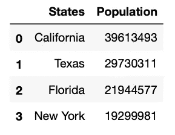
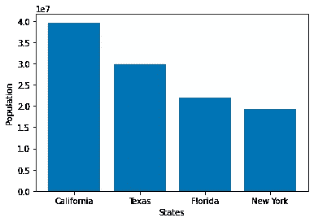
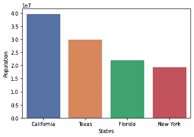
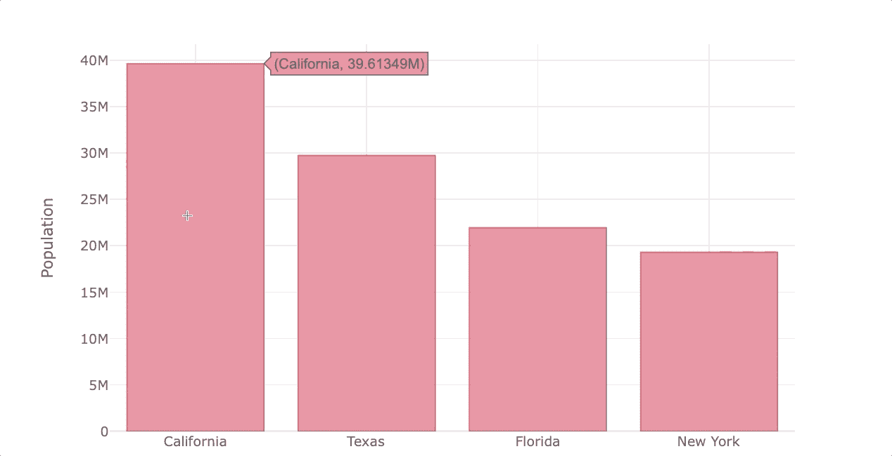

# 所有顶级数据科学 Python 库解释(带代码)

> 原文：<https://towardsdatascience.com/all-top-python-libraries-for-data-science-explained-with-code-40f64b363663?source=collection_archive---------2----------------------->

## 简明英语的数据科学 Python 库和免费学习资源


约翰·施诺布里奇在 [Unsplash](https://unsplash.com?utm_source=medium&utm_medium=referral) 上的照片

Python 是数据科学中最流行的编程语言之一。它提供了大量的库，这些库提供了处理数学、统计和科学函数的强大功能。

然而，Python 有超出数据科学的应用，所以有很多 Python 库是你永远不会在数据科学项目中使用的。

为了帮助您专注于学习数据科学所需的 Python 内容，我将使用实际例子向您介绍所有顶级的数据科学 Python 库。除此之外，我会分享大量的资源来帮助你免费学习它们。

*注意:你可以用* `*pip*` *或者* `*conda*` *安装本文提到的大部分库。查看我将在每一节末尾留下的指南或它们的文档，以便轻松地安装它们。*

```
**Table of Contents** 1\. [Python libraries for Data Collection](#c268)
2\. [Python libraries for Data Cleaning & Wrangling](#9d79)
3\. [Python libraries for Feature Engineering](#a7e4)
4\. [Python libraries for Data Visualization](#35e9)
5\. [Python libraries for Model Building & Deployment](#b542)
```

# 用于数据收集的 Python 库

每个数据科学项目都是从数据收集开始的。有时数据是 CSV 格式的，或者需要从数据库中提取。然而，当数据不可用时，你可以从世界上最大的数据库——互联网上获取公共数据。下面的库帮助你用一种叫做网络抓取的技术从互联网上提取数据。

免责声明:并非所有网站都允许网络抓取。如果您正在访问网站，您应该始终考虑他们的服务条款并检查`robots.txt`文件(更多详细信息[在此](https://developers.google.com/search/docs/advanced/robots/intro))。如果你发出太多的请求，你可能会被网站屏蔽。记住，如果网站有一个 API 或者有一个免费的数据集(你可以在 [Kaggle](https://www.kaggle.com/) 上找到数百个)，那么做网络抓取就没有意义了。

## 请求&美丽的汤

通过使用 Request 和 Beautiful Soup 库，我们可以从不运行 JavaScript 的网站中提取数据。

请求库帮助我们用 Python 发出 HTTP 请求。得益于此，我们可以获得一个网站的内容。然后我们使用解析器(例如 html.parser、lxml 等)和 Beautiful Soup 来提取网站中的任何数据。

让我们看一个例子:

## 硒/瘙痒

硒和刺痒的作用和美人汤一样；然而，他们更强大。

它们都可以从 JavaScript 驱动的网站中提取数据。Selenium 也可以用于 web 自动化，而 Scrapy 速度很快，允许您轻松地将数据导出到数据库，并且具有其他功能，使其成为最完整的工具。

下面是从头开始学习这些库的指南:

*   [美汤指南](https://betterprogramming.pub/how-to-easily-scrape-multiple-pages-of-a-website-using-python-73e85bd06f8c)(刮电影抄本)
*   [硒导](https://medium.com/swlh/web-scraping-basics-scraping-a-betting-site-in-10-minutes-8e0529509848)(刮庄家)
*   [抓取指南](https://betterprogramming.pub/how-to-use-scrapy-to-build-a-dataset-for-your-data-science-project-8f04af3548c6)(抓取人口数据)
*   [4 网页抓取项目让你的生活自动化](https://medium.com/geekculture/4-web-scraping-projects-that-will-help-automate-your-life-6c6d43aefeb5)
*   [网页抓取备忘单](https://medium.com/geekculture/web-scraping-cheat-sheet-2021-python-for-web-scraping-cad1540ce21c)

# 用于数据清理和争论的 Python 库

一旦有了可读格式(CSV、JSON 等)的数据，就该清理它了。熊猫和 Numpy 图书馆可以在这方面提供帮助。

## 熊猫

Pandas 是一个强大的工具，它提供了多种操作和清理数据的方式。Pandas 处理数据帧，它将数据组织在一个类似于 Excel 电子表格的表格中，但速度更快，并具有 Python 的所有功能。

这是你创建熊猫数据框架的方法:

```
import pandas as pd# data used for the example (stored in lists)
states = ["California", "Texas", "Florida", "New York"]
population = [39613493, 29730311, 21944577, 19299981]# Storing lists within a dictionary
dict_states = {'States': states, 'Population': population}# Creating the dataframe
df_population = pd.DataFrame.from_dict(dict_states)print(df_population)
```



作者图片

## Numpy

Numpy 是一个具有数学功能的 Python 库。它允许我们处理多维数组、矩阵、生成随机数、线性代数例程等等。

当涉及到扯皮和转换数据时，经常使用一些 Numpy 方法，如`np.where`和`np.select`。除此之外，其他库如 Matplotlib 和 Scikit-learn 在某种程度上依赖于 NumPy。

让我们看看如何用 NumPy 创建一个二维数组。

```
import numpy as npb = np.array([[1.5,2,3], [4,5,6]],dtype=float)IN [0]: print(b)
IN [1]: print(f'Dimension: {b.ndim}')OUT [0]: [[1.5  2\.  3\. ]
          [4\.   5\.  6\. ]]
OUT [1]: Dimension: 2
```

## 不平衡学习

不平衡学习是一个帮助我们处理不平衡数据的库。当每个类的观测值数量分布不均时，就会出现不平衡数据。例如，在亚马逊产品的评论部分，您通常会看到大量的正面评论(大多数类别)和少量的负面评论(少数类别*)。*

我们使用不平衡学习(imblearn)库对数据进行重采样。您可以对正面评价进行欠采样，也可以对负面评价进行过采样。

让我们看看我是如何使用`RandomUnderSampler`对正面评价进行欠采样的(完整代码可以在下面列出的指南中找到)

下面是从头开始学习这些库的指南:

*   【Excel 用户熊猫指南
*   [Numpy 指南](/numpy-basics-for-people-in-a-hurry-8e05781503f)
*   [通过 Sci-kit 学习实现不平衡学习](/a-beginners-guide-to-text-classification-with-scikit-learn-632357e16f3a)

# 用于数据可视化的 Python 库

饼图、条形图、箱线图和直方图等图表通常用于探索性数据分析，也用于展示结果。Python 库允许我们制作传统的以及交互式的图形。

## Matplotlib/Seaborn

Matplotlib 是一个允许我们进行基本绘图的库，而 Seaborn 则擅长统计可视化。

主要区别在于创建一个情节需要编写的代码行。Seaborn 更容易学习，有默认主题，默认情况下制作的剧情比 Matplotlib 好看。

让我们为在 Pandas 部分创建的`df_population`数据帧创建一个柱状图。

```
import matplotlib.pyplot as plt

plt.bar(x=df_population['States'],
        height=df_population['Population'])plt.xlabel('States')
plt.ylabel('Population')
plt.show()
```



作者图片

现在让我们用 Seaborn 创造同样的情节。

```
import seaborn as sns

sns.barplot(x=df_population['States'],
            y=df_population['Population'],
            palette='deep')
plt.show()
```



作者图片

如您所见，我们不需要在 Seaborn 中指定轴名(它取自 dataframe 列)，而 Matplotlib 需要更多的代码行，默认情况下绘图看起来一点也不好看。

## Plotly/Bokeh(熊猫集成)

如果想更上一层楼，应该尝试用 Plotly 或者 Bokeh 做交互可视化。两者都允许创建大量的交互式绘图，最酷的是你可以使用它们中的任何一个直接用 Pandas 绘图语法来绘图。

两者都使绘制交互式可视化变得容易，但在我看来，Plotly 默认创建更好看的图。

这是一个如何使用熊猫绘图语法创建交互式绘图的例子。

```
import pandas as pd
import cufflinks as cf
from IPython.display import display,HTML
cf.set_config_file(sharing='public',theme='white',offline=True) 

df_population = df_population.set_index('States')
df_population.iplot(kind='bar', color='red',
                    xTitle='States', yTitle='Population')
```



作者图片

## 词云/风格云

Wordclouds 允许我们识别一段文本中的关键词。Python 有两个这种类型的图形库——word cloud 和 stylecloud。

第一个制作基本的词云，甚至允许我们上传自己的图像作为词云的遮罩，而第二个用几行代码创建华丽的词云，并提供大量高质量的图标，你可以在你的词云上使用。

让我们把著名的史蒂夫·乔布斯在斯坦福的演讲做成文字云。的。我用于 wordcloud 的 txt 文件可以在我的 [Github](https://github.com/ifrankandrade/data-visualization.git) 上找到。

```
import stylecloud

stylecloud.gen_stylecloud(file_path='SJ-Speech.txt',
                          icon_name= "fas fa-apple-alt")
```


这就是你制作这个单词云所需要的全部！您可以移除停用字词并使用其他功能。要了解更多细节，请查看我的 wordcloud 指南。

下面是从头开始学习这些库的指南:

*   [Python 中美丽可视化的简单指南(Matplotlib&Seaborn Guide)](/a-simple-guide-to-beautiful-visualizations-in-python-f564e6b9d392)
*   [用熊猫制作漂亮的互动视觉效果的最简单方法(Plotly 指南)](/the-easiest-way-to-make-beautiful-interactive-visualizations-with-pandas-cdf6d5e91757?sk=23fbe5b404e507dc340fce3bbf6ca94f)
*   [如何用 Python 轻松制作漂亮的文字云](/how-to-easily-make-beautiful-wordclouds-in-python-55789102f6f5)

# 用于要素工程的 Python 库

一旦清理了数据，下一步就是让数据更容易分析。尽管数据被整齐地组织在表格/数据帧中，但是对于机器来说，这些数据可能仍然难以理解和处理。

通过实施特征工程，我们将使数据易于阅读，因此，我们的机器学习模型将提高其性能。

在建模之前，您可以使用特征缩放或标准规范化来准备数字数据，但当涉及到文本时，我们需要在自然语言处理(NLP)领域找到解决方案。让我们来看看帮助我们处理人类语言数据的流行的 NLP 库。

## NLTK

NLTK 包含超过 50 个语料库和词汇资源以及文本处理库。这允许我们执行标记化、分类、词干提取、标记等等。

例如，一个句子有不同形式的单词(单数、复数)。我们可以使用 NLTK 的 WordNetLemmatizer 来获取每个单词的引理(又名一个单词的字典形式)，并使文本统一。

让我们在下面的`words`列表中找到单词的字典形式。

```
from nltk import WordNetLemmatizerlemmatizer = WordNetLemmatizer()
words = ['papers', 'friendship', 'parties', 'tables']for word in words:
    print(lemmatizer.lemmatize(word))
```

词汇化中的默认词类(POS)值是一个名词，所以上一个例子的打印值将是`paper`、`friendship`、`party`和`table`。

## 空间

SpaCy 可以用于 NLTK 中描述的相同任务，但是它更快也更容易学习。

让我们看看命名实体识别(NER)如何与 spaCy 一起工作。

```
import spacynlp = spacy.load("en_core_web_sm")
doc = nlp("Messi will go to Paris next summer")
print([(X.text, X.label_) for X in doc.ents])
```

这将打印以下值

```
[('Messi', 'PERSON'), ('Paris', 'GPE'), ('next summer', 'DATE')]
```

Spacy 发现“梅西”是一个人，“巴黎”是 GPE(国家，城市，州等)，而“明年夏天”是一个日期。

下面是从头开始学习这些库的指南:

*   [用 Python 完成自然语言处理(NLP)指南](https://pub.towardsai.net/natural-language-processing-nlp-with-python-tutorial-for-beginners-1f54e610a1a0)
*   [用 Python 可以轻松实现的 7 种 NLP 技术](/7-nlp-techniques-you-can-easily-implement-with-python-dc0ade1a53c2)
*   [Python 中的 NLP 课程](https://youtu.be/xvqsFTUsOmc)

# 用于模型构建和部署的 Python 库

一旦数据准备好进行处理，我们就应用不同的算法来获得最佳模型，调整模型以获得最佳结果，然后部署模型。这里有一个 Python 库的列表可以帮助你做到这一点。

## sci kit-学习

Scikit-learn 是一个机器学习库，它允许我们训练和评估许多算法。它支持许多监督学习算法(线性回归，随机森林，SVM，决策树等)以及非监督学习算法。

让我们看看如何在 sklearn 中使用 LogisticRegression 来训练一个模型。

```
from sklearn.linear_model import LogisticRegressionlog_reg = LogisticRegression()
log_reg.fit(train_x_vector, train_y)
```

## Keras/Tensorflow/Pytorch

说到深度学习，我们可以与 3 个库合作——Keras、Tensorflow 和 Pytorch。

TensorFlow 是 Google 开发的深度学习框架。它允许我们创建具有许多层的大规模神经网络。TensorFlow 的一些[流行用例是语音/声音识别、基于文本的应用、图像识别、时间序列和视频检测。](https://www.exastax.com/deep-learning/top-five-use-cases-of-tensorflow/)

Keras 是用 Python 编写的高级神经网络 API，它提供了深度神经网络的快速实验。它是用户友好的和可扩展的。[2017 年整合到 tensor flow](https://www.simplilearn.com/keras-vs-tensorflow-vs-pytorch-article)，但仍可独立运营。

最后，PyTorch 由脸书开发，用于 NLP 应用程序。

您可以查看这篇[文章](https://www.simplilearn.com/keras-vs-tensorflow-vs-pytorch-article)来深入比较这 3 个库。

## 瓶

Flask 是一个微框架，它提供了 web 应用程序的基本特性。尽管您不会以数据科学家的身份创建 web 应用程序，但您仍然需要围绕您构建的模型构建 web API。

之所以选择 Flask 而不是 Django 之类的其他 web 框架，是因为它更 Pythonic 化，更容易学习，并且更适合小型项目。

下面是从头开始学习这些库的指南:

*   [Scikit-Learn 简单指南——用 Python 构建机器学习模型](/a-beginners-guide-to-text-classification-with-scikit-learn-632357e16f3a)
*   [TensorFlow 2.0 完整教程](https://youtu.be/tPYj3fFJGjk)
*   [带张量流航向的 Keras】](https://youtu.be/qFJeN9V1ZsI)
*   [深度学习课程 py torch](https://youtu.be/GIsg-ZUy0MY)

我找不到专门介绍数据科学所需内容的 Flask 教程。如果你知道一个，请在评论区分享。

[**与 3k 以上的人一起加入我的电子邮件列表，获取我在所有教程中使用的 Python for Data Science 备忘单(免费 PDF)**](https://frankandrade.ck.page/bd063ff2d3)

如果你喜欢阅读这样的故事，并想支持我成为一名作家，可以考虑报名成为一名媒体成员。每月 5 美元，让您可以无限制地访问数以千计的 Python 指南和数据科学文章。如果你使用[我的链接](https://frank-andrade.medium.com/membership)注册，我会赚一小笔佣金，不需要你额外付费。

<https://frank-andrade.medium.com/membership> 