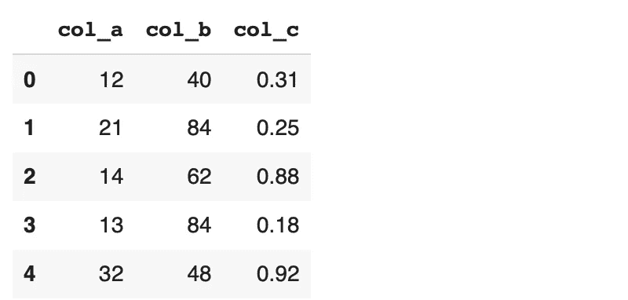

# 你所需要知道的关于熊猫切和 Qcut 函数

> 原文：<https://towardsdatascience.com/all-you-need-to-know-about-pandas-cut-and-qcut-functions-4a0c1001c38b?source=collection_archive---------9----------------------->

## 它们之间到底有什么区别？


[亚历克斯](https://unsplash.com/@worthyofelegance?utm_source=unsplash&utm_medium=referral&utm_content=creditCopyText)在 [Unsplash](https://unsplash.com/s/photos/divide?utm_source=unsplash&utm_medium=referral&utm_content=creditCopyText) 上的照片

Pandas 可以说是数据科学生态系统中最受欢迎的数据分析和操作工具。感谢众多的函数和方法，我们可以自由地处理数据。

在许多情况下，cut 和 qcut 函数非常方便。起初我并不清楚它们之间的区别。在做了几个例子之后，我就能弄明白了。

在本文中，我们也将这样做。本文中的例子将演示如何使用 cut 和 qcut 函数，并强调它们之间的区别。

让我们从创建一个样本数据框开始。

```
import numpy as np
import pandas as pddf = pd.DataFrame({
  "col_a": np.random.randint(1, 50, size=50),
  "col_b": np.random.randint(20, 100, size=50),
  "col_c": np.random.random(size=50).round(2)
})df.head()
```



(图片由作者提供)

第一列和第二列分别包含 1-50 和 20–100 之间的整数。第三列包含 0 到 1 之间的浮点数。我们使用 numpy 函数来随机生成这些值。

> 剪切功能将整个取值范围划分为多个区间。每个箱覆盖的范围将是相同的。

在第一列(col_a)中，我们随机分配 1 到 50 之间的整数。让我们首先检查这一列中的最小值和最大值。

```
df.col_a.max(), df.col_a.min()(49, 3)
```

如果要将此列分成 5 个范围相等的容器，每个容器的大小将为 9.2，计算如下:

```
(49 - 3) / 5 = 9.2
```

cut 函数执行这种宁滨运算，然后将每个值分配到适当的 bin 中。

```
df["col_a_binned"] = pd.cut(df.col_a, bins=5)
df.col_a_binned.value_counts()(21.4, 30.6]     16 
(39.8, 49.0]     14 
(12.2, 21.4]      8 
(30.6, 39.8]      6 
(2.954, 12.2]     6
```

正如我们所看到的，除了最小的那个，每个箱子的大小正好是 9.2。下限不包含在内。因此，最小容器的下限稍微小于最小值(3)以能够包括它。

我们可以通过手动定义箱边缘来自定义箱。边值作为列表传递给 bin 参数。

```
pd.cut(df.col_a, bins=[0, 10, 40, 50]).value_counts()(10, 40]    33 
(40, 50]    13 
(0, 10]      4
```

默认情况下，右边缘是包含的，但可以更改。

```
pd.cut(df.col_a, bins=[0, 10, 40, 50], right=False).value_counts()[10, 40)    33 
[40, 50)    13 
[0, 10)      4
```

使用 cut 函数，我们无法控制每个容器中有多少值。我们只能指定箱边缘。

这就是我们需要学习 qcut 函数的地方。它可用于将值划分为多个桶，每个桶包含大约相同数量的值。

先说个例子。

```
pd.qcut(df.col_a, q=4).value_counts()(40.75, 49.0]    13 
(19.5, 25.0]     13 
(2.999, 19.5]    13 
(25.0, 40.75]    11
```

我们有 4 个桶，每个桶包含几乎相同数量的值。在 4 的情况下，存储桶也称为四分位数。值总数的四分之一在第一个四分位数中，一半在前两个桶中，依此类推。

使用 qcut 功能，我们无法控制 bin 边缘。它们是自动计算的。假设一列中有 40 个值(即行),我们希望有 4 个存储桶。从最小值开始，第一个桶的上限范围将按照第一个桶包含 10 个值的方式来确定。

*   剪切功能:重点是根据值范围(即，容器上边缘和下边缘之间的差异)来确定容器的大小
*   Qcut 函数:重点是根据每个箱中值的数量来确定箱的大小。

qcut 功能允许定制铲斗尺寸。让我们创建 3 个桶。第一个包含最小的 50%的值(即下半部分)。然后，我们把上半部分分成两个箱。

```
pd.qcut(df.col_a, q=[0, .50, .75, 1]).value_counts()(2.999, 25.0]    26 
(40.75, 49.0]    13 
(25.0, 40.75]    11
```

cut 和 qcut 功能都允许给箱子或桶贴标签。我们如下使用标签参数。

```
df["new"] = pd.qcut(df.col_a, q=[0, .33, .66, 1], labels=["small", "medium", "high"])df["new"].value_counts()high      17 
small     17 
medium    16
```

这就像把一个连续变量转换成一个范畴变量。让我们检查每个类别中的平均值，以确保 qcut 函数正常工作。

```
df.groupby("new").agg(avg=("col_a","mean")) avg
new
small    14.000000
medium   26.687500
high     43.705882
```

平均增加，因为我们从小到大，这是意料之中的。

## 结论

cut 和 qcut 函数都可以用于将一组连续值转换为离散或分类变量。

cut 函数关注于 bin 的取值范围。它根据最小值和最大值之间的差异确定整个范围。然后，它根据所需的箱数将整个范围划分为多个箱。默认情况下，每个箱的大小是相同的(大约),它是箱的上边缘和下边缘之间的差值。

qcut 函数关注每个 bin 中值的数量。这些值从最小到最大排序。如果我们需要 5 个桶，前 20%的值放在第一个桶中，后 20%放在第二个桶中，依此类推。

这两个功能都允许定制上边缘和下边缘。因此，我们可以有不同大小的箱子或桶。

感谢您的阅读。如果您有任何反馈，请告诉我。