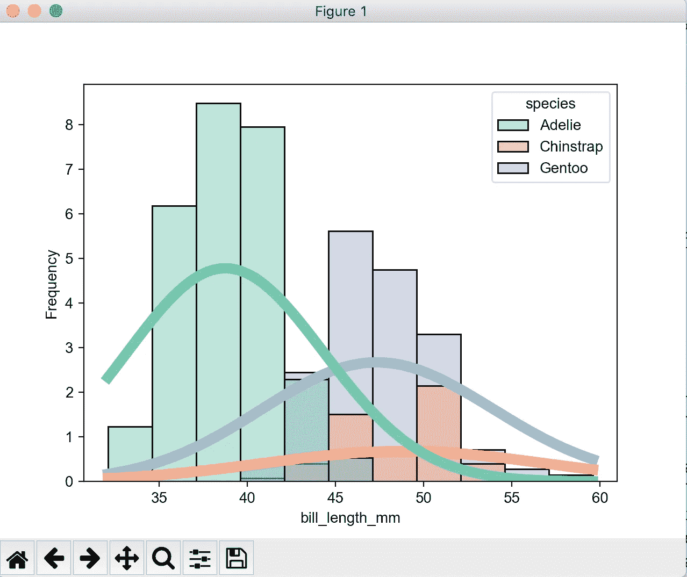

# 你需要知道的关于 Seaborn 的一切

> 原文：<https://towardsdatascience.com/all-you-need-to-know-about-seaborn-6678a02f31ff?source=collection_archive---------11----------------------->

## [python-可视化-教程](https://towardsdatascience.com/tagged/python-visualization)

## 什么时候应该用 Seaborn vs matplotlib，怎么用？


由[唐纳德·詹纳蒂](https://unsplash.com/@wizwow?utm_source=medium&utm_medium=referral)在 [Unsplash](https://unsplash.com?utm_source=medium&utm_medium=referral) 上拍摄的照片

这是我的 [python 可视化系列](https://github.com/frankligy/python_visualization_tutorial)的最后一个教程:

1.  [教程一:Fig 和 Ax 对象](/making-publication-quality-figures-in-python-part-i-fig-and-axes-d86c3903ad9b)
2.  [教程二:线图、图例、颜色](/making-publication-quality-figures-in-python-part-ii-line-plot-legends-colors-4430a5891706)
3.  [教程三:箱线图、条形图、散点图、直方图、热图、色彩图](/making-publication-quality-figures-in-python-part-iii-box-plot-bar-plot-scatter-plot-407fa457449)
4.  [教程四:小提琴剧情，树状图](/making-publication-quality-figures-in-python-part-iv-violin-plot-and-dendrogram-ed0bb8b23ddd)
5.  教程 Seaborn 中的图(聚类热图、对图、距离图等)

你不需要阅读所有以前的文章，这篇文章与我的前四篇文章有点不同。我将向您展示 python 中 matplotlib 库和 Seaborn 库的直接比较。

正如我在我的[教程 I](/making-publication-quality-figures-in-python-part-i-fig-and-axes-d86c3903ad9b) 中提到的，我特意使用最底层的可视化库——matplotlib 来演示如何获得完全的控制并理解每种绘图类型中的每个元素。如果你有机会阅读我以前的文章，我希望它确实有助于你实现这个目标(**如果没有，请不要犹豫，让我知道，我可以发布额外的教程**)。与 matplotlib 相反，Seaborn 是一个高级接口，通过减轻痛苦和将我们从编写大量样板代码中解放出来，它将使我们的生活变得更加容易。这是一个很棒的包，在这篇文章中，我将提供有用的指导，告诉你什么时候应该使用 Seaborn，更重要的是，我将使用具体的例子来引导你完成使用 Seaborn 的过程。

# 我应该什么时候使用 Seaborn？

我制作了一个包含所有 Seaborn 支持的地块类型的表格:


所有 Seaborn 支持的地块类型

所有我标记为“难以在 matplotlib 中绘制”的绘图类型，例如，我们刚刚在[教程四:小提琴绘图和树状图](/making-publication-quality-figures-in-python-part-iv-violin-plot-and-dendrogram-ed0bb8b23ddd)中提到的小提琴绘图，使用 Seaborn 将是缩短绘图时间的明智选择。我概述了一些指导如下:

1.  对于"**matplotlib**中易于绘制的"类型，您可以使用任何一种工具，并且在时间和复杂性方面不会有太大差异。(如果你不知道如何在 matplotlib 中做到这一点，请查看[我以前的帖子](https://github.com/frankligy/python_visualization_tutorial))
2.  对于"**难以在 matplotlib** 中绘制的类型，我建议在实践中使用 Seaborn，但我也建议**至少理解如何从头开始绘制这些图**。
3.  对于所有图形类型，如果**涉及多个类别**，Seaborn 将是一个更好的选择，例如，您需要绘制一个并排的盒子图或小提琴图。

接下来，我将向您展示如何在那些“难以在 matplotlib 中绘图”的场景下使用 Seaborn。有一件事是我们将很快涉及的其他情节的基础，那就是, **Seaborn 是为熊猫数据帧设计的。因此，作为一个安全的赌注和良好的做法，请始终表示您的数据作为一个熊猫数据框架。**

# 长格式和宽格式数据帧

为了理解什么是长格式和宽格式数据框，我准备了两个数据集，我们将在以下示例中使用。

第一个是`penguin`数据集，它是一个长格式的数据帧:


Penguin，长格式数据帧

在我向您展示什么是宽格式数据帧之后，将会更清楚为什么它被称为长格式数据帧:

我创建了一个名为`synthesis`的合成数据集，它是一个宽格式的数据框:


合成:一种宽格式的数据帧

一个宽幅数据帧`synthesis`只包含三列全数值，每列对应一个类别，名称显示为列名`var1`、`var2`、`var3`。让我们使用以下代码将其转换为长格式的数据帧:

```
synthesis.stack().reset_index(-1)
```


合成:转换为长格式

正如您所看到的，现在我们堆叠了这个数据框，并以某种方式压缩了它的宽度，迫使它成为一个更长的格式，每个类别现在都按顺序列在第 1 列中，与其相关值的对应关系没有改变。**简而言之，** `**long-formatted**` **数据框和** `**wide-formatted**` **数据框只是包含不同类别数据的数据框的两种不同视图。**

这两个概念将帮助我们理解 Seaborn 包的逻辑和不同行为。

# 分布图

我们使用示例来演示不同的分布图，参见下面的代码:

```
fig,ax = plt.subplots()
sns.histplot(data=penguin,  # the long-formatted data frame
kde=True,     # draw kernel density estimation line as well
stat='frequency',  # the y-axis is the frequency
x='bill_length_mm',  # the column of dataframe we want to visualize
hue='species',    # the categorical column
multiple='layer',   # how to lay out different categories's data
kde_kws={'bw_adjust':5},   # adjust the smoothness of kde curve
line_kws={'linewidth':7}, #adjust the aesthetic element of kde curve
palette='Set2',    # choose color map
ax=ax).   # the ax object we want to draw on
```

代码应该是自解释的，除非有两个点，`stat`和`bw_adjust`，但是让我们先看看效果:



长格式分布图

`stat`接受四个关键词:

`count`:每个箱子的数量

`frequency`:每个箱子的数量除以每个箱子的宽度

`density`:总和(每个箱的密度*每个箱的宽度)= 1

`probability` : sum(每个箱的概率，或高度)= 1

然后`bw_adjust`参数调整 kde 曲线的平滑程度，这里我们将它设置为一个大值，所以它应该非常平滑。你可以把它改成 0.2，看它怎么变。

让我们看另一个宽格式的例子。

```
fig,ax = plt.subplots()
sns.histplot(data=synthesis,   # wide format data
kde=True, 
stat='density',
common_norm=False,   # sum of all category is equal tot 1 or each category
hue_order=['var2','var1','var3'],  # the order to map category to colormap
multiple='layer',
ax=ax)
```

先看效果:


宽格式(合成数据集) :分布图

这里，我们将`stat`设置为`density`，这意味着所有面元的总和*面元宽度将为 1。然而，现在我们有了多个类别，你的意思是三条曲线下的所有面积总和都是 1 还是每个类别会计算它们自己的密度？这种混淆是通过`common_norm`论证进行的，`True`表示前一种情况，`False`表示后一种情况。

**宽格式的区别在于，这里我们没有单独的一栏作为** `**hue**` **，而是将每一栏自动识别为一个类别。在这种情况下，您甚至不需要指定** `**x**` **参数，而只需要输入整个宽格式数据帧。**

如果你只想画 kde 曲线呢，简单！

```
sns.kdeplot(data=penguin,
x='bill_length_mm',
hue='species',
clip=(35,100)).  # the range within which curve will be displayed
```


KDE 图

这里，`clip`参数是控制 KDE 曲线显示的范围，换句话说，超出这个范围的 KDE 曲线不会在这里显示。这在某些情况下是有用的，例如，你知道你绘制的`x`变量具有非负属性，所以你想只关注正分支，而`clip`参数将是实现这一点的便利工具。

最后，如果您想将地毯添加到分布图中，只需使用`rugplot`功能:

```
sns.rugplot(data=penguin,x='bill_length_mm',hue='species')
```


x 轴的 KDE 曲线加地毯

**你看，只要你理解了数据帧的长而宽的格式，所有的 Seaborn 情节就变得非常好理解了。**

# 分类图

一个**带状图**是与每个类别相关联的所有数据点将并排显示，请在此处查看示例:

**虫群图**更进一步，它保证那些点不会互相重叠，参见[这里](https://seaborn.pydata.org/generated/seaborn.swarmplot.html#seaborn.swarmplot):

让我们用`penguin`数据集画一个蜂群图:

```
sns.swarmplot(data=penguin,x='species',y='bill_length_mm',hue='sex',dodge=True)
```


群体图

`dodge`表示不同的`hue`会被分离出来，而不是聚在一起。尽管如此，只要你理解 Seaborn 如何画作品的哲学，所有的情节类型都是相互联系的，对吗？

再来一个，就是**小提琴剧情**，你还记得我们在[教程四:小提琴剧情和树状图](/making-publication-quality-figures-in-python-part-iv-violin-plot-and-dendrogram-ed0bb8b23ddd)里从零开始画小提琴剧情有多辛苦吗？现在让我们看看在 Seaborn 会有多容易。

```
sns.violinplot(data=penguin,
x='species',
y='bill_length_mm',
hue='sex',
split=True,   # will split different hues on different side of categories
bw=0.2,    # the smoothness of violin body
inner='quartile',   # show the quartile lines 
scale_hue=True,    # scale arcross each hue instead of all violins
scale='count'). # scale the width of each violin
```

我们来看看效果:


小提琴情节

对论点的解释:

`scale`:它接受三个值:

`area`:默认情况下，每把小提琴都有相同的面积

`count`:小提琴的宽度将根据每个类别的观察结果进行缩放

`width`:每把小提琴都有相同的宽度

对于`scale_hue`，这意味着上述缩放是在图中的所有小提琴上执行还是仅在每个`hue` 组中的小提琴上执行。

`inner`接受几个值，如果`quartile`，它会显示所有的四分线，如果`box`，它会像我们在 matplotlib violin plot 中所做的那样显示四分线框。如果`point`或`stick`，基本上显示所有的点。

最后，我们一起再看一个例子，`point plot`。点阵图有助于可视化不同类别的点估计和置信区间变化，连接每个点估计的线条将使可解释变量`x`对响应变量`y`的影响变得更加清晰。

```
sns.pointplot(data=penguin,x='species',y='bill_length_mm',hue='sex')
```


点图

我将把`boxenplot`留给您自己探索，但它只是 boxplot 的增强版本，在某种意义上，它不仅会显示 25、50 和 75 四分位数，还会显示一些额外的四分位数，因此它可以为复杂的数据数组提供更丰富的信息。

# 回归图

在这里，我想引起您的注意，与其他图不同，回归图**非常容易绘制，但我建议您了解实际情况。**换句话说，这些回归线是如何从数据中得出的，每个参数将如何影响最终的绘图**？**

```
sns.regplot(data=penguin,x='bill_length_mm',y='bill_depth_mm')
```


回归图

简而言之，您可以将这一过程描绘成我们计算每个`x`位置的平均值，然后我们或者通过自举估计置信区间，或者将标准差(sd)输出为图表上显示的半透明带。但是还有一些额外的参数，如`logistic`、`lowess`、`logx`、`robust`等，将有一个底层的统计模型函数来执行每个回归推导。只要记住这一点，并确保你能描述回归线是如何得出的，就是这样。

# 热图

嗯，你很快就会发现 Seaborn 的 Heatmap 有多方便，让我们看看:

```
sns.heatmap(data=synthesis.iloc[0:5,:],
annot=True,   # superimpose the text
linewidths=0.5,   # add grid line
square=True,
yticklabels=False)
```


热图

我最喜欢的参数是`annot`和`linewidth`，如果你还记得我们在[教程三:热图](/making-publication-quality-figures-in-python-part-iii-box-plot-bar-plot-scatter-plot-407fa457449)中是如何制作热图的，那是一个非常痛苦的过程，现在只是一键操作，超级爽！！

另一个方便的参数是`mask`，它允许你任意屏蔽掉任何你不需要或不想看到的方块。让我们首先定义一个掩码，记住，掩码矩阵与数据矩阵具有相同的维数，并且您想要掩码的位置将接收真值或 1 值。

```
mask = np.array([[0,0,0],
         [0,0,0],
         [0,1,0],
         [0,0,0],
         [0,0,0]])
```

那我们来策划一下:

```
sns.heatmap(data=synthesis.iloc[0:5,:],annot=True,linewidths=0.5,square=True,yticklabels=False,mask=mask)
```


带遮罩的热图

# 你绝对想在 Seaborn 尝试的三个情节

1.  集群热图
2.  配对图
3.  联合地块

如果你认为 Seaborn 在上面的图中只是给你带来了适度的方便，在这三个例子中，如果没有 Seaborn 的方便界面，你可能要花几个小时来绘制它们。

让我们从集群热图开始:

```
sns.clustermap(data=synthesis)
```


集群热图

真正发生的事情比这一行代码要复杂得多，你必须进行分层聚类，然后你基本上需要绘制一个热图，对其进行注释，然后绘制树状图(你刚刚在[教程四:树状图](/making-publication-quality-figures-in-python-part-iv-violin-plot-and-dendrogram-ed0bb8b23ddd)中提到过)，想象一下这有多复杂。

这可以说是我在 Seaborn 中最喜欢的功能，非常感谢开发者！

接下来我将介绍另一个很酷的功能，它可以添加任意数量的行颜色条和列颜色条，我将演示如何添加两层行颜色条。

```
row_cb = pd.DataFrame(data=np.random.choice(['r','g','b','m'],(100,2)),
index=np.arange(100),
columns=['hey','ha'])
```

我基本上创建了一个数据框，该数据框的每一行对应于主热图中的一行，该数据框的两列包含您想要分配给每个样本的颜色。然后我们可以将行颜色条添加到主热图中。

```
sns.clustermap(data=synthesis,row_colors=row_cb)
```


带有行颜色条的聚类热图

做得非常好！！！

让我们进入下一个激动人心的剧情功能，`pairplot`。

```
sns.pairplot(data=penguin.iloc[:,[2,3,4,5]],dropna=True)
```

让我们只使用属于数值的四列`penguin`数据集，并且我们删除数据集中具有 NAN 的观察值。


配对图

您可以在函数中更改对角线绘图种类和非对角线绘图类型，但我将留给您探索。只需查看其[文档](https://seaborn.pydata.org/generated/seaborn.pairplot.html#seaborn.pairplot)。

最后但同样重要的是，我们有`jointplot`。

```
sns.jointplot(data=penguin,
x='bill_length_mm',
y='bill_depth_mm',
kind='scatter')
```


联合绘图(默认类型)

你也可以在上面加上回归线和 KDE 曲线，

```
sns.jointplot(data=penguin,
x='bill_length_mm',
y='bill_depth_mm',
kind='reg')
```

只要把`kind`改成`reg`，就大功告成了！


联合图(带回归和 KDE 曲线)

# 最后的评论

这就把我们带到了本教程的结尾，我们从使用 matplotlib 进行繁琐枯燥的底层编码开始，也体验了 Seaborn 能给我们带来什么样的刺激。但我敢打赌，如果没有一开始的痛苦，我们就无法感受到最后的快乐。回到我最初的愿望，我试图分享我如何用 python 制作出版物质量的数字。制作出版物质量的数字的关键是(a)简洁，(b)有一个体面的前景。此外，您应该能够随意调整图上的任何元素。**我喜欢一个比喻，说绘制出版物质量的数字就像在一张完全空白的草稿纸上绘图，**这就是为什么我在我的教程中开始向你展示如何理解你的画布，然后一路向下到每个特定的情节类型。我希望它在某些方面是有用的，请不要犹豫问我问题。

如果你喜欢这些教程，请在 medium 上关注我，非常感谢你的支持。在我的 [Twitter](https://twitter.com/FrankLI55917967) 或 [LinkedIn](https://www.linkedin.com/in/guangyuan-li-399617173/) 上联系我，也请问我你想学习哪种图形以及如何简洁地画出它们，我会回复！

所有的代码都可以在[https://github.com/frankligy/python_visualization_tutorial](https://github.com/frankligy/python_visualization_tutorial)获得