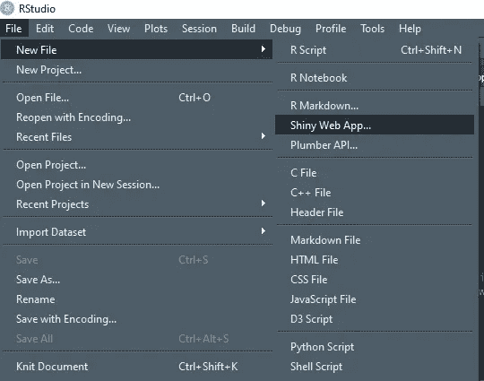
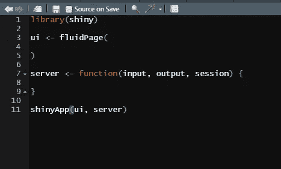
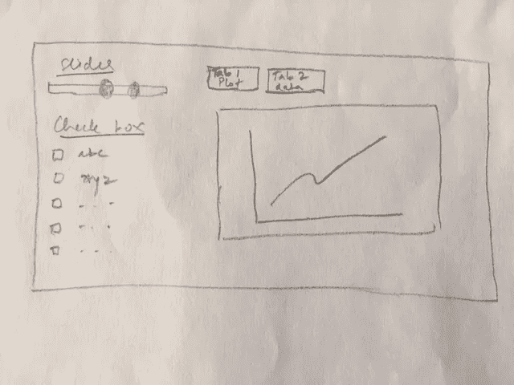
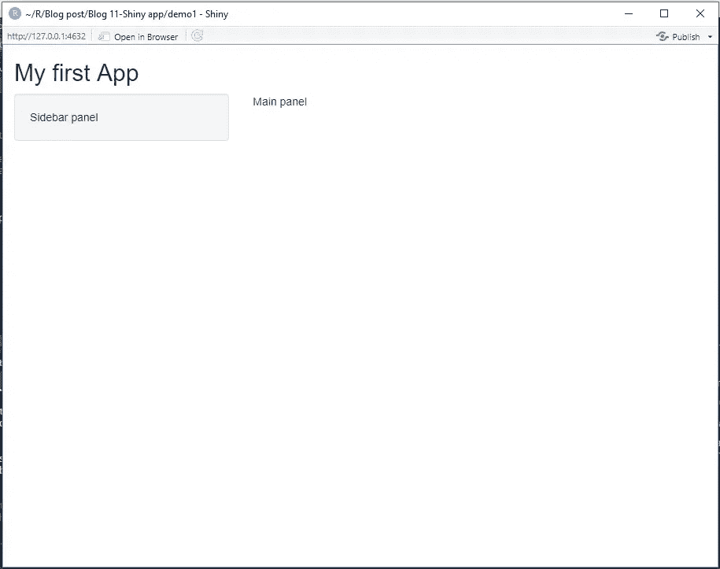
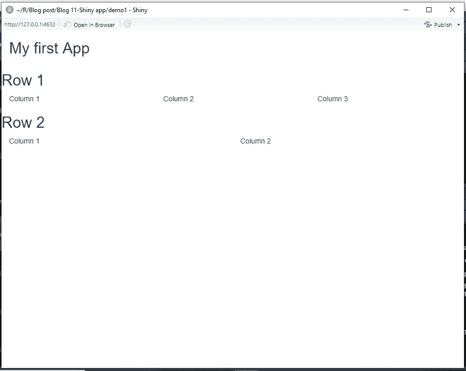
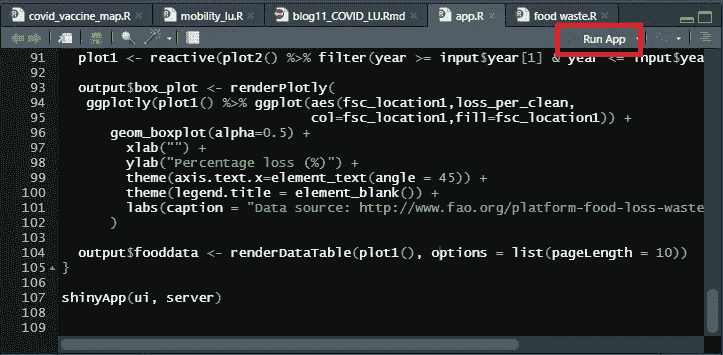
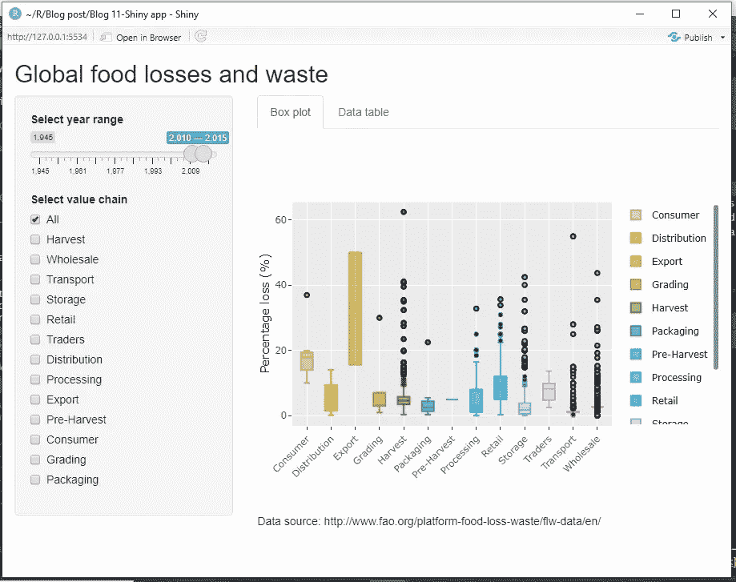
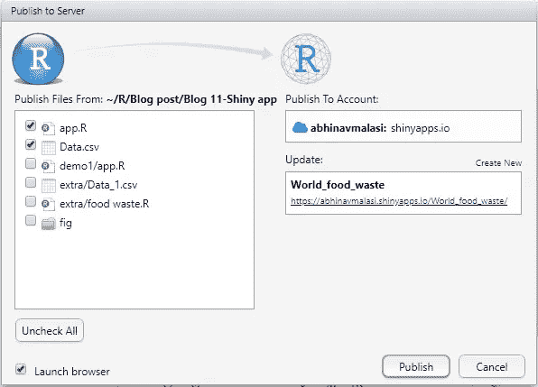

# 构建您的第一个闪亮应用程序所需要知道的一切

> 原文：<https://towardsdatascience.com/all-you-need-to-know-to-build-your-first-shiny-app-653603fd80d9?source=collection_archive---------14----------------------->

## 涵盖了从数据准备到连接用户界面和服务器再到在线发布应用程序的基本概念


斯蒂芬·道森在 Unsplash[拍摄的照片](https://unsplash.com?utm_source=medium&utm_medium=referral)

hiny 是数据分析师和数据科学家手中开发基于 web 的应用程序和交互式数据可视化的强大工具之一。闪亮的应用程序包含两个重要的功能:UI 和服务器功能。Shiny 的一个关键特性是使用反应式编程，在输入发生变化时自动更新输出。

我们使用联合国粮食及农业组织(FAO)的数据集来获得从头构建一个闪亮应用程序的实践经验(应用程序的[链接](https://abhinavmalasi.shinyapps.io/World_food_waste/))。本文分为以下几个部分:

1.  Shiny 概述:了解 Shiny 的工作原理和不同的可用选项
2.  数据准备:准备应用程序要使用的数据
3.  编写 UI 代码
4.  连接到服务器
5.  运行和发布应用程序

# 闪亮的概览

RStudio 开发的 Shiny 是一个同名的包。闪亮的框架由 CSS、HTML 和 Java 组成。这给了它添加功能的自由。在闪亮服务器的帮助下，这些应用程序托管在 shinyapps.io 上。

让我们从闪亮的 RStudio [画廊](https://shiny.rstudio.com/gallery/)看一些例子来获得动力。Shiny 还为用户提供演示、布局和[小部件](https://shiny.rstudio.com/gallery/widget-gallery.html)。这也有助于确定它们的工作原理，并为您自己的应用选择它们。

所以让我们开始吧…

要开始构建应用程序，我们可以打开一个新的闪亮的 Web 应用程序文档，如下图所示。这将弹出一个新窗口，提示您选择应用程序名称、应用程序类型(选择单个文件选项)，并设置工作目录。这将打开一个名为 app.R 的文件。该文件有一个默认代码为“老忠实喷泉数据”应用程序。



作者图片

另一个选择是打开一个新的 R 脚本(Windows 的 Ctrl+Shift+N ),并以 app 的名称保存它。R ( **这很重要**)在选择的文件夹中。然后只需在编辑器中键入`shinyapp`，这将打印出应用程序的框架，如下图所示。



作者图片

此时，我们将使用命令`install.packages(“shiny”)`确保我们已经在 over 设备上安装了闪亮的包。

运行`shinyapp`命令后，我们看到编辑器上显示了 4 个内容。

1.  它通过调用`library(shiny)`来加载闪亮的包。
2.  UI 是用户界面，它决定了用户如何与 HTML 网页交互。
3.  服务器是应用程序的后端，UI 端的所有交互都在这里实现，它们的结果被发送回 UI 进行显示。
4.  `shinyapp`功能是构建 app。

在深入研究 UI 和服务器提供的功能细节之前，让我们来设计一下用户界面的布局。一旦解决了这个问题，构建我们的应用程序将会更加直观。



作者图片

现在我们可以看看 UI 和服务器提供的功能。

## **用户界面控件**

这部分将处理用户在面板上可以访问的不同输入和输出控件。面板的宽度为 12。我们可以定义我们选择的布局，并相应地定制它。实现这一目标的关键功能是:

***【fluid page()***:确保应用自动调整以填充浏览器空间。

***titlePanel()*** :这应该是默认情况下在代码中标识应用程序将做什么。

**`sidebarLayout()`需要的其他功能是`sidebarPanel()`和`mainPanel()`。与在面板上向与侧边栏相关的最终用户显示功能相关的所有代码都将在`sidebarPanel()`中，而对于主面板，则在`mainPanel()`函数中。**

```
ui <- fluidPage(
  titlePanel("My first App"),

  sidebarLayout(
    sidebarPanel("Sidebar panel"),
    mainPanel("Main panel")
  )
)
```



作者图片

***fluidRow()*** :另一种方式可以是将面板分成多行。并且这些行中的每一行都可以有多列。通过多次使用`fluidRow()`函数实现多行，在`fluidRow()`函数中，我们可以使用`column()`定义列。

```
ui <- fluidPage(
  titlePanel("My first App"),

  fluidRow(
    titlePanel("Row 1"),
    column(4,"Column 1"),
    column(4,"Column 2"),
    column(4,"Column 3")
  ),
  fluidRow(
    titlePanel("Row 2"),
    column(6,"Column 1"),
    column(6,"Column 2")
  )
)
```



作者图片

现在我们知道如何建立骨架，我们可以开始填充前端的空白空间。前端处理 Shiny 应用程序提供的输入和输出。

## 输入部件

用户界面中的输入部件可以是文本、数字或日期，可以使用文本字段、滑块输入、单选按钮、复选框等输入。所有输入函数都有相同的第一个参数，即标识字段。

> 这个分配的 id 对于函数应该是唯一的，并且应该是仅由字母、数字和分数组成的单个字符串。

第二个参数是标签，它是用户理解要执行的操作的标识符。这个参数存在于大多数输入函数中。其他参数更具体地针对输入函数类型，最好的方法是浏览它们的文档或直观地查看[。](https://shiny.rstudio.com/gallery/widget-gallery.html)

## 输出

像输入函数或输入小部件这样的输出函数有一个惟一的标识符作为它们的第一个参数。输出可以是图表、数据表、文本或总结的形式。

## 计算机网络服务器

服务器功能是你的应用程序的大脑，所有的决定都在这里做出，并反映到用户界面上。

现在我们已经有了用 Shiny 构建一个应用程序所需的所有基础知识和细节，所以让我们开始吧。

# 数据集和包

为了构建应用程序，我们将使用粮农组织提供的粮食损失和浪费数据库。到数据集的链接在这里是。数据由 18k 多行和 22 列组成。

我们将使用`shiny`包来构建应用程序，`readxl`包用于读取 CSV 文件，`plotly`包用于交互式数据可视化，`tidyverse`包用于所有数据操作，`ggplot2`包用于绘图。

# 数据准备

在开始开发 app 之前，需要准备好资料。在目前的研究中，我们将在一定程度上复制粮农组织开发的应用程序。在本练习中，我们将获取两个输入，并以图表和数据表的形式生成两个输出。

安装相关软件包后，使用`read_csv()`功能读取 CSV 文件，同时用 *NA* 值替换所有空单元格。为了简单起见，删除了一些不必要的列。因为我们对粮食损失如何随时间变化感兴趣，所以为了简单起见，带有年份数据的列被重命名为 *year* 。

接下来，变量 *supplychain* 已被定义，并被赋予我们感兴趣的参数。仅绘制相对于 *fsc_location1* 的百分比损失数据就显示了一个收割的错别字，该错别字随后被纠正。

使用`filter()`函数后，定义了一个新变量 *food_new* 。由于我们只关心*供应链*变量中的参数，我们将数据过滤到新创建的变量中。

定义了一个名为*换行符*的函数，以避免稍后在 UI 中重复使用换行符。定义了一个名为*复选框*的新变量，包含使用`checkboxGroupInput()`功能可获得的所有选项。

# 编写 UI 代码

我们的目标是让用户界面带有侧边栏，主面板带有两个选项卡。我们将从`fluidPage()`函数开始，并在其中构建所有东西。有三个主要步骤:

1.  使用`titlePanel()`功能向应用程序提供航向。
2.  定义`sidebarLayout()`功能，定义其主体部分由`sidebarPanel()`和`mainPanel()`组成。
3.  在`mainPanel()`函数中，我们使用 `tabsetPanel()`中的`tabPanel()`函数定义标签。

一旦创建了框架，我们就可以开始填充细节了。我们从侧边栏面板开始，用户将在那里与数据进行交互。考虑的两种不同的交互方式是(1)滑块输入和(2)复选框。对于滑块输入，我们将使用带有 *id = "year"* ，*label = " Select year range "*的`sliderInput()`函数，设置所考虑年份的最小值和最大值以及默认年份范围。从复选框中选择选项时，将使用`checkboxGroupInput()`功能。此函数有一个标识符， *id="valuechain"* ，*label = " Select value chain "*， *check_box* 变量，所有选项都显示给用户，默认选择值为“all”。

我们现在转到`mainPanel()`功能。在`tabsetPanel()`函数中，我们设置 *type="tabs"* 在用户界面的布局上有标签。接下来，我们定义两个`tabPanel()`来表示两个不同的选项卡。将名称分配给选项卡作为第一个参数，在我们的例子中，它们是*“盒图”*和*“数据表”*。

一旦定义了输入函数，我们就开始输出函数。第一个选项卡将显示使用 `plotlyOutput()`功能的交互图，第二个选项卡将显示使用`dataTableOutput()`功能的数据表，这些功能生成具有内置搜索功能的动态表。像输入函数一样，输出函数的第一个参数是标识符。对于图形和表格输出，标识符值分别设置为*“box _ plot”*和*“food data”*。

# 连接到服务器

完成 UI 代码后，我们将使用 UI 的各种输入和输出函数中定义的标识符将 UI 连接到服务器。服务器函数有三个参数:输入、输出和会话。我们将只处理输入和输出参数。

> session 参数确保每次在网络上打开应用程序时，它都会启动一个新的会话。这样，一个用户所做的更改不会反映到另一个用户的会话中。

服务器中定义了两种不同的函数:反应函数和渲染函数。我们将逐一查看它们，看看这些函数是如何与 UI 通信的。

我们将`reactive()`功能留到最后，先讨论渲染功能。在 UI 中，我们为每个输入和输出函数定义了标识符。在这里，我们将使用信息流的标识符来连接 UI 和服务器。

查看盒图，我们看到*输出$box_plot* 变量被分配给`renderPlotly()`函数。需要注意的重要一点是，*输出$box_plot* 借助于 *box_plot* 标识符连接到 UI 中的`plotlyOutput()`功能。UI 中的每个输出功能都与服务器中的一个`render()`功能相关联。在该应用中，UI 中的`plotlyOutput()`功能与`renderPlotly()`关联，`dataTableOutput()`与`renderDataTable()`功能关联。并且为 UI 中的每个输出函数定义的唯一标识符*将其与相关的渲染函数连接起来。这样，我们就将用户界面中的盒图和数据表与服务器连接起来了。*

在`renderDataTable()`函数中，我们定义了`options`参数，将页面长度限制为 10 行数据。

我们现在已经准备好了静态应用程序，可以在线发布了。这个应用程序所缺少的是，对滑块或复选框所做的更改不会显示在 boxplot 或数据表中。为了让应用程序更加动态，我们将使用`reactive()` 表达式。

这里要解决的一个关键点是，应用程序的动态特性不需要一个`reactive()`表达式。UI 的所有输入功能都可以直接连接到`render()`功能。这种风格可能适用于具有基本功能的应用程序，但随着应用程序变得复杂，最好使用`reactive()`表达式。

`reactive()`表达式做了两件重要的事情:它使应用程序更快更有效，消除了代码的重复，并保持渲染函数与所有外部操作的清洁。`reactive()`表达式被分配给在 Shiny 中被称为 *variable()* 的变量。在我们的例子中，我们定义了两个反应表达式 *plot1* 和 *plot2* 。在 *plot2* 中，对 UI 中的复选框输入面板进行基于条件的过滤。在 *plot1* 中，过滤与滑块输入相关联。因为我们希望这两个变化都反映在显示的输出中，所以，我们使用了 *plot2()* 作为 *plot1* 的输入变量。最后， *plot1()* 被用作`render()`函数中的数据。

为了反映用户界面上所做的更改，我们将在标识符的帮助下连接 UI 的输入函数，就像输出函数一样。这里，我们将使用*输入$valuechain* 来反映对“选择价值链”选项所做的任何更改，这些更改将直接告诉服务器使用`reactive()`表达式采取行动，并将反映在用户界面上的方框图和数据表中。类似地，*输入$year* 将反映在绘图和数据表的滑块上所做的更改。

# 运行应用程序

现在您已经填写了 UI 和服务器的详细信息。现在是时候使用编辑器右上角的运行应用程序选项来启动应用程序了。



作者图片

按下运行应用程序按钮，应用程序将在一个新窗口中打开，如下所示。



作者图片

# 在线发布应用程序

如果这是你第一次在 ShinyApps.io 上打开一个用户帐户，接下来，在 R 上安装 *rsconnect 包*，然后从你的 Shiny 帐户复制令牌细节，并在 R 控制台上运行命令，这将授权你从你的笔记本电脑发布到 ShinyApps.io 网页。

要在线发布应用程序，请按应用程序右上角的发布按钮(您可以参考上图)。现在将打开一个窗口，按下一步，然后选择 ShinyApps.io 选项。接下来的事情是选择需要发布的文件，并给你的应用程序命名，这将显示在 URL 中。



作者图片

按下“发布”后，应用程序需要几分钟才能上线。这将显示在 ShinyApps 网站上您帐户的仪表盘中。

已发布 app 链接:[](https://abhinavmalasi.shinyapps.io/World_food_waste/)

# **结束语**

**Shiny 是一个强大的工具，一旦你对它的内部工作有了基本的了解，它就可以非常直观和容易地构建应用程序。它既被动又懒惰。在用户界面上所做的改变会很快反映在界面上，从而使它变得被动和懒惰，因为它只会做最少量的工作来更新应用程序。**

**用 Shiny 构建应用程序的最佳方法是首先在一张纸上设计用户界面，以确定你需要什么。然后开始在 UI 中逐个添加组件，然后连接到服务器。确保为 UI 中的每个功能定义唯一的标识符。这样，当一个功能完成时，运行应用程序，看看它是否能根据您的需要工作。如果它是好的，然后添加其他功能，并与前一个连接。这样，在构建你的应用程序时，卡住的机会就少了。**

**我希望这能激励你构建自己的闪亮应用。有大量关于构建闪亮应用的文献和教程。从[闪亮网站](https://shiny.rstudio.com/tutorial/)的教程开始，并从网页上分享的[应用中获得灵感。然后你也可以读一读《掌握闪亮的 T9》这本书，这本书很好地理解了哈德利·威克姆(Hadley Wickham)构建闪亮应用背后的思维过程。](https://shiny.rstudio.com/gallery/)**

**如果你开发了应用程序，请在评论或链接中分享你的想法。到那时，快乐的编码！**

**对 R 的更多阅读感兴趣，请查看:**

**[](/3-lesser-known-pipe-operators-in-tidyverse-111d3411803a) [## Tidyverse 三家不太知名的管道运营商

### Tee、exposition 和赋值管道操作符，用于干净的代码编写。

towardsdatascience.com](/3-lesser-known-pipe-operators-in-tidyverse-111d3411803a) [](/data-visualization-using-ggplot2-5-features-worth-knowing-c0447a760335) [## 使用 ggplot2 的数据可视化:值得了解的 5 个特性

### 使用 ggplot2 包提高 dataviz 效率的技巧

towardsdatascience.com](/data-visualization-using-ggplot2-5-features-worth-knowing-c0447a760335) [](/create-your-resume-with-pagedown-package-in-r-123ca6310d52) [## 用 R 中的 pagedown 包创建你的简历

### 使用 pagedown 包在 1 小时内制作令人印象深刻的简历

towardsdatascience.com](/create-your-resume-with-pagedown-package-in-r-123ca6310d52) [](/7-shortcuts-worth-knowing-for-efficient-workflow-in-r-cc52c351cb73) [## R 中高效工作流值得知道的 7 个捷径

### RStudio 中常规编码的便捷键盘快捷键

towardsdatascience.com](/7-shortcuts-worth-knowing-for-efficient-workflow-in-r-cc52c351cb73) [](/master-data-visualization-with-ggplot2-theme-customization-8421695d24e2) [## 使用 ggplot2: theme()定制的主数据可视化

### 自定义 ggplot2 主题，为高效工作流程创建您的个性化主题模板。

towardsdatascience.com](/master-data-visualization-with-ggplot2-theme-customization-8421695d24e2) 

## 参考资料:

1.  [https://mastering-shiny.org/index.html](https://mastering-shiny.org/index.html)
2.  [https://data catalog . world bank . org/dataset/what-waste-global-database](https://datacatalog.worldbank.org/dataset/what-waste-global-database)
3.  【http://www.fao.org/platform-food-loss-waste/flw-data/en/ 
4.  [https://shiny.rstudio.com/reference/shiny/1.5.0/](https://shiny.rstudio.com/reference/shiny/1.5.0/)

该应用程序的完整代码的链接是[这里是](https://github.com/amalasi2418/Blog-post/tree/master/Blog%2012-Shiny%20app)。

您可以在 [LinkedIn](https://www.linkedin.com/in/abhinav-malasi/) 和 [Twitter](https://twitter.com/malasi_abhinav) 上与我联系，跟随我的数据科学和数据可视化之旅。**