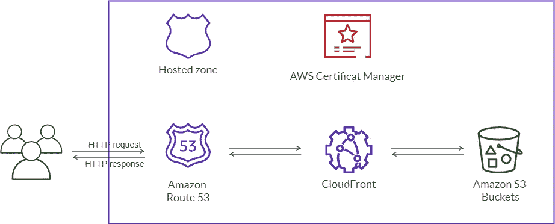
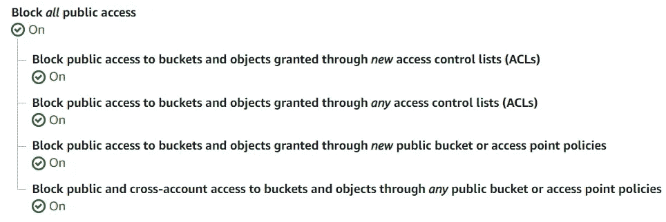
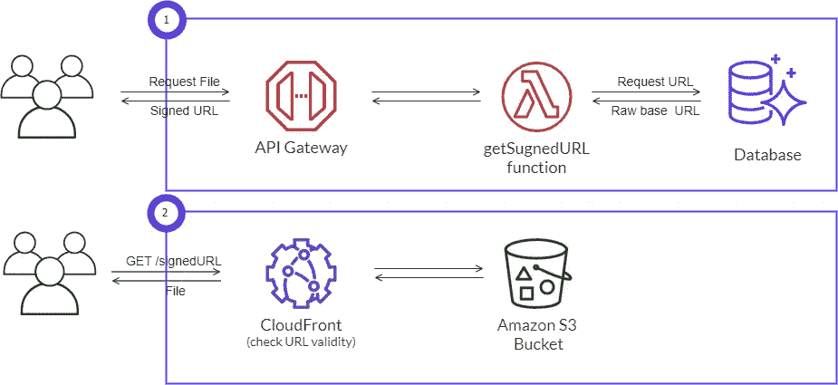

# 使用 CloudFront 功能和 S3 保护应用程序，您只需知道

> 原文：<https://towardsdatascience.com/all-you-need-to-know-to-secure-apps-with-cloudfront-functions-and-s3-d9f5c966d8a9?source=collection_archive---------12----------------------->

## [行业笔记](https://towardsdatascience.com/tagged/notes-from-industry)，我所了解到的

## 帮助我们成功通过安全审计的安全最佳实践


由美国国家航空航天局、欧空局和 STScI 拍摄的船底座星云(“名人星”星云)

C 目前，亚马逊 S3 和 CloudFront 是交付生产就绪 spa 的最佳云服务，如 Angular 应用程序、Vue 应用程序或 React 应用程序。不幸的是，默认情况下，S3 和 CloudFront 并没有启用所有的安全功能，需要在生产中运行这样的 SPA 前端应用程序。

最近，我们推出了一个前端(Angular apps)平台，托管在亚马逊 S3 和 CloudFront 上。在本文中，我想分享主要的安全最佳实践，以及我们如何在我们的平台上实现它们。有了这些安全最佳实践，帮助我们成功通过了非常严格的安全审核！

# S3 和 CloudFront 的安全最佳实践概述

S3 和 CloudFront 都是非常成熟的云服务，开始时也相对简单。然而，还有比第一眼看到的更多的东西，特别是如果这些服务一起使用的话。此外，如果与 Route 53 (AWS DNS 服务)和 Amazon Certificates Manager 等其他云服务相结合，它们将成为任何 web 开发人员的强大必备工具套件。不幸的是，它们的灵活性和表面上的简单性可能是一个安全隐患。在过去的几个月里，我们大多数人可能听说过至少一个 S3 数据泄露的例子(无论你什么时候读到这篇文章)。

下图显示了托管在 S3 和 CloudFront 上的典型 SPA 的示例基础架构。自然，这样的前端应用程序将依赖于一组后端服务和 API。由于这篇文章已经超出了我最初的预期，我们将不在本文中讨论平台的后端。



使用 S3 和 CloudFront 的 Angular、Vue 或 React 应用程序的示例部署图(作者)。

在本文中，我将主要关注安全性最佳实践，这些实践有助于解决以下问题:

*   **如何保护存储敏感用户数据和应用程序代码的 S3 存储桶？**
*   **如何安全地配置 CloudFront 发行版？**
*   **如何用 CloudFront 功能保护前端应用免受常见 OWASP 威胁？**

因此，让我们首先看看我们可以用 S3 和 CloudFront 做些什么来保护我们的 Angular、Vue 或 React 前端应用程序。

> 注意:我决定基于 AWS 服务来组织这篇文章，因为我想尽可能多地亲自动手。

# 固定 S3 铲斗

多年来，S3 已经发展成为一个功能极其丰富的云服务。亚马逊 S3 可以实现许多用例。因此，保护 S3 桶和物体在很大程度上取决于它们的使用方式。大概，最常见的用例，也是我想更详细考察的用例是:托管 web 应用，为用户的二进制对象数据提供存储，比如:图像、视频和文档。

保护 S3 桶主要需要:*锁定对桶的访问，阻止所有公共访问，* *保护静态数据，保护传输中的数据*。

让我们从配置 bucket 访问权限开始。首先，我们需要了解有几种方法来控制对 S3 存储桶和对象的访问:使用 S3 存储桶策略、S3 ACL、S3 接入点策略或 IAM 策略。如果你对其中的区别感兴趣，你应该看看:*[*IAM 策略和 Bucket 策略以及 ACL！哦，天啊！*](https://aws.amazon.com/blogs/security/iam-policies-and-bucket-policies-and-acls-oh-my-controlling-access-to-s3-resources/) ”。*

## ***使用 S3 存储桶策略的访问控制***

*我将重点介绍使用 S3 存储桶策略配置访问控制，因为在我看来，它们最适合手头的任务。以下策略在保护 S3 水桶方面做得很好。*

*通过 CloudFront 配置访问的 S3 策略示例。*

*我们的示例 S3 存储桶策略包含两个语句。第一条语句用于锁定对 bucket 对象的读访问，即只允许通过特定的 CloudFront 发行版访问它们。该发行版通过使用其*原始访问标识*来指定，其中可以通过 [CloudFront 控制台](https://docs.aws.amazon.com/AmazonCloudFront/latest/DeveloperGuide/private-content-restricting-access-to-s3.html#private-content-creating-oai-console)轻松创建。这很容易设置，但它已经提高了安全性，因为 S3 桶策略将*拒绝*一个动作，除非有明确的*允许。*在我们的策略中，只明确允许 *GetObject* 动作，并且只允许我们的 CloudFront 发行版读取 bucket 的对象。注意，这个策略并不阻止通过 CloudFront 发行版访问数据。任何知道 CloudFront URL 的人都可以阅读我们 S3 桶中的所有数据。稍后我们将讨论如何进一步限制对数据读访问。*

*解开我们政策中的第二个声明要稍微复杂一点。它用于阻止向 S3 存储桶添加对象，除非写请求是由具有`BACKEND_ROLE_ID`角色的后端服务发出的。更正式的说法是:*否认* `PutObject` *动作*对于任何*原则*，除非其`userId`以`BACKEND_ROLE_ID`开头。或者相反，只有当委托人已经承担了`BACKEND_ROLE_ID.`的角色时，才允许写入这个桶*

*需要注意的是，在我们的条件中，我们没有使用角色的 ARN，而是使用其唯一的*角色 Id* 来指定期望的角色*。为了检索*角色 Id* ，我们可以运行`aws iam get-role --role-name ROLE_NAME`。如果由于某种原因无法使用 AWS CLI，另一个解决方案是使用条件键`aws:PrincipalArn` 而不是`aws:userId` *，*，因为它也总是包含在请求中。例如，您可以更改上面的策略来指定下面的条件语句，而不更改策略的语义。**

*使用 PrincipalArn 代替 UserId 的替代条件。*

*眼尖的读者会注意到，我们在语句“条件”中也指定了`*AIDA**` *。通过将它添加到我们的条件表达式中，我们还允许所有 IAM 用户将对象写入 S3 桶。原因是 AWS IAM 为所有用户分配唯一的 id，所有这些 id 都有相同的前缀，也就是`*AIDA*`。虽然添加这个条件并不是生产所需要的(记住[总是*让人们远离数据*](https://wa.aws.amazon.com/wat.pillar.security.en.html) )，但它在开发过程中非常有用。此外，我们可以使用类似的方法为 CI/CD 管道、lambda 函数、自动缩放组中的 EC2 实例等设置权限。**

> *注意:激活 IAM Access Analyzer 在实践中非常有用，在策略创建期间(充当“语法检查器”)和系统运行期间(持续监视安全策略的更改)都是如此。而且是免费的。*

*这种方法是允许后端服务和外部服务器到服务器回调将数据上传到我们的 S3 桶的好方法。然而，许多应用程序也希望最终用户能够上传他们自己的数据，例如个人资料图像。为了能够将文件从前端应用程序直接上传到 S3 存储桶，我们需要 [S3 预先指定的 URL](https://docs.aws.amazon.com/AmazonS3/latest/userguide/PresignedUrlUploadObject.html)。这个过程的工作方式(大致)是让后端服务向 S3 发送一个上传请求。然后，它使用 POST 或 PUT 方法生成加密的上传 URL，并将其返回给调用服务。最后，后端服务将这个签名的 URL 发送到前端客户端，然后前端客户端可以直接上传到 S3。降低成本和更好的性能(特别是使用 [S3 传输加速](https://docs.aws.amazon.com/AmazonS3/latest/userguide/transfer-acceleration.html))只是使用预设计 URL 的一些好处。查看以下文章了解更多细节。*

*[](https://aws.amazon.com/blogs/compute/uploading-to-amazon-s3-directly-from-a-web-or-mobile-application/) [## 从网络或移动应用程序直接上传到亚马逊|亚马逊网络服务

### 这篇博文介绍了一个样例应用程序 repo，并解释了从 S3 检索签名 URL 的过程。它…

aws.amazon.com](https://aws.amazon.com/blogs/compute/uploading-to-amazon-s3-directly-from-a-web-or-mobile-application/) 

## **保护 S3 的静态数据**

保护静态数据是一个非常广泛的主题，涉及的技术包括:数据加密、标记化(匿名化数据)和屏蔽(编辑数据)。S3 提供了许多有用的功能，可以为驻留在 S3 的数据增加额外的安全层。尽管保护静态数据可能是一个非常复杂的过程，但大多数 web 应用程序通过采取以下措施应该是没问题的:

*   *启用* [*默认桶加密*](https://docs.aws.amazon.com/AmazonS3/latest/userguide/default-bucket-encryption.html) *n⁴* 。亚马逊 S3 支持用户数据的服务器端加密，并且对最终用户完全透明。也可以在 S3 控制台中一键启用。我推荐使用亚马逊 S3 管理的密钥(SSE-S3)，因为这将降低成本，而且因为 SSE-S3 不受任何费率限制。
*   激活 [*桶版本*](https://docs.aws.amazon.com/AmazonS3/latest/userguide/manage-versioning-examples.html) *g.* 这使得 S3 为每个修改或删除的对象存储一个新版本，如果需要的话，我们可以从该版本中恢复(意外)受损的对象。另外，我发现在 bucket 上启用 [MFA delete 非常有用，但是必须由 root 帐户来完成。激活版本控制非常简单，类似于启用服务器端加密，不需要我们改变应用程序的业务逻辑。](https://docs.aws.amazon.com/AmazonS3/latest/userguide/MultiFactorAuthenticationDelete.html)
*   *启用* [*为 S3*](https://docs.aws.amazon.com/AmazonS3/latest/userguide/enable-cloudtrail-logging-for-s3.html) *⁴* 进行 CloudTrail 日志记录。这是我推荐的最低标准。它支持记录 S3 API 调用，包括来自控制台的调用和对亚马逊 S3 API 的代码调用(例如，来自后端服务)。
*   最后，作为额外的安全层，确保[阻止所有公共访问](https://docs.aws.amazon.com/AmazonS3/latest/userguide/access-control-block-public-access.html)你的 S3 桶。



阻止所有公众访问 S3 桶。

# 保护 CloudFront 发行版

在其核心，CloudFront 是一个内容交付网络(CDN ),它(除了缓存层之外)不存储任何数据。因此，在保护我们前端的 CloudFront 分发的背景下，主要讨论:*保护传输中的数据和管理访问控制是有意义的。*

我们的 CloudFront 发行版是我们应用程序的唯一入口。这意味着所有用户请求都需要通过 CloudFront 发行版。CloudFront 还支持将多个来源放在一个发行版后面。这使我们能够通过单个分布，即单个(子)域，公开多个 S3 桶。所有这些使得保护我们的 CloudFront 发行版成为一个非常重要的问题。

## 使用 CloudFront 的签名 URL 进行访问控制

通过限制只有 CloudFront 才能访问我们的 S3 存储区，我们已经极大地限制了访问控制。然而，一些数据可能需要额外的安全层。输入 CloudFront 签名的 URL。

签名的 URL 是一个非常有用的特性，它本身可能值得写一篇文章。在这里，我简要地讨论了*何时以及* *如何使用它们，因为没有经过签名的 URL，我们的安全最佳实践将是不完整的。*

我们通常决定额外保护 S3 对象，当我们不想让网上的每个人都可以读取它们的时候。这可能是因为数据是敏感的(例如，用户的购买发票)，或者它应该只对付费用户开放(例如，课程视频)。例如，私人用户文件应该只允许特定用户访问，而不是网络上的所有人。下面是一个签名网址的例子，可以用来访问`user_invoice.pdf`。

```
https://example.com/user_invoice.pdf?**Expires**=1622924658&**Signature=**9MwQEvSlsWvNfv9GrW71WMiG4X…&**Key-Pair-Id**=APKAJXX2ABBXX6HIX
```

我们注意到它只是一个普通的 URL，末尾附加了三个参数。`Expires`，它决定了 URL 的有效时间,(哈希和签名)`Signature`本身和用于生成签名的公钥的`Key-Pair-Id`。如果任何参数被省略或不正确，CloudFront 将返回禁止，并带有 HTTP 403 状态代码。还要注意，在我们的例子中，为了可读性，签名被缩短了。



生成一个 CloudFront 签名的 URL 并使用签名的 URL 检索一个 S3 文件(由作者完成)。

那么我们如何生成这样的 URL 呢？据我所知，最常见的使用模式是拥有一个后端签名服务，它充当一个可信的签名者，并在用户请求时对 URL 进行签名(见上图)。URL 通常存储为“原始的”(基本 URL，没有签名)，签名服务用于在请求时按需生成签名的 URL。然后，这些可以被嵌入到前端页面中，并例如在用户仪表板上向用户显示。

> 注意:最近，生成签名的 URL 变得更加方便，因为现在 IAM 用户可以通过密钥组管理用于签名的 URL 的公钥(参见上面例子中的`Key-Pair-Id`),而不需要 AWS root 帐户。签名 URL 的一种替代方法是签名 cookies。它们都有自己的目的，但是一般来说，我们可以用签名的 URL 和 cookies 达到相似的效果。

## 通过 CloudFront 和 S3 保护传输中的数据

CloudFront 提供了许多配置旋钮，可以很容易地“转动”它们来提高传输中数据的整体安全性。在这里，我们认为传输中的数据是查看者(用户)和源(我们的 S3 桶)之间的所有数据流，它们通过 CloudFront 分布(边缘位置)。最重要的 CloudFront 配置旋钮 include⁵:

*   确保安全策略正确配置了安全 TLS 和密码。这保证了 CloudFront 使用安全版本的 TLS 协议在 CloudFront 的边缘位置和您的用户(查看者)之间进行 HTTPS 通信。根据经验，我建议使用 TLSv1.0 或更高版本(如果浏览器兼容性允许，最好只使用 TLSv1.2_2019)，并严格避免使用 SSLv3 协议。*注意:参见 CloudFront 发行版的安全策略设置。*
*   确保 CloudFront 发行版和查看器之间的通信通过 HTTPS 进行。*注意:只需将查看器协议策略设置为总是要求查看器只使用 HTTPS protocol⁴.*
*   确保 CloudFront edge 位置与其客户源之间的通信使用 HTTPS，以满足传输中数据加密的合规性要求。*注:如前所述，通过设置查看器协议策略自动启用。*

最后，还有一个有用的 S3 功能，用于额外保护传输中的数据——VPC 端点，特别是 S3 的[网关端点](https://docs.aws.amazon.com/vpc/latest/privatelink/vpc-endpoints-s3.html)。网关端点类似于 AWS 公共区域服务的网关。它通常用于使私有子网中的 EC2 实例能够访问 S3(或 DynamoDB)，而无需离开私有 VPC 网络。它们基于路由表工作，即添加新的路由规则。安全性是通过 VPC 端点策略实现的。然而，我不会更详细地讨论 VPC 端点，因为我相信大多数[应用程序使用数据](https://d1.awsstatic.com/whitepapers/compliance/AWS_Data_Classification.pdf)，不一定需要这种级别的隔离。* 

# *CloudFront 功能和防范常见 OWASP 威胁*

*许多[十大 OWASP 威胁](https://owasp.org/www-project-top-ten/)不容易(甚至不可能)仅通过 S3 和 CloudFront 特性解决。直到最近，我们不得不使用 Lambda@Edge⁶，但从几周前开始，我们可以使用 [CloudFront 函数](https://aws.amazon.com/blogs/aws/introducing-cloudfront-functions-run-your-code-at-the-edge-with-low-latency-at-any-scale/)来实现与 Lambda@Edge 函数相同的功能，而成本只是它的一小部分。下面是函数，我们用它来注入最常见的安全 HTTP 响应头，并实施一些最佳安全实践。我们希望在向用户返回响应之前激活这个函数。因此，它应该与 CloudFront Functions 事件类型相关联:*查看器响应*。*

*一个添加通用安全响应 HTTP 头的 CloudFront 函数。*

*我们的 CloudFront 函数向来自 CloudFront 的用户/查看者响应注入了几个常见的 HTTP 安全头:*

*   *[HTTP Strict-Transport-Security](https://developer.mozilla.org/en-US/docs/Web/HTTP/Headers/Strict-Transport-Security)(HSTS)是 HTTP 响应头，指示浏览器始终使用 HTTPS 访问网站。我们添加这个标题是为了保护我们的用户免受[中间人](https://owasp.org/www-community/attacks/Manipulator-in-the-middle_attack)攻击。*
*   *[内容安全策略(CSP)](https://developer.mozilla.org/en-US/docs/Web/HTTP/CSP) 是一个 HTTP 响应头，它告诉浏览器应该如何以及在哪里加载页面内容。例如，CSP 可用于限制仅从可信来源(如 own domain、Stripe 和 Google)加载 JS 脚本。CSP 在检测和缓解[跨站脚本(XSS)](https://owasp.org/www-community/attacks/xss/) 和数据注入攻击方面发挥着重要作用。*
*   *[X-XSS 保护](https://developer.mozilla.org/en-US/docs/Web/HTTP/Headers/X-XSS-Protection)是一个 HTTP 响应头，它指示浏览器在检测到反射的 C [罗斯站点脚本(XSS)](https://owasp.org/www-community/attacks/xss/) 攻击时阻止页面加载。这对于不支持 CSP 的旧浏览器非常有用。*
*   *[X-Content-Type-Options](https://developer.mozilla.org/en-US/docs/Web/HTTP/Headers/X-Content-Type-Options) 是一个 HTTP 响应头，它指示浏览器按原样使用 MIME 类型，并禁用浏览器的内容嗅探试探法。通过将这个头添加到响应中，我们可以防止 [MIME 混淆](https://blog.mozilla.org/security/2016/08/26/mitigating-mime-confusion-attacks-in-firefox/)攻击。*
*   *[X-Frame-Options](https://developer.mozilla.org/en-US/docs/Web/HTTP/Headers/X-Frame-Options) 是一个 HTTP 响应头，指示是否允许浏览器在`<frame>`、`<iframe>`、`<embed>`或`<object>`元素中呈现页面。我们可以用这个头来防止[点击劫持攻击](https://owasp.org/www-community/attacks/Clickjacking) s。*
*   *[Referrer-Policy](https://developer.mozilla.org/en-US/docs/Web/HTTP/Headers/Referrer-Policy) 是一个 HTTP 响应头，它控制对外部链接的请求应该包含多少 Referrer 信息。引用策略用于确保没有跨域的引用泄漏。*
*   *[Expect-CT](https://developer.mozilla.org/en-US/docs/Web/HTTP/Headers/Expect-CT) 是和 HTTP 响应头，使用证书透明性策略，即要求证书存在于公共日志中，并且客户端响应附有有效签名。*

> *注意:这个函数最初是用 Lambda@Edge 实现的。这个版本的功能可以在 [GitHub gist 这里](https://gist.github.com/stefannastic/2af907acdd242d762a64b0e550ce11db)获得。*

# *结束语*

*Amazons [良好架构的框架](https://wa.aws.amazon.com/wat.pillar.security.en.html)指定了 6 个安全最佳实践，这些实践被分解为 10 个安全问题。在本文中，我们主要关注为前端应用程序实现[数据保护](https://wa.aws.amazon.com/wat.pillar.security.en.html#sec.daataprot)最佳实践，这些应用程序使用 S3 和 CloudFront 进行数据存储和交付。特别是，我们解决了 SEC 9(保护静态数据)和 SEC 10(保护传输中的数据)安全问题。此外，我们还看到了如何通过使用 CloudFront 函数(或 Lambda@Edge 函数)来防范常见的 OWASP 威胁。*

*我最初的目标是分享我在 AWS 上保护前端应用程序的经验，以及从上次安全审计中学到的一些教训。然而，这被证明是(我所认为的)一个保护具有 S3 和 CloudFront 功能的前端应用程序的综合指南。*

*反正有很多教程讲解如何部署 Angular 或者 React 之类的 spa。然而，对于侧重于实施安全最佳实践的全面的端到端指南来说，情况并非如此。*

*感谢阅读到最后！希望你喜欢这个！*

# *尾注*

1.  **下面是一个实际的* [*模式*](https://github.com/cdk-patterns/serverless/blob/main/s3-angular-website/README.md) *如何使用 AWS 云开发套件(CDK)部署这样一个应用。**
2.  **注意，在 AWS 术语中，bucket owner 实际上是 AWS 帐户，而不是 IAM 用户，它创建了 bucket 或对象。另请参见下面的尾注 3。**
3.  **注意，所有想要访问 S3 桶的服务(和用户)都需要一个明确的许可。该许可可以通过 S3 存储桶策略或 IAM 策略来授予。我更喜欢用后者。因此，在本文中我假设* `*BACKEND_ROLE*` *有一个关联的 IAM 策略，这允许它与 S3 对话。**
4.  **这可能会产生额外的费用。**
5.  *除了以上几点，我们还可以对特别敏感的数据使用字段级加密，比如信用卡信息。它是 HTTPS 之上的附加加密层，它保证只有你的应用程序才能解密这些字段。例如，这可以防止通过系统日志或诊断工具泄漏信息。*
6.  *AWS 确实提供了 WAF 和 Shield 等附加服务，但我们不能完全依赖它们。相反，我们应该始终致力于深度防御方法*，即保护我们应用程序的所有层。**