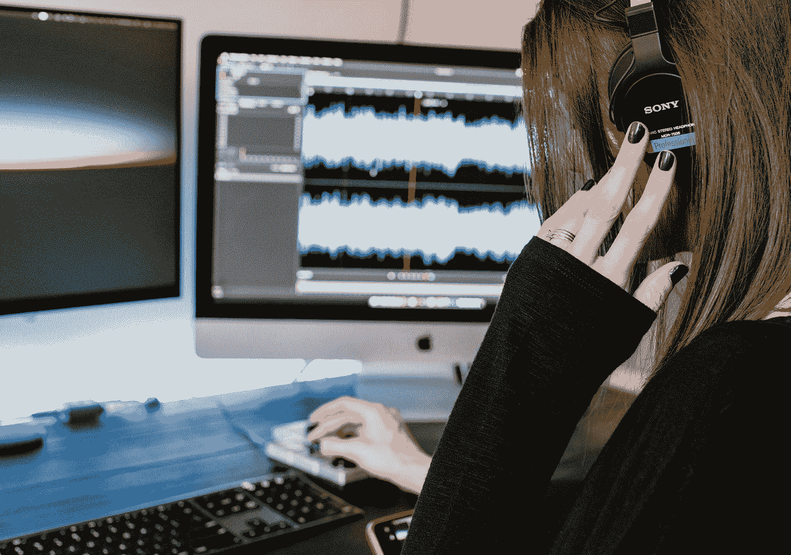
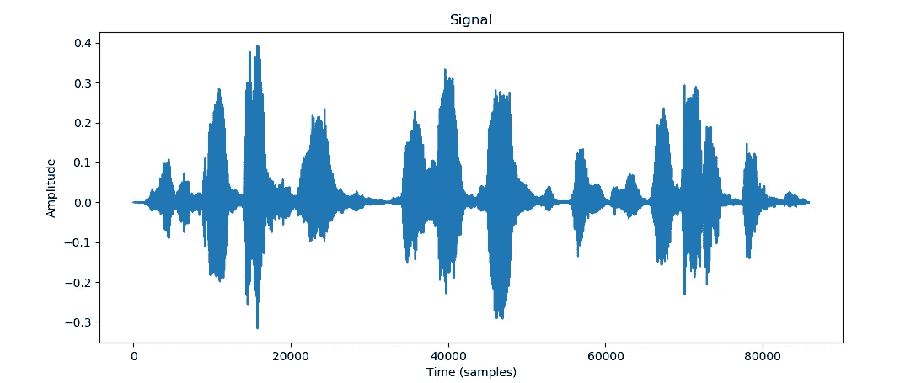
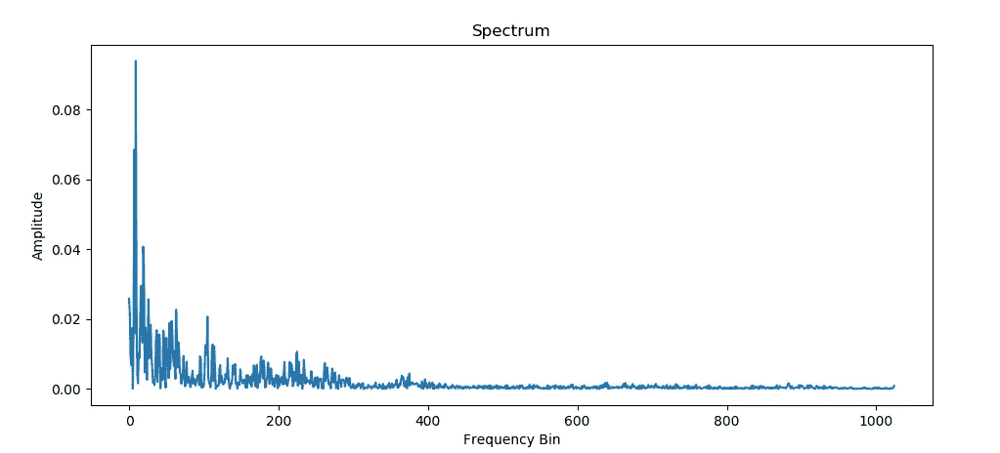
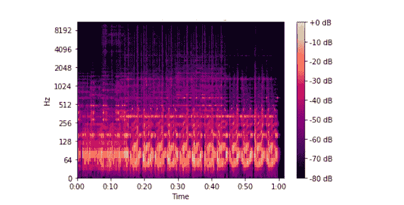

# 使用深度学习开始语音处理需要知道的术语

> 原文：<https://towardsdatascience.com/all-you-need-to-know-to-start-speech-processing-with-deep-learning-102c916edf62?source=collection_archive---------12----------------------->

凯利·西克玛在 [Unsplash](https://unsplash.com?utm_source=medium&utm_medium=referral) 上的照片

我们都爱我们的 Alexa 和 Siri，但你知道你可以自己从头开始做一个吗？

在接下来的系列博客中，我们将讨论更多关于音频和围绕音频的深度学习研究。但首先，让我们花些时间来了解与处理音频相关的基本术语。

通过这篇博客，我将讲述以下主题，这些主题将使您能够更深入地研究文本到语音转换和语音处理:

*   声音的
*   傅里叶变换
*   短时傅里叶变换和频谱图
*   梅尔光谱图
*   音位

# **音频**

我们的主要交流方式是通过语音，我们经常听音频。但是计算机是如何理解音频的呢？计算机只能理解数字，所以我们采集一段时间内的气压样本，这就成了一段音频剪辑。我们对该数据的采样速率可以变化，但最常见的是 44.1 kHz(频率)。

可视化音频样本(图片由作者提供)

以上是音频的数字表示。假设我以 16kHz 对该数据进行采样，这意味着在一秒钟内有 16000 个幅度的序列。因此，如果音频为 10 秒，总振幅将为 16000*10，这是一个很大的数字！那么，我们如何从这个巨大的振幅集合中提取必要的信息呢？这就是傅立叶变换帮助我们的地方。

# **傅立叶变换**

音频信号由几个单频声波组成。在上面的图示中，我们只能看到在每个时间步长上，所有不同频率的波的振幅相加所产生的波。傅立叶变换通过将信号分解成单个频率和对应于该频率的幅度来帮助我们。换句话说，我们可以说我们正在将信号从时域转换到频域。这种转换是可能的，因为每个音频信号都可以分解为余弦和正弦波的总和。

快速傅立叶变换(FFT)是一种快速有效的傅立叶变换算法。下面是我们之前看到的音频样本的 FFT。

以上音频的 FFT(图片由作者提供)

上图显示，这个特定的音频信号具有较高振幅的低频波和较低振幅的高频波。

一般来说，在一个音频片段中，不同频率波的振幅随时间而变化。因此，我们可以有一个音频剪辑，其中一些补丁只有高振幅的高频波，而同一剪辑中的其他一些补丁只有高振幅的低频波。现在，如果我们看到整个音频的 FFT，那么最终频谱的低频和高频幅度将达到平均，因为它将在整个片段上达到平均。另一方面，我们可以计算对应于多个音频片段的多个 FFT，这些 FFT 是通过以固定的时间间隔分割原始剪辑而获得的。这些 FFT 集合实际上会提供更多关于原始剪辑中发生的变化的信息，因为它们正确地表示了局部信息。

# **短时傅里叶变换和频谱图**

我们发现多次 FFT 对我们更有利，所以我们使用短时傅立叶变换(STFT)。STFT 将较长的音频信号分成等长的小段，然后在每个小段上分别计算傅立叶变换。

STFT 可视化([纸](https://www.mdpi.com/2076-3417/10/20/7208/htm)

*   窗口长度是 STFT 划分信号的固定间隔的长度。
*   跳跃长度是窗口长度的非交叉部分的长度。
*   重叠长度是窗口长度相交部分的长度。

为了表示 STFT，我们使用声谱图。在频谱图中，y 轴的一个单位对应于对数域中的频率，x 轴的一个单位对应于用于计算 STFT 的窗口长度。(x，y)处的值表示对应于窗口时间和频率的幅度(以 dB 为单位)。这里的 dB 标度类似于幅度的对数标度。

声谱图(图片由作者提供)

# **梅尔声谱图**

从数学上来说，[梅尔标度](https://en.wikipedia.org/wiki/Mel_scale)是频率标度的非线性变换的结果。梅尔标度是这样的，它接近地代表了人耳对两个独特声音之间的差异的感知程度。因此，如果人耳能够清楚地理解两个声音之间的差异，那么在 Mel 标度上，它们将比人类不能清楚地区分的另外两个声音彼此相距更远。
这比 Hz 标度更好，因为在 Hz 标度上，500-1000 Hz 和 7500-8000 Hz 之间的差异是相等的，但对于人耳来说，500-1000Hz 之间的差异非常明显，而对于 7500-8000Hz，我们几乎注意不到这种差异。

因此，我们通过将频率转换为 Mel 标度，将上面的频谱图转换为 Mel 频谱图，以获得我们数据的更实际的表示。

# **音素**:

音位是使一个词的发音和意义不同于另一个词的最小声音单位。例如,' soar '中的/s/与' roar '中的/r/不同，因为它与' soar '在发音和意义上都不同。

# **总结**

*   音频只不过是我们可以以不同频率采样的气压幅度列表。
*   FFT 用于将信号从时域转换到频域。但是使用 FFT 转换整个音频会导致信息丢失，因此我们使用 STFT。
*   STFT 对音频使用滑动窗口 FFT。
*   为了表示 STFT，我们使用声谱图。
*   声谱图在对数域中具有频率，当我们将其转换到 Mel 标度时，所得声谱图成为 Mel 声谱图。

我希望这个博客能给你一些关于语音处理中常用术语的必要信息。要了解语音处理中使用的不同深度学习算法，请查看[这个](https://medium.com/@AnveeNaik/text-to-speech-explained-from-basic-498119aa38b5)博客。

*成为* [*媒介会员*](https://medium.com/@AnveeNaik/membership) *解锁阅读媒介上的许多其他故事。关注我们的*[*Medium*](https://medium.com/@AnveeNaik)*阅读更多此类博文*。