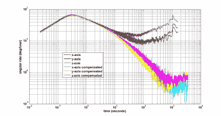
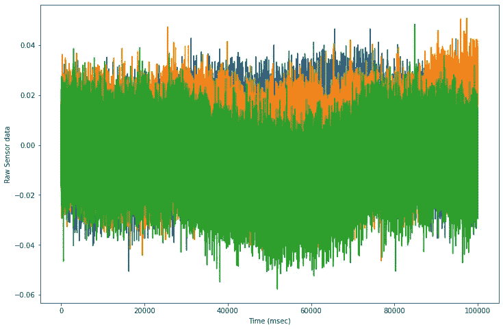

# Python 中的 Allan 方差

> 原文：<https://towardsdatascience.com/allan-variance-in-python-d1175e5aeee2?source=collection_archive---------3----------------------->

## 尿囊醇的简要背景和用途

作者图片

> **简介**

传感器在我们的日常生活中有着广泛的用途，在现代物联网中发挥着举足轻重的作用。这些芯片感应必要的机械激励，并转换成电实体。智能手机、智能手表、运动器材、笔记本电脑和其他物联网工具等日常用品中都有传感器。这些设备的性能很大程度上取决于安装在内部的传感芯片的质量。容易捕捉噪声和不必要信号的传感器不能提供精确的结果，最终退出市场。在传感器行业，开发能够有效区分信号和噪声的顶级芯片的竞争非常激烈。

在本文中，我将介绍 MEMS 传感器的噪声测量过程。MEMS 代表微机电系统。工程学的这一分支研究那些需要电子和机械工程知识的设备。AVAR (Allan 方差)测试是检查 MEMS 器件噪声性能的众多测试之一。它以美国物理学家[大卫·w·艾伦](https://en.wikipedia.org/w/index.php?title=David_W._Allan)的名字命名。该测试提供了器件相对于时间尺度的噪声性能，并且需要解释 AVAR 曲线来得出器件是否有噪声的结论。有时用离差代替方差来绘制曲线。

艾伦偏差曲线示例如下所示。该图特别针对时钟的频率稳定性，但人们可以在足够长的时间内测量任何感兴趣的变量，以获得这些偏差曲线。我将在后面的部分解释艾伦偏差图。

图片来自[维基百科](https://en.wikipedia.org/wiki/Allan_variance#/media/File:AllanDeviationExample.gif)

> **噪声测量**

如果方差太大，数据被称为有噪声的。我们都知道标准偏差或标准方差，公式如下

[可汗学院](https://www.khanacademy.org/math/statistics-probability/summarizing-quantitative-data/variance-standard-deviation-population/a/calculating-standard-deviation-step-by-step)

如果来自设备的数据由随机尖峰或下降组成，它将具有高偏差，并且最终它将被认为是有噪声的设备。有时，如果噪声的相对振幅与信号的振幅相似，则噪声与信号无法区分。通常，在 MEMS 传感器中，噪声应该比真实信号小几个数量级。因此，噪声的第一估计是从设备收集的样本数据的偏差。为什么我们不坚持标准差/方差呢？为什么我们需要像 Allan variance 这样的不同类型的变化？

对于 MEMS 传感器，开发人员对器件参数的长期稳定性感兴趣，因此需要长时间收集数据。通常，传统的标准偏差随着数据量的增加而增加，因此，利用该偏差作为器件性能参数没有什么意义。我们需要某种偏差参数，该参数将基于设备性能，而不依赖于任何数据伪影[1]。

> **艾伦方差的变化**

艾伦方差有许多不同的公式。最常见的是重叠艾伦方差，其中数据点被分成与后续组有一定数量重叠的聚类。经典的 Allan 偏差公式仅包含两个连续的数据点用于计算。这就是为什么它有时被称为双样本方差。

但是这种方法的可信度很差。最常用的方法是重叠法，公式如下

本质上。该方法收集数据点，并在τ初始值的 m 倍上求平均值。例如，如果 2 个数据点被平均，m 的值将是 2。两个连续数据点之间的最小时间差是初始τ。

> **艾伦偏差曲线解读**

样本 MEMS 传感器 AV 曲线[2]

我们来看一个样本 AVAR 结果，如上图所示。AV 曲线通常以双对数标度绘制。偏差最初增加，直到某个时间点，它增加，然后开始下降。x 轴是聚类时间，其中的值表示数据分组在一起的时间量。将这些聚类一起平均，以获得 Allan 偏差。偏差的下降是一段时间内平均数据的结果。最初的增加归因于滚降的假象。在很短的时间跨度内，我们通常没有一个完整的样本，但我们希望平均。偏差在这一点上升。这是在非常短的时间尺度上相关传感器运动的假象。

初始时间簇是高频噪声的代表。由于这是一个双对数图，偏差随着负半斜率快速下降，这实质上描述了白噪声的存在。曲线中的最低点通常被定义为“偏置稳定性”，它被视为一个非常关键的噪声参数。通常期望偏置稳定性在一定的上限和下限内。超过这个点，有时偏差开始增加，表明低频噪声占主导地位。这种类型的噪声可能包括温度效应、设备老化或其他次级效应。对于许多设备来说，如果没有在足够长的时间内收集数据，就无法观察到这种上升趋势，因为这是一个对数-对数图。白噪声区对于陀螺仪称为角度随机游走(ARW ),对于加速度计称为速度随机游走(VRW)。随机游走系数有时可以从所需聚类时间的直线斜率中获得。

> **Python 实现**

由 [AllanTools](https://allantools.readthedocs.io/en/latest/index.html) 的开发者们已经做出了巨大的努力来生成 python 包来实现 Allan variance。这里我将使用这个 python 包在笔记本环境中实现 Allan variance。为了演示，我之前已经使用 R 语言创建了一个合成数据集，我将在这里使用它。

数据首先被转换成一个列表，因为 allantools.oadev()方法接受一个列表作为输入。

最后，将该数据提供给生成对数标度的 AVAR 曲线的方法。

作者图片

由于这是一个合成数据集，我们最初没有看到滚降效应。oadev()方法以 1 Hz 的采样率获取数据。它返回绘制的所需 tau 和偏差值。通常，传感器有多个轴，参数也在所有轴上进行检查，如下所示

作者图片

如果我们在原始值上绘图，它将看起来像下面这样

作者图片

在这里，我们可以看到温度效应或其他低频效应接近曲线带的末端，曲线开始上升，表明偏差较大。因此，我们有一个偏差最小的最小点，该平均点是最理想的工作点。

当不使用重叠方法时，偏差变得随机。

作者图片

> **结论**

本文展示了 Allan 偏差/方差作为噪声参数在现代传感器业务中的应用。结合 python 工具描述了 Allan 曲线的解释。AllanTools 软件包用于绘制 Allan 偏差曲线。合成数据集没有清楚地显示 AV 曲线的所有方面，但真实的传感器肯定会展示滚降和次级效应。

感谢阅读。

[Github 页面](https://mdsohelmahmood.github.io/2021/07/02/AVAR.html)

> **参考**

[1] D. W. Allan，“精密时钟和振荡器的时间和频率(时域)表征、估计和预测”，载于 IEEE 超声波学、铁电体和频率控制汇刊，第 34 卷，第 6 期，第 647-654 页，1987 年 11 月，doi: 10.1109/T-UFFC.1987.26997。

[2]坦纳豪斯、马丁&盖修、蒂姆&卡洪、迪安&霍兰德、亚历克斯。(2010).通过应用和处理 MEMS 惯性传感器阵列的精确实时惯性导航装置。20–26.10.1109/计划。56610.86686866616