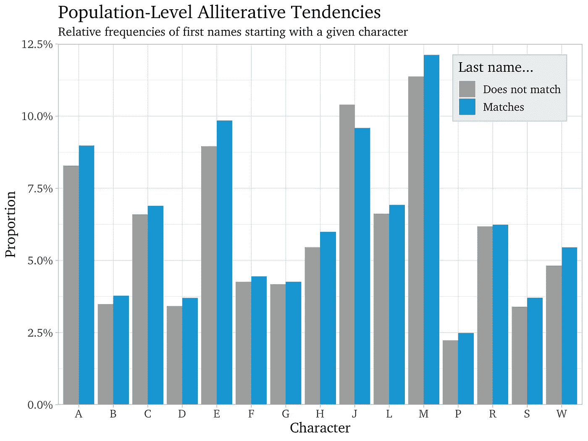
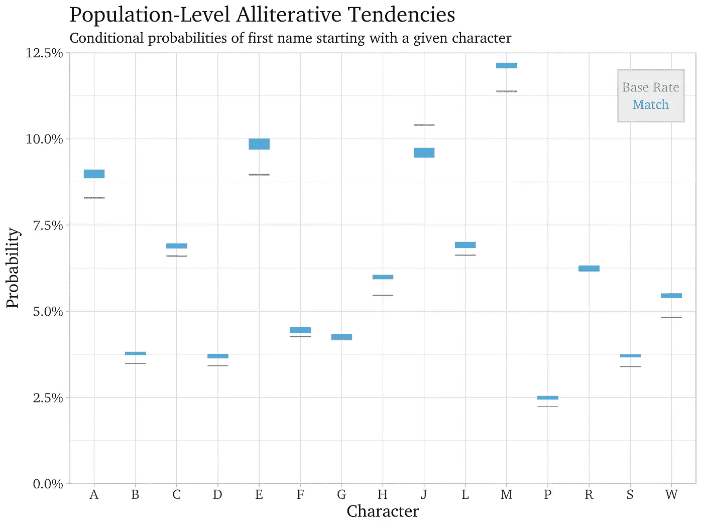

# 头韵相似性

> 原文：<https://towardsdatascience.com/alliterative-affinities-do-parents-select-first-names-to-match-surnames-574c04528ec1?source=collection_archive---------43----------------------->

## 父母会选择名字来匹配姓氏吗？

乔恩·泰森在 [Unsplash](https://unsplash.com?utm_source=medium&utm_medium=referral) 上的照片

名称又能代表什么呢对于很多父母来说，一切。考虑到婴儿名字书的广泛流行，令人眼花缭乱的标题如 *100，000+婴儿名字:最有帮助的，最完整的，&最新的名字书*和*60，000 婴儿名字的大书*。对一些父母来说，这个决定太重要了，除了专家之外，不能托付给任何人。在这种情况下，婴儿命名顾问会提供个性化的命名建议，价格从几百美元到近 3 万美元不等。在这篇文章发表时，报道范围的上限超过了美国中等家庭收入的 50%。

所有这些努力，以及在某些情况下的支出，会带来什么？由经济学家兼记者二人组史蒂芬·列维特和史蒂芬·都伯纳合著的著名流行经济学著作《魔鬼经济学》在最后一章中对这个问题提出了质疑。莱维特和杜布纳认为，孩子的名字最终会更多地反映孩子的父母，而不是孩子本身。一个像“胜利者”这样据说吉祥的名字不会注定一个孩子的魅力或成功，被命名为“失败者”也不会注定一个孩子的生活艰难。这个例子来自一个奇怪的案例，一位父亲将一个孩子命名为“赢家”，另一个孩子命名为“输家”，他们的人生轨迹与他们被赋予的名字不符。

莱维特和杜伯纳进一步指出，相对于期望值，父母对孩子的影响很大程度上取决于孩子出生时父母是什么样的人，而不是他们掌握育儿科学的程度。也就是说，*父母*可能比*养育*更重要(超过最低限度的体面和关心的某个阈值)。

就名字而言，一个名字对一个人的描述可能不如一个人对一个名字的描述。在我们对这种关系的方向感到困惑的时候，我们把一种地位和权力的感觉归因于某些名字，父母可能会被这些名字所吸引。例如，2008 年和 2009 年，取名为巴拉克的新生儿数量激增，这似乎是巴拉克·奥巴马当选总统的直接影响。

父母会把头韵名字视为这类理想名字的一员吗？

为了回答这个问题，我利用了 IPUMS 1930 年人口普查中 [5%的样本。我知道这很老了，但是有代表性的、及时的个人身份信息来源是很难得到的，尤其是对于许多人认为是愚蠢的问题。我向你保证，我会是第一个认为这确实是一个愚蠢问题的人。](https://usa.ipums.org/usa/sampdesc.shtml#us1930b)

我对这些数据提出了一个简单的问题:如果一组父母的姓氏以某个字母开头(比如“Anderson”)，他们是否比其他父母更有可能为孩子选择以相同字母开头的名字(比如“Amelia”)？

答案似乎是肯定的，除非你的姓以 j 开头。

我们可以在下面的图中看到这种效果。蓝条表示姓氏以给定字符开头的人和名字以相同字符开头的人的比例。灰色的条柱报告了姓氏不是以给定字符开始的*而不是以给定字符开始的名字是以给定字符开始的个人的比例。*

资料来源:美国 IPUMS 和作者的计算

例如，看一看最左边的 2 个条形，对应于字母 A。姓氏以 A 开头的个人有 8.3%的时间以 A 开头，详细情况由灰色条形表示。相比之下，姓以 A 开头的人有 9.0%的时候名字以 A 开头，这在蓝条中有报道。

灰色条可以被认为是以给定的第一个字符开始的名字的**基本比率**，而蓝色条是那些*可能有*头韵名字的人的比率(因为他们的姓以给定的字符开始)——我称之为**头韵比率**。对于下面显示的每个字母，头韵率都超过了基本率(我只显示了最常见的 15 个字符，占名字的 90%)，但 J 除外，其效果奇怪地相反。

头韵和基础率之间的一些差异似乎微不足道。那么，这些差异有多大意义呢？我在下面以不同的格式给出了这些相同的估计值，按字符组织的基本和头韵率的置信区间为 95%。只有 G 和 R 在头韵和基础率之间没有表现出显著差异。

资料来源:美国 IPUMS 和作者的计算

我们可以通过将头韵率标准化为基本率来进行字符间的比较。例如，虽然 A 的头韵率和基本率之间的差距为 0.7 个百分点，B 仅为 0.3 个百分点，但这两个头韵率都比各自的基本率大 8.4%。因此，姓氏以 A 开头的人，其名字以 A 开头的可能性比姓氏以 A 开头的人高 8.4%。如果我们对 15 个最常见字符的头韵倾向进行平均，排除 J 并按基本比率加权，我们会得到 7.0%的平均影响。

西班牙裔个体的平均头韵效应为 13%，接近人口平均水平的两倍。农村居民的平均头韵效应为 4.9%，城市地区个人的平均头韵效应为 8.6%。对 35 岁以下的人来说，平均影响从大约 7%攀升到 36 岁及以上的人的 11%以上。

在男女婚姻中，妇女随夫姓的普遍做法减少了头韵倾向。J 的头韵效应仍然是负的，对两组都有统计学意义。其余 14 种头韵效果中，只有 5 种对已婚女性有意义，相比之下，14 种对已婚男性有意义。

头韵倾向在不同的人口统计学维度上差异很大。然而，选择头韵名字的趋势似乎相当普遍。

一共是三万美元，谢谢。

**参考文献**

[1] D. Baer，[人们支付高达 29，000 美元请一个婴儿命名顾问给他们的孩子取名](https://www.businessinsider.com/baby-name-consultants-are-now-a-thing-2016-4) (2016)，商业内幕

[2] A. S .吉布斯，[成长巴拉克:遇见以奥巴马总统命名的三个男孩](https://www.nbcnews.com/storyline/president-obama-the-legacy/growing-barack-meet-three-boys-named-after-president-obama-n709046) (2017)，NBC

[3] S. Ruggles，S. Flood，S. Foster，R. Goeken，J. Pacas，M. Schouweiler 和 m .索贝克， [1930 年 5%样本](https://usa.ipums.org/usa/sampdesc.shtml#us1930b) (2021)，IPUMS