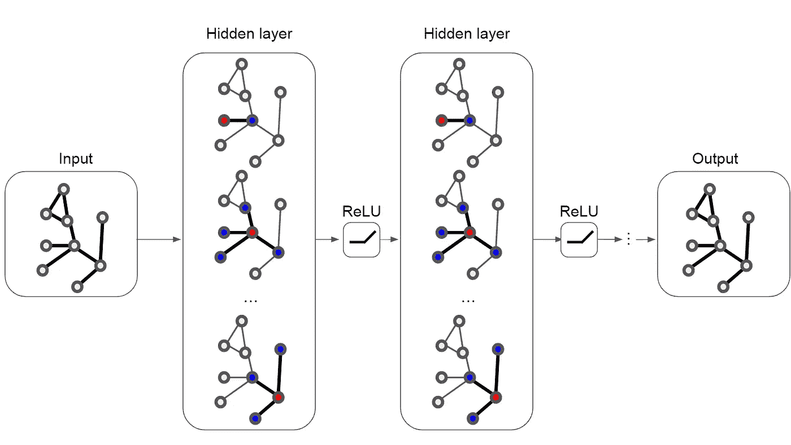
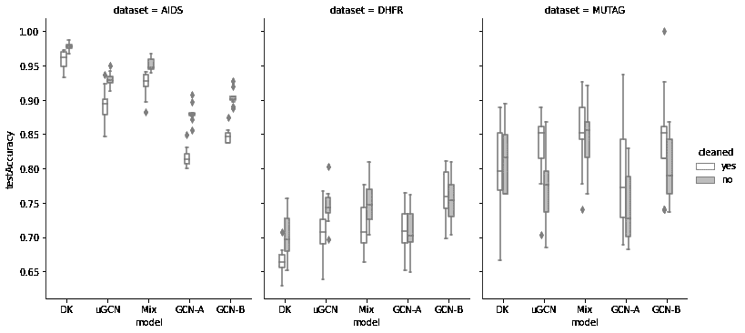
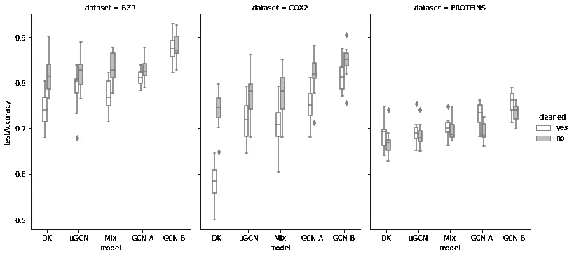

# 在一系列基准测试中，几乎自由归纳嵌入在图分类中的表现优于训练过的图神经网络

> 原文：<https://towardsdatascience.com/almost-free-inductive-embeddings-out-perform-trained-graph-neural-networks-in-graph-classification-651ace368bc1?source=collection_archive---------26----------------------->

## *训练还是不训练——这不是问题
(匿名)*

具有随机分配的权重的未训练的图卷积网络[1] (uGCN)由于极低的成本、实现的简单性和相当明显的优雅性，已经成为我在一系列图数据任务中的主要基线编码器。然而，没有人(据我所知)报告过这个简单模型相对于它的姐姐(一个在监督设置下完全成熟(端到端训练)的图卷积网络(CGN))的实际性能基准。于是我照做了。

动机:找出 uGCN 是否产生高质量的表示，可以在归纳设置中的图**上的一系列下游任务中使用，以便训练的模型可以归纳到以前看不到的数据(受最近报道的直推设置结果的启发[2])。**

结果很有趣。在最坏的情况下，简单模型(uGCN + degree kernel + random forest)与端到端训练的 GCN 相比，得分为 54:90，而更现实的情况导致了毁灭性的 93:51，这表明**我们可以几乎免费的嵌入，在图形分类任务中表现优于或接近匹配端到端训练的 gcn，而成本只有一小部分**。小模型的训练只花了 10 分钟，而整个实验持续了 4 个小时。让我们详细了解一下，看看发生了什么事！

万一你的阅读偏好是喜欢代码而不是文章，请随意使用附带的 [colab 笔记本](https://colab.research.google.com/drive/1HjQiL1iTjfxnB8xiAAT2fkNlj_u3kuLL?usp=sharing)进行实验。

# **预赛**

许多重要的现实世界数据集以图形或网络的形式出现:社会网络、知识图、蛋白质相互作用网络、万维网等。(仅举几例)[1]。

通常写为 G=(V，E)的图是一个数学模型，由一组顶点 V 和一组边 E 组成——顶点 I 和 j 之间的成对连接 e(i，j)。图的扩展是一个带标签的属性图，允许将特征向量 xi 分配给顶点 vi(我们也可以将特征分配给边，但这超出了今天实验的范围)。

图形神经网络[3] (GNN)是一个机器学习模型(一个参数函数，用于调整或从数据中学习参数)，它将一个众所周知的生物启发算法家族扩展到非结构化图形数据领域。依我看，对于 GNNs 的机制来说，信息传递是最简单的直觉，参考记忆法则“告诉我谁是你的朋友，我会告诉你你是谁”是合理的。图卷积网络(gcn)被它的发明者([https://tkipf.github.io/graph-convolutional-networks/](https://tkipf.github.io/graph-convolutional-networks/))很好地描述了，我发现更好地讲述这个故事很有挑战性。



带一阶滤波器的多层 GCN。作者图片

# **数据**

让我们对公开可用的数据进行一系列实验。我们将(I)从数据集[4](一组基准数据集)中获取数据，以及(ii)将我们的练习限制在小分子的二元分类(性质预测)上。我们努力的另一个限制是(iii)使用带标号顶点的图。

归纳约束留给我们一个广泛用于测试新算法的数据集列表。这些是:艾滋病，BZR，二氧化碳，DHFR，穆塔格和蛋白质。所有这些数据都已经作为 Pytorch Geometric [5](一个用于图形深度学习的库)的一部分，有两个版本:原始版本和清除重复版本[6]。这样我们手头就有 12 个数据集了。

## **艾滋病抗病毒筛查数据[7]**

DTP 艾滋病抗病毒筛查已经检查了数万种化合物的抗 HIV 活性证据。可以获得保密协议未涵盖的化合物的筛选结果和化学结构数据。原始数据集包含 2000 个分子，其清理后的版本留给我们 1110 个数据点。

## **苯二氮卓受体(BZR)配体【8】**

原始数据集包含 405 个分子，其清理后的版本留给我们 276 个数据点。

## **环氧合酶-2 (COX-2)抑制剂【8】**

原始数据集包含 467 个分子，其清理后的版本留给我们 237 个数据点。

## **二氢叶酸还原酶(DHFR)抑制剂【8】**

原始数据集包含 756 个分子，其清理后的版本留给我们 578 个数据点。

## **穆塔格【9】**

MUTAG 数据集由 188 种化合物组成，根据它们对细菌的诱变作用分为两类。它的净化版本留给我们 135 个结构。

## **蛋白质类【10】**

来自蛋白质数据库(PDB)蛋白质文件的蛋白质图——一个酶和非酶的数据集。原始数据集包含 1113 个分子，其清理后的版本留给我们 975 个数据点。

# **实验设计**

锦标赛就是这样！

对于每个数据集，我们运行 12 轮训练和测试。

对于每一轮，我们:

**我**

在 Pytorch Geometric 中进行随机的 80/20 分割(从随机种子= 42 开始，并且对于接下来的每一轮将种子增加 1)，使得 80%的数据点(图形)被分配到训练集中，而剩余的 20%进入测试集；

**II**

在训练集上训练模型，在测试集上评估**精度**。

对于微小的模型，这意味着预处理，以生成输入分类器的特征。

对于 gcn，我们运行 200 个时期的训练和测试，学习率= 0.01，并报告:

**(A)10 个最终时期的平均精度** —一个现实的场景；

**(B)在训练过程中达到的最佳精度**(就好像我们保存中间状态以便挑选最佳性能的模型)GCNs 的最佳情况(以及我们的小模型的最差情况)；

**三**

最佳模特得 1 分；

**四**

如果出现平局的情况，问题就出在最小的模特身上。

有 288 个点要奖励:12 个数据集* 12 轮* 2 个场景。

# **型号**

**度核(DK)** —节点度(与特定顶点关联的边的数量)的直方图，归一化为给定图中的节点数量(使得每个图的特征向量由具有特定数量连接的节点的分数大小组成——这些总和为 1)。

```
import networkx as nx 
import numpy as np  
from scipy.sparse import csgraph *# g - a NetworkX* graph
numNodes = len(g.nodes) 
degreeHist = nx.degree_histogram(g) 
*# normalize*
degreeKernel = [x/numNodes for x in degreeHist]
```

**未训练的图形卷积网络(uGCN)** —一种前馈图形卷积网络，具有为 3 层随机分配的权重，其间具有 ReLU 激活。我们将全局平均池应用于输出的 64 维向量(节点嵌入)，以便获得图形的表示。

```
*# INPUT
# g - a NetworkX* graph
*# X - node features of a graph g (np.array)* 
*# W0, W1, W2 - randomly assigned weights*# PREPROCESSING
*# A - adjacency matrix of a graph g*
A = nx.convert_matrix.to_scipy_sparse_matrix(g)
# D - normalized laplacian matrix of a graph g derived from A
D = sparse.csgraph.laplacian(A, normed=True) # GRAPH CONVOLUTIONAL NETWORK - FORWARD PASS
*# Layer 0* 
Xc = D @ X @ W0 
*# ReLU* 
Xc = Xc * (Xc>0) 
*# concatenation of node features with those aggregated of neighbors*
Xn = np.hstack((X, Xc)) 
*# Layer 1*
Xc = D @ Xn @ W1 
*# ReLU* 
Xc = Xc * (Xc>0) 
Xn = np.hstack((Xn, Xc)) 
*# Layer 2 - node embeddings*
Xc = D @ Xn @ W2 
*# global mean pooling - graph embedding* 
embedding = Xc.sum(axis=0) / Xc.shape[0]
```

**DK 和 uGCN (Mix)** 的组合——由 DK 和 uGCN 模型获得的图形表示的串联。

```
mix = degreeKernel + list(embedding)
```

**具有最大深度 17 的 100 棵树的随机森林(RF)** 分类器(来自 Scikit-learn [11]包)在上面被训练。

**图卷积网络(CGN)** —一个端到端分类器，由 3 个卷积层(64 维)组成，其间有 ReLU 激活，一个全局平均池层(直到此刻 GCN 与 uGCN 非常匹配)，后面是一个丢弃层和一个线性分类器。我们将把最佳情况场景(B)中的模型称为 GCN-B，将现实场景(A)中的模型称为 GCN-A。我们将使用 Pytorch Geometric 的参考实现[和 GCN 的](https://colab.research.google.com/drive/1I8a0DfQ3fI7Njc62__mVXUlcAleUclnb?usp=sharing)，以使比赛尽可能公平。

# **结果**

在简单模型和端到端训练的 gcn 之间的 144 轮(12 个数据集* 12 轮)基准测试之后，总计 288 点分布如下:

# **147:141**

测试集的准确性在不同的分裂之间有所不同，并且存在微小模型支配复杂竞争者的情况。



**小模特胜出的数据集:**艾滋病、DHFR(A)、穆塔格。图片由作者提供，使用 Matplotlib [13]的 Seaborn [12]扩展制作

例如，degree 内核采用了 AIDS 数据集上的所有 48 个点，证明比端到端训练的 GCN 高 10%以上的准确性。



**gcn 大放异彩的数据集:** BZR、COX2 和蛋白质。作者图片

**收集的点数:**

90—GCN-B；

71—DK；

51—GCN—A；

21 — uGCN。

```
Clean wins:DK in all versions of AIDS dataset in both scenarios (48 points);
GCN-B (scenario B) has championed in cleaned BZR (12), COX2 (24) and PROTEINS (24) - all versions;The rest of the points distributed as follows.-----------------
Dataset: BZR, cleaned: yes
Scenario: A
DK      0
uGCN    3
Mix     1
GCN     8-----------------
Dataset: BZR, cleaned: no
Scenario: A
DK      4
uGCN    1
Mix     4
GCN     3-----------------
Dataset: BZR, cleaned: no
Scenario: B
DK       1
uGCN     0
Mix      1
GCN     10-----------------
Dataset: COX2, cleaned: yes
Scenario: A
DK      0
uGCN    3
Mix     1
GCN     8-----------------
Dataset: COX2, cleaned: no
Scenario: A
DK       0
uGCN     1
Mix      1
GCN     10-----------------
Dataset: DHFR, cleaned: yes
Scenario: A
DK      1
uGCN    1
Mix     4
GCN     6-----------------
Dataset: DHFR, cleaned: yes
Scenario: B
DK      0
uGCN    0
Mix     3
GCN     9-----------------
Dataset: DHFR, cleaned: no
Scenario: A
DK      2
uGCN    4
Mix     5
GCN     1-----------------
Dataset: DHFR, cleaned: no
Scenario: B
DK      0
uGCN    1
Mix     5
GCN     6-----------------
Dataset: MUTAG, cleaned: yes
Scenario: A
DK      2
uGCN    3
Mix     6
GCN     1-----------------
Dataset: MUTAG, cleaned: yes
Scenario: B
DK      1
uGCN    2
Mix     5
GCN     4-----------------
Dataset: MUTAG, cleaned: no
Scenario: A
DK      5
uGCN    0
Mix     7
GCN     0-----------------
Dataset: MUTAG, cleaned: no
Scenario: B
DK      5
uGCN    0
Mix     6
GCN     1-----------------
Dataset: PROTEINS, cleaned: yes
Scenario: A
DK      2
uGCN    1
Mix     0
GCN     9-----------------
Dataset: PROTEINS, cleaned: no
Scenario: A
DK      0
uGCN    1
Mix     6
GCN     5-----------------
```

请查看 [colab 笔记本](https://colab.research.google.com/drive/1HjQiL1iTjfxnB8xiAAT2fkNlj_u3kuLL?usp=sharing)了解详细的性能报告，或者参考[本回合摘要](https://github.com/saffronoff/opendata/blob/master/statisticsDF.csv) (csv)或 [**本谷歌电子表格**](https://docs.google.com/spreadsheets/d/1WFszJpioJZPUC2hd6FJzu3vFp6DLGjLcb0DiU1dvmMw/edit?usp=sharing) 。

总体而言，数据集的清理版本和原始版本之间的性能一直存在差异。这提醒了拥有高质量数据对于相当好的基准的价值。毕竟，数据很少，这可能是我们得到如此不稳定结果的原因。好消息是，研究界有解决这一问题的趋势，并且做了大量工作来实现公平的基准测试。

# **结论**

正如我们所看到的，实验证明了这样一个猜想，即在小分子的图属性预测设置中**，我们可以以很小的成本**获得几乎免费的嵌入，这些嵌入在图分类任务中胜过或接近匹配端到端训练的 gcn。这些发现与[2]的结果一致，因为在概念上，标签传播非常类似于图卷积网络中的消息传递。对这种良好性能的解释，也许是植根于两难境地:我们是否应该调整光谱滤波器参数，以便输出嵌入变得线性可分，或者只是选择一个更鲁棒的分类器，就像我们刚才做的那样。

各轮之间的表现差异再次提醒我们，每个基准都是不稳定的。值得一提的是免费午餐定理，并指出使用几个模型很可能是一个很好的选择。同样值得注意的是，分割确实会影响性能——对于相同的数据集，相同的模型表现出明显不同的决策质量。这就是为什么当在模型之间进行基准测试时，请确保在相同的数据上进行训练和测试。另外，设置随机种子并不是万能的…

下一步可能是在更大的数据集上进行基准测试。同样值得探索的是不同的问题，例如:链接预测、节点和链接分类、图上的回归等等——图卷积网络(训练过的，没有那么多)是非常有能力的模型。

# **后记**

两年前，在 [PyData-Lisbon Meetup](https://www.meetup.com/ru-RU/PyData-Lisbon/events/260477711/) 上，我第一次公开谈论 uGCN 作为一种几乎适用于所有解决方案，将它命名为通过傅立叶空间的皇家宏伟捷径，并在那时组装了第一个图形分类管道，以便向一个渴望启动她的航空航天初创公司的女孩展示图形卷积的力量。这篇文章是一个真实实验(基于私人数据)的副产品，在这个实验中，经过数小时的训练后，我们可以超越微小模型设定的性能。

如今，随着图的机器学习成为名人，每周都有新的图神经网络架构出现。然而，对于 gnn 为什么在实践中是成功的以及它们是否是良好性能的必要条件的理解相对较少[2]。

在您进入图形机器学习的奇妙世界之前，请熟悉一些基础知识。有很大的努力投入到使最新的发现(以及经典方法)免费提供给更广泛的受众。仅举几个值得关注的努力:cs224w [课程](http://web.stanford.edu/class/cs224w/)和[讲座](https://www.youtube.com/playlist?list=PLoROMvodv4rPLKxIpqhjhPgdQy7imNkDn)、[开放图基准](https://ogb.stanford.edu/)【14】，以及最近关于[几何深度学习](https://arxiv.org/abs/2104.13478)【15】基础的工作，为尚未开发的新架构提供了一个清晰的框架。还有一点——一定要从简单的基线开始，如核方法或无监督图卷积网络——通常这些微小的模型很出色。

可持续发展，使用高效的算法。有时候不学就是力量。


2018 年 8 月，在瑞典议会大楼外，格里塔·图恩伯格(Greta Thunberg)开始了一场针对气候的学校罢工。她的标牌上写着，“Skolstrejk fr klim atet”，意思是“学校为气候罢工”。图片由 Anders Hellberg 提供，根据[知识共享](https://en.wikipedia.org/wiki/en:Creative_Commons) [署名-分享相似 4.0 国际](https://creativecommons.org/licenses/by-sa/4.0/deed.en)许可协议授权。

# 参考

[1] Kipf & Welling，用图卷积网络进行半监督分类(2017)，国际学习表示会议；
[2]黄等，结合标签传播和简单模型优于图神经网络(2021)，学习表征国际会议；
[3]斯卡塞利等，图神经网络模型(2009)，IEEE 神经网络汇刊(第 20 卷，第 1 期，2009 年 1 月)；
[4] Morris et al .，TUDataset:用图学习的基准数据集集合(2020)，ICML 2020 图表示学习研讨会及以后；
【5】Fey&Lenssen，PyTorch Geometric 快速图表示学习(2019)，ICLR 关于图和流形上的表示学习研讨会；
【6】Ivanov，Sviridov & Burnaev，理解图数据集中的同构偏差(2019)，arXiv 预印本 arXiv:1910.12091；
【7】Riesen&Bunke，IAM 基于图形的模式识别和机器学习图形数据库库(2008)，载于:da Vitora Lobo，n .等人(编辑。)，SSPR&2008 年春季，LNCS，第 5342 卷，第 287–297 页；
[8] Sutherland 等人，用遗传算法进行样条拟合:开发分类结构-活性关系的方法(2003)，化学杂志。Inf。计算机。Sci。, 43, 1906–1915;
【9】deb Nath 等，诱变芳香和杂芳香硝基化合物的构效关系(1991)，医学杂志。化学。34(2):786–797;
【10】Dobson&Doig，在没有比对的情况下区分酶结构与非酶(2003)，J. Mol .生物。, 330(4):771–783;
[11] Pedregosa 等人，sci kit-learn:Python 中的机器学习(2011)，JMLR 12，第 2825–2830 页；
【12】was kom，seaborn:统计数据可视化(2021)，开源软件杂志，6(60)，3021；
【13】Hunter，Matplotlib:2D 图形环境(2007)，科学计算&工程，第 9 卷，第 3 期，第 90–95 页；
[14]胡等，开放图基准:图上机器学习的数据集(2020)，arXiv 预印本 arXiv:2005.00687；
【15】布朗斯坦等，几何深度学习:网格、组、图、测地线和量规(2021)，arXiv 预印本 arXiv:2104.13478。