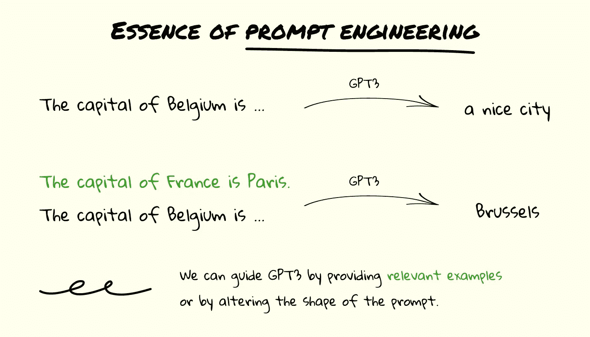
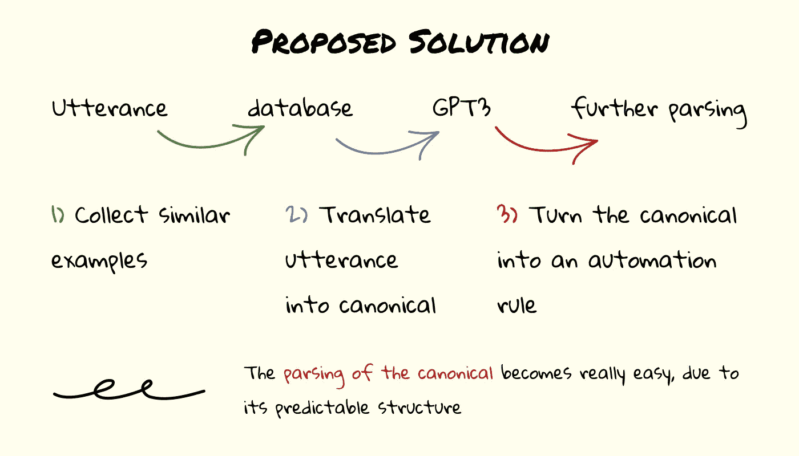
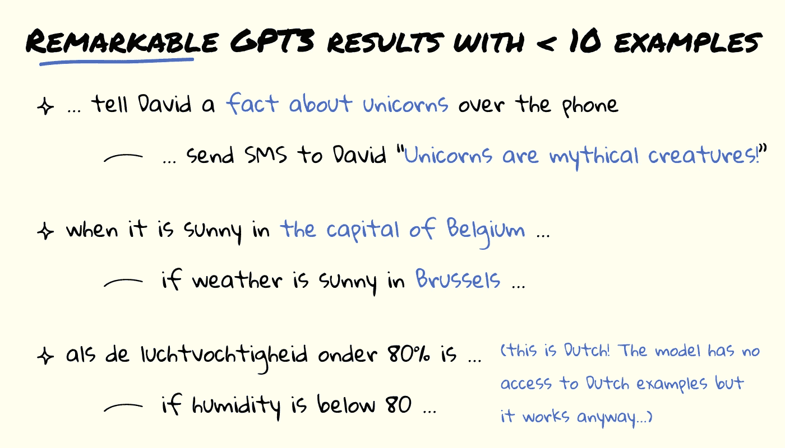

# 几乎没有数据也没有时间？释放 GPT3 的真正潜力，案例研究

> 原文：<https://towardsdatascience.com/almost-no-data-and-no-time-unlocking-the-true-potential-of-gpt3-a-case-study-b4710ca0614a?source=collection_archive---------21----------------------->

## [思想和理论](https://towardsdatascience.com/tagged/thoughts-and-theory)

## 使用 GPT3 快速构建复杂的 NLP 应用原型

由[阿尔方斯·莫拉莱斯](https://unsplash.com/@alfonsmc10?utm_source=medium&utm_medium=referral)在 [Unsplash](https://unsplash.com?utm_source=medium&utm_medium=referral) 上拍摄的照片

# 介绍

大型预训练语言模型(如[GPT 3](https://openai.com/blog/openai-api/)【1】)的出现正在自然语言处理领域催生“即时工程”的新范式。这种新的范例使我们能够基于非常少量的数据，不费吹灰之力地快速构建复杂的 NLP 应用程序的原型。我将展示一个案例研究，我在 Waylay[的夏季实习期间使用这一技术创建了一个应用程序，使每个人都可以使用语音和文本输入来实现行业级自动化(想想类似谷歌助手的东西，但用于物联网和类固醇！).该解决方案只需极少的数据点，无需重新培训即可轻松适应新情况。最后，我将对这一令人振奋的新趋势发表一些看法。](https://waylay.io/)

如果你不想看，你可以看一下[这段我向公司提出我的解决方案的内部会议的录音](https://www.youtube.com/watch?v=8pckQSoJSss)。

# 提示工程:新的深度学习范式？

回到机器学习的旧时代，工程师们不得不花费无数时间来创建信息丰富和有区别的特征，以提高他们模型的质量。随着深度学习的出现，模型现在能够在给定大量数据的情况下提取自己的质量特征。最终，数据科学家创造了通过迁移学习将大型预训练模型应用于许多下游任务的技术，这使得这些模型可以在许多任务上获得强大的性能，只需看似少量的数据。

自然语言处理(NLP)领域也经历了这些发展。有趣的是，这个领域似乎正在出现一种新的范式，这可能对我们未来如何使用深度学习产生重大影响。

最近，大型预训练生成模型风靡一时。GPT3，这些模型中的一个，通过尽可能准确地预测给定句子的延续来训练(这个任务被称为*因果语言建模*)。因为这项任务不需要额外的注释(我们称之为*自我监督*，研究人员能够收集大量数据(40GB 的文本)，并训练一个大得离谱的深度学习模型(1750 亿个参数)。因此，GPT3 是目前生成类人语言的最佳模型。给定一个输入句子，GPT3 以自然的方式继续它。

事实证明，善于生成连贯的自然语言有很多好处。当继续那句“虽然演员阵容还可以，但电影剧本很恐怖。这部电影是……”，比起“好”，GPT3 输出“坏”字的可能性要大得多。因此，本质上，通过学习生成文本，我们还学习了如何在不需要访问情感注释的情况下进行情感分类。许多不同的 NLP 应用程序在某种程度上都出现了类似的情况。

我们甚至可以在生成过程中指导 GPT3。如果想知道比利时的首都是什么，可以让 GPT3 继续下面的句子:“法国的首都是巴黎。日本的首都是东京。比利时的首都是……”。另一方面，如果我们只是问“比利时的首都是……”，我们很可能会得到一个延续，如“一个不错的城市”，而不是“布鲁塞尔”。

(图片由作者提供)prompt engineering 背后的核心理念。

我们如何问 GPT3 这些问题，我们使用什么格式，我们包括什么例子被称为提示工程。Prompt engineering 是 NLP 世界中的一种新范式，它可以从根本上改变我们与深度学习模型的交互方式。现在，我们不再需要收集大量数据并对现有模型进行微调，而是能够利用少量数据点来获得显著的结果。额外的好处是，当新数据可用或者当我们想要改变任务定义时，我们甚至不需要重新训练我们的模型。我们甚至不需要自己托管模型，因为可以通过 API 访问 GPT3！

和任何新的范例一样，研究人员和实践者正在快速探索许多不同的利用即时工程的方法。这可以从动态选择提示中的示例(我们将在案例研究中进行)到学习提示的最佳形状。论文“预训练、提示和预测:自然语言处理中提示方法的系统调查”[2]很好地概述了当前对提示方法的研究。

# 使用 GPT3 实现物联网自动化:案例研究

## 物联网自动化

Waylay 是一个低代码平台，允许开发者在任何地方应用企业级自动化。连接传感器，推送数据，开始享受低代码自动化的好处。

自动化规则是 Waylay 平台的核心。开发人员编写小的代码片段(或使用预先存在的代码片段)并用逻辑操作符将它们链接在一起，以定义自动化规则。自动化规则可以允许您在连续 3 天无雨的晴天打开洒水器，或者在众多传感器中的一个传感器检测到异常时安排对工业机器的检查。通过将这些规则链接在一起，我们可以创建任意复杂的自动化软件。

让这种自动化技术为每个人所用是 Waylay 的核心价值观之一。想象一下，如果我们可以简单地通过语音或文本控制，以自然的方式与这个自动化引擎进行交互。这就是 NLP 的用武之地。我们可以想象一个工厂工人问他们的机器“烤箱 5 的温度是多少”，而不是必须以典型的方式与计算机交互或者告诉它“如果冷冻室的温度上升到零下 10 度以上并且门是开着的，就发出紧急警告”。

做好这件事当然不容易。人说的规则可能带有很多模糊性，需要大量的智能来正确解析和翻译成 Waylay 自动化规则。

## 解决方案

如果我们想建立一个解决方案，将人类说出的规则翻译成 Waylay 自动化规则，“传统的”方法是不够的。首先，我们正在处理数据缺乏的问题。为了稳健地解析人类话语并捕获必要的信息以将它们翻译成拦路抢劫系统可以理解的东西，我们将需要跨越不同说话方式和相应的拦路抢劫规则的大量数据。目前没有这方面的数据。即使我们有这些数据，我们的模型也需要重新训练，每次我们想让它服务于一种新的说话方式或一种新的拦路抢劫规则。

我们求助于工程来解决这个问题。如果我们可以使用 GPT3 来为我们做艰苦的工作，我们就可以建立一个高度数据高效的系统，而不需要重新培训来处理新的案件。那该有多好？

现在的问题变成了“我们如何利用 GPT3 的能力来为我们做脏活？”。不幸的是，很难教会 GPT3 根据自然语言输入输出正确的内部数据结构。幸运的是，我们可以用一个聪明的方法来解决这个问题(为此我们必须感谢微软的聪明人[3])。在我们的解决方案中，我们将让 GPT3 输出一个*规范句子*。这个句子与我们的自然语言输入包含相同的信息，但是以一种更加结构化的方式。例如,“给大卫发一条消息，告诉他在巴黎下雨时安全驾驶”和“只有当巴黎下雨时，告诉大卫“安全驾驶！”“通过短信”都可以简化为标准句“如果巴黎下雨，那么给大卫发短信，告诉他“开车小心！”。

(图片由作者提供)使用 GPT3 将话语映射到规范。

将这些话语转换成规范更像是翻译或摘要任务，GPT3 可以更容易地处理。仅根据几个例子(不到 10 个)，GPT3 已经非常擅长将自然声音语言翻译成这种结构化的规范语言。一旦我们得到这个规范的，我们需要一些额外的解析来把它变成表示一个中途停留规则的内部数据结构。虽然这最后一步肯定需要一些额外的工程努力，但我们已经成功地将问题的“智能部分”委托给了 GPT3。

为了获得最佳性能，我们还有一个锦囊妙计。最初，我们只有少量可用的例子。然而，一旦更多的例子变得可用，我们需要根据我们想要转换的话语来选择将哪些例子输入到 GPT3。一个简单的方法是选择与给定的口语句子最相似的例子。这样，我们可以确保 GPT3 始终能够访问最相关的示例。为了验证这个想法，我们采取了最简单的方法:使用静态单词嵌入的均值池来嵌入所有句子，并使用余弦相似度作为距离度量。虽然更高级的相似性度量当然是可能的，但这种快速简单的解决方案已经提供了大部分价值:给定一个大型数据集，我们现在可以快速提取样本，GPT3 将能够使用这些样本来处理给定的话语。

(图片由作者提供)建议的解决方案。

实现这个解决方案非常简单。几个 Flask 微服务、一个小型数据库和一个 Vue.js 前端就很好地完成了这个任务。部署深度学习模型不需要专业知识！

## 结果

现在是有趣的部分，探索结果。

基于不到 10 个话语示例及其在提示中对应的规范，该解决方案已经显示出显著的效果。该模型能够处理 10 个给定示例中没有表示的不同种类的话语。这一点非常重要，因为在生产过程中，我们可以预期解决方案会以许多不同的不可预见的方式被调用。该解决方案对于打字错误和语法错误是健壮的。此外，该解决方案还利用了 GPT3 强大的“常识”推理能力。它知道如何将“比利时首都”翻译成“布鲁塞尔”，并将“关于独角兽的事实”映射到“独角兽是神秘的生物！”。它甚至可以根据需要讲笑话(尽管它们并不总是好笑)！

在一次内部演示中，一名 Waylay 员工让我用荷兰语输入一些内容。接下来发生的事情震惊了在场的每一个人……在看过零个荷兰语示例后，GPT3 成功地正确解释了荷兰语，并输出了相应的标准英语。如果你有时间，我建议看这个演示的[视频记录](https://www.youtube.com/watch?v=8pckQSoJSss&t=1480s)，我们所有人脸上的表情都是无价的。

(图片由作者提供)取得的一些成果。

# 结论

通过将我们的语义解析任务重新表述为翻译任务，我们能够利用大型预训练语言模型(GPT3)来为我们完成所有困难的工作。我们的解决方案只需要极少的数据点，无需重新培训就可以轻松适应新的情况，我们甚至不需要自己托管深度学习模型。由于 GPT3 的强大功能，我们的解决方案显示了对未知场景(甚至未知语言)的卓越的泛化能力！).

在接下来的几年中，这种快速工程方法将允许数据科学家以前所未有的速度和便利性构建许多不同的自然语言应用程序的原型。这些原型可以作为实验性功能推出，当越来越多的数据可用时，性能会提高。一旦收集了临界量的数据，就可以探索更传统的深度学习技术。

随着公司目前专注于[构建更大的预训练语言模型](https://research.aimultiple.com/wu-dao/)和研究人员[开源他们对这些模型的实现](https://huggingface.co/EleutherAI/gpt-j-6B)，我们只能期待在接下来的几年里 prompt engineering 变得更加重要。

看看 prompt 工程领域在不久的将来会朝哪个方向发展将会很有趣。有一点是肯定的，随着更大的语言模型的发布(在 API 之后，但也是开源的)，我们一定会看到大量有趣的技术，这些技术可以用来立即构建高数据效率的 NLP 应用程序。

# 参考

1.  语言模型是一次性学习者。arXiv 预印本 arXiv:2005.14165 (2020)。
2.  刘，彭飞，等。〈预训练，提示和预测:自然语言处理中提示方法的系统综述〉。arXiv 预印本 arXiv:2107.13586 (2021)。
3.  受约束的语言模型产生少量的语义解析器。arXiv 预印本 arXiv:2104.08768 (2021)。