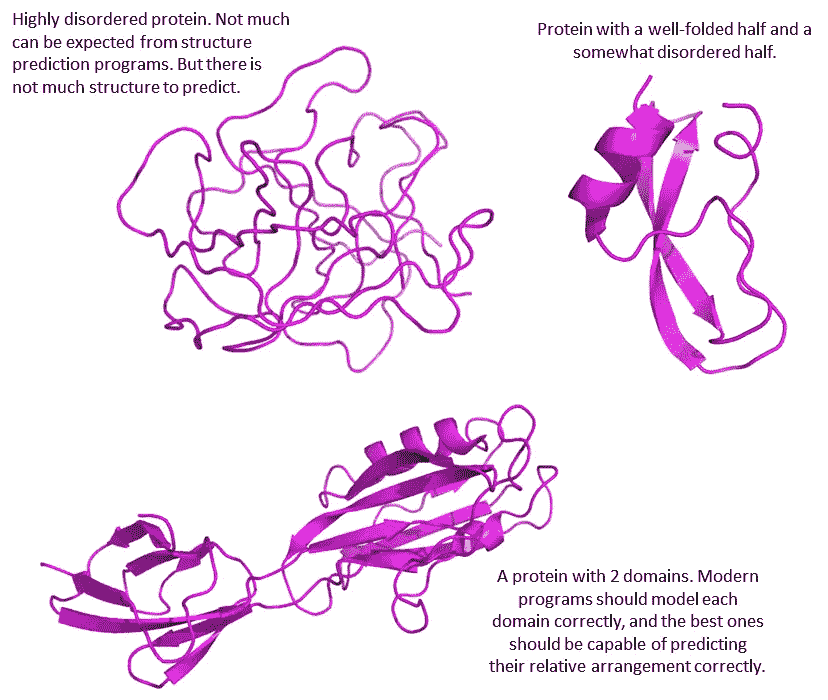
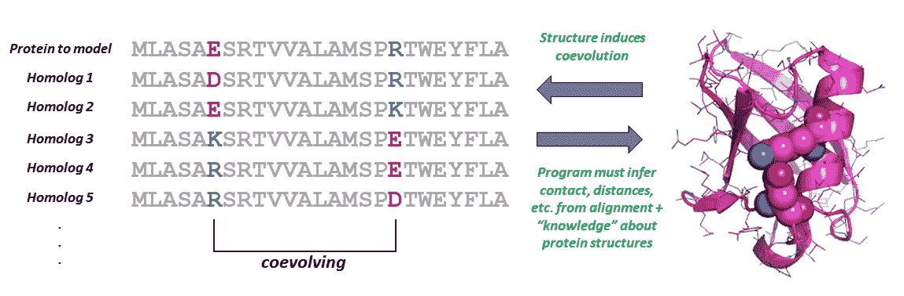
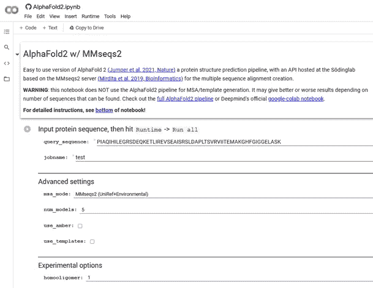
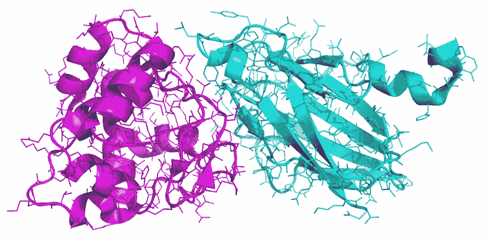
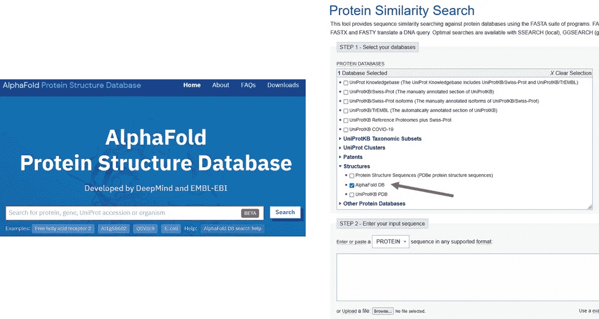

# 基于 AlphaFold 的数据库和成熟的，易于使用的，在线 AlphaFold 界面准备彻底改变生物学

> 原文：<https://towardsdatascience.com/alphafold-based-databases-and-fully-fledged-easy-to-use-alphafold-interfaces-poised-to-baf865c6d75e?source=collection_archive---------15----------------------->

**不仅有*计算*还有*实验*生物学。对生物学中数据科学领域未来的思考。**

**在最近的一篇** [**故事**](/google-colab-notebooks-are-already-running-deepminds-alphafold-v-2-92b4531ec127) **中，我报道了描述 AlphaFold 第二版及其源代码的学术论文的发布，我向你展示了世界各地的科学家如何开始通过谷歌 Colab 笔记本将该程序应用于他们喜爱的蛋白质，免费且不需要任何硬件。这些笔记本正在迅速发展，以实现更多的功能，允许任何人不仅模拟分离的蛋白质，还模拟多种蛋白质的复合物，并包括相关蛋白质的已知结构和多序列比对，以改善程序的结果。此外，Deepmind 和欧洲生物信息学研究所开始上传“所有”蛋白质的 AlphaFold 计算模型，已经覆盖了 20 个完整的生物体，并可供免费下载。尝试该程序和模型数据库的科学家在 Twitter 上报告了几个成功的故事，这些故事预测了这些和相关技术将如何扰乱结构生物学领域。不仅是计算性的，也是实验性的结构生物学，因为预测的模型促进了蛋白质结构的实验测定。**

在上周发表的这篇文章中，我在《自然》*杂志的一篇同行评审文章中报道了 AlphaFold 2 的正式发布细节，这是一个由谷歌的 Deepmind 开发的赢得 CASP14 的结构预测程序，以及它在 GitHub 中的代码。我还向您展示了尽管这个模型非常庞大，它对其他库和硬件需求的复杂依赖性，但由于一些非常善良的科学家开发的 Google Colab 笔记本，世界各地的科学家已经在网上运行这个程序。但是在这个时代，历史揭开的速度非常快，所以自从我的上一篇文章以来，许多额外的令人兴奋的消息出现了。*

*在快速回顾了什么是蛋白质，为什么生物学家对了解它们的结构感兴趣，它们如何通过实验确定或由计算机预测，以及 AlphaFold 2 如何工作之后，我开发了突发新闻:增强的 Colab 笔记本，展示了 AlphaFold 最先进的功能，一个不断增长的免费模型数据库，由 AlphaFold 2 为从测序基因组中已知的所有蛋白质的主要部分预先计算，已经发生的成功应用，以及测试该程序限制的“实验”结果。最后，我讨论了这一切对生物学的未来意味着什么，以及作为 AlphaFold 带来的这些新技术以及导致 Deepmind 掌握它的所有先前学术工作的结果，结构生物学和生物信息学的哪些利基可能会蓬勃发展。*

***目录***

*   *[**背景:蛋白质，为什么生物学家有兴趣知道它们的结构，结构如何通过实验确定或通过计算机程序预测，AlphaFold 2 如何工作*——如果你已经熟悉蛋白质结构和 AlphaFold，跳过这个。***](#020a)*
*   *[**增强的 Colab 笔记本，展示了充分利用 AlphaFold 所需的功能:多重序列比对、相关蛋白质的已知结构和寡聚化状态。**](#1d16)*
*   *[**挑战极限:AlphaFold 非常好，它可以做一些它甚至可能没有设计到的事情，但它也陷入了一些长期存在的问题**](#cc22)*
*   *[**Deepmind 和欧洲生物信息学研究所联手，用 AlphaFold 2 计算“所有”蛋白质的蛋白质模型。20 种生物的模型已经可以免费下载**](#b231)*
*   *[**alpha fold 2 及相关技术的一些具体成功应用**](#502b)*
*   *[**生物学和数据科学的未来在生物学内部的利基，以及对机器学习科学本身的影响**](#b631)*
*   *[**链接并进一步读作**](#wea8)*

***背景:蛋白质，为什么生物学家对了解它们的结构感兴趣，结构如何通过实验确定或由计算机程序预测，以及 AlphaFold 2 如何工作***

*简而言之，蛋白质是由多个氨基酸组成的线性链，每个氨基酸由 4 个非氢原子的恒定单元和一个大小可变的侧链组成，从无到约 20 个原子不等。氨基酸通过称为骨架的恒定单位连接，形成不再保持随机而是获得一种或多种空间排列的多肽。也就是说，它们折叠成 3D 结构。蛋白质在 3D 中将采用什么样的确切结构基本上取决于氨基酸侧链的同一性，即其氨基酸序列。非常简单和简化的定义是非常复杂的，氨基酸序列由基因编码；一个生物体的基因集合就是它的基因组；基因组中编码的蛋白质的集合就是蛋白质组。*

*更准确地说，这一点在后面会很重要，多肽实际上可以折叠成多个亚结构，每个亚结构称为一个结构域。(原则上，AlphaFold 掌握的是这些域，而不一定是整个蛋白质——因为这主要是 CASP 跟踪的内容。)此外，某些蛋白质或蛋白质区域实际上不会折叠成明确的 3D 结构，而是保持“无序”。无序区域可以很小，连接折叠良好的结构域，或者很长，这反过来可能有一些生物学相关性(大多数情况下)或没有；此外，有些蛋白质完全是“内在”无序的。我知道，对于非生物学家来说，所有这些都超出了蛋白质和蛋白质结构的经典定义，但是对于本文后面的讨论来说，这些都是很重要的。不仅预测蛋白质的结构，而且预测它们的无序区域和蛋白质如何移动，都是现代结构生物信息学的关键。*

**

*具有不同程度的无序和有序域的蛋白质的例子，以及人们应该期望像 AlphaFold 这样的当前程序合理地预测什么。图片作者。*

*为什么生物学家想知道蛋白质的结构？正如在我的另一个故事的引言中简要提到的，了解蛋白质的结构有助于推进生物技术和制药。药物是结合到蛋白质结构中特定口袋的小分子，以积极的生理结果调节它们的结构。例如，一个小分子可以瞄准一种控制细胞分裂的蛋白质来攻击癌症。另一个小分子可能会干扰细菌的基本蛋白质，从而杀死它。这样的例子不胜枚举。了解蛋白质的结构也有助于我们了解它是如何执行其功能的，因此我们可以改变它(通过在编码基因中引入突变)以适应它在一些生物技术过程中的用途，如发酵、油脱胶等。*

*我们可以很容易地对基因和整个基因组进行测序，但从氨基酸序列到实际的 3D 结构并不简单。在最好的情况下，当生物学家想要知道一种新蛋白质的结构时，他们可以检查类似序列的其他蛋白质是否已经解决了它们的结构(蛋白质数据库是一个免费的数据库，学者可以在其中存放和找到所有实验确定的结构)。如果没有已知的结构可用于通过同源性可靠地模拟新蛋白质，那么有两个主要选择:要么尝试新蛋白质的实验测定，要么应用不依赖于已知结构同源性的预测方法。在大多数情况下，实验性的结构测定是乏味的、昂贵的和劳动密集型的，并且经常失败。有三种主要的技术可以通过实验来解决蛋白质结构:蛋白质晶体的 X 射线衍射，这需要你的蛋白质产生良好衍射的晶体，核磁共振光谱学在可处理的大小和溶液条件方面有严重的限制，冷冻电子显微镜学发展非常迅速，但仍然非常局限于相当大的、明确定义的蛋白质或复合物，对于许多蛋白质来说，它还不能产生原子分辨率，而只是一些原子密度的斑点。另一方面，在没有任何已知结构的同源蛋白的情况下预测或“建模”蛋白质结构是(或有点“曾经是”)一个极其困难的问题，现在这变得更加容易，这不仅要感谢 AlphaFold，还要感谢在它之前的几项技术。*

*在没有相关蛋白质的已知结构的情况下预测蛋白质结构的领域是 CASP 追踪了超过四分之一世纪的领域。你可以在我上周的[故事](/google-colab-notebooks-are-already-running-deepminds-alphafold-v-2-92b4531ec127)中看到，在很长一段时间里，这些预测都相当糟糕，直到检测氨基酸对之间接触的方法被引入，帮助指导蛋白质模型的折叠。这些方法本质上利用了与正在研究的序列相似的序列比对，寻找一起变化的氨基酸对，并推断共变何时反映了两个氨基酸在 3D 结构中接触。这是由 CASP11 和 12 完成的，然后对于 CASP13，一些学术团体和 Deepmind 通过机器学习模型重新路由了类似的基于比对的分析，以预测残基之间的接触以及距离和方向，这有助于更好地约束折叠蛋白质模型。然后在 CASP14 中，许多团队推进了这一点，获得了一些预测能力，但 Alphafold 2 通过几个新颖的想法解决了这个问题。虽然细节在[他们的论文](https://www.nature.com/articles/s41586-021-03819-2)中，但对我来说，它最有趣的成分是(I)他们如何处理输入序列比对和相关蛋白质的已知结构的新方法；(ii)它们代表网络内蛋白质折叠问题的事实，即它们不像所有学者通过 CASP14 甚至 AlphaFold 1 通过 CASP13 所做的那样使用外部折叠；事实上，从序列或比对输入到 3D 模型输出的一切都在一个单一、巨大、端到端可区分的网络中流动。*

**

*蛋白质结构如何在进化过程中诱导氨基酸之间的相关性，建模程序可以根据从蛋白质数据库等大型数据库中学习到的有关蛋白质结构的知识，推断出驱动折叠甚至更复杂的几何特征的联系。图片作者。*

***增强的 Colab 笔记本，揭示了 AlphaFold 最大限度利用它所需的功能:多序列比对、相关蛋白质的已知结构和寡聚化状态。***

*正如我在之前的故事中所讨论的，AlphaFold 2 模型非常庞大，许多研究人员担心他们手头永远无法拥有运行它所需的硬件资源。然而，在发布后不到一周，一些很酷、很友好的科学家推出了谷歌 Colab 笔记本，任何人只要有一个谷歌账户，就可以运行 AlphaFold 最喜欢的蛋白质序列。早期的笔记本非常简单，只允许对单个蛋白质链进行建模，毕竟这是 AlphaFold 的设计目标，主要在最受欢迎的 CASP 赛道上进行测试。但很快，科学家们开始在笔记本上添加更多 AphaFold 的功能，这样用户现在就可以完全控制和输入任何蛋白质。*

*主要增加了两个对 AlphaFold(以及任何其他现代结构预测程序)的良好运行非常重要的功能。一种是从输入序列中计算多序列比对的可能性，输入到程序中，以便从中提取结构信息。CASP12 显示，可以找到更多序列的蛋白质平均起来建模更好。CASP13 显示了相同的趋势，但也发现程序可以用更少的序列工作。CASP14 表明，程序可以使用更少的序列，但它们(包括 AlphaFold 2)仍然需要它们来进行高质量的预测。在早期的 Google Colab 笔记本中，用户使用单个输入序列运行程序，根本没有比对。这通常导致中等质量到差的模型，如 LDDT 图所示(其预测每个氨基酸的模型的预期质量)。用户也可以提供他们自己的比对，但是用于结构预测的良好比对有一些特殊的要求。新的 Colab 笔记本考虑到了这一点；此外，他们利用一些为此而优化的*特别*方法，在加起来超过 2000 万个序列的多个数据库中搜索蛋白质序列。*

*第二个非常重要的补充是可以找出“模板”，即可能与想要建模的蛋白质具有相同结构特征的蛋白质的实验结构，并将这些模板传递给 AlphaFold。这当然对建模非常有帮助，直到最近，基于这种同源性的建模是保证某些成功的唯一方法。模板和目标的相似度越高越好。当然，对于许多目标来说，没有好的结构可以用作模板。*

*最好的 Colab 笔记本是谢尔盖·奥夫钦尼科夫、马丁·施泰因格、米洛特·米尔迪塔和闵京白的这两本:*

*[https://colab . research . Google . com/github/so 氪/colab fold/blob/main/alpha fold 2 . ipynb](https://colab.research.google.com/github/sokrypton/ColabFold/blob/main/AlphaFold2.ipynb)*

*[https://colab . research . Google . com/github/sokrypton/colab fold/blob/main/alpha fold 2 _ complex . ipynb # scroll to = g-rpnoxdjf 18](https://colab.research.google.com/github/sokrypton/ColabFold/blob/main/AlphaFold2_complexes.ipynb#scrollTo=g-rPnOXdjf18)*

*除了构建序列比对和使用模板的选项之外，该笔记本还包括两个额外的有趣功能:通过分子模拟进行最终优化的可能性，以及一起模拟蛋白质多个拷贝的可能性。前一个特性对于优化小问题很重要，只有当模型看起来已经相当可靠时才有意义。当你知道或怀疑你的蛋白质实际上可能是寡聚体时，对蛋白质的多个拷贝一起建模的选项是有意义的，正如我在下一节中描述的。*

*为了完成这款 Colab 笔记本的简短描述，它提供了 5 个模型和一个预测质量评估图，所有这些都可以轻松下载。虽然这款笔记本可能会有一些改进和一些进一步的扩展，但我认为主要的新有趣功能将来自科学家们正在测试 AlphaFold 2 极限的不同测试。*

**

*位于[的 Google Colab 笔记本 https://Colab . research . Google . com/github/sokrypton/Colab fold/blob/main/alpha fold 2 . ipynb](https://colab.research.google.com/github/sokrypton/ColabFold/blob/main/AlphaFold2.ipynb)图片由作者提供。*

***挑战极限:AlphaFold 非常好，它可以做一些它可能甚至没有设计到的事情，但它也遇到了一些长期存在的问题***

*科学家们很快开始测试这个程序的极限，强迫它做出预测，原则上它不太可能完成得很好。令人惊讶的是，这些测试的一些结果是非常积极的！*

*首先，从 CASP14 评估中已经知道(我提醒你这是盲目的，独立于做结构预测的人)，AlphaFold 不仅可以正确折叠组成蛋白质的单个结构域，还可以正确折叠它们的相对排列。也就是说，它可以得到正确的整体结构，至少对于结构良好的蛋白质来说是如此，对于这些蛋白质，可以建立大的比对，并且对于类似的蛋白质，一些实验结构是可用的。CASP14 评估还发现，AlphaFold 2 不仅可以正确模拟蛋白质的主链，还可以正确模拟氨基酸侧链。从历史上看，这个问题非常困难，以至于 CASP 过去基本上只评估主链，但到了 CASP13，当我还是评估员时，很明显顶级程序(包括 AlphaFold 1 和一些学术程序)在建模主链方面非常出色，侧链也应该考虑在内。现在对于大多数目标蛋白，AlphaFold 2 很好地模拟了侧链。*

*接下来，这是由几位自己运行 AlphaFold 2 的科学家报告的，该程序似乎在预测两个或更多蛋白质形成的复合物方面取得了巨大的进步。在生物学中，这种复合物对于蛋白质之间传递信息是必不可少的，并且在许多情况下，因为真正的功能单元是多个蛋白质的组装体，如果将其分离，则不会执行任何功能。有些人甚至在没有伴侣的情况下也不稳定。蛋白质复合物有两种主要类型:由同一分子的多个拷贝组成的所谓同源寡聚体，以及由两种或多种不同蛋白质组成的异源寡聚体。CASP 有一个专门研究复杂事物的专门轨道，历史表明这仍然是一个非常困难的问题——当然，许多人正在研究这个问题。甚至还有另一个专门针对蛋白质复合物预测的比赛，叫做 CAPRI，在那里我不会惊讶很快就会看到 Deepmind 也参加比赛。*

*更具体地说，科学家们发现，如果他们将两个连接的蛋白质序列输入 AlphaFold 2，那么它很有可能会返回相当合理的复合物。这绝不是小事，而且已经研究了好几年，原因有二。一个是串联蛋白质意味着在整个输入多序列比对中串联它们，这本身不是一件容易的事情。第二，蛋白质对之间的共同进化信号确实存在，但它们通常较弱，对于同源寡聚体来说，分子间信号(包含两个蛋白质复合物的信息)很难从分子内信号(包含每个蛋白质如何折叠的信息)中分离出来。*

*我刚刚告诉你的所有这些目前仍然是轶事，只是在 twitter 上，没有同行评议，但越来越多的成功蛋白质复合物预测的案例出现了。我敢肯定，现在一些团体在更大的范围内对此进行了进一步的基准测试，我们将很快看到一项同行评审工作评估 AlphaFold 预测复合物的能力。*

**

*两种不同蛋白质形成复合物，即异二聚体的例子。图片作者。*

*AlphaFold 2 还不能模拟哪些结构特征？这当然也很重要。首先，它可以很好地模拟短无序环，这些环连接折叠良好的域内的结构化片段，或者连接单独的域。但是它根本不能模拟更长的循环，所以最好不去做预测，特别是当它们是终点的时候。毕竟，仅从序列中很容易识别出长的无序区域。好的一面是 LDDT 图很好地预测了这些环是不准确的。时刻关注 LDDT 的情节。*

*谈到 LDDT，重要的是要记住，这是一个相当局部的模型质量估计。这是非常重要的，因为序列上相距较远的两个区域可能具有较高的 LDDT 分数，表明这些氨基酸可能具有良好的品质，但它们的相对方向和距离却完全不同。在我自己的测试中，我看到当一个寡聚蛋白质被建模为单体时，这种情况尤其会发生。如果程序被告知蛋白质是单体的，它当然会试图通过使单体变形来满足所有接触和短距离限制。因此，模型的整体形状将是错误的，即使每个氨基酸的 LDDT 估计值相当高。一个新的实验将有望解决这个问题，该实验表明在预测中必须包含多少个蛋白质拷贝。*

*我见过的另一个问题是蛋白质，它们大部分是水溶性的，但含有跨膜元素。膜是脂质的层状排列，脂质不喜欢水，所以它们自我组装成膜，以隐藏自己不接触水。一些蛋白质只存在于整合到膜中，这些蛋白质大多被很好地模拟了。其他人完成他们在解决方案中的角色；这些也大多建模正确。但其他的是可溶的，但有小分子，通常是螺旋的，插入膜中。在我所做的测试中，这种螺旋往往会产生α折叠问题，显然是因为它试图将它们与折叠部分打包在一起。不知何故，这并不全是错的，因为如果蛋白质在溶液中，没有任何膜可以结合，这种元素可能会这样做！现实实际上更复杂，因为这种情况通常使蛋白质变得难以处理，所以实验人员无法解决这些类型蛋白质的完整结构；相反，在这些情况下，他们只解决了可溶域的结构。*

*我所看到的报道和我自己看到的另一个问题是对蛋白质数据库中可用的 3D 排列的强烈偏见。这完全没问题，因为 AlphaFold 是在这个数据库上训练出来的，每个谨慎的、有知识的用户可能都会意识到这些限制。到底是什么问题？嗯，许多蛋白质结合更小的分子甚至元素离子作为它们正常功能的一部分，为此它们采用不同的结构。通常，结合了小分子或离子的结构更稳定，所以这是蛋白质数据库中的最后一个。另一个分子可以用其他实验方法研究，这些方法不能给出原子的细节，但通常可以揭示小分子束缚态和自由态之间的实质性差异。当你训练一个模型来预测结构时，它最有可能预测这种状态，因为这是它所知道的，即使你只提供了一个序列，并没有表明任何离子或小分子被束缚。事实上，无论是 AlphaFold 还是任何其他结构预测程序都没有为“结合的相关小分子”提供输入字段。同样，如果多种选择没有在蛋白质数据库中得到反映，他们也不会考虑任何其他来源的结构可变性。我看到人们在 Twitter 上讨论 AlphaFold 2 的一个典型例子是结合金属离子的蛋白质，比如铜或锌:参与结合离子的氨基酸通常只以结合形式存在，但以未结合形式存在。一位用户感到惊讶的是，AlphaFold 预测了离子结合形式，尽管它没有提供任何关于结合离子的信息。这是完全可以预料的，因为对于这种蛋白质，蛋白质数据库主要由离子结合形式控制，因为游离形式通常很难表征。*

*这一节对局限性的总结是明确的:用户仍然需要了解他们的化学和生物学，并使用它们来解释一个模型正在讲述什么新的东西，什么部分是可以信任的，以及为什么它正在讲述它正在讲述的东西。这就是为什么像任何其他蛋白质模型一样，查看质量评估和程序使用的模板和比对是必不可少的，当然要时刻记住关于蛋白质的已知信息。*

*Deepmind 和欧洲生物信息学研究所联手用 AlphaFold 2 计算“所有”蛋白质的蛋白质模型。20 种生物的模型已经可以免费下载。*

*对于生物学家来说，最新的消息是 Deepmind 和欧洲生物信息学研究所共同努力，试图对所有已知基因组的所有蛋白质进行建模。这意味着大约 2000 万个结构模型，其中 350，000 个来自人类和 20 个其他物种。这意味着减少运行程序的时间和不需要专业知识(尽管 Colab 笔记本已经使它变得非常容易！).*

*这些模型可以在 https://alphafold.ebi.ac.uk/免费获得。对于那些蛋白质组已经被处理过的生物，在 https://alphafold.ebi.ac.uk/download 的[有直接的下载链接。用户可以通过各种关键字搜索数据库，从自由文本到生物学中广泛使用的蛋白质标识符。但对我来说，最好的工具是允许你在 https://www.ebi.ac.uk/Tools/sss/fasta/](https://alphafold.ebi.ac.uk/download)[通过比较氨基酸序列来搜索模型。为什么？因为您感兴趣的确切蛋白质可能尚未建模，但可能有一个高度相似的模型，您可以使用它通过同源性轻松地对您的蛋白质建模。](https://www.ebi.ac.uk/Tools/sss/fasta/)*

*该数据库提供的模型的一个重要注意事项是，它们都是基于假设的单体状态，我已经看到这在许多我知道是二聚体、三聚体等的蛋白质中引起问题。AlphaFold 没有办法知道(或者猜测)这个。也许 Deepming + EBI 提供假设不同寡聚化状态的模型会很好？目前，你最好运行低聚物的计算，以补充 EBI 提供的。同样，如上所示，运行偏向于产生类似于蛋白质数据库中已经存在的模型；这意味着，如果你输入一个蛋白质的序列，该序列只在配体结合的实验表征中是稳定的，你将最有可能得到一个对应于这种形式的模型，即使严格地说你想单独对蛋白质建模。在完成这篇文章后，我发现 EBI 确实强调了所有这些限制，他在 https://www . ebi . AC . uk/about/news/opinion/alpha fold-potential-impacts 中写道*

**

*左图:位于 https://alphafold.ebi.ac.uk/[的 AlphaFold-EBI 门户网站。右图:作者在](https://alphafold.ebi.ac.uk/)[https://www.ebi.ac.uk/Tools/sss/fasta/](https://www.ebi.ac.uk/Tools/sss/fasta/)图片上通过蛋白质序列匹配搜索 AlphaFold 模型的工具。*

***alpha fold 2 及相关技术的一些具体成功应用***

*使用通过机器学习方法处理的比对和模板的结构预测方法的浪潮已经在 CASP 的早期版本中给出了一些实际的惊喜，但是 AlphaFold 2 在 CASP14 中垄断了这些情况。也就是说，这些模型本身有助于完成对实验数据的解释，这些数据正等待着在一个被称为分子置换的过程中被用来完成实验结构测定，在这个过程中，模型草案被用来解释 X 射线衍射数据。一旦完成，就可以对模型(和其他模型)进行最终评估；当然，这个和实验结构非常接近。*

*类似的报告在 CASP 之外已经有好几年了。例如，在最近的工作中通过实验方法解析的结构[基本上依赖于使用学者编写的程序建立的部分模型——在这个过程中为 AlphaFold 1 奠定了基础，有些实际上与它没有太大区别。](https://lucianosphere.medium.com/our-work-on-a-novel-protein-structure-shows-how-machine-learning-can-also-help-experimental-science-ce69f842b397)*

*另一个已经从这种模型中受益的领域，可能是从 AlphaFold 2 中受益最多的领域，是低温电子显微镜。在这种技术中，获得的主要实验数据实质上是电子密度的 3D 图。当这个分辨率足够高时，特殊程序(使一个长过程变短，但当然它实际上需要大量的人工干预)可以将氨基酸放入其中，并以这种方式获得实验结构。但是与产生的数据量相比，高分辨率地图相对较少。因此，对于通过冷冻电子显微镜检查的大量蛋白质，很难通过氨基酸序列来确定其结构。但有了来自 AlphaFold 等程序的高质量模型，人们可以——快速而肤浅地——简单地将模型放入电子密度图中进行“验证”，最好的情况是将其扭曲一点，以更好地匹配实验数据。这并不是什么新鲜事，这是相当常规的做法，但目前仅限于易于建模的蛋白质。现在，AlphaFold 2 将允许对几乎所有蛋白质应用同样的技巧。此外，冷冻电子显微镜通常对几种蛋白质的组装效果最好，因此 AlphaFold 据称也能模拟它们的能力如果得到证实将非常有用。*

*而且这些应用只限于结构生物学，即在原子水平上处理结构细节的生物学部分。但获得模型也将直接影响生物学的其他领域，如细胞生物学，在细胞生物学中，即使是蛋白质结构的粗略模型也往往足以解释实验结果并设计新的实验。*

***生物学和数据科学在生物学领域的未来，以及对机器学习科学本身的影响***

*AlphaFold 和类似程序的直接影响当然是改进了蛋白质结构建模的方法。正如我在上面的一些例子中所展示的，这绝不是实验结构生物学的终结，因为这些程序中没有一个能够获得足够正确的细节，并且因为它们天生偏向于蛋白质数据库中的可用信息。相反，在上一节中，我指出了从这些程序中得出的模型对实验结构求解有很大的帮助。这意味着 AlphaFold 和其他建模技术绝不会取代结构生物学家，而是让他们的工作变得更简单，让他们专注于更复杂的方面和系统。*

*21 世纪初有几个基因组项目备受关注，因为他们承诺“破解生命密码”。尽管 DNA 测序和全基因组带来了许多进步，但从结构生物学的角度来看，显然只有这些基因组是不够的。解析结构的时代很快就开始了，但这远不如测序 DNA 有效，也更昂贵。结构基因组学联盟的努力将优先考虑哪些蛋白质对解决结构最重要，试图加快蛋白质数据库的完成速度。现在，相当精确地模拟蛋白质的可能性(假定有足够的信息可用，并且本文中讨论的所有限制加上某些其他限制是肯定的！)使得蛋白质组结构覆盖的梦想变得更加可行。当然，这种成就在一定程度上要归功于结构基因组学项目期间所做的工作，该项目用程序学习的结构数据填充了蛋白质数据库。以及数年来 DNA 测序蛋白质获得的数百万蛋白质序列，现在允许蛋白质建模程序所需的数据丰富的比对。*

*对结构生物学的影响不仅在于预测蛋白质的结构和辅助它们的实验测定，还在于设计它们，甚至是从零开始。从接触、距离和方向的中间预测预测蛋白质结构的神经网络最近被重新用于优化蛋白质序列以获得给定蛋白质结构的迭代方法。蛋白质设计本身就是一个领域，我推荐[这篇综述](https://www.sciencedirect.com/science/article/pii/S0021925821003367)来了解不同的方法，包括那些基于神经网络的方法。*

*Deepmind 工作的另一个重大影响可能会更加广泛，并且与 AlphaFold 2 中开发和整合的所有技术有关。正如我已经描述过的，这不是 AlphaFold 1 的改进，而是一个整体的重新设计，包括许多更小的(然而很大！)机器学习和数据科学社区的新工具。从他们的论文来看，这些新的发展包括:*

*   *一种联合处理序列比对和成对特征的新架构，它也可以应用于处理文本的其他问题。*
*   *3D 模型的新的输出表示和新的损失函数一起实现完整的端到端结构预测，这可以适用于各种其他问题，也可以将它们重新整形为端到端形式。*
*   *一种新的注意力结构，帮助在预测问题的不同阶段起关键作用的不同信息部分如何在网络中移动。*
*   *使用中间损失来实现预测的迭代改进，这有助于程序在运行时以不同的分辨率水平在内部逐步改进模型。*
*   *与结构联合训练的掩蔽 MSA 损失，这允许它即使在比对没有太多序列时也能很好地执行。*
*   *从没有实验结构但可以可靠建模的蛋白质序列中学习。我想这是有风险的，但显然成功了。*
*   *在预测结构的同一个网络中计算的自我精度估计。精确度的估计应该有益于神经网络在所有领域的应用！*

*这些新的“小”发明和对现有神经网络组件的改进中的每一个都可能用于生物学的其他问题，以及更广泛的计算机科学。Deepmind 表示，他们正在致力于改善蛋白质复合物的预测以及小分子结合，这些都是生物学中关键的、仍未解决的问题。他们已经在生物学和临床的许多其他领域开展工作，例如在医学图像中自动检测肿瘤，这只是一个例子。*

*学者们比以往任何时候都更热衷于将这些新想法应用到其他问题上。蛋白质结构预测之外的化学和生物学领域包括预测突变对疾病的影响，自动解释人类书写的文本以注释到数据库中，自动图像分析以检测、定界、提取和识别对象，更好的化学计算自动化，等等。因此，我们可以预计，在不久的将来，用于构建 AlphaFold 的技术可能会对科学和工程的许多领域产生影响，并激发影响。*

***链接和进一步阅读***

*   *一个关于 AlphaFold2 与调用一流的序列比对生成器 MMSeqs2 相结合的后续故事，让用户在简单的 Colab 笔记本上充分利用这项技术:[https://towards data science . com/the-hype-on-alpha fold-keep-growing-with this-new-preprint-a 8 C1 f 21d 15 c 8](/the-hype-on-alphafold-keeps-growing-with-this-new-preprint-a8c1f21d15c8)*
*   *我在 [AlphaFold 2 上的第一个故事，以及科学家们如何在 Google Colab 上运行它](/google-colab-notebooks-are-already-running-deepminds-alphafold-v-2-92b4531ec127)*
*   *我正在使用的用于单体和同低聚物的 Colab 笔记本:[https://Colab . research . Google . com/github/so 氪/Colab fold/blob/main/alpha fold 2 . ipynb](https://colab.research.google.com/github/sokrypton/ColabFold/blob/main/AlphaFold2.ipynb)*
*   *你正在使用的用于异二聚体的 Colab 笔记本:[https://Colab . research . Google . com/github/so 氪/Colab fold/blob/main/alpha fold 2 _ complex . ipynb # scroll to = g-rpnoxdjf 18](https://colab.research.google.com/github/sokrypton/ColabFold/blob/main/AlphaFold2_complexes.ipynb#scrollTo=g-rPnOXdjf18)*
*   *官方 Deepmind 笔记本(截至 2021 年 7 月未使用相关蛋白质的可用结构):[https://colab . research . Google . com/github/deep mind/alpha fold/blob/main/notebooks/alpha fold . ipynb](https://colab.research.google.com/github/deepmind/alphafold/blob/main/notebooks/AlphaFold.ipynb)*
*   *https://alphafold.ebi.ac.uk/ EBI 的 AlphaFold 2 车型:(见文中其他链接)*
*   *Mohammed AlQuraishi 在 Nature 论文发布后的博客文章:[https://moalquraishi . WordPress . com/2021/07/25/the-alpha fold 2-method-paper-a-fount-of-good-ideas/](https://moalquraishi.wordpress.com/2021/07/25/the-alphafold2-method-paper-a-fount-of-good-ideas/)*
*   *卡洛斯·奥特拉尔在《自然》杂志论文发布后的博文:[https://www . blo pig . com/blog/2021/07/alpha fold-2-is-here-whats-behind-the-structure-prediction-miracle/](https://www.blopig.com/blog/2021/07/alphafold-2-is-here-whats-behind-the-structure-prediction-miracle/)*
*   *AlphaFold 2 的[纸张](https://www.nature.com/articles/s41586-021-03819-2)和[代码](https://github.com/deepmind/alphafold)*
*   *Deepmind 关于人类蛋白质组的新[论文](https://www.nature.com/articles/s41586-021-03828-1)被 EBI《自然》杂志的 AlphaFold 覆盖*

*喜欢这篇文章，想给我提示？【<https://www.paypal.me/LAbriata>**】-谢谢！***

****我是一个自然、科学、技术、编程和 DIY 爱好者。生物技术专家和化学家，在潮湿的实验室和计算机里。我写我广泛兴趣范围内的一切。查看我的* [*列表*](https://lucianosphere.medium.com/lists) *了解更多故事。* [*成为媒介会员*](https://lucianosphere.medium.com/membership) *访问我和其他作家的所有故事，* [*订阅通过邮件获取我的新故事*](https://lucianosphere.medium.com/subscribe) *(平台原创附属链接)。****