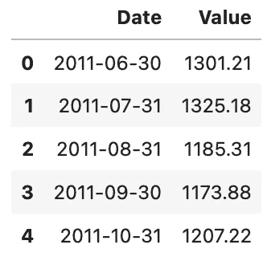
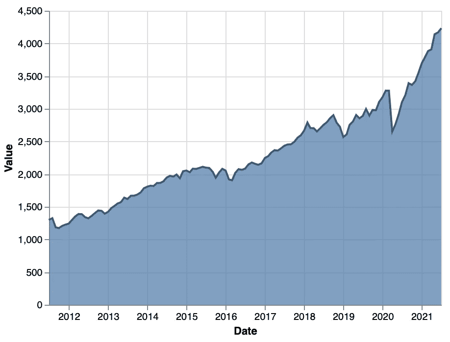
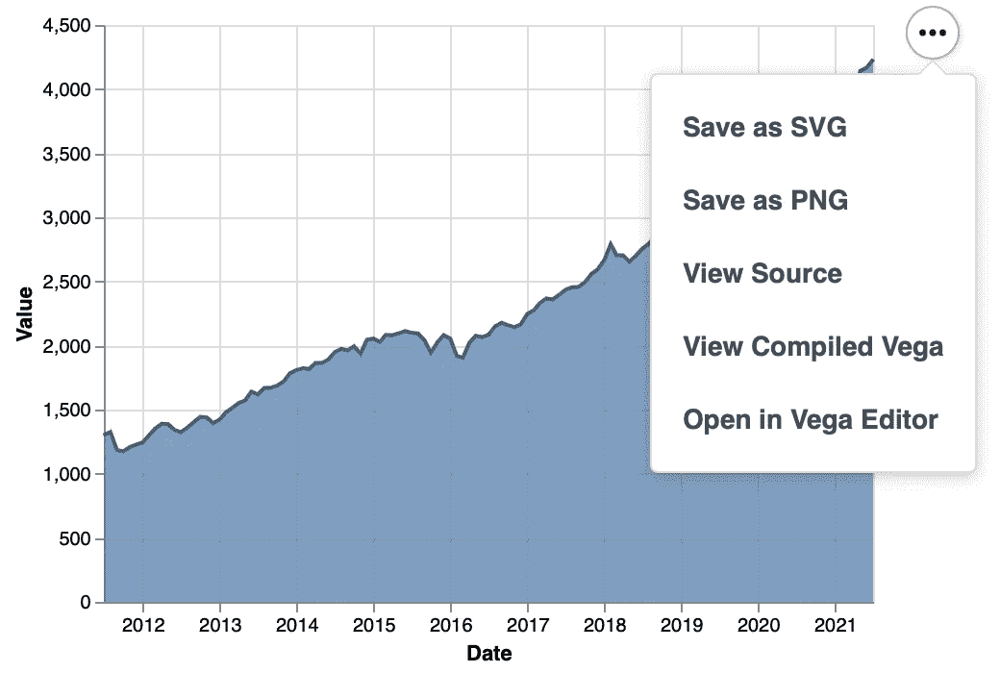
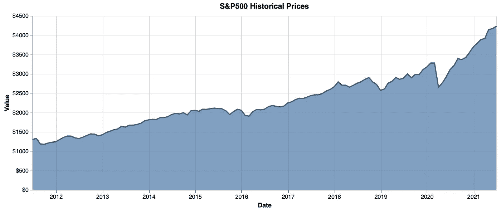
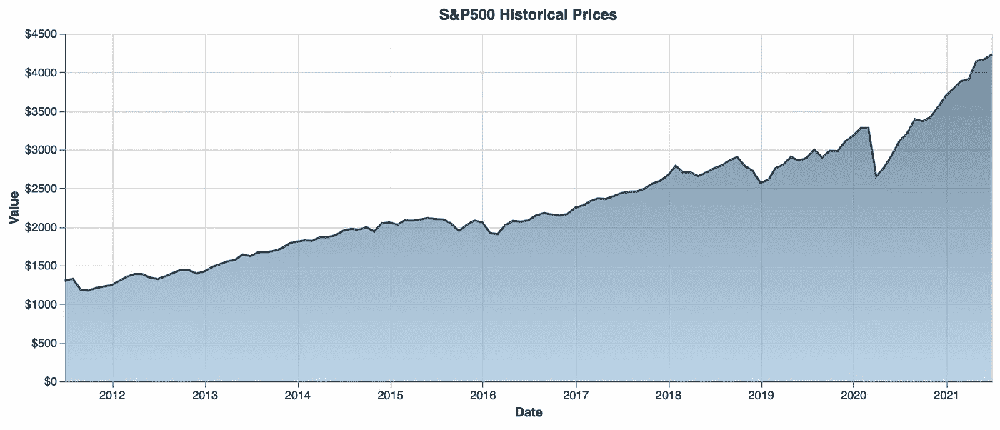
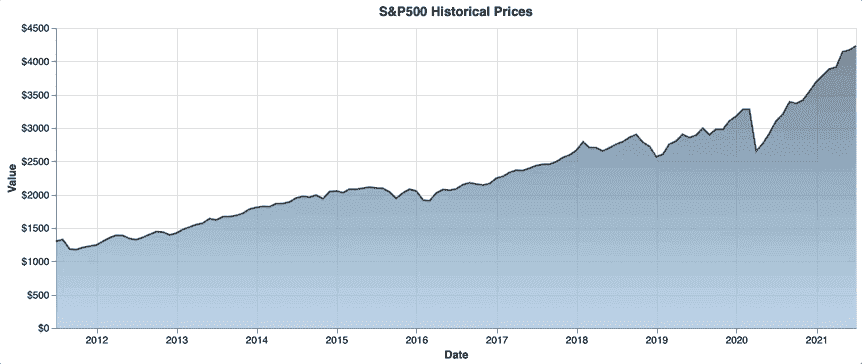

# Altair:Python 中的交互式数据可视化变得简单

> 原文：<https://towardsdatascience.com/altair-interactive-data-visualizations-in-python-made-easy-7f002336b692?source=collection_archive---------35----------------------->

## 在几分钟内实现 S&P500 的交互式可视化，结果令人惊叹


[罗汉 G](https://unsplash.com/@rohan_g?utm_source=unsplash&utm_medium=referral&utm_content=creditCopyText) 在 [Unsplash](https://unsplash.com/?utm_source=unsplash&utm_medium=referral&utm_content=creditCopyText) 上的照片

数据可视化帮助我们理解大量杂乱的表格数据。作为数据科学的首选语言，Python 有几个优秀的数据可视化库。其中之一是[牛郎星](https://altair-viz.github.io/)，今天你将学习它的基础知识。

作为一名数据科学家，数据的可视化表示是必须的，尤其是在向不太懂技术的观众展示数据和见解时。你还应该注意你的可视化的美感，这就是 Altair 的亮点。您可以轻松制作令人惊叹的交互式图表，这是使用 *Matplotlib* 不容易实现的。

Altair 还可以用于构建和部署交互式报告。本文解释了如何:

</introducing-datapane-how-to-create-interactive-reports-and-visualizations-with-python-ebc40e02e748>  

今天的文章结构如下:

*   Altair 安装和数据集介绍
*   牛郎星基础—简单面积图
*   Altair 的基本款式
*   Altair 的高级风格—渐变
*   添加交互性
*   保存图表
*   最后的话

# Altair 安装和数据集介绍

您可以像安装任何其他 Python 库一样安装 Altair。我们将它安装在一个名为`altair_env`的独立虚拟环境中，基于 Python 版本。

Numpy 和 Pandas 是 Altair 的依赖，不用手动安装。如果您使用的是 Anaconda，下面一组 shell 命令将设置环境，激活它，并安装所有需要的东西:

```
conda create — name altair_env python=3.8
conda activate altair_envconda install -c conda-forge altair altair_saver
conda install -c anaconda pandas-datareader
conda install jupyter jupyterlab
```

厉害！您现在可以启动 Jupyter Lab 并创建一个新的空笔记本。

在开始可视化之前，我们还需要一些数据。您可以使用`pandas_datareader`库下载历史股票数据。以下代码片段下载 S & P500 指数的数据，将其重新采样为月平均值，并将值四舍五入到小数点后两位:

下面是前几行的样子:



图片 1-S&P500 索引数据集的头部(图片由作者提供)

这就是我们开始的全部内容。接下来让我们做一个基本的牛郎星可视化。

# 牛郎星基础—简单面积图

可视化时间序列数据的一种优雅方式是使用面积图。简单的折线图就可以了，但是面积图将用户体验带到了一个新的层次。

用 Altair 做面积图还是挺容易的。`mark_area()`函数就是这样做的，并且可以接受多个参数。其中之一是`line`，您可以在其中指定顶部线条的外观。我们将把它漆成漂亮的深蓝色。

要将列名与实际的 X 和 Y 轴连接起来，您必须使用`encode()`函数。`x`和`y`参数现在已经足够了。

以下是完整的代码片段:

这是视觉效果:



图 2-基本牛郎星面积图(图片由作者提供)

你得承认，默认情况下看起来还不错。如果您还没有注意到，右上角的三个点提供了保存图表(SVG 和 PNG)的选项，以及其他一些东西:



图 3 —图表保存/导出选项(作者图片)

我们将在文章的最后探讨储蓄。

接下来，让我们探索一下如何给你的图表添加一些基本的样式。

# Altair 的基本款式

我们现在将稍微改变可视化的外观—包括标题、图表宽度和 Y 轴格式。我们将使图表更宽，包括一个标题，这样每个人都知道它代表什么，并将 Y 轴刻度格式化为 USD。

您必须进行以下代码更改:

这是更新后的可视化效果:



图 4-带有基本样式的牛郎星图(图片由作者提供)

马上就好看了。一般来说，增加时间序列图表的宽度可以显著改善外观。如果你有很多数据点，那就更是如此。

接下来，让我们通过添加渐变来使图表看起来更好。

# Altair 的高级风格—渐变

我现在不喜欢的一点是区域填充颜色。它和线条颜色一样，只是增加了一点透明度。基于时间序列的面积图之所以吸引人，是因为面积中从一点到另一点的颜色变化(渐变)。

添加渐变颜色需要在`mark_area()`函数中添加大量代码，但是这种努力是值得的。我们将使 Y 值越低颜色越亮，越高颜色越暗。

下面是代码片段:

图表现在是这样的:



图 5-带有渐变区域的牛郎星图(图片由作者提供)

好多了。还缺一样东西。你会发现任何好看的在线图表都有一个共同点——交互性。让我们在下面的部分添加它。

# 添加交互性

没有人喜欢静态图表。添加一个简单的工具提示可以节省用户猜测正确轴值的时间和麻烦——特别是对于一个大的 X 或 Y 范围。

幸运的是，用 Altair 添加工具提示只需要一行代码。您只需在`encode()`函数中为`tooltip`参数指定一个值。预期值是一个列表，其中包含您希望值包含在工具提示中的列名。

代码如下:

这是视觉效果:



图 6 —带有基本工具提示的牛郎星图表(图片由作者提供)

这比预期的要容易得多，尤其是当你用 Plotly 做很多数据可视化的时候。

最后，让我们探索一下如何将图表保存到本地机器上。

# 保存图表

您已经了解了如何以 PNG 或 SVG 格式保存图表。`altair_saver`库给了你几个额外的选项。但是在使用之前，请将图表的最终版本保存到变量中。这里有一个例子:

太好了！如果您安装了`altair_saver`库，您可以将可视化保存为 JSON 和 HTML 格式。方法如下:

这两者都将在您的根目录中立即可用。

*但是 png 和 SVG 呢？*事实证明，您需要安装一些额外的包来以编程方式保存它们。程序相当冗长，文中就不讨论了。参考[以下链接](https://github.com/altair-viz/altair_saver/)获取完整指南。

# 最后的话

这就是你要做的——从收集历史股票数据到漂亮的交互式可视化，只需要几分钟，几行代码。Altair 需要一些时间来适应语法，但对所有可视化库来说都是如此。

最终，可视化效果看起来比用 Matplotlib 和 Seaborn 产生的效果好得多。

*但是 Plotly 呢？嗯，那是另一个话题了。请继续关注我的博客，了解两者之间的详细对比。*

感谢阅读。

*喜欢这篇文章吗？成为* [*中等会员*](https://medium.com/@radecicdario/membership) *继续无限制学习。如果你使用下面的链接，我会收到你的一部分会员费，不需要你额外付费。*

<https://medium.com/@radecicdario/membership>  

# 了解更多信息

*   [2021 年学习数据科学的前 5 本书](/top-5-books-to-learn-data-science-in-2020-f43153851f14)
*   如何用 Cron 调度 Python 脚本——你需要的唯一指南
*   [Dask 延迟—如何轻松并行化您的 Python 代码](/dask-delayed-how-to-parallelize-your-python-code-with-ease-19382e159849)
*   [如何用 Python 创建 PDF 报告——基本指南](/how-to-create-pdf-reports-with-python-the-essential-guide-c08dd3ebf2ee)
*   [2021 年即使没有大学文凭也能成为数据科学家](/become-a-data-scientist-in-2021-even-without-a-college-degree-e43fa934e55)

# 保持联系

*   在 [Medium](https://medium.com/@radecicdario) 上关注我，了解更多类似的故事
*   注册我的[简讯](https://mailchi.mp/46a3d2989d9b/bdssubscribe)
*   在 [LinkedIn](https://www.linkedin.com/in/darioradecic/) 上连接